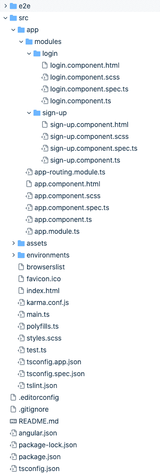

# 如何在 Angular 中构建一个通用的表单验证器

> 原文：<https://www.freecodecamp.org/news/angular-generic-form-validator/>

构建一个包含许多表单的角度应用程序可能会很有压力。尤其是当您必须处理每个组件上的验证消息时。

减轻压力的一个方法是编写一个通用的验证类来处理所有的验证消息。

一方面，这将显著减少 HTML 模板上的代码。它还将为您提供一个错误消息源，可以灵活地覆盖每个组件上的错误消息

另一方面，它涉及到在组件和额外文件上多写一点代码

但是我认为在不同的组件中处理多种表单时利大于弊。

### 先决条件

*   角度的基本知识
*   反应形式的基本知识

## 我们正在建造的东西

Angular 有两种形式:模板驱动形式和反应形式。在本帖中，我们将关注反应式表单。

我们将学习如何使用一个反应式表单来验证一个简单的登录和注册表单。我使用了布尔玛 CSS 框架进行设计。

当您单击提交时，表单输入值只是控制台日志。我这样做是为了让我们可以主要关注表单验证，但是您可以对表单输入值做任何您想做的事情。

这里是 [Stackblitz](https://stackblitz.com/github/onwuvic/generic-reactive-form-validation) 上的演示链接。

## 第一步:设置

我已经为这个项目创建了一个启动文件，所有的 HTML，CSS 和布尔玛都完成了。这使得我们可以更专注于通用表单验证。在 [GitHub 这里](https://github.com/onwuvic/generic-reactive-form-validation)克隆这个回购。

然后，在您的终端中运行以下命令:

```
git clone git@github.com:onwuvic/generic-reactive-form-validation.git
```

或者您可以这样做:

```
git clone https://github.com/onwuvic/generic-reactive-form-validation.git
```

```
cd generic-reactive-form-validation
```

```
git checkout starter
```

```
npm install
```

```
ng serve
```

接下来，在浏览器上访问 [http://localhost:4200/](http://localhost:4200/) 。

在任何编辑器中打开 generic-reactive-form-validation 文件夹。文件结构应该如下所示:



file structure

## 步骤 2:导入反应式模块

现在，让我们将`ReactiveFormsModule`导入到我们的 app 模块中，并将其添加到`imports`数组中。

```
import { BrowserModule } from '@angular/platform-browser';
import { NgModule } from '@angular/core';
import { ReactiveFormsModule } from '@angular/forms';

import { AppRoutingModule } from './app-routing.module';
import { AppComponent } from './app.component';
import { LoginComponent } from './modules/login/login.component';
import { SignUpComponent } from './modules/sign-up/sign-up.component';

@NgModule({
  declarations: [
    AppComponent,
    LoginComponent,
    SignUpComponent
  ],
  imports: [
    BrowserModule,
    AppRoutingModule,
    ReactiveFormsModule
  ],
  providers: [],
  bootstrap: [AppComponent]
})
export class AppModule { }
```

src/app/app.module.ts

## 步骤 3:创建一个通用的验证类和密码确认验证器

### 通用验证类

让我们在根应用程序文件夹中创建一个共享文件夹。然后在共享文件夹中，创建一个 generic-validator.ts 文件。编写以下代码:

```
import { FormGroup } from '@angular/forms';

// Provide all set of validation messages here
const VALIDATION_MESSAGES = {
  email: {
    required: 'Required',
    email: 'This email is invalid'
  },
  password: {
    required: 'Required',
    minlength: 'The password length must be greater than or equal to 8'
  },
  confirmPassword: {
    required: 'Required',
    match: 'Password does not match'
  },
  firstName: {
    required: 'Required'
  },
  lastName: {
    required: 'Required'
  }
};

export class GenericValidator {
  // By default the defined set of validation messages is pass but a custom message when the class is called can also be passed
  constructor(private validationMessages: { [key: string]: { [key: string]: string } } = VALIDATION_MESSAGES) {}

  // this will process each formcontrol in the form group
  // and then return the error message to display
  // the return value will be in this format `formControlName: 'error message'`;
  processMessages(container: FormGroup): { [key: string]: string } {
    const messages = {};
    // loop through all the formControls
    for (const controlKey in container.controls) {
      if (container.controls.hasOwnProperty(controlKey)) {
        // get the properties of each formControl
        const controlProperty = container.controls[controlKey];
        // If it is a FormGroup, process its child controls.
        if (controlProperty instanceof FormGroup) {
          const childMessages = this.processMessages(controlProperty);
          Object.assign(messages, childMessages);
        } else {
          // Only validate if there are validation messages for the control
          if (this.validationMessages[controlKey]) {
            messages[controlKey] = '';
            if ((controlProperty.dirty || controlProperty.touched) && controlProperty.errors) {
              // loop through the object of errors
              Object.keys(controlProperty.errors).map(messageKey => {
                if (this.validationMessages[controlKey][messageKey]) {
                  messages[controlKey] += this.validationMessages[controlKey][messageKey] + ' ';
                }
              });
            }
          }
        }
      }
    }
    return messages;
  }
}
```

src/app/shared/generic-validator.ts

首先，我们导入`FormGroup`。我们可以在这个文件中编写所有的验证消息，或者从组件中传递每个表单验证消息。

`VALIDATION_MESSAGES`对象上的每个属性对应于每个输入字段名或`formControlName`。此外，输入字段的每个属性都对应于它上面的验证名称。它的值就是您希望显示为错误消息的内容。

例如，输入字段名`formControlName`“email”上有“required”和“email”的验证。

在构造函数方法中，我们可以通过在实例化泛型验证类时传递验证消息来覆盖使用泛型验证的组件的默认错误消息。

processMessages 方法处理每个表单输入字段，并返回错误消息进行显示。

### 密码确认验证

现在，让我们创建一个密码确认验证器来检查我们的密码和确认密码是否匹配。

在共享文件夹中，创建一个`password-matcher.ts`文件。编写以下代码:

```
import { AbstractControl } from '@angular/forms';

export class PasswordMatcher {
  static match(control: AbstractControl): void | null {
    const passwordControl = control.get('password');
    const confirmPasswordControl = control.get('confirmPassword');

    if (passwordControl.pristine || confirmPasswordControl.pristine) {
      return null;
    }

    if (passwordControl.value === confirmPasswordControl.value) {
      return null;
    }

    confirmPasswordControl.setErrors({ match: true });
  }
}
```

src/app/shared/password-matcher.ts

## 步骤 4:将 FormGroup 和 FormBuilder 添加到每个组件和模板中

### 注册表单组件

在应用程序/模块/注册中，将以下代码添加到注册组件中:

```
import { Component, OnInit } from '@angular/core';
import { FormGroup, FormBuilder, Validators } from '@angular/forms';

import { PasswordMatcher } from '../../shared/password-matcher';

@Component({
  selector: 'app-sign-up',
  templateUrl: './sign-up.component.html',
  styleUrls: ['./sign-up.component.scss']
})
export class SignUpComponent implements OnInit {
  signupForm: FormGroup;

  // Use with the generic validation message class
  displayMessage: { [key: string]: string } = {};

  constructor(private fb: FormBuilder) {}

  ngOnInit() {
    this.signupForm = this.fb.group({
      firstName: ['', [Validators.required]],
      lastName: ['', [Validators.required]],
      email: ['', [Validators.required, Validators.email]],
      password: ['', [Validators.required, Validators.minLength(8)]],
      confirmPassword: ['', Validators.required]
    }, { validator: PasswordMatcher.match });
  }

  signup() {
    console.log('---form', this.signupForm.value);
  }

}
```

src/app/modules/sign-up/sign-up.component.ts

我们为每个输入字段提供了角度内置验证，以及我们的自定义`PasswordMatcher`验证，以确保密码和确认密码匹配。

### 注册表单模板

现在我们来看看注册表单模板:

```
<h1 class="title is-4">Sign Up</h1>
<p class="description">Let's get started!</p>
<form (ngSubmit)="signup()" [formGroup]="signupForm" novalidate autocomplete="false">
  <div class="field">
    <div class="control">
      <input [ngClass]="{'is-danger': displayMessage.firstName}" formControlName="firstName" class="input is-medium" type="text" placeholder="First Name">
      <p *ngIf="displayMessage.firstName" class="help is-danger">
        {{ displayMessage.firstName }}
      </p>
    </div>
  </div>
  <div class="field">
    <div class="control">
      <input [ngClass]="{'is-danger': displayMessage.lastName}" formControlName="lastName" class="input is-medium" type="text" placeholder="Last Name">
      <p *ngIf="displayMessage.lastName" class="help is-danger">
        {{ displayMessage.lastName }}
      </p>
    </div>
  </div>
  <div class="field">
    <div class="control">
      <input [ngClass]="{'is-danger': displayMessage.email}" formControlName="email" class="input is-medium" type="email" placeholder="Email">
      <p *ngIf="displayMessage.email" class="help is-danger">
        {{ displayMessage.email }}
      </p>
    </div>
  </div>
  <div class="field">
    <div class="control">
      <input [ngClass]="{'is-danger': displayMessage.password || displayMessage.confirmPassword }" formControlName="password" class="input is-medium" type="password" placeholder="Password">
      <p *ngIf="displayMessage.password" class="help is-danger">
        {{ displayMessage.password }}
      </p>
    </div>
  </div>
  <div class="field">
    <div class="control">
      <input [ngClass]="{'is-danger': displayMessage.confirmPassword}" formControlName="confirmPassword" class="input is-medium" type="password" placeholder="Confirm Password">
      <p *ngIf="displayMessage.confirmPassword" class="help is-danger">
        {{ displayMessage.confirmPassword }}
      </p>
    </div>
  </div>
  <br>
  <button type="submit" class="button is-block is-primary is-fullwidth is-medium" [disabled]="signupForm.invalid">Submit</button>
  <br>
  <small class="has-text-centered">
    <em>
      Already have an account
      <a [routerLink]="['']" class="primary-color">Login</a>
    </em>
  </small>

</form>
```

src/app/modules/sign-up/sign-up.component.html

```
<form (ngSubmit)="signup()" [formGroup]="signupForm" novalidate autocomplete="false">
```

我们将我们的`ngSubmit`和`formGroup`添加到表单标签中。

```
<input [ngClass]="{'is-danger': displayMessage.firstName}" formControlName="firstName" class="input is-medium" type="text" placeholder="First Name">
```

我们还为每个输入字段添加了`formControlName`。如果显示消息中有 firstName 错误消息，它会将 ngClass is-danger 应用到输入字段。

```
<p *ngIf="displayMessage.firstName" class="help is-danger">
  {{ displayMessage.firstName }}
</p>
```

这将显示我们的错误消息。

```
<button type="submit" class="button is-block is-primary is-fullwidth is-medium" [disabled]="signupForm.invalid">Submit</button>
```

如果表单无效，我们禁用提交按钮。

### 登录表单组件

在应用程序/模块/登录中，将以下代码添加到登录组件中:

```
 import { Component, OnInit } from '@angular/core';
import { FormGroup, FormBuilder, Validators } from '@angular/forms';

@Component({
  selector: 'app-login',
  templateUrl: './login.component.html',
  styleUrls: ['./login.component.scss']
})
export class LoginComponent implements OnInit, AfterViewInit {
  loginForm: FormGroup;

  // Use with the generic validation message class
  displayMessage: { [key: string]: string } = {};
  private validationMessages: { [key: string]: { [key: string]: string } };

  constructor(private fb: FormBuilder) {
    // Defines all of the validation messages for the form.
    this.validationMessages = {
      email: {
        required: 'Required',
        email: 'This email is invalid'
      },
      password: {
        required: 'Required',
        minlength: 'The password length must be greater than or equal to 8'
      }
    };
  }

  ngOnInit() {
    this.loginForm = this.fb.group({
      email: ['', [Validators.required, Validators.email]],
      password: ['', [Validators.required, Validators.minLength(8)]],
    });
  }

  login() {
    console.log('---form', this.loginForm.value);
  }

}
```

src/app/modules/login/login.component.ts

这里与注册组件的唯一区别是，我们将使用验证消息覆盖通用验证类中的默认错误消息。

### 登录表单模板

在登录模板中编写以下代码:

```
<h1 class="title is-4">Login</h1>
<p class="description">Welcome back!</p>
<form (ngSubmit)="login()" [formGroup]="loginForm" novalidate autocomplete="false">
  <div class="field">
    <div class="control">
      <input [ngClass]="{'is-danger': displayMessage.email}" class="input is-medium" type="email" placeholder="Email" formControlName="email">
      <p *ngIf="displayMessage.email" class="help is-danger">
        {{ displayMessage.email }}
      </p>
    </div>
  </div>
  <div class="field">
    <div class="control">
      <input [ngClass]="{'is-danger': displayMessage.password}" class="input is-medium" type="password" placeholder="Password" formControlName="password">
      <p *ngIf="displayMessage.password" class="help is-danger">
        {{ displayMessage.password }}
      </p>
    </div>
  </div>
  <button type="submit" class="button is-block is-primary is-fullwidth is-medium" [disabled]="loginForm.invalid">Login</button>
  <br>
  <small class="has-text-centered">
    <em>
      Don't have an account
      <a [routerLink]="['signup']" class="primary-color">Sign Up</a>
    </em>
  </small>
</form>
```

src/app/modules/login/login.component.html

## 步骤 5:在每个组件中使用通用验证

### 注册时的一般验证

将以下代码添加到`sign-up.component.ts`文件中:

```
import { Component, OnInit, ViewChildren, ElementRef, AfterViewInit } from '@angular/core';
import { FormGroup, FormBuilder, Validators, FormControlName, AbstractControl } from '@angular/forms';
import { Observable, fromEvent, merge } from 'rxjs';
import { debounceTime } from 'rxjs/operators';
import { GenericValidator } from '../../shared/generic-validator';
import { PasswordMatcher } from '../../shared/password-matcher';

@Component({
  selector: 'app-sign-up',
  templateUrl: './sign-up.component.html',
  styleUrls: ['./sign-up.component.scss']
})
export class SignUpComponent implements OnInit, AfterViewInit {
  // Access every form input fields in our signup html file
  @ViewChildren(FormControlName, { read: ElementRef }) formInputElements: ElementRef[];
  signupForm: FormGroup;

  // Use with the generic validation message class
  displayMessage: { [key: string]: string } = {};
  private genericValidator: GenericValidator;

  constructor(private fb: FormBuilder) {
    // Define an instance of the validator for use with this form,
    this.genericValidator = new GenericValidator();
  }

  ngOnInit() {
    this.signupForm = this.fb.group({
      firstName: ['', [Validators.required]],
      lastName: ['', [Validators.required]],
      email: ['', [Validators.required, Validators.email]],
      password: ['', [Validators.required, Validators.minLength(8)]],
      confirmPassword: ['', Validators.required]
    }, { validator: PasswordMatcher.match });
  }

  ngAfterViewInit(): void {
    // Watch for the blur event from any input element on the form.
    const controlBlurs: Observable<any>[] = this.formInputElements
      .map((formControl: ElementRef) => fromEvent(formControl.nativeElement, 'blur'));

    // Merge the blur event observable with the valueChanges observable
    merge(this.signupForm.valueChanges, ...controlBlurs).pipe(
      debounceTime(800)
    ).subscribe(value => {
      this.displayMessage = this.genericValidator.processMessages(this.signupForm);
    });
  }

  signup() {
    console.log('---form', this.signupForm.value);
  }

}
```

src/app/modules/sign-up/sign-up.component.ts

这里我们已经导入了通用验证类。

```
@ViewChildren(FormControlName, { read: ElementRef }) formInputElements: ElementRef[];
```

我们添加了`@ViewChildren`来访问注册 HTML 文件中的每个表单输入字段。这有助于我们听他们的事件。

```
private genericValidator: GenericValidator;

constructor(private fb: FormBuilder) {
   // Define an instance of the validator for use with this form
   this.genericValidator = new GenericValidator();
}
```

我们在构造函数中实例化泛型验证。

然后，我们实现 ngAfterViewInit 接口。

```
ngAfterViewInit(): void {
   // Watch for the blur event from any 
   // input element on the form.
   const controlBlurs: Observable<any>[] = this.formInputElements
      .map((formControl: ElementRef) =>
         fromEvent(formControl.nativeElement, 'blur')
      );
   // Merge the blur event observable 
   // with the valueChanges observable
   merge(this.signupForm.valueChanges, ...controlBlurs)
    .pipe(debounceTime(800))
    .subscribe(value => {
      this.displayMessage = this.genericValidator
        .processMessages(this.signupForm);
   });
}
```

在这里，我们观察表单上任何输入元素的模糊事件。

```
const controlBlurs: Observable<any>[] = this.formInputElements
      .map((formControl: ElementRef) =>
         fromEvent(formControl.nativeElement, 'blur')
      );
```

```
merge(this.signupForm.valueChanges, ...controlBlurs)
    .pipe(debounceTime(800))
    .subscribe(value => {
      this.displayMessage = this.genericValidator
        .processMessages(this.signupForm);
   });
```

现在，我们已经将表单值变化可观察值(当任何输入值变化时触发)和任何输入字段的模糊事件组合成一个可观察值。

因此，当用户更改输入值或点击任何输入字段时，这个合并方法就会被触发。

然后我们用`debounceTime(800)`加上 800 毫秒的延迟。这让用户有时间在触发验证之前进行更改。

最后，我们通过调用通用验证器方法来获得要显示的错误消息。

### 登录时的一般验证

将以下代码写入`login.component.ts`文件:

```
import { Component, OnInit, ViewChildren, ElementRef, AfterViewInit } from '@angular/core';
import { FormGroup, FormBuilder, Validators, FormControlName } from '@angular/forms';
import { Observable, fromEvent, merge } from 'rxjs';
import { debounceTime } from 'rxjs/operators';
import { GenericValidator } from '../../shared/generic-validator';

@Component({
  selector: 'app-login',
  templateUrl: './login.component.html',
  styleUrls: ['./login.component.scss']
})
export class LoginComponent implements OnInit, AfterViewInit {
  // Access every form input fields in our login html file
  @ViewChildren(FormControlName, { read: ElementRef }) formInputElements: ElementRef[];
  loginForm: FormGroup;

  // Use with the generic validation message class
  displayMessage: { [key: string]: string } = {};
  private validationMessages: { [key: string]: { [key: string]: string } };
  private genericValidator: GenericValidator;

  constructor(private fb: FormBuilder) {
    // Defines all of the validation messages for the form.
    this.validationMessages = {
      email: {
        required: 'Required',
        email: 'This email is invalid'
      },
      password: {
        required: 'Required',
        minlength: 'The password length must be greater than or equal to 8'
      }
    };
    // Define an instance of the validator for use with this form,
    // passing in this form's set of validation messages.
    this.genericValidator = new GenericValidator(this.validationMessages);
  }

  ngOnInit() {
    this.loginForm = this.fb.group({
      email: ['', [Validators.required, Validators.email]],
      password: ['', [Validators.required, Validators.minLength(8)]],
    });
  }

  ngAfterViewInit(): void {
    // Watch for the blur event from any input element on the form.
    const controlBlurs: Observable<any>[] = this.formInputElements
      .map((formControl: ElementRef) => fromEvent(formControl.nativeElement, 'blur'));

    // Merge the blur event observable with the valueChanges observable
    merge(this.loginForm.valueChanges, ...controlBlurs).pipe(
      debounceTime(800)
    ).subscribe(value => {
      this.displayMessage = this.genericValidator.processMessages(this.loginForm);
    });
  }

  login() {
    console.log('---form', this.loginForm.value);
  }

}
```

src/app/modules/login/login.component.ts

这里与注册代码的唯一区别是，我们用这个组件中指定的新验证消息覆盖了我们的默认验证消息。然后，当我们实例化它时，我们将它传递给泛型验证类。

```
 constructor(private fb: FormBuilder) {
    // Defines all of the validation messages for the form.
    this.validationMessages = {
      email: {
        required: 'Required',
        email: 'This email is invalid'
      },
      password: {
        required: 'Required',
        minlength: 'The password length must be greater than or equal to 8'
      }
    };
    // Define an instance of the validator for use with this form,
    // passing in this form's set of validation messages.
    this.genericValidator = new GenericValidator(this.validationMessages);
  }
```

我们可以预期这与注册通用验证的工作方式相同。

这就是在 Angular 中构建通用验证器所需的全部内容。

## 结论

创建一个通用的验证器可以轻松处理多个表单验证，而不需要在 Angular 应用程序中使用大量冗余代码。

我希望这篇文章对你有用！

你可以通过 [LinkedIn](https://www.linkedin.com/in/victoronwuzor/) 和 [Twitter](https://twitter.com/victoronwuzor) 与我联系。