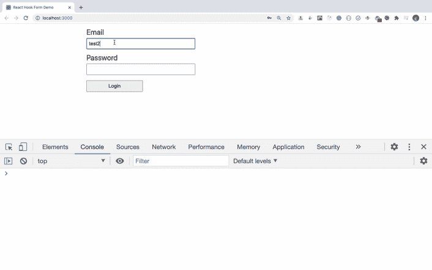
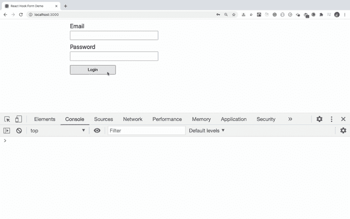
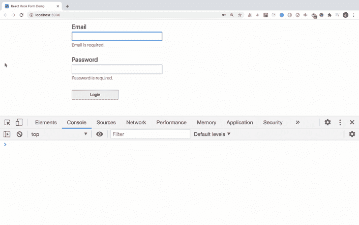

# 如何使用 react-hook-form 库在 React 中构建表单

> 原文：<https://www.freecodecamp.org/news/build-forms-in-react-with-react-hook-form-library/>

在本文中，我们将探索 [react-hook-form](https://react-hook-form.com/) 库。

您将学习如何使用这个库并将其与 React 集成。我们还将了解为什么它成为构建简单和复杂表单的流行选择，并增加了对处理复杂验证的支持。

### 我们开始吧

在 React 中使用表单是一项复杂的任务。当输入字段的数量随着验证的增加而增加时，事情会变得更加复杂。

看看下面的代码:

```
 import React, { useState } from "react";
import "./styles.css";

export default function App() {
  const [state, setState] = useState({
    email: "",
    password: ""
  });

  const handleInputChange = (event) => {
    setState((prevProps) => ({
      ...prevProps,
      [event.target.name]: event.target.value
    }));
  };

  const handleSubmit = (event) => {
    event.preventDefault();
    console.log(state);
  };

  return (
    <div className="App">
      <form onSubmit={handleSubmit}>
        <div className="form-control">
          <label>Email</label>
          <input
            type="text"
            name="email"
            value={state.email}
            onChange={handleInputChange}
          />
        </div>
        <div className="form-control">
          <label>Password</label>
          <input
            type="password"
            name="password"
            value={state.password}
            onChange={handleInputChange}
          />
        </div>
        <div className="form-control">
          <label></label>
          <button type="submit">Login</button>
        </div>
      </form>
    </div>
  );
}
```

这里有一个代码沙盒演示:[https://codesandbox.io/s/login-form-zjxs9](https://codesandbox.io/s/login-form-zjxs9)。

在上面的代码中，我们只有两个输入字段，即`email`和`password`，以及一个提交按钮。

每个输入字段都添加了一个`value`和`onChange`处理程序，因此我们可以根据用户的输入更新状态。

此外，我们还添加了一个`handleSubmit`方法，将表单中输入的数据显示到控制台。

这看起来不错。但是，如果我们需要添加验证，如必填字段验证、最小长度验证、密码验证、电子邮件字段验证，并显示相应的错误消息，该怎么办呢？

随着输入字段及其验证数量的增加，代码将变得更加复杂和冗长。

这在任何应用程序中都是非常常见的要求。因此，为了方便地处理表单，有各种各样的库可用，如`Formik`、`redux-form`、`react-final-form`、`react-hook-form`等等。

但是越来越受欢迎的是图书馆。

所以现在让我们来学习为什么以及如何使用它。为此，我们将创建一个新的 React 应用程序。

通过从终端运行以下命令创建一个新的 React 项目:

```
npx create-react-app react-hook-form-demo
```

项目创建完成后，删除`src`文件夹中的所有文件，并在`src`文件夹中创建新的`index.js`和`styles.css`文件。

要安装表单库，请从终端执行以下命令:

```
yarn add react-hook-form
```

## 如何创建初始页面

打开`src/index.js`文件，在里面添加以下内容:

```
 import React from 'react';
import ReactDOM from 'react-dom';
import App from './App';

ReactDOM.render(<App />, document.getElementById('root'));
```

打开`src/styles.css`文件，将这里[的内容添加到](https://github.com/myogeshchavan97/react-hook-form-demo/blob/master/src/styles.css)文件中。

现在，在`src`文件夹中创建一个新文件`App.js`，内容如下:

```
 import React from "react";
import "./styles.css";

export default function App() {
  return (
    <div className="App">
      <form>
        <div className="form-control">
          <label>Email</label>
          <input type="text" name="email" />
        </div>
        <div className="form-control">
          <label>Password</label>
          <input type="password" name="password" />
        </div>
        <div className="form-control">
          <label></label>
          <button type="submit">Login</button>
        </div>
      </form>
    </div>
  );
}
```

这里，我们刚刚在表单中添加了电子邮件和密码字段。

## 使用 react-hook-form 创建基本表单

`react-hook-form`库提供了一个`useForm`钩子，我们可以用它来处理表单。

像这样导入`useForm`钩子:

```
import { useForm } from 'react-hook-form';
```

像这样使用`useForm`挂钩:

```
const { register, handleSubmit, errors } = useForm();
```

这里，

*   寄存器是一个函数，用作由`useForm`钩子提供的 ref。我们可以将它分配给每个输入字段，这样`react-hook-form`就可以跟踪输入字段值的变化。
*   handleSubmit 是我们在提交表单时可以调用的函数
*   错误将包含验证错误(如果有)

现在，用以下内容替换`App.js`文件的内容:

```
 import React from "react";
import { useForm } from "react-hook-form";
import "./styles.css";

export default function App() {
  const { register, handleSubmit, errors } = useForm();

  const onSubmit = (data) => {
    console.log(data);
  };

  return (
    <div className="App">
      <form onSubmit={handleSubmit(onSubmit)}>
        <div className="form-control">
          <label>Email</label>
          <input type="text" name="email" ref={register} />
        </div>
        <div className="form-control">
          <label>Password</label>
          <input type="password" name="password" ref={register} />
        </div>
        <div className="form-control">
          <label></label>
          <button type="submit">Login</button>
        </div>
      </form>
    </div>
  );
}
```

在上面的代码中，我们给了从`useForm`钩子得到的每个输入字段一个 ref。

```
ref={register}
```

此外，我们添加了传递给 handleSubmit 函数的 onSubmit 函数。

```
<form onSubmit={handleSubmit(onSubmit)}>
```

注意，对于每个输入字段，我们给出了一个唯一的名称，这是强制性的，因此`react-hook-form`可以跟踪变化的数据。

当我们提交表单时，handleSubmit 函数将处理表单提交。它会将用户输入的数据发送到 onSubmit 函数，我们正在将该函数记录到控制台。

```
const onSubmit = (data) => {  
 console.log(data);
};
```

现在，通过运行`yarn start`命令启动应用程序。



如您所见，当我们提交表单时，用户输入的详细信息显示在控制台中。

此外，与不带`react-hook-form`的代码(我们在本文开头看到的)相比，这段代码要简单得多。这是因为我们不必为每个输入字段添加`value`和`onChange`处理程序，也没有必要自己管理应用程序状态。

## 如何向表单添加验证

现在，让我们向输入字段添加必填字段和最小长度验证。

要添加验证，我们可以将其传递给 register 函数，该函数作为 ref 传递给每个输入字段，如下所示:

```
 <input type="text" name="email" ref={register({ required: true})} />
<input
  type="password"
  name="password"
  ref={register({ required: true, minLength: 6 })}
/>
```

如果验证失败，我们还希望显示错误消息。

当验证失败时，来自`useForm`的错误对象将用验证失败的字段填充。

打开`App.js`文件，将其内容替换为以下内容:

```
 import React from "react";
import { useForm } from "react-hook-form";
import "./styles.css";

export default function App() {
  const { register, handleSubmit, errors } = useForm();

  const onSubmit = (data) => {
    console.log(data);
  };

  return (
    <div className="App">
      <form onSubmit={handleSubmit(onSubmit)}>
        <div className="form-control ">
          <label>Email</label>
          <input
            type="text"
            name="email"
            ref={register({
              required: true,
              pattern: /^[^@ ]+@[^@ ]+\.[^@ .]{2,}$/
            })}
          />
          {errors.email && errors.email.type === "required" && (
            <p className="errorMsg">Email is required.</p>
          )}
          {errors.email && errors.email.type === "pattern" && (
            <p className="errorMsg">Email is not valid.</p>
          )}
        </div>
        <div className="form-control">
          <label>Password</label>
          <input
            type="password"
            name="password"
            ref={register({ required: true, minLength: 6 })}
          />
          {errors.password && errors.password.type === "required" && (
            <p className="errorMsg">Password is required.</p>
          )}
          {errors.password && errors.password.type === "minLength" && (
            <p className="errorMsg">
              Password should be at-least 6 characters.
            </p>
          )}
        </div>
        <div className="form-control">
          <label></label>
          <button type="submit">Login</button>
        </div>
      </form>
    </div>
  );
}
```



这里，对于电子邮件输入字段，我们已经提供了必需的和模式匹配验证。

```
<input
    type="text"
    name="email"
    ref={register({
      required: true,
      pattern: /^[^@ ]+@[^@ ]+\.[^@ .]{2,}$/
    })}
  />
```

因此，当您在电子邮件输入字段中键入内容时，验证将在表单提交后运行。

如果验证失败，那么 errors 对象中的`errors.email`字段将被我们用来显示错误消息的 type 字段填充。

```
 {errors.email && errors.email.type === "required" && (
  <p className="errorMsg">Email is required.</p>
)}
```

以类似的方式，我们添加了密码字段验证。

如您所见，当我们提交表单时，如果输入字段有任何验证错误，每个输入字段都会自动聚焦。

此外，只要存在验证错误，就不会提交表单。您可以看到，只有当表单有效时，才会打印出`console.log`语句。

所以使用`react-hook-form`减少了我们必须编写的代码量。验证也是响应性的，所以一旦字段变得有效，错误消息就会立即消失。

但是随着每个字段验证数量的增加，条件检查和错误消息代码仍然会增加。因此，我们可以进一步重构代码，使其更加简单。

看看下面的代码:

```
 import React from 'react';
import { useForm } from 'react-hook-form';
import './styles.css';

export default function App() {
  const { register, handleSubmit, errors } = useForm();

  const onSubmit = (data) => {
    console.log(data);
  };

  return (
    <div className="App">
      <form onSubmit={handleSubmit(onSubmit)}>
        <div className="form-control ">
          <label>Email</label>
          <input
            type="text"
            name="email"
            ref={register({
              required: 'Email is required.',
              pattern: {
                value: /^[^@ ]+@[^@ ]+\.[^@ .]{2,}$/,
                message: 'Email is not valid.'
              }
            })}
          />
          {errors.email && <p className="errorMsg">{errors.email.message}</p>}
        </div>
        <div className="form-control">
          <label>Password</label>
          <input
            type="password"
            name="password"
            ref={register({
              required: 'Password is required.',
              minLength: {
                value: 6,
                message: 'Password should be at-least 6 characters.'
              }
            })}
          />
          {errors.password && (
            <p className="errorMsg">{errors.password.message}</p>
          )}
        </div>
        <div className="form-control">
          <label></label>
          <button type="submit">Login</button>
        </div>
      </form>
    </div>
  );
}
```

在上面的代码中，我们更改了电子邮件和密码验证代码。

对于电子邮件输入字段，我们更改了之前的代码:

```
 <input
  type="text"
  name="email"
  ref={register({
    required: true,
    pattern: /^[^@ ]+@[^@ ]+\.[^@ .]{2,}$/
  })}
/>
```

到下面的新代码:

```
 <input
  type="text"
  name="email"
  ref={register({
    required: 'Email is required.',
    pattern: {
      value: /^[^@ ]+@[^@ ]+\.[^@ .]{2,}$/,
      message: 'Email is not valid.'
    }
  })}
/>
```

这里，我们已经直接提供了在添加验证本身时想要显示的错误消息。

所以我们不再需要为每次验证增加额外的检查。我们使用每个输入字段的 errors 对象中可用的 message 属性来显示错误消息。

```
{errors.email && <p className="errorMsg">{errors.email.message}</p>}
```

因此，通过这样做，代码被进一步简化，这使得将来添加额外的验证变得容易。

请注意，如果存在验证错误，onSubmit 处理程序将不会执行，相应的输入字段将自动聚焦(这是一件好事)。

## 如何添加自定义验证方法

您甚至可以通过添加一个`validate`方法来为输入字段提供自定义验证。如果您需要像这样执行复杂的验证，这很有用:

```
// validation function
const validatePassword = (value) => {
  if (value.length < 6) {
    return 'Password should be at-least 6 characters.';
  } else if (
    !/(?=.*\d)(?=.*[a-z])(?=.*[A-Z])(?!.*\s)(?=.*[!@#$*])/.test(value)
  ) {
    return 'Password should contain at least one uppercase letter, lowercase letter, digit, and special symbol.';
  }
  return true;
};

// JSX
<input
  type="password"
  name="password"
  ref={register({
    required: 'Password is required.',
    validate: validatePassword
  })}
/>
```



现在您知道了如何使用`react-hook-form`在 React 中创建表单以及复杂的验证。

## 为什么 react-hook-form 比其他形式更好

让我们看看`react-hook-form`应该成为您处理表单的首选的其他原因。

*   与`formik`、`redux-form`和其他替代方案相比，代码复杂度较低。
*   `react-hook-form`与用于模式验证的`yup`库很好地集成，因此您可以组合自己的验证模式。
*   与备选方案相比，应用程序中的重新渲染次数较少。
*   与备选方案相比，安装时间更短。

有关实际的比较指标，请点击此处阅读更多信息。

## 结论

在本文中，我们看到了如何使用`react-hook-form`，以及为什么它是许多开发人员在 React 中构建简单和复杂表单的首选。

你可以在这里找到这个应用程序的 GitHub 源代码。

如果你喜欢这篇文章，那么你也会喜欢我的其他文章。
订阅我的[每周简讯](https://bit.ly/2HwVEA2)，加入其他 1000 多名订阅者的行列，直接在收件箱中获得惊人的技巧、窍门和文章。