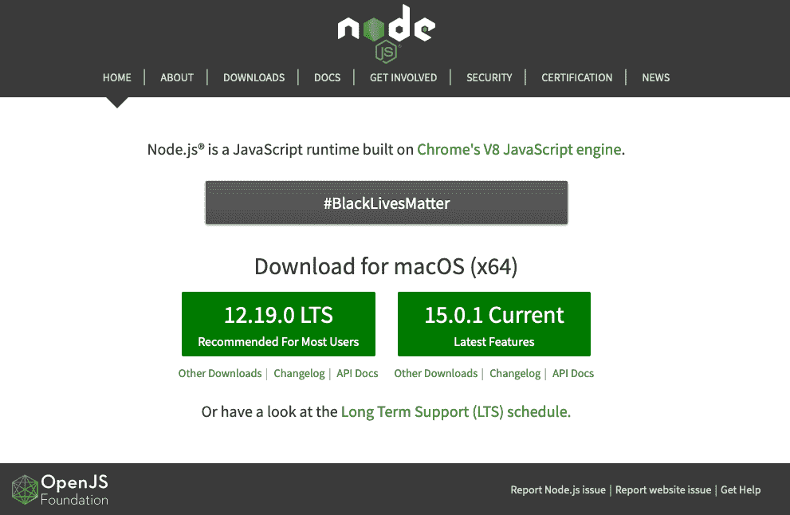
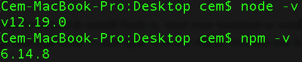
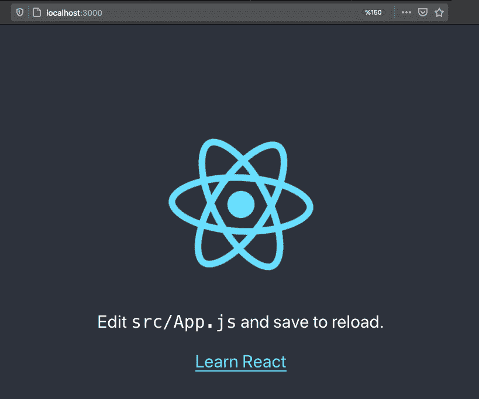

# 如何用 create-react-app 安装 React.js

> 原文：<https://www.freecodecamp.org/news/install-react-with-create-react-app/>

React 是当今 web 开发领域最流行的 JavaScript 库之一。

作为一名前端开发人员，我个人在我的项目中使用过 React，将来可能会继续使用它。许多人纠结的一个步骤是 React 的安装/配置过程。

所以让我们从基础开始。在这篇文章中，您将学习如何以最简单的方式安装和运行 React 应用程序。

由于学习 React 的兴趣也日益增加，我也决定在我的 YouTube 频道上制作关于 React 的视频教程。这是本教程的视频版本:

[https://www.youtube.com/embed/QJZ-xgt4SJo?feature=oembed](https://www.youtube.com/embed/QJZ-xgt4SJo?feature=oembed)

## 如何下载和安装 Node.js

首先，你需要 NPM(或者纱线)。让我们以 NPM 为例。

如果你的系统上没有安装它，那么你需要前往[官方 Node.js 网站](https://nodejs.org/en/)下载并安装 Node，其中也包括 NPM (Node Package Manager)。



[Node.js' official website](https://nodejs.org/en/)

选择“推荐大多数用户使用”按钮，并下载您的操作系统的当前版本。

下载并安装 Node 后，启动您的终端/命令提示符并运行`node -v`和`npm -v`来查看您有哪些版本。



你的 NPM 版本应该至少是 5.2.0 或更新版本，因为 create-react-app 要求我们已经安装了 [NPX](https://github.com/npm/npm/releases/tag/v5.2.0) 。如果您有旧版本的 NPM，请运行以下命令进行更新:

```
npm install -g npm
```

## 什么是 create-react-app？

由于它很复杂，需要很多时间，我们不想手动配置 React。create-react-app 是一种更简单的方式，它可以自动为我们完成所有的配置和必要的软件包安装，并在本地启动一个新的 react 应用程序，为开发做好准备。

使用 create-react-app 的另一个好处是，你不必处理 Babel 或 Webpack 配置。所有必要的配置将由 create-react-app 为您完成。

[根据 react 文档](https://reactjs.org/docs/create-a-new-react-app.html)的说法，create-react-app 是 React 中官方支持的创建单页面应用的方式之一。你可以在这里找到其他方法[。](https://reactjs.org/docs/create-a-new-react-app.html)

### 如何安装创建反应应用程序

为了安装您的应用程序，首先转到您的工作区(桌面或文件夹)并运行以下命令:

```
npx create-react-app my-app
```

安装过程可能需要几分钟时间。完成后，您应该会看到一个文件夹出现在您的工作空间中，其名称与您为应用程序指定的名称相同。

> 注意:如果你在 Mac 上并且收到权限错误，不要忘记首先使用 sudo 命令成为超级用户。

### 如何运行用 Create-React-App 创建的应用程序

安装完成后，转到应用程序的安装目录:

```
cd my-app
```

最后运行`npm start`在本地主机上查看您的应用程序:

```
npm start
```



如果您在浏览器中看到类似这样的内容，那么您已经准备好使用 React 了。恭喜你！:)

感谢您的阅读！