# Python 读取 JSON 文件——如何从文件中加载 JSON 并解析转储

> 原文：<https://www.freecodecamp.org/news/python-read-json-file-how-to-load-json-from-a-file-and-parse-dumps/>

欢迎光临！如果您想学习如何在 Python 中使用 JSON 文件，那么这篇文章就是为您准备的。

**您将了解到:**

*   为什么 JSON 格式如此重要。
*   它的基本结构和数据类型。
*   JSON 和 Python 字典如何在 Python 中协同工作。
*   如何使用 Python 内置的`json`模块？
*   如何将 JSON 字符串转换成 Python 对象，反之亦然。
*   如何使用`loads()`和`dumps()`
*   如何自动缩进 JSON 字符串？
*   如何使用`load()`读取 Python 中的 JSON 文件
*   如何使用`dump()`在 Python 中写入 JSON 文件
*   还有更多！

你准备好了吗？我们开始吧！✨

## 🔹简介:JSON 是什么？

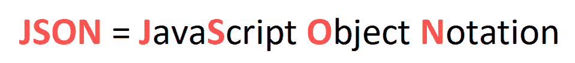

JSON 格式最初是受 JavaScript(一种用于 web 开发的编程语言)语法的启发。但从那时起，它已经成为一种独立于语言的数据格式，我们今天使用的大多数编程语言都可以生成和读取 JSON。

### JSON 的重要性和用例

JSON 基本上是一种用于存储或表示数据的格式。它的常见用例包括 web 开发和配置文件。

让我们看看为什么:

*   **Web 开发:** JSON 常用于在 Web 应用中从服务器向客户端发送数据，反之亦然。

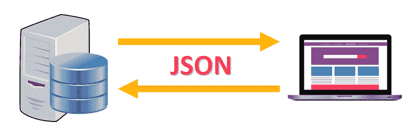

*   **配置文件:** JSON 也用于存储配置和设置。例如，要创建一个 [Google Chrome 应用](https://developer.chrome.com/apps/first_app#one)，您需要包含一个名为`manifest.json`的 JSON 文件来指定应用的名称、描述、当前版本以及其他属性和设置。


## 🔸JSON 结构和格式

现在您已经知道了 JSON 格式的用途，让我们用一个表示比萨饼订单数据的例子来看看它的基本结构:

```
{ 
	"size": "medium",
	"price": 15.67,
	"toppings": ["mushrooms", "pepperoni", "basil"],
	"extra_cheese": false,
	"delivery": true,
	"client": {
		"name": "Jane Doe",
		"phone": null,
		"email": "janedoe@email.com"
	}
}
```

Sample .json file

以下是 JSON 格式的主要特征:

*   有一个由花括号`{}`包围的键值对序列。
*   使用以下格式将每个键映射到一个特定的值:

```
"key": <value> 
```

💡**提示:**需要引号的值必须用双引号括起来。

*   键值对由逗号分隔。只有最后一对后面没有逗号。

```
{
	"size": "medium", # Comma!
	"price": 15.67
}
```

💡**提示:**我们通常用不同级别的缩进来格式化 JSON，以使数据更容易阅读。在本文中，您将学习如何使用 Python 自动添加缩进。

### JSON 数据类型:键和值

JSON 文件有特定的规则来决定哪些数据类型对键和值有效。

*   **键**必须是字符串。
*   **值**可以是字符串、数字、数组、布尔值(`true` / `false`)、`null`或 JSON 对象。

根据 [Python 文档](https://docs.python.org/3/library/json.html#json.dumps):

> JSON 的键/值对中的键总是属于 [`str`](https://docs.python.org/3/library/stdtypes.html#str) 类型。当一个字典被转换成 JSON 时，该字典的所有键都被强制转换成字符串。

### 风格指南

根据[谷歌 JSON 风格指南](https://google.github.io/styleguide/jsoncstyleguide.xml):

*   总是选择有意义的名字。
*   数组类型应该有多个键名。所有其他键名应该是单数。比如:如果对应的值是数组，就用`"orders"`代替`"order"`。
*   JSON 对象中不应该有注释。

## 🔹JSON 与 Python 字典

JSON 和字典乍看起来可能非常相似(视觉上)，但它们是非常不同的。让我们看看它们是如何“连接”的，以及它们是如何互补的，从而使 Python 成为处理 JSON 文件的强大工具。

JSON 是一种用于表示和存储数据的文件格式，而 Python 字典是 Python 程序运行时保存在内存中的实际数据结构(对象)。

### JSON 和 Python 字典如何协同工作


当我们在 Python 中处理 JSON 文件时，我们不能只是读取它们并直接使用程序中的数据。这是因为整个文件将被表示为一个单独的字符串，我们不能单独访问键值对。

除非...

我们使用 JSON 文件的键值对来创建一个 Python 字典，我们可以在程序中使用它来读取、使用和修改数据(如果需要的话)。

这是 JSON 和 Python 字典之间的主要联系。JSON 是数据的字符串表示，字典是程序运行时在内存中创建的实际数据结构。

太好了。既然您对 JSON 有了更多的了解，让我们开始深入到如何在 Python 中使用 JSON 的实际方面。

## 🔸JSON 模块

幸运的是，Python 自带了一个名为`json`的内置模块。它是在您安装 Python 时自动安装的，它包含了帮助您处理 JSON 文件和字符串的函数。

我们将在接下来的例子中使用这个模块。

### 如何导入 JSON 模块

为了在我们的程序中使用`json`,我们只需要在文件的顶部写一个导入语句。

像这样:


通过这一行，您将可以访问模块中定义的功能。我们将在示例中使用其中的几个。

**💡提示:**如果您编写这个导入语句，您将需要使用这个语法来调用在`json`模块中定义的函数:

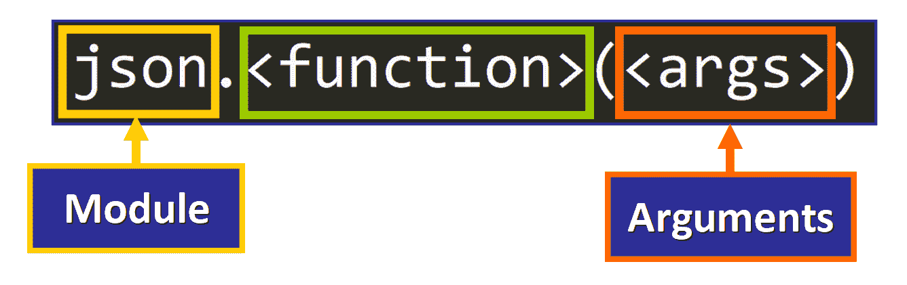

## 🔹Python 和 JSON 字符串

为了说明`json`模块的一些最重要的函数是如何工作的，我们将使用 JSON 格式的多行字符串。

### JSON 字符串

特别是，我们将在示例中使用这个字符串。它只是一个遵循 JSON 格式的常规多行 Python 字符串。

```
data_JSON =  """
{
	"size": "Medium",
	"price": 15.67,
	"toppings": ["Mushrooms", "Extra Cheese", "Pepperoni", "Basil"],
	"client": {
		"name": "Jane Doe",
		"phone": "455-344-234",
		"email": "janedoe@email.com"
	}
}
"""
```

JSON String

*   为了在 Python 中定义多行字符串，我们使用三重引号。
*   然后，我们将字符串赋给变量`data_JSON`。

💡**提示:**[Python 风格指南](https://www.python.org/dev/peps/pep-0008/#string-quotes)建议对三引号字符串使用双引号字符。

### JSON 字符串到 Python 字典

我们将使用 JSON 格式的字符串来创建一个我们可以访问、使用和修改的 Python 字典。

为此，我们将使用`json`模块的`loads()`函数，将字符串作为参数传递。

这是基本语法:

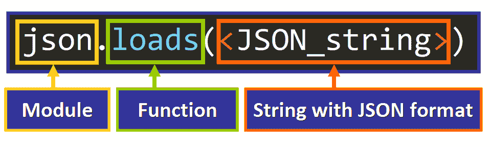

代码如下:

```
# Import the module
import json

# String with JSON format
data_JSON =  """
{
	"size": "Medium",
	"price": 15.67,
	"toppings": ["Mushrooms", "Extra Cheese", "Pepperoni", "Basil"],
	"client": {
		"name": "Jane Doe",
		"phone": "455-344-234",
		"email": "janedoe@email.com"
	}
}
"""

# Convert JSON string to dictionary
data_dict = json.loads(data_JSON) 
```

让我们关注这一行:

```
data_dict = json.loads(data_JSON)
```

*   用 JSON 字符串的键值对创建一个新字典，并返回这个新字典。
*   然后，将返回的字典赋给变量`data_dict`。

**牛逼！**如果我们打印这本字典，我们会看到这样的输出:

```
{'size': 'Medium', 'price': 15.67, 'toppings': ['Mushrooms', 'Extra Cheese', 'Pepperoni', 'Basil'], 'client': {'name': 'Jane Doe', 'phone': '455-344-234', 'email': 'janedoe@email.com'}}
```

字典中已经填充了 JSON 字符串的数据。每个键值对都已成功添加。

现在，让我们看看当我们尝试使用与访问常规 Python 字典的值相同的语法来访问键-值对的值时会发生什么:

```
print(data_dict["size"])
print(data_dict["price"])
print(data_dict["toppings"])
print(data_dict["client"])
```

输出是:

```
Medium
15.67
['Mushrooms', 'Extra Cheese', 'Pepperoni', 'Basil']
{'name': 'Jane Doe', 'phone': '455-344-234', 'email': 'janedoe@email.com'}
```

正如我们所料。每个键都可以用来访问其对应的值。

💡提示:我们可以像使用其他 Python 字典一样使用这个字典。例如，我们可以调用字典方法，添加、更新和删除键值对，等等。我们甚至可以在 for 循环中使用它。

### JSON 到 Python:类型转换

当您使用`loads()`从 JSON 字符串创建 Python 字典时，您会注意到一些值会被转换成它们对应的 Python 值和数据类型。

在 [Python 文档](https://docs.python.org/3/library/json.html#encoders-and-decoders)中为`json`模块提供的这个表格总结了从 JSON 数据类型和值到 Python 数据类型和值的对应关系:

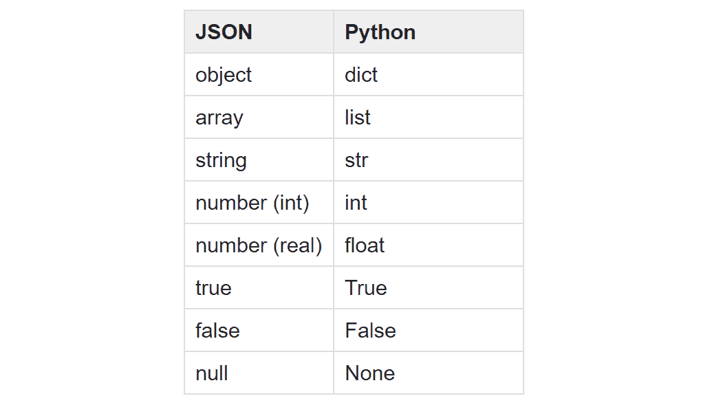

Table presented in the official [documentation of the json module](https://docs.python.org/3/library/json.html#encoders-and-decoders) 

**💡提示:**当我们处理 JSON 文件时，同样的转换表也适用。

### Python 字典到 JSON 字符串

现在您知道了如何从 JSON 格式的字符串创建 Python 字典。

但是有时我们可能需要做完全相反的事情，从一个对象(例如字典)创建一个 JSON 格式的字符串来打印、显示、存储它，或者作为一个字符串使用它。

为此，我们可以使用`json`模块的`dumps`函数，将对象作为参数传递:

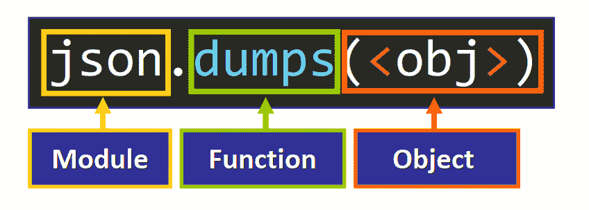

**💡提示:**这个函数会返回一个字符串。

在这个例子中，我们将 Python 字典`client`转换成 JSON 格式的字符串，并将其存储在一个变量中:

```
# Python Dictionary
client = {
    "name": "Nora",
    "age": 56,
    "id": "45355",
    "eye_color": "green",
    "wears_glasses": False
}

# Get a JSON formatted string
client_JSON = json.dumps(client)
```

让我们关注这一行:

```
client_JSON = json.dumps(client)
```

*   `json.dumps(client)`以 JSON 格式创建并返回字典中所有键值对的字符串。
*   然后，这个字符串被赋给`client_JSON`变量。

如果我们打印这个字符串，我们会看到这样的输出:

```
{"name": "Nora", "age": 56, "id": "45355", "eye_color": "green", "wears_glasses": false}
```

💡**提示:**注意最后一个值(`false`)被修改了。在 Python 字典中，这个值是`False`，但是在 JSON 中，等价的值是`false`。这有助于我们确认，原来的字典现在确实被表示为 JSON 格式的字符串。

如果我们检查这个变量的数据类型，我们会看到:

```
<class 'str'>
```

所以这个函数的返回值肯定是一个字符串。

### Python 到 JSON:类型转换

当我们将字典转换成 JSON 字符串时，也会发生类型转换过程。来自 [Python 文档](https://docs.python.org/3/library/json.html#json.JSONEncoder)的表格说明了相应的值:

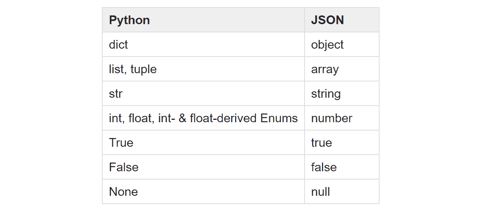

Table from the [official documentation of the json module](https://docs.python.org/3/library/json.html#json.JSONEncoder).

### 如何用缩进打印 JSON

如果我们使用`dumps`函数并打印上一个例子中得到的字符串，我们会看到:

```
{"name": "Nora", "age": 56, "id": "45355", "eye_color": "green", "wears_glasses": false}
```

但是这个可读性不是很好，对吧？

我们可以通过添加**缩进**来提高 JSON 字符串的可读性。

要自动做到这一点，我们只需要传递第二个参数来指定我们想要用来缩进 JSON 字符串的空格数:

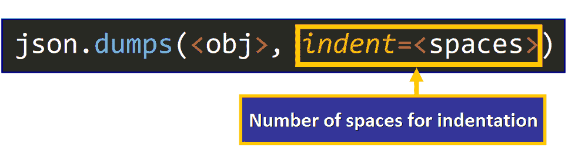

**💡提示:**第二个参数必须是一个非负整数(空格数)或字符串。如果缩进是一个字符串(比如`"\t"`)，那么这个字符串被用来缩进每一级([源](https://docs.python.org/3/library/json.html#json.dump))。

现在，如果我们用第二个参数调用`dumps`:

```
client_JSON = json.dumps(client, indent=4)
```

打印`client_JSON`的结果是:

```
{
    "name": "Nora",
    "age": 56,
    "id": "45355",
    "eye_color": "green",
    "wears_glasses": false
}
```

太棒了，对吧？现在我们的字符串被很好地格式化了。当我们开始使用文件以人类可读的格式存储数据时，这将非常有帮助。

### 如何对键进行排序

如果需要，还可以按字母顺序对键进行排序。为此，您只需要写下参数名称`sort_keys`并传递值`True`:

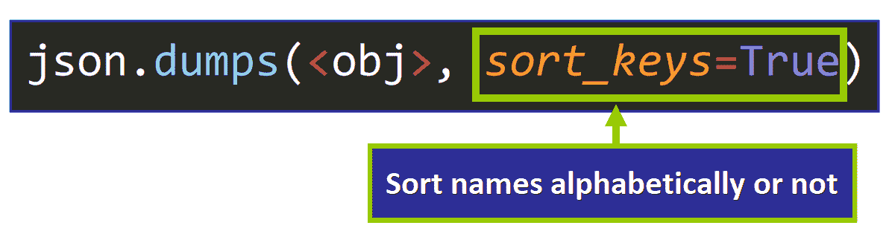

💡**提示:**如果没有传值的话`sort_keys`的值默认为`False`。

例如:

```
client_JSON = json.dumps(client, sort_keys=True)
```

返回此字符串，其中的键按字母顺序排序:

```
{"age": 56, "eye_color": "green", "id": "45355", "name": "Nora", "wears_glasses": false}
```

### 如何按字母顺序排序和缩进(同时)

要生成按字母顺序排序并缩进的 JSON 字符串，只需传递两个参数:

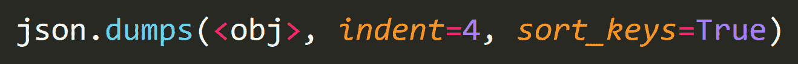

在这种情况下，输出是:

```
{
    "age": 56,
    "eye_color": "green",
    "id": "45355",
    "name": "Nora",
    "wears_glasses": false
}
```

**💡提示:**您可以按任何顺序(相对于彼此)传递这些参数，但是对象必须是列表中的第一个参数。

太好了。现在您已经知道了如何使用 JSON 字符串，所以让我们看看如何在 Python 程序中使用 JSON 文件。

## 🔸JSON 和文件

通常，JSON 用于在文件中存储数据，因此 Python 为我们提供了在程序中读取这些类型的文件、处理它们的数据以及写入新数据所需的工具。

**💡提示:**一个 JSON 文件有一个`.json`扩展名:


让我们看看如何在 Python 中处理`.json`文件。

### 如何用 Python 读取 JSON 文件

假设我们用这个数据创建了一个`orders.json`文件，它表示一家比萨饼店中的两个订单:

```
{
	"orders": [ 
		{
			"size": "medium",
			"price": 15.67,
			"toppings": ["mushrooms", "pepperoni", "basil"],
			"extra_cheese": false,
			"delivery": true,
			"client": {
				"name": "Jane Doe",
				"phone": null,
				"email": "janedoe@email.com"
			}
		},
		{
			"size": "small",
			"price": 6.54,
			"toppings": null,
			"extra_cheese": true,
			"delivery": false,
			"client": {
				"name": "Foo Jones",
				"phone": "556-342-452",
				"email": null
			}
		}
	]
}
```

orders.json

请花点时间分析一下这个 JSON 文件的结构。

以下是一些快速提示:

*   注意值的数据类型、缩进和文件的整体结构。
*   主键`"orders"`的值是一个 JSON 对象的数组(这个数组在 Python 中将表示为 list)。每个 JSON 对象保存一个比萨饼订单的数据。

如果我们想用 Python 读取这个文件，我们只需要使用一个`with`语句:

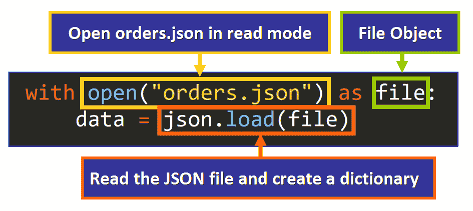

💡**提示:**在上面的语法中，我们可以给`file`(绿框)赋予任何名称。这是一个变量，我们可以在`with`语句中使用它来引用文件对象。

该语法中的关键代码行是:

```
data = json.load(file)
```

*   `json.load(file)`用 JSON 文件中的键值对创建并返回一个新的 Python 字典。
*   然后，这个字典被分配给`data`变量。

💡**提示:**注意，我们使用了`load()`而不是`loads()`。这是`json`模块中的不同功能。在这篇文章的最后，你会了解到更多关于他们的不同之处。

一旦我们将 JSON 文件的内容作为字典存储在`data`变量中，我们就可以用它来做任何我们想做的事情。

### 例子

例如，如果我们写:

```
print(len(data["orders"]))
```

输出是`2`，因为主键`"orders"`的值是一个包含两个元素的列表。

我们还可以使用这些键来访问它们对应的值。这是我们在处理 JSON 文件时通常会做的事情。

例如，要访问第一个订单的浇头，我们应该编写:

```
data["orders"][0]["toppings"]
```

*   首先，我们选择主键`"orders"`
*   然后，我们选择列表中的第一个元素(索引`0`)。
*   最后，我们选择与键`"toppings"`相对应的值

您可以在图表中看到这条“路径”:

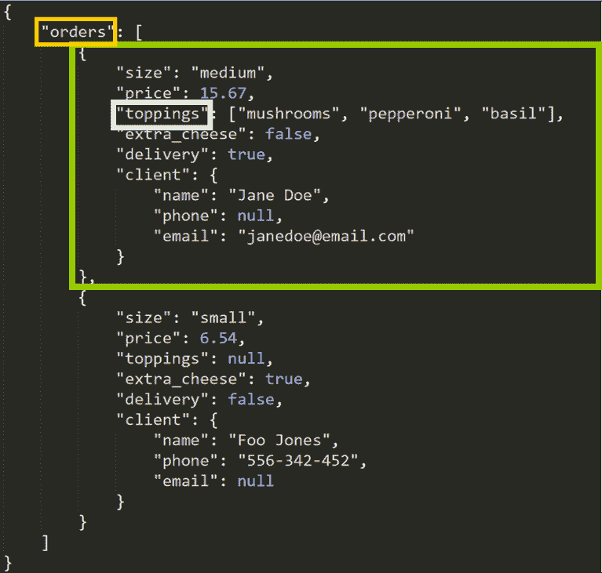

如果我们打印这个值，输出是:

```
['mushrooms', 'pepperoni', 'basil']
```

正如我们所料。您只需要通过使用必要的键和索引来“深入”字典的结构。您可以使用原始的 JSON 文件/字符串作为可视化参考。这样，您可以访问、修改或删除任何值。

**💡提示:**记住我们正在使用新词典。对这个字典所做的更改不会影响 JSON 文件。为了更新文件的内容，我们需要写入文件。

### 如何写入 JSON 文件

让我们看看如何写一个 JSON 文件。

`with`语句的第一行非常相似。唯一的变化是您需要在`'w'`(写)模式下打开文件，以便能够修改文件。

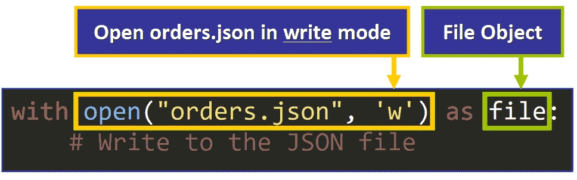

**💡提示:**如果当前工作目录(文件夹)中不存在该文件，将自动创建。通过使用`'w'`模式，我们将替换文件的全部内容，如果它已经存在的话。

在`with`语句体中写入 JSON 文件有两种替代方法:

*   `dump`
*   `dumps`

下面我们来详细看看。

**第一种方法:`dump`**

这个函数有两个参数:

*   将以 JSON 格式存储的对象(例如，字典)。
*   存储它的文件(file 对象)。

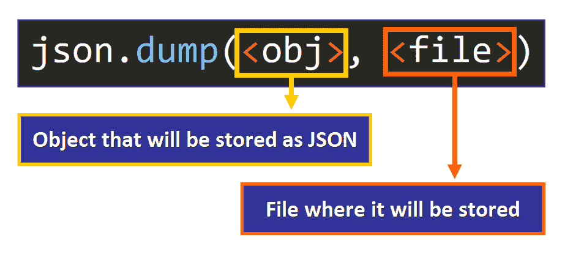

假设比萨饼店想要从 JSON 文件中删除客户的数据，并用这个新版本创建一个名为`orders_new.json`的新 JSON 文件。

我们可以用下面的代码做到这一点:

```
# Open the orders.json file
with open("orders.json") as file:
    # Load its content and make a new dictionary
    data = json.load(file)

    # Delete the "client" key-value pair from each order
    for order in data["orders"]:
        del order["client"]

# Open (or create) an orders_new.json file 
# and store the new version of the data.
with open("orders_new.json", 'w') as file:
    json.dump(data, file)
```

这是`orders.json`文件中数据的原始版本。请注意，`"client"`键值对是存在的。

```
{
	"orders": [ 
		{
			"size": "medium",
			"price": 15.67,
			"toppings": ["mushrooms", "pepperoni", "basil"],
			"extra_cheese": false,
			"delivery": true,
			"client": {
				"name": "Jane Doe",
				"phone": null,
				"email": "janedoe@email.com"
			}
		},
		{
			"size": "small",
			"price": 6.54,
			"toppings": null,
			"extra_cheese": true,
			"delivery": false,
			"client": {
				"name": "Foo Jones",
				"phone": "556-342-452",
				"email": null
			}
		}
	]
} 
```

orders.json

这是`orders_new.json`文件中的新版本:

```
{"orders": [{"size": "medium", "price": 15.67, "toppings": ["mushrooms", "pepperoni", "basil"], "extra_cheese": false, "delivery": true}, {"size": "small", "price": 6.54, "toppings": null, "extra_cheese": true, "delivery": false}]}
```

orders_new.json

如果仔细分析，您会发现所有订单中都删除了`"clients"`键-值对。

然而，这个文件中缺少了一些东西，对吗？

请花点时间思考一下这个问题...会是什么呢？

当然是缩进！

该文件看起来并不像 JSON 文件，但是我们可以通过将参数`indentation=4`传递给`dump()`来轻松解决这个问题。

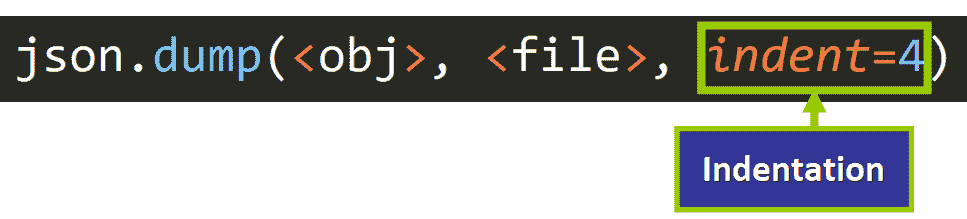

现在，该文件的内容如下所示:

```
{
    "orders": [
        {
            "size": "medium",
            "price": 15.67,
            "toppings": [
                "mushrooms",
                "pepperoni",
                "basil"
            ],
            "extra_cheese": false,
            "delivery": true
        },
        {
            "size": "small",
            "price": 6.54,
            "toppings": null,
            "extra_cheese": true,
            "delivery": false
        }
    ]
}
```

orders_new.json

差别真大！这正是我们所期望的 JSON 文件的样子。

现在您知道了如何使用`load()`和`dump()`读写 JSON 文件。让我们看看这些函数和我们用来处理 JSON 字符串的函数之间的区别。

## 🔹负载()与负载()

下表总结了这两种功能之间的主要区别:

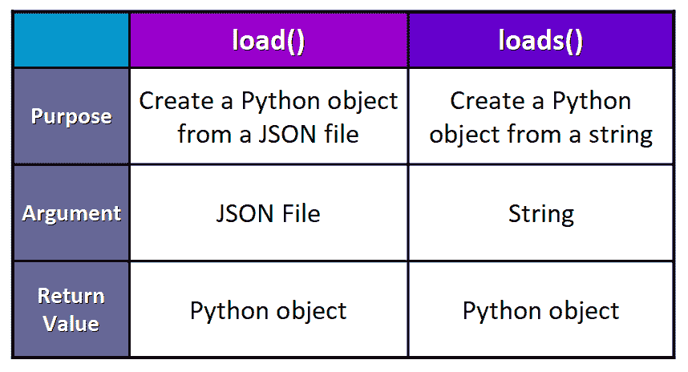

💡**提示:**把`loads()`想象成“加载字符串”，这将帮助你记住哪个函数用于哪个目的。

## 🔸转储()与转储()

这里我们有一个表格，总结了这两种功能之间的主要区别:

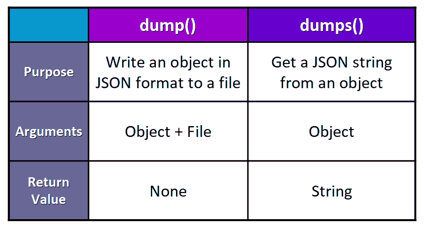

💡**提示:**把`dumps()`想象成一个“转储字符串”，这将帮助你记住哪个函数用于哪个目的。

## 🔹JSON 中的重要术语

最后，使用 JSON 需要知道两个重要的术语:

*   **序列化:**将对象转换成 JSON 字符串。
*   **反序列化:**将 JSON 字符串转换成对象。

## 🔸概括起来

*   JSON (JavaScript Object Notation)是一种用于表示和存储数据的格式。
*   它通常用于在 web 上传输数据和存储配置设置。
*   JSON 文件有一个`.json`扩展名。
*   您可以将 JSON 字符串转换成 Python 对象，反之亦然。
*   您可以读取 JSON 文件，并根据它们的键值对创建 Python 对象。
*   可以写入 JSON 文件，以 JSON 格式存储 Python 对象的内容。

我真的希望你喜欢我的文章，并发现它很有帮助。 现在你知道如何在 Python 中使用 JSON 了。在推特上关注我[@ estefanicassn](https://twitter.com/EstefaniaCassN)和[查看我的在线课程](https://www.udemy.com/user/estefania-cn/)。