# 如何在 Next.js 中使用 Chakra UI 并做出反应

> 原文：<https://www.freecodecamp.org/news/how-to-use-chakra-ui-with-next-js-and-react/>

建立网站和应用程序是困难的。有很多事情需要考虑，以确保我们的应用程序可用和可访问，包括我们的 React 组件如何工作。

我们如何利用 Chakra UI 的强大功能来构建优秀的 web 应用程序？

*   [什么是查克拉 UI？](#what-is-chakra-ui)
*   是什么让 Chakra UI 如此伟大？
*   我们要建造什么？
*   [步骤 0:用 Next.js 创建一个新的 React 项目](#step-0-creating-a-new-react-project-with-next-js)
*   [步骤 1:在 Next.js 中安装和配置 Chakra UI](#step-1-installing-and-configuring-chakra-ui-in-next-js)
*   [步骤 2:向 React 应用添加 Chakra UI 组件](#step-2-adding-chakra-ui-components-to-a-react-app)
*   [第三步:用 Chakra UI 制作响应式组件](#step-3-making-responsive-components-with-chakra-ui)
*   [步骤 4:定制默认脉轮 UI 主题](#step-4-customizing-the-default-chakra-ui-theme)

[https://www.youtube.com/embed/ubB5l-HVPgY?feature=oembed](https://www.youtube.com/embed/ubB5l-HVPgY?feature=oembed)

## 什么是查克拉 UI？

[Chakra UI](https://chakra-ui.com/) 是 React 的一个组件库，可以轻松构建应用或网站的 UI。

他们的目标是提供一个简单的、模块化的、可访问的组件集，以便快速启动和运行。

## 是什么让 Chakra UI 如此伟大？

首先，默认情况下，查克拉努力使每个组成部分都是可及的。这是经常被忽视的应用程序开发的关键部分，Chakra 维护者已经尽力确保组件遵循 [WAI-ARIA 指南](https://www.w3.org/WAI/standards-guidelines/aria/)。

Chakra 还包括一个简单的 API，允许开发人员提高工作效率。它允许人们和团队制作包容性的应用程序，而不必担心自己构建一堆组件。

对于样式和定制，Chakra 使用 [Emotion](https://emotion.sh/) 为开发人员提供了在 JavaScript 中使用样式道具对组件进行样式化的能力。它有一个默认的主题，但允许用自定义设置轻松覆盖它。

## 我们要建造什么？

为了更好地理解 Chakra 是如何工作的，我们将使用 Chakra UI 组件重新构建默认的 Next.js 模板。

这将有助于我们理解几个重要的概念，例如如何使用 Next.js 使用 Chakra UI，如何使用道具添加自定义样式，以及如何自定义 Chakra UI 主题。

这里的概念几乎可以适用于任何 [React](https://reactjs.org/) 应用程序，尽管示例将稍微针对 Next.js。

## 步骤 0:用 Next.js 创建一个新的 React 项目

要开始，我们需要一个 React 应用程序。我们将使用 Next.js 作为我们的框架，这将使我们能够轻松开发新的应用程序。

进入要创建项目的目录后，运行:

```
yarn create next-app my-chakra-app
# or
npx create-next-app my-chakra-app 
```

注意:可以随意将`my-chakra-app`更改为您想要命名的项目目录。

完成后，您可以导航到该目录并开始项目:

```
yarn dev
# or
npm run dev 
```

这应该会在 [http://localhost:3000](http://localhost:3000) 启动您的开发服务器，我们应该准备好了！

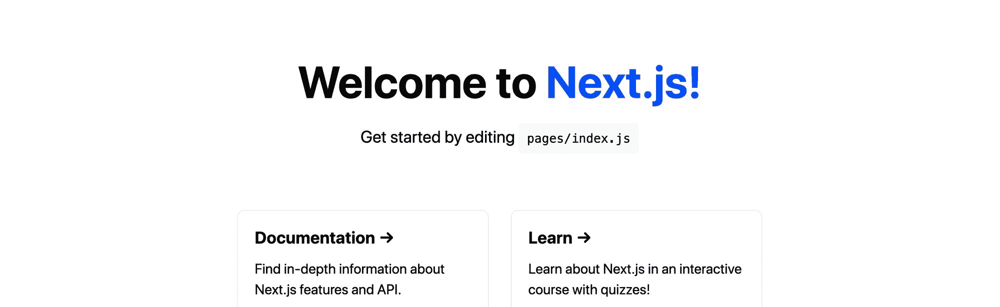

Default Next.js template

[跟随提交！](https://github.com/colbyfayock/my-chakra-app/commit/01f6ec8d961eb197fe3e8a32e498d07bf0be269b)

## 步骤 1:在 Next.js 中安装和配置 Chakra UI

接下来，我们来安装 Chakra UI。

在项目目录中，运行:

```
yarn add @chakra-ui/core @emotion/core @emotion/styled emotion-theming
# or 
npm install @chakra-ui/core @emotion/core @emotion/styled emotion-theming 
```

这将安装 Chakra UI 及其依赖项，包括情感，因为它依赖于它的造型。

为了让 Chakra 在我们的应用程序中工作，我们需要在应用程序的根目录下配置一个提供者。这将允许脉轮的所有组成部分互相交谈，并使用配置来保持一致的风格。

在`pages/_app.js`中，首先让我们在顶部导入我们的提供商:

```
import { ThemeProvider, theme } from '@chakra-ui/core'; 
```

接下来，将组件内部的 return 语句替换为:

```
function MyApp({ Component, pageProps }) {
  return (
    <ThemeProvider theme={theme}>
      <Component {...pageProps} />
    </ThemeProvider>
  )
} 
```

您会注意到，我们还将一个`theme`变量传递给了我们的提供者。我们直接从 Chakra 导入 Chakra UI 默认主题，并将其传递给我们的`ThemeProvider`,这样我们所有的组件都可以获得默认的样式和配置。

最后，我们想添加一个名为`CSSReset`的组件作为`ThemeProvider`的直接子组件。

首先，添加`CSSReset`作为导入:

```
import { ThemeProvider, theme, CSSReset } from '@chakra-ui/core'; 
```

然后在`ThemeProvider`内添加组件:

```
<ThemeProvider theme={theme}>
  <CSSReset />
  <Component {...pageProps} />
</ThemeProvider> 
```

现在，如果我们重新加载页面，我们可以看到事情看起来有点不同！

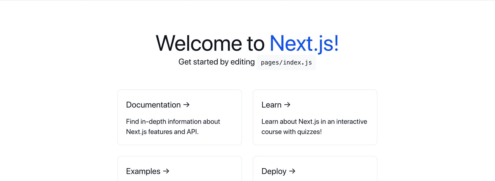

Next.js with Chakra UI CSS Reset

浏览器有很多默认样式，默认情况下，Chakra UI 不会覆盖它们。这包括按钮元素上的边框等样式。

虽然我们在这里不一定需要 CSS 重置，但我们可以手动覆盖这些内容。这为我们提供了一个基础，在这里我们将知道 Chakra UI 正在如其预期的那样工作，并且我们可以开始添加我们的组件。

[跟随提交！](https://github.com/colbyfayock/my-chakra-app/commit/8538b3609cfac71b6ece60e36314edf9a189941b)

## 步骤 2:将 Chakra UI 组件添加到 React 应用程序

现在是有趣的部分。我们将使用 Chakra UI 组件尝试重建 Next.js 默认模板。它不会看起来 100%一样，但它将携带精神，我们可以根据自己的喜好定制它。

### 构建标题和描述

从顶部开始，让我们更新标题和描述。

在页面顶部，我们需要导入我们的`Heading`组件:

```
import { Heading, Link } from "@chakra-ui/core"; 
```

那么让我们将`<h1>`替换为:

```
<Heading as="h1" size="2xl" mb="2">
  Welcome to Next.js!
</Heading> 
```

这里，我们使用了标题为的[组件，然后我们将它设置为`h1`。我们可以使用任何 HTML 标题元素标记名，但是因为我们要替换 h1，所以我们想使用它。](https://chakra-ui.com/heading)

我们还设置了一个`size`属性，允许我们控制标题的大小，以及代表`margin-bottom`的`mb`，允许我们在下面添加一些空间。

我们已经可以看到我们的页面看起来更像默认模板。


Chakra UI Heading component

我们还想添加回我们的链接。

将`Link`添加到我们的 import 语句的顶部，然后在我们的`<Heading>`组件内部，将 Next.js 文本替换为:

```
<Link color="teal.500" href="https://nextjs.org">Next.js!</Link> 
```

Chakra 的[链接](https://chakra-ui.com/link)组件创建了一个预期的链接，但随后允许我们使用风格道具来定制它。这里，我们使用脉轮提供的颜色变量`teal.500`来改变我们与脉轮颜色的联系。

我们可以看到我们有了 Next.js 链接！


Chakra UI Heading with Link component

标题的最后一部分是描述。为此，我们希望使用文本组件。

将`Text`和`Code`添加到导入语句中，并将描述替换为:

```
<Text fontSize="xl" mt="2">
  Get started by editing <Code>pages/index.js</Code>
</Text> 
```

我们使用[文本](https://chakra-ui.com/text)组件来重新创建一个`<p>`标签，使用[代码](https://chakra-ui.com/code)组件来创建我们的`<code>`标签。类似于我们的标题组件，我们添加了一个`fontSize`来使字体变大，并添加了代表`margin-top`的`mt`来在它上面添加一些空间。

现在我们有我们的头了！


Chakra UI Text component with Code

### 用 Chakra UI 组件替换信息卡

对于我们的每张卡片，我们可以使用与标题相同的概念来重新创建我们的每个盒子。

首先，为`Flex`组件添加一个导入，并将标签`<div className={styles.grid}>`替换为:

```
<Flex flexWrap="wrap" alignItems="center" justifyContent="center" maxW="800px" mt="10">
  ...
</Flex> 
```

确保将所有卡留在 Flex 组件内。 [Flex](https://chakra-ui.com/flex) 组件将通过添加 Flexbox 以及之前网格上的相同属性来重新创建网格。

在这一点上，它应该和以前完全一样。

接下来，将`Box`添加到导入语句中，然后将第一张卡替换为:

```
<Box as="a" href="https://nextjs.org/docs" p="6" m="4" borderWidth="1px" rounded="lg" flexBasis="45%">
  <Heading as="h3" size="lg" mb="2">Documentation &rarr;</Heading>
  <Text fontSize="lg">Find in-depth information about Next.js features and API.</Text>
</Box> 
```

类似于我们的标题组件，我们将我们的[框](https://chakra-ui.com/box)组件设置为一个`<a>`标签，允许它作为一个链接。然后，我们配置我们的风格道具来复制我们的卡。

在其中，我们使用标题和文本组件来重新创建卡片的实际内容。

仅更换第一张卡后，我们现在可以看到变化:

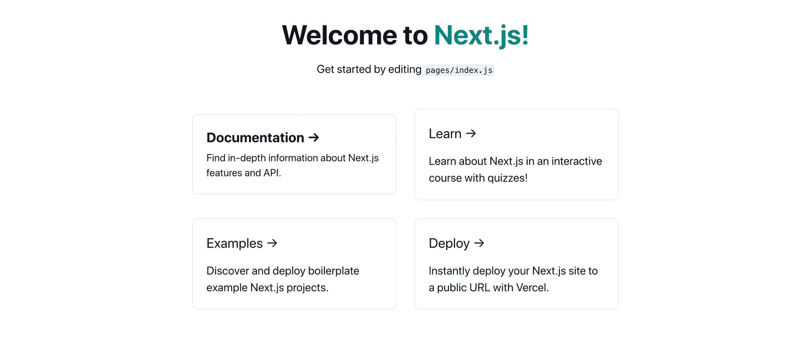

Chakra UI Box component

现在，我们可以返回并用相同的组件替换其他三张卡来完成网格的重新创建。

为了好玩，我们可以添加第五张卡链接到查克拉用户界面:

```
<Box as="a" href="https://chakra-ui.com/" p="6" m="4" borderWidth="1px" rounded="lg" flexBasis="45%">
  <Heading as="h3" size="lg" mb="2">Chakra UI &rarr;</Heading>
  <Text fontSize="lg">Build accessible React apps & websites with speed.</Text>
</Box> 
```

经过所有的更改，我们现在可以看到重新创建的 Next.js 起始模板了！

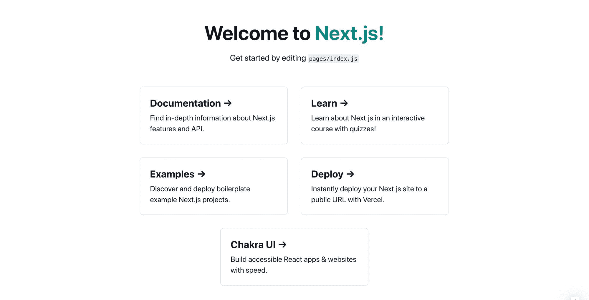

Chakra UI recreating Next.js grid

[跟随提交！](https://github.com/colbyfayock/my-chakra-app/commit/a324f8cd1d4120027a7f4dbcb16f45980de5495a)

## 步骤 3:用 Chakra UI 制作响应组件

默认的 Next.js 网格能够提供的一部分功能是，一旦浏览器的尺寸变得足够小，卡片就能够扩展到全宽。这与`600px`特别相关，这通常意味着有人在使用移动设备。

如果我们在移动设备上看我们的页面，我们可以看到我们的卡片没有填满整个宽度。

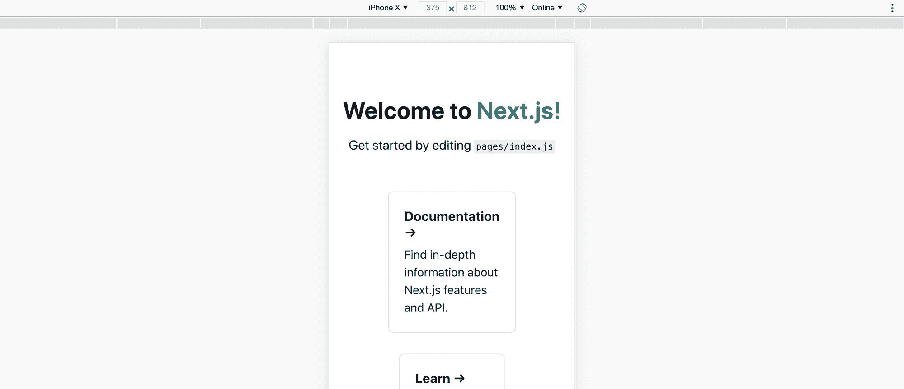

Chakra UI default without responsive

Chakra 允许我们[设置响应风格](https://chakra-ui.com/responsive-styles)及其烘焙尺寸，允许我们轻松地重新创建我们的响应网格卡。

为此，我们可以传入一个数组，而不是传入一个值给我们的样式属性。

例如，在我们的每个 Box 组件上，让我们将`flexBasis`属性更新为:

```
flexBasis={['auto', '45%']} 
```

这里，根据查克拉的[默认响应断点](https://chakra-ui.com/responsive-styles)，我们说默认情况下，我们希望我们的`flexBasis`被设置为`auto`。但是对于任何`480px`和更大的，也是 Chakra 默认的第一个断点，我们将其设置为`45%`。

查克拉认为它的响应样式首先是可移动的，这就是为什么你看到`480px`作为最小尺寸，而不是最大尺寸。

随着这一变化，我们现在可以看到，在大型设备上，我们仍然有自己的网格。

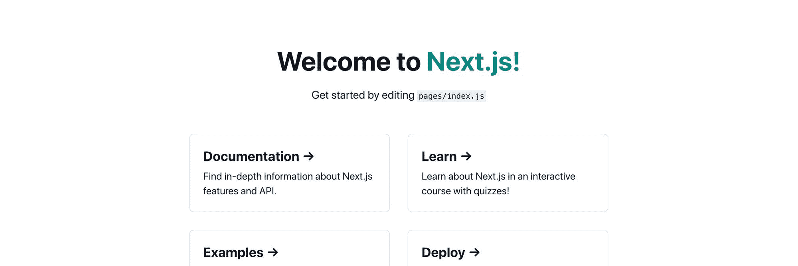

Chakra UI components on large device

但是现在在手机上，我们的卡占据了整个宽度！

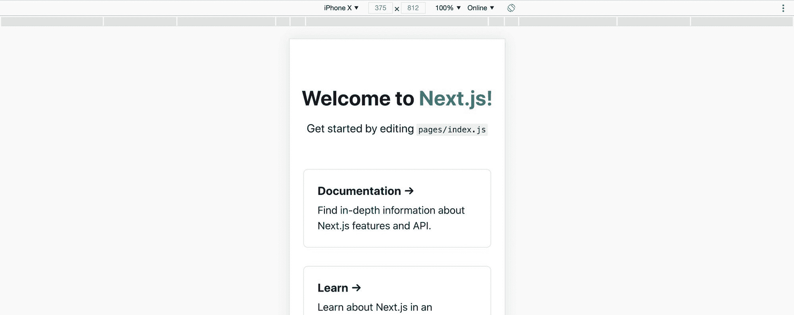

Chakra UI components on small device

使用阵列模式适用于所有断点，所以如果你想对你的风格有更多的控制，Chakra 可以让你做到这一点。

[跟随提交！](https://github.com/colbyfayock/my-chakra-app/commit/c08e80b60395aa738eaa8f8eb411ca7004ffac9d)

## 步骤 4:定制默认的脉轮用户界面主题

虽然 Chakra 提供了一个非常棒的默认主题，但我们也可以根据自己的喜好定制它，以符合我们的品牌或个人品味。

例如，虽然我们用于标题链接的蓝绿色很棒，并且使用了 Chakra 的风格，但是如果我想定制所有链接，使用我在网站上使用的紫色呢？

首先，Chakra 有一个默认的紫色，所以我们可以更新我们的链接来使用紫色:

```
Welcome to <Link color="purple.500" href="https://nextjs.org">Next.js!</Link> 
```

我们看到了我们的改变。

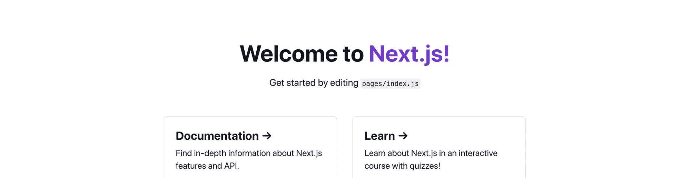

Making Next.js header link purple with color style prop

那看起来很棒，但是让我们更新它到我使用的确切的紫色。

在`pages/_app.js`中，我们将在页面顶部创建一个新的对象，在这里我们扩展了默认主题，创建了一个新的主题对象。我们还将用我们的新对象替换`theme`道具:

```
const customTheme = {
  ...theme
}

function MyApp({ Component, pageProps }) {
  return (
    <ThemeProvider theme={customTheme}> 
```

如果我们保存并重新加载页面，它看起来会完全一样。

接下来，我们想要更新颜色，所以在我们的自定义主题对象中，让我们添加颜色属性，然后我们可以在其中设置我们的自定义紫色:

```
const customTheme = {
  ...theme,
  colors: {
    ...theme.colors,
    purple: '#692ba8'
  }
} 
```

注意:在这里你会看到我们也在传播`theme.colors`。如果我们不这样做，我们将只用紫色值替换颜色对象，这意味着我们将没有任何其他颜色。

但是如果我们重新加载页面，我们的链接就不再是紫色的了！

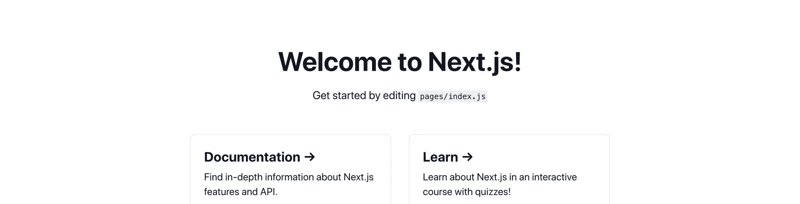

Next.js link with no color

脉轮通常使用各种颜色，这允许我们使用每种颜色的不同色调。在我们的链接组件中，我们指定了没有设置为存在的`purple.500`。

因此，为了解决这个问题，我们可以使用类似于 [Smart Swatch](https://smart-swatch.netlify.app/#692ba8) 的工具来获取我们需要的所有颜色值，并在我们的自定义主题对象中设置这些值:

```
const customTheme = {
  ...theme,
  colors: {
    ...theme.colors,
    purple: {
      50: '#f5e9ff',
      100: '#dac1f3',
      200: '#c098e7',
      300: '#a571dc',
      400: '#8c48d0',
      500: '#722fb7',
      600: '#59238f',
      700: '#3f1968',
      800: '#260f40',
      900: '#10031a',
    }
  }
} 
```

提示:智能样本实际上允许您将这些值作为 JavaScript 对象进行复制，从而更容易粘贴到我们的主题中！

现在，如果我们重新加载页面，我们可以看到我们的紫色！

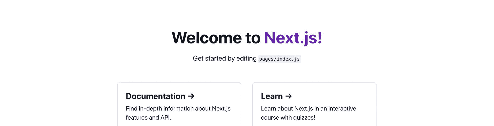

Next.js with custom purple

虽然我们在这里使用了范围值，但是我们也可以指定没有范围的颜色变量。

假设我想让默认的脉轮紫色保持“原样”,但为我提供一个参照我的紫色的方法。

为此，我可以删除这些紫色值并添加一个新的自定义变量:

```
const customTheme = {
  ...theme,
  colors: {
    ...theme.colors,
    spacejelly: '#692ba8'
  }
} 
```

然后更新我的链接以使用该颜色:

```
Welcome to <Link color="spacejelly" href="https://nextjs.org">Next.js!</Link> 
```

我们可以看到，我们现在使用的是紫色，而没有覆盖原来的颜色:

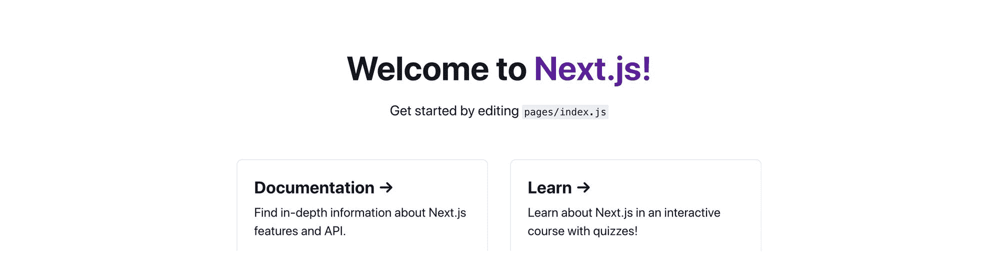

Next.js with custom color variable

我们可以将此应用于 Chakra 风格的大多数部分，包括排版和设置自定义断点。这是另一种方式，使我们的项目定制为我们自己的，同时仍然利用查克拉的力量！

[跟随提交！](https://github.com/colbyfayock/my-chakra-app/commit/b9d707ce3324207c25c2348934ca0c506402bd2f)

## 用 Chakra UI 还能做什么？

虽然我们讨论了一些简单的例子，但它确实为 Chakra 通过其组件 API 提供的更复杂的风格变化和控制打开了大门。

还有很多很棒的组件可以用来改造你的网站或应用程序，让开发变得又快又容易！

他们甚至[提供了一些配方](https://chakra-ui.com/recipes),举例说明如何将这些组件结合起来，从而产生强大的功能。这包括一个响应头，甚至添加动画与帧运动。

[](https://twitter.com/colbyfayock)

*   [？在 Twitter 上关注我](https://twitter.com/colbyfayock)
*   [？订阅我的 Youtube](https://youtube.com/colbyfayock)
*   [✉️注册我的简讯](https://www.colbyfayock.com/newsletter/)
*   [？赞助我](https://github.com/sponsors/colbyfayock)