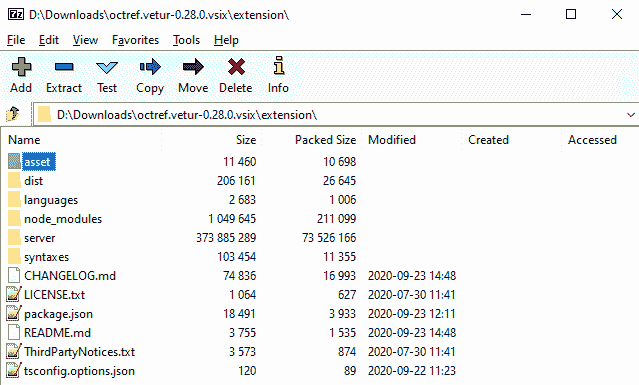
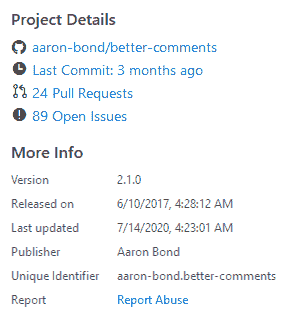
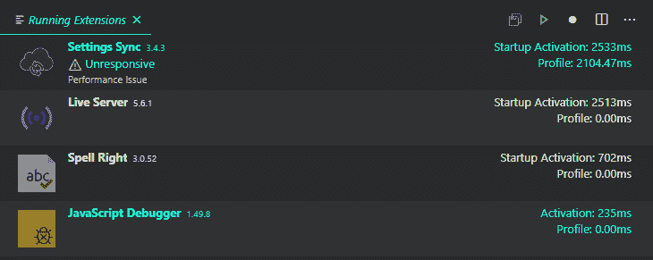
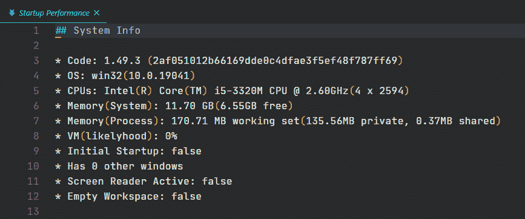
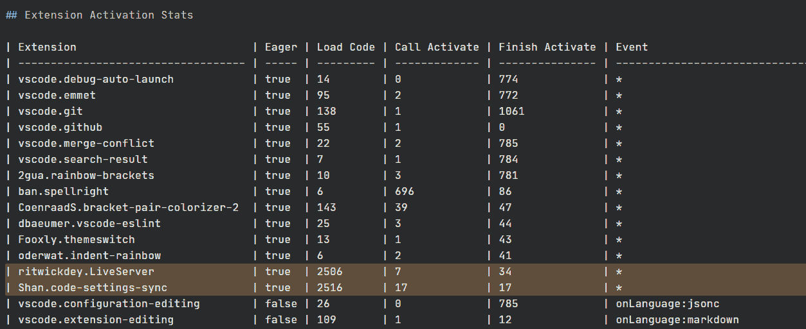
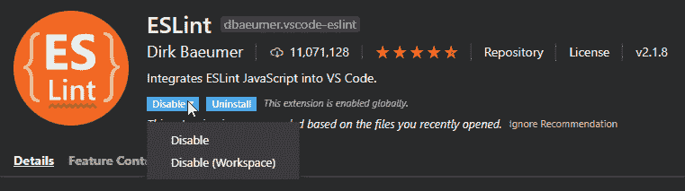

# VS 代码性能——如何优化 Visual Studio 代码并选择“最佳”扩展

> 原文：<https://www.freecodecamp.org/news/optimize-vscode-performance-best-extensions/>

Visual Studio 代码(VS 代码)被设计成轻量级的。它有一组紧凑的核心特性，您可以通过扩展添加额外的特性。

但是随着扩展集的增加，性能将不可避免地受到影响。

在安装一个扩展之前，你会评估它的性能吗？如果 VS 代码的启动增长了你怎么办？从没有人写这个话题来看，我猜人们不知道。

在本文中，我将解释影响扩展性能的因素。我还会对一些流行的扩展的性能进行评分。然后，我将概述如何审计现有扩展套件的性能，并给出一些通用的性能提示。

## 最低硬件和软件要求

在我们进入扩展之前，让我们简单地谈谈运行 VS 代码的最低要求是什么。

最近几年买的规格适中的计算机应该能够毫无问题地运行 VS 代码。

### 五金器具

我推荐的最低硬件是:

*   1.6 GHz 或更快的处理器；
*   至少 1 GB 内存；
*   至少 200MB 磁盘空间。

### 操作系统

VS 代码已经在以下操作系统上进行了测试:

*   OS X Yosemite 及更高版本。
*   Windows 7(带。NET Framework 4.5.2)、8.0、8.1 和 10 (32 位和 64 位)。
*   Linux (Debian): Ubuntu 桌面 14.04，Debian 7。
*   Linux(红帽):红帽企业版 Linux 7，CentOS 7，Fedora 23。

### 为 Raspberry Pi 和 Chromebooks 构建的非官方社区

Jay Rodgers 发布了一个开源项目，为 Raspberry Pi 和 chrome book 执行[每夜构建 VS 代码。](http://code.headmelted.com/)

> 我维护这个项目已经有几年了，它已经从为 Pi 提供二进制文件扩展到提供支持和工具，让 VS 代码在低端 ARM 设备上运行，否则这些设备可能不会像 Chromebooks 一样支持它(Chromebooks 现在占学校设备的 60%)。

如果你想亲自尝试一下，你可以按照他的指导去做。他做了很多工作，尽可能使它简单明了。

## 并非所有的扩展都是平等的


编辑的《蒙眼女士的正义》由[汀吉律师事务所](https://unsplash.com/@tingeyinjurylawfirm?utm_source=unsplash&utm_medium=referral&utm_content=creditCopyText)于[Unsplash](https://unsplash.com/s/photos/equal?utm_source=unsplash&utm_medium=referral&utm_content=creditCopyText)

扩展在不同的条件下加载和卸载。扩展的作者决定这一点。这是通过*激活事件*指定的，我们将在后面讨论。

编辑器中没有指示扩展是否活动的反馈。那么我们如何知道一个扩展何时是活动的呢？

大多数扩展是用 TypeScript 编写的，但也可以用 JavaScript 编写。扩展可以包含节点模块作为依赖项。

如果你愿意，你可以把你的源文件打包成一个文件。VS 代码文档建议这样做来改善加载时间，但是许多扩展不这样做。这些选择会影响他们的表现。

扩展大多是开发者编写的开源端项目。代码的质量会有所不同。代码的维护会有所不同。

微软编写的扩展也不能避免这些缺点，但它们不太可能受到这些缺点的影响。

## 选择扩展的标准

大多数扩展列表都谈到了很酷的特性，其他的就很少了。如果有东西着火了，请告诉我一些关于燃料和烟雾的信息。？‍?？

我建议的一些标准包括查看源代码。不要因此而不高兴。收集关键事实只需要几分钟。我会告诉你怎么做！

1.  我需要的特性在 VS 代码中已经存在了吗？

    我在文章[“VS Code:你不需要那个扩展”](https://roboleary.net/vscode/2020/08/05/dont-need-extensions.html)中演示了你不需要很多流行的扩展。你可以参考 [VS 代码文档](https://code.visualstudio.com/Docs)来检查一个特定的特性。

2.  扩展有我需要的功能吗？

    请参考 Visual Studio Marketplace 上的扩展页面来找出答案。

3.  什么时候加载并激活一个扩展？

    我将在[激活事件](#activation-events)一节中详细讨论这一点。你需要检查源代码的 *package.json* 来提前发现这一点。

    您可以运行**Developer:Startup Performance**命令来查看已安装扩展的激活事件。我将在[如何审计绩效一节中进一步讨论这个问题。](#how-to-audit-performance)

4.  资源得到优化了吗？

    您需要检查源代码，看看它是否使用了 bundler。您可以检查 *package.json* 来查看*脚本*部分是否有用于捆绑的预构建步骤。

    VSIX 扩展文件是代码和 marketplace 列表的压缩档案。开发人员通常会包含不必要的文件。有一个*。vscodeignore* 文件来排除文件。

    VSIX 包含的文件数量会影响冷激活时间。冷激活时间是安装扩展后第一次运行的时间。它往往比其他时间慢。我猜这是因为 VSIX 是未压缩和缓存的。

    这是你在 [7Zip](https://www.7-zip.org/) 中打开的 [Vetur](https://marketplace.visualstudio.com/items?itemName=octref.vetur) 扩展的样子。



5.  **最近是否报告了任何未解决的性能问题？**

    您可以通过审计扩展的性能来发现这些问题。您还需要检查 Git 回购上的问题。

6.  代码有测试吗？

    没有经过测试，这个扩展会更容易出现错误。你需要检查源代码，看看是否有测试。

7.  **是否积极维护？**

    扩展页面的*项目细节*部分概述了公共 Git 回购的活动。在某些情况下，扩展可能已经“完成”，因此维护不是一个重要的考虑因素。



## 激活事件

激活事件是触发扩展激活的事件。它们定义了加载和卸载扩展的条件。

扩展的作者在`package.json` ( [扩展清单](https://code.visualstudio.com/api/references/extension-manifest))的`activationEvents`字段中声明这一点。

有一系列激活事件可供选择。扩展可以监听许多激活事件，以产生更具体的范围。

这是一个序列图，显示了启动 VS 代码时会发生什么。它给你一个事件发生的时间顺序的概念，它影响你什么时候能与编辑器交互和使用某些扩展。

[](https://cdn.imgpaste.net/2020/10/19/IDOqm.png)

现在，我将介绍最重要的激活事件。我将从最宽的范围开始，一直到最窄的范围。

### 启动事件

当 VS 代码启动时,`*`激活事件将激活一个扩展。这些扩展将**一直激活**。这会影响 VS 代码的启动时间。

```
"activationEvents": [
    "*"
] 
```

VS 代码文档给出了以下建议:

> 为了确保良好的最终用户体验，请仅在您的用例中没有其他激活事件组合时，才在您的扩展中使用此激活事件。

我认为，必须有一个特殊的情况来批准扩大这一范围。最好至少使用`onStartUpFinished`。

**本次激活事件的热门扩展** : [ES Lint](https://marketplace.visualstudio.com/items?itemName=dbaeumer.vscode-eslint) (11M 安装)、 [Live Server](https://marketplace.visualstudio.com/items?itemName=ritwickdey.LiveServer) (7.4 安装)、 [GitLens](https://marketplace.visualstudio.com/items?itemName=eamodio.gitlens) (6.5M 安装)、[美化](https://marketplace.visualstudio.com/items?itemName=HookyQR.beautify) (5.4M 安装)、[括号对上色器](https://marketplace.visualstudio.com/items?itemName=CoenraadS.bracket-pair-colorizer) (3.6M 安装)、 [Git 历史](https://marketplace.visualstudio.com/items?itemName=donjayamanne.githistory) (2.9M 安装)、[设置同步](https://marketplace.visualstudio.com/items?itemName=Shan.code-settings-sync) (2M 安装)、[缩进-彩虹【等](https://marketplace.visualstudio.com/items?itemName=oderwat.indent-rainbow)

### onStartupFinished 事件

这个扩展将在 VS 代码启动后的某个时间**被激活。这就像`*`激活事件，但不会减缓 VS Code 的启动。**

```
"activationEvents": [
    "onStartupFinished"
] 
```

**本次激活事件的热门扩展** : [更漂亮](https://marketplace.visualstudio.com/items?itemName=esbenp.prettier-vscode)(850 万安装)。

### 非语言事件

每当打开某种语言的文件时，该扩展名将被激活。

```
"activationEvents": [
    "onLanguage:json",
    "onLanguage:markdown",
    "onLanguage:typescript"
] 
```

`onLanguage`事件接受一个[语言标识符](https://code.visualstudio.com/docs/languages/identifiers)值。您可以声明任意多种语言。

**带有此激活事件**的流行扩展:Visual Studio 代码市场中的[“编程语言”类别](https://marketplace.visualstudio.com/search?target=VSCode&category=Programming%20Languages&sortBy=Installs)中的大多数扩展都有一个 *onLanguage* 条目以及其他激活事件、 [Vetur](https://marketplace.visualstudio.com/items?itemName=octref.vetur) (5.6M 安装-仅对 *Vue* 有效)、 [YAML](https://marketplace.visualstudio.com/items?itemName=redhat.vscode-yaml) (4.3M 安装-仅对 *YAML* 有效)、[更好的评论](https://marketplace.visualstudio.com/items?itemName=aaron-bond.better-comments) (1.1M 安装-仅对

### 工作空间包含事件

每当您打开包含至少一个与 glob 模式匹配的文件的文件夹时，此扩展将被激活。

```
"activationEvents": [
    "workspaceContains:**/package.json"
] 
```

### onCommand 事件

每当您调用一个命令时，这个扩展将被激活。

```
"activationEvents": [
        "onCommand:vscode-docker.compose.down",
        "onCommand:vscode-docker.compose.restart",
        "onCommand:vscode-docker.compose.up",
        ...
] 
```

### 其他激活事件

您可以在参考文档中阅读激活事件的[完整列表。](https://code.visualstudio.com/api/references/activation-events)

### 扩展是否一致地设置了特定的范围？

不要！

太多扩展使用了`*`激活事件。

这是我对我所使用的一些扩展的作用域定义的评分:

*   **好的** : [维特](https://marketplace.visualstudio.com/items?itemName=octref.vetur)， [YAML](https://marketplace.visualstudio.com/items?itemName=redhat.vscode-yaml) ，[更好的评论](https://marketplace.visualstudio.com/items?itemName=aaron-bond.better-comments)。
*   **坏的**:
    *   [更漂亮](https://marketplace.visualstudio.com/items?itemName=esbenp.prettier-vscode):最好只针对它支持的语言。
    *   [Markdown All in One](https://marketplace.visualstudio.com/items?itemName=yzhang.markdown-all-in-one) :当 Markdown 文件打开时，或者工作区包含 README.md 时，它是活动的，后者对我来说似乎是不必要的。
*   **丑陋的**:上面提到的`*` *激活事件*的所有扩展。

## 捆绑对扩展的性能有什么影响？


由[巴勃罗·默汉·蒙特斯](https://unsplash.com/@pablomerchanm?utm_source=unsplash&utm_medium=referral&utm_content=creditCopyText)于 [Unsplash](https://unsplash.com/s/photos/burger?utm_source=unsplash&utm_medium=referral&utm_content=creditCopyText) 编辑无标题照片

可以产生很大的影响！

John Papa 在他的文章“[你的 VS 代码扩展慢吗？以下是加快速度的方法！](https://dev.to/azure/is-your-vs-code-extension-slow-heres-how-to-speed-it-up-4d66)”。

他揭示了对微软的两个扩展进行彻底检查的结果:

1.  [Azure 账号](https://marketplace.visualstudio.com/items?itemName=ms-vscode.azure-account&wt.mc_id=devto-blog-jopapa):捆绑减少激活时间 50%。通过捆绑和排除更多文件，扩展大小从 6.2MB 减少到 840KB(在*)。vscodeignore* 文件)。
2.  [Docker](https://marketplace.visualstudio.com/items?itemName=PeterJausovec.vscode-docker&wt.mc_id=devto-blog-jopapa) :捆绑将激活时间从 3.5 秒减少到 2 秒以下。此外，需要考虑的是冷激活时间，它往往比其他时间(热激活时间)要慢。冷激活时间从惊人的 20 秒变成了 2 秒。

你可以通过向扩展的作者提出这个问题来改进你最喜欢的扩展。[捆绑扩展用户指南](https://code.visualstudio.com/api/working-with-extensions/bundling-extension)解释了如何操作。

## 如何审计绩效

您可以运行**Developer:Show Running Extensions**命令来获得关于正在运行的扩展的基本统计信息。它从激活时间最长到最短对扩展进行排序。如果扩展是在启动时加载的，则时间标题为“启动激活”。

从截图中可以看到，它也给出了关于性能问题的警告。



如前所述，值得注意的是，冷激活时间(第一次运行扩展)和热激活时间(第二次运行和以后的运行)可能会有很大差异。因此，您应该将扩展的典型性能建立在第二次运行的基础上。

您可以通过运行**Developer:Startup Performance**命令来审计启动性能。它打开一个文档，里面有详细的统计数据，比如:系统信息、性能标记、扩展激活统计数据、模块的加载统计数据等等。



执行该命令时，结果特定于当前项目和任何打开的文件。

*扩展激活统计*部分给出了扩展性能的更详细的概述。这对于查看*激活事件*非常有用，无需检查扩展的源代码。



您可以看到，VS 代码在启动时也为 Git、Emmet 和其他一些应用程序加载了自己的“核心”扩展。？你不希望启动时加载的扩展列表太长！

## 一些最流行的扩展的记分卡

我把重点放在我自己在这里使用的扩展上。我不想猜测我没有真正使用过的扩展。

### 埃斯林特

[ESLint](https://marketplace.visualstudio.com/items?itemName=dbaeumer.vscode-eslint) 是 JavaScript 和 TypeScript 最流行的静态分析工具。它用红色曲线突出了编辑器中的问题。

*   **作者**:微软。
*   **安装数量**:1100 万。
*   **市场评分:** 4.3/5 (156)。
*   **核心特性**:报告语法问题。能够自动修复一些问题。
*   **激活事件**:启动时(`*`)。下一个版本可能会改成`onStartupFinished`。参见[本期未决问题](https://github.com/microsoft/vscode-eslint/issues/1068)了解做出这一选择的原因。
*   **资源是否得到优化**:是。
*   **文件大小** : 133KB。
*   **我的系统激活时间**:39 毫秒。
*   **测试套件**:看起来很基础。只是全球模式的一个小测试。
*   **主动维护**:是。
*   **备选扩展名:** [JS 提示](https://marketplace.visualstudio.com/items?itemName=dbaeumer.jshint)， [TS 皮棉](https://marketplace.visualstudio.com/items?itemName=ms-vscode.vscode-typescript-tslint-plugin)。

ESLint 是一个可靠的扩展。表演很精彩。

令人失望的是，它是在启动时加载的。如果这困扰着你，你可以试试 JavaScript 的 [JS 提示](https://marketplace.visualstudio.com/items?itemName=dbaeumer.jshint)(由同一个开发者编写)，TypeScript 的 [TS Lint](https://marketplace.visualstudio.com/items?itemName=ms-vscode.vscode-typescript-tslint-plugin) 。或者可以叉项目，自己改！

它得到了积极的维护。它没有重要的测试套件。

**分数:8/10**

### 漂亮代码格式化程序

[更漂亮](https://prettier.io/)是一个固执己见的代码格式化程序。目前支持以下语言:JavaScript、TypeScript、Flow、JSX、JSON、CSS、SCSS、Less、HTML、Vue、Angular、GraphQL、Markdown、YAML。

*   **作者**:比较漂亮。
*   **安装数量**:850 万。
*   **市场评分:** 3.8/5 (204)。
*   **核心特性**:格式化代码。
*   **激活事件** : `onStartupFinished`。
*   **资源是否得到优化**:是。
*   **文件大小** : 2.1MB
*   **我的系统激活时间** : 286ms。
*   **测试套件**:是的。覆盖面看起来不错。
*   **主动维护**:是。
*   **另类延伸:** [美化](https://marketplace.visualstudio.com/items?itemName=HookyQR.beautify)。

Prettier 在简化代码格式方面做得很好。

演出很好，但也许还可以改进。它处于激活光谱的较慢一侧。

激活范围很广。最好只针对支持的语言。我遇到了降价格式的问题，所以我目前不使用来格式化降价。这些都是可以轻易改变的事情。

**评分:7.5/10。**

### 实时服务器

[Live Server](https://marketplace.visualstudio.com/items?itemName=ritwickdey.LiveServer) 启动本地开发服务器，实时预览您的 HTML 和 SVG 文件。

*   **作者**:雷特威克·戴伊。
*   **安装数量**:750 万。
*   **市场评分:** 4.5/5 (269)。
*   **核心功能** : HTML 和 SVG 直播预览。
*   **激活事件**:启动时(`*`)。
*   **资源是否得到优化**:否
*   **文件大小** : 2.5MB
*   **我的系统激活时间** : 2513ms。
*   **测试套件**:是的。基本测试。
*   **主动维护**:否，最后一次提交是在一年前。扩展的作者正在寻找新的维护者。
*   **替代扩展:**我还没找到！

当它工作时，它是一个使用方便的扩展。

性能差，不再维持。

我建议成为维护者，并把它塑造成型。或者为工作寻找另一个扩展。

**评分:5/10。**

### 走吧

GitLens 帮助可视化代码作者身份并探索 Git 库。

*   作者:埃里克·阿莫迪奥。
*   **安装数量**:650 万。
*   **市场评分:** 4.86/5 (387)
*   **核心特性**:代码作者身份可视化一目了然。丰富的 git 回购侧边栏视图。
*   **激活事件**:启动时(`*`)。
*   **资源是否得到优化**:是。
*   **文件大小** : 1.5MB
*   **我的系统激活时间**:35 毫秒。
*   **测试套件**:否
*   **积极维护**:有，但近期活跃度较低。最后一次作案是 4 个月前。
*   **替代扩展名:**无。

GitLens 是个好主意，有助于深入了解代码库。

写得很好，表演也很出色。

我只用过责备注释的扩展，但是有很多特性和配置选项(135 个单独的设置！).

每个特性都有启用的设置，这是一个非常好的方法。您可以轻松地打开和关闭 codelens。

最近活动有所停顿。我不知道这是不是暂时的情况。所以，很难说这些扩展将来会得到怎样的支持。作者有支持他的细节。

**评分:9/10。**

### 艺术品或古董

Vue 语言支持。

*   **作者**:松武。
*   **安装数量**:560 万。
*   **市场评分:** 4.5/5 (117)
*   **核心特性**:语法高亮。智能感知。代码格式。
*   **激活事件** : `onLanguage: vue`。
*   **资源是否得到优化**:否
*   **文件大小** : 70.6 MB。
*   **我的系统激活时间** : 252ms。然而，“完成激活”统计是 3943 毫秒！
*   **测试套件**:是的。
*   **主动维护**:是。
*   **替代扩展:**没有明显的替代。格式化可以用更漂亮的来完成。

Vetur 是用 VS 代码开发 Vue 应用的首选扩展。

语法突出显示、智能感知和悬停引用对于 Vue 开发来说是非常好的。

扩展的规模是巨大的。

表现有点飘忽不定。在我的机器上完成激活至少需要 4 秒，比内置的 *JavaScript 语言特性*要长很多。JavaScript 语法的自动完成也有明显的延迟。

开发人员目前正在捆绑这个扩展，所以希望性能很快会有所改善。？

**评分:7/10。**

### 设置同步

[设置同步](https://marketplace.visualstudio.com/items?itemName=Shan.code-settings-sync)使用 GitHub Gist 同步设置。

*   **作者**:单于。
*   **安装数量**:200 万。
*   **市场评分:** 4.61/5 (638)
*   **核心特性**:同步设置。
*   **激活事件**:启动时(`*`)。
*   **资源是否得到优化**:是。
*   **文件大小** : 1.2 MB。
*   **我的系统激活时间** : 2513ms。
*   **测试套件**:是的。
*   **主动维护**:否，最后一次提交是在 1 年前。
*   **替代扩展:**这是 VS 代码中的[内置特性。](https://code.visualstudio.com/docs/editor/settings-sync)

这是一个突出的扩展。跨机器同步你的完整编辑器设置是非常有用的。

自 2020 年 7 月起，同样的功能成为了 VS 代码中的内置特性。主要的区别是，这个扩展将你的设置保存到一个要点，你也可以选择与他人分享。

激活时间相当慢。它慢得有道理吗？很难说。

我的猜测是，内置功能最终会做得更好，因为它有微软的支持。似乎不再支持该扩展。

**评分:8/10。**

### 一次降价

[减价一体机](https://marketplace.visualstudio.com/items?itemName=yzhang.markdown-all-in-one)满足你的许多减价需求。

*   **作者**:张瑜。
*   **安装数量**:170 万。
*   **市场评分:** 4.8/5 (90)
*   **核心功能**:切换式编辑。目录。
*   **激活事件** : `onLanguage: markdown`，`onCommand: markdown.extension.printToHtmlBatch`，`workspaceContains: README.md`。
*   **资源是否得到优化**:是。
*   **文件大小** : 4.1 MB。
*   **我的系统激活时间** : 195ms。
*   **测试套件**:是的。
*   **主动维护**:是。
*   **替代扩展:** [Marky Markdown](https://marketplace.visualstudio.com/items?itemName=robole.marky-markdown) 。

它是一个可靠的扩展，性能非常出色。

对我来说，它的特点太多了。对许多人来说，在一个分机中拥有他们想要的一切是很有吸引力的。

激活事件`workspaceContains: README.md`对我来说似乎是不必要的。我的大多数项目都有一个自述文件，但我很少编辑它们。所以对我来说，这就像让扩展始终处于活动状态。

目录的逻辑有点普通。过去它有一些假阳性的问题。我不知道那件事是否已经完全解决了。

通过从扩展包中排除自述文件截图，可以减小扩展的文件大小。

**评分:8/10。**

## 一般性能提示

### 使用 64 位操作系统

如果升级到 64 位版本的操作系统，可以将 VS 代码可用的虚拟内存(VM)从 2 GB 扩展到 4 GB。

这使得 VS 代码能够在需要 VM 时处理大得多的工作负载。

### 启动时禁用项目状态恢复

VS 代码自动从先前的会话中恢复项目状态。这可能会延长加载项目的时间。

您可以禁用一些恢复设置来加快加载速度:

*   `Workbench › Editor: Restore View State`:默认开启。
*   `Files: Restore Undo Stack`:默认开启。
*   `Workbench: Startup Editor`:控制启动时显示哪个编辑器。默认为`welcome page`。你可以设置这个为`none`来防止任何编辑器在启动时出现。

### 禁用影响编辑性能的昂贵功能

*   **小地图** : `Editor › Minimap: Enabled`。默认启用。
*   **自动换行** : `Editor: Word Wrap`。默认情况下禁用。
*   **镜头代码** : `Editor: CodeLens`。默认启用。
*   **保存时的格式** : `Editor: Format On Save`。默认情况下禁用。
*   **粘贴格式** : `Editor: Format On Paste`。默认情况下禁用。

### 禁用工作区的扩展

您可以禁用工作区(项目)的扩展。



对于总是运行的扩展，您很可能想要这样做。对于一个 Java 项目，你不需要 ESLint！

你也可以采取相反的方法。您可以全局禁用一个扩展，并且只为选定数量的项目启用它。

### 创建扩展集

您可以从命令行为扩展名指定一个备用目录，如下所示。

```
code --extensions-dir <dir> 
```

所以，如果你想使用不同的扩展集，你可以。您可以为此添加一个桌面快捷方式，或从命令行定期运行它的别名。

需要记住的一点是同步。如果您在机器之间同步您的扩展，您可能想要从同步中排除扩展。否则，您可能会在切换时误将文件夹弄乱。

理想情况下，您应该不需要这样做。

### 禁用会话的所有分机

您可以在从命令行禁用所有用户扩展的情况下启动 VS 代码。禅宗模式 plus plus！

```
code --disable-extensions 
```

## 性能问题疑难解答

### 经历缓慢或空白屏幕

VS 代码在某些系统上遇到 GPU(图形处理单元)硬件加速的问题。你可以通过禁用 GPU 加速来看看是不是这种情况。

```
code --disable-gpu 
```

要永久设置此选项，请执行以下操作:

*   打开命令选项板(Ctrl+Shift+P)。
*   运行**首选项:配置运行时参数**命令。
*   该命令将打开一个`argv.json`文件来配置运行时参数。你可能已经看到一些默认的参数了。
*   添加`"disable-hardware-acceleration": true`。
*   重启 VS 代码。

### 安装似乎已损坏，并显示[不支持的]消息

VS 代码在启动时会进行后台检查，检查您是否更改了它的任何源文件。如果是这种情况，您将在标题栏中看到**【不支持】**文本。

这个问题的一个原因可能是防病毒软件。VS 代码可能被错误地隔离，或者文件被防病毒软件删除(参见问题 [#94858](https://github.com/microsoft/vscode/issues/94858) )。请检查您的防病毒软件设置以防止这种情况发生。

为了解决这种情况，你可以[重新安装 VS 代码](https://code.visualstudio.com/download)。这将替换已修改的文件并消除警告。

## 最后的话

您不应该为了获得所需的功能而牺牲性能。

最实用的方法是逐步添加您需要的扩展。每次做一点研究，测试一下这个扩展。在你意识到之前，你将拥有一个令人敬畏的扩展组合。