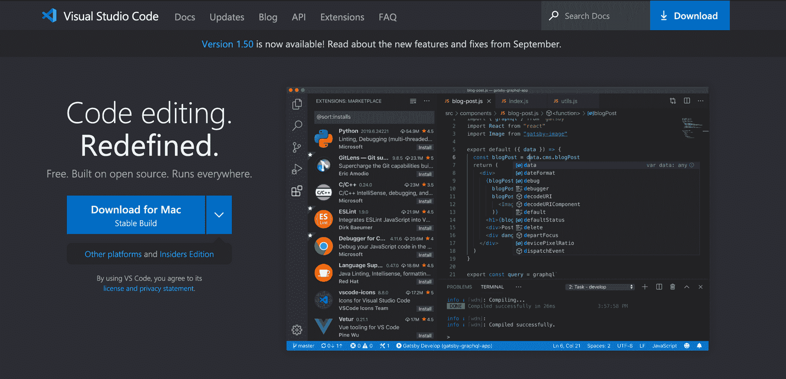
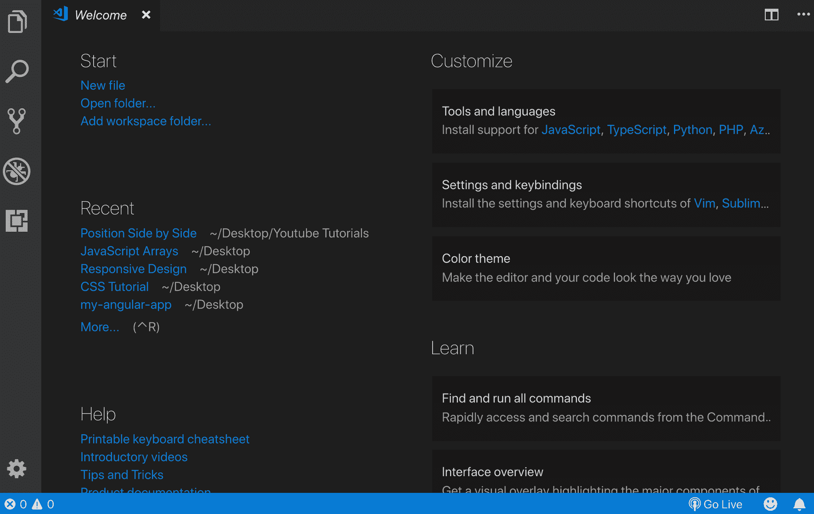
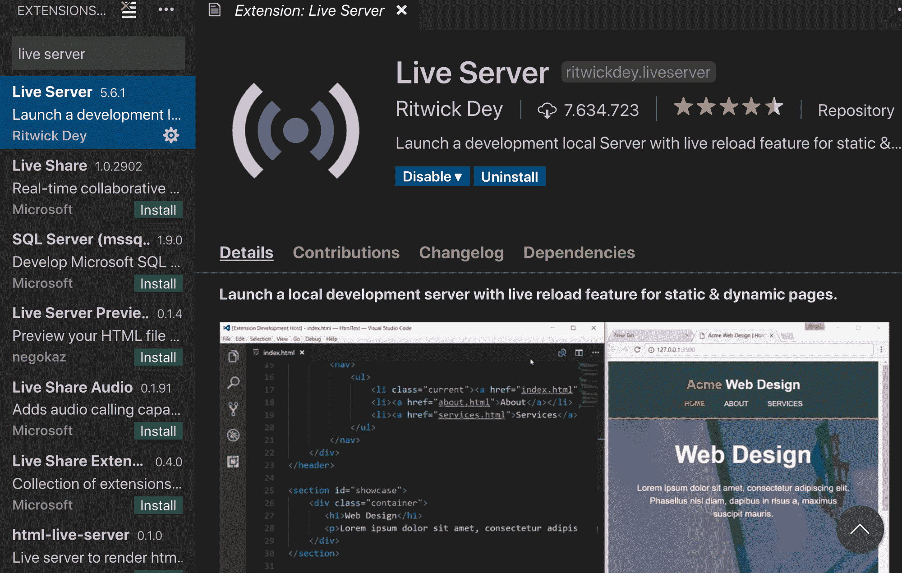
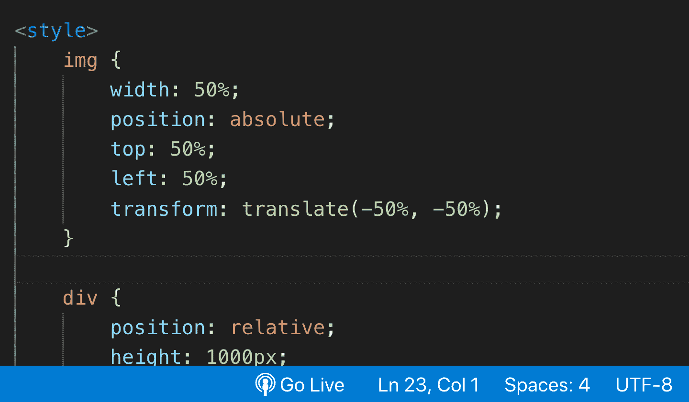

# 如何用这个简单的扩展自动刷新你的浏览器

> 原文：<https://www.freecodecamp.org/news/vscode-live-server-auto-refresh-browser/>

Visual Studio 代码是最流行的代码编辑器之一。它是免费的，它有一个干净的界面，它有无数的扩展，使编程更容易和更有趣。

我是一名前端 web 开发人员，我在工作和我的 YouTube 频道上使用 VS 代码。很多人问我，在我编码的时候，浏览器是如何自动刷新的，而不需要点击重载按钮。

如果你在 VS 代码中配置一个有用的叫做 live-server 的扩展，这是可能的。在这篇文章中，我将详细解释它是如何工作的，以及如何在你的 VS 代码编辑器中设置和配置一个活动服务器。

## 为什么我应该使用实时服务器扩展？

通常，当您更改代码或编写新内容时，需要手动刷新页面才能看到更改。

换句话说，如果你每天修改 100 次代码，你需要刷新浏览器 100 次。

然而，live-server 扩展为您实现了自动化。安装后，自动化的本地主机将能够在您的浏览器中运行，您可以通过一个按钮启动浏览器。

一旦你修改了你的代码或者写了新的东西，保存后，浏览器会自动刷新。然后，您将能够快速、自动地看到这些变化。

如果您愿意，也可以观看下面的教程视频:

[https://www.youtube.com/embed/jdWlGQdq1Q0?feature=oembed](https://www.youtube.com/embed/jdWlGQdq1Q0?feature=oembed)

## 首先，安装 VS 代码

如果您已经在计算机上安装了 VS 代码，可以跳过这一部分。否则可以从[其官网](https://code.visualstudio.com/)下载。

Visual Studio Code Official Website

下载并安装 VS 代码后，您将看到欢迎屏幕:

在左侧，您应该会看到几个图标。其中之一(在无错误图标下)是扩展按钮:

一旦你点击它，一个搜索栏就会出现。只需输入“直播服务器”。

您将看到许多选项，因此您可以选择适合您系统的选项。我使用 Ritwick Dey 的 Live 服务器，所以让我们继续使用本例中的服务器:

点击安装按钮，它将安装扩展。

## 创建新的 HTML 页面

要启动实时服务器，请确保您至少创建了一个 HTML 页面。为此，单击最顶部的文件按钮，然后选择新建文件按钮并键入 index.html:

New File Icon with Plus Sign (2nd from left)

### 配置问题

现在，在您创建了一个 HTML 页面并安装了扩展之后，您应该能够在蓝色区域的正下方看到一个“Go Live”图标:

如果你没有看到它只是重新启动 VS 代码。那应该没问题。

单击“Go Live”按钮，本地主机(分配给一个端口号)应该会在您的默认浏览器上启动。你可以通过点击同一个按钮随时启动和停止你的服务器。

如果你已经走到这一步，恭喜你！:)现在你可以使用实时服务器了。否则，如果您仍然有问题，请查看[这篇文章了解更多信息](https://www.freecodecamp.org/news/visual-studio-code-live-server-not-working/)。

## 结论

我希望这篇文章能帮助你用 VS 代码安装和配置 live server 扩展。如果你想了解更多关于 web 开发的知识，欢迎访问我的 Youtube 频道。

感谢您的阅读！