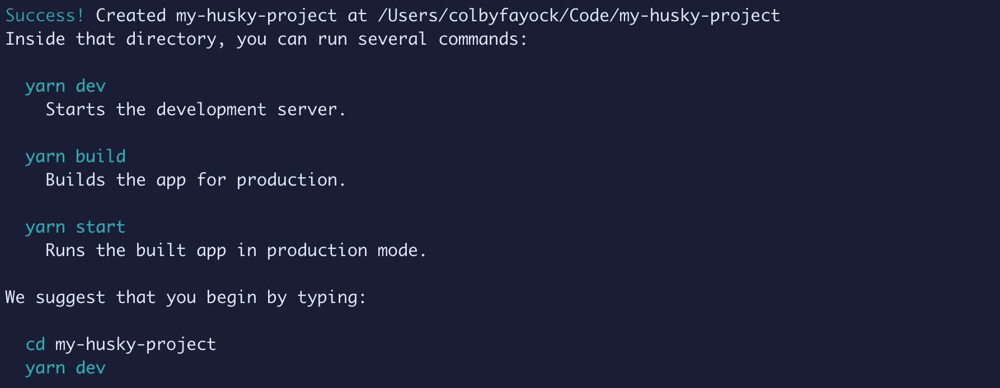
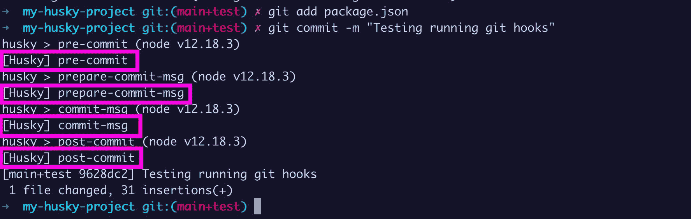
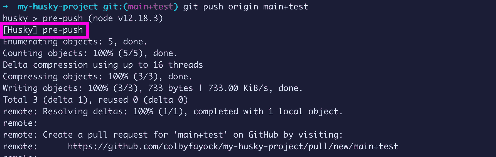
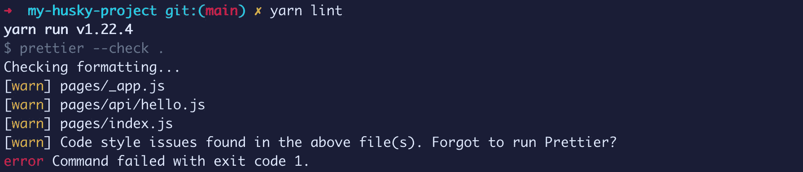
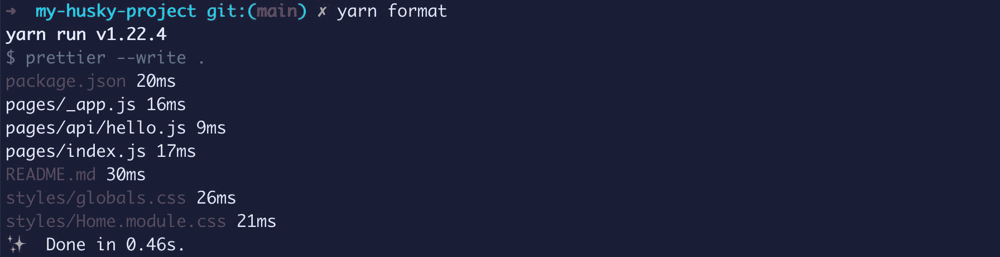
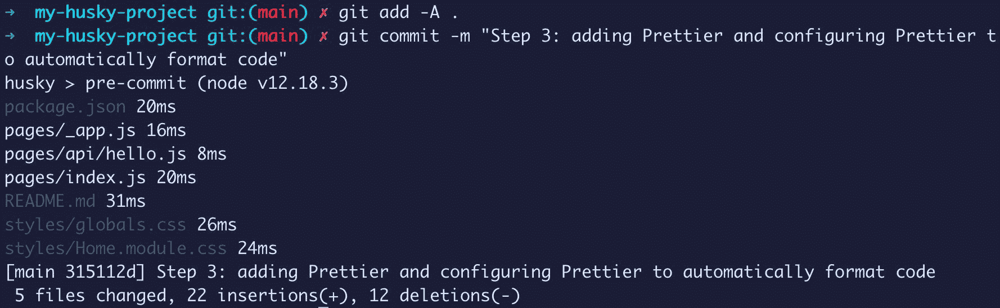

# 如何使用 Husky 向 Git 添加提交挂钩以自动化代码任务

> 原文：<https://www.freecodecamp.org/news/how-to-add-commit-hooks-to-git-with-husky-to-automate-code-tasks/>

有很多工具可以自动化我们的代码任务。我们可以用 ESLint 检查语法问题，用 Prettier 格式化我们的代码。

但是并不是团队中的每个人都会记得在每次提交时运行这些命令。我们如何使用 Husky 添加 Git 挂钩来为我们运行它们？

*   [什么是 Git 挂钩？](#what-are-git-hooks)
*   [什么是哈士奇？](#what-is-husky)
*   我们要建造什么？
*   [步骤 0:建立新项目](#step-0-setting-up-a-new-project)
*   [第一步:将哈斯基安装到项目中](#step-1-installing-husky-to-a-project)
*   [步骤 2:配置 Husky 运行 Git 挂钩](#step-2-configuring-husky-to-run-git-hooks)
*   [第三步:使用 Husky 用更漂亮的格式化代码](#step-3-using-husky-to-format-code-with-prettier)

[https://www.youtube.com/embed/tuzys2b1J70?feature=oembed](https://www.youtube.com/embed/tuzys2b1J70?feature=oembed)

## 什么是 Git 挂钩？

[Git 挂钩](https://git-scm.com/docs/githooks)是一些脚本，你可以设置它们在 Git 生命周期中的某些事件时[运行。这些事件包括提交的不同阶段，如提交前(提交前)和提交后(提交后)。](https://git-scm.com/book/en/v2/Customizing-Git-Git-Hooks)

这些功能非常有用，因为它们允许开发人员运行定制代码任务，甚至通过自动化其他脚本来运行这些任务，从而强制执行标准。

## 什么是哈士奇？

Husky 是一个工具，它允许我们轻松地与 Git 挂钩，并在这些阶段运行我们想要的脚本。

它通过在我们的`package.json`文件中包含一个对象来配置 Husky 运行我们指定的脚本。之后，Husky 负责管理我们的脚本将在 Git 生命周期的哪个点运行。

## 我们要建造什么？

我们将建立一个简单的项目，可以用来测试 Git 挂钩。

虽然您应该能够跟进您正在处理的任何项目，但我将使用 [Next.js](https://nextjs.org/) 作为这个项目的起点，因为我们可以运行一个命令来启动项目。

不过，关于这个项目的一个考虑是，我们将使用[beautiful](https://prettier.io/)作为使用 Git 钩子的例子。

Prettier 是一个自动为我们格式化代码的工具，如果你不希望它发生，它会给你带来很多压力。跟随我使用 Next.js 项目将允许您在不做任何无意的更改的情况下测试这一点。

至于测试 Git 挂钩，我们将从添加一个简单的命令行语句来查看 Husky 的工作开始。但是我们也将测试添加更漂亮，这将自动为我们格式化我们的代码。

最后，在写这篇文章的时候，Husky 发布了一个 [v5 Alpha](https://typicode.github.io/husky/#/) 版本的 Git hook 解决方案。鉴于它仍然只是一个 Alpha 版本，我们将继续使用 [v4](https://github.com/typicode/husky/tree/v4.3.0) ，这允许我们轻松地安装带有 npm 的 Husky。

## 步骤 0:如何设置新项目

正如我提到的，在这里，您可以对任何使用`package.json`文件管理的项目执行相同的步骤。

对于本演练来说，Next.js 绝对是多余的，但目标是最大限度地减少设置以实际使用 Husky 的步骤。

要开始使用 Next.js，请导航到要启动项目的目录，然后运行以下命令:

```
yarn create next-app my-husky-project
# or
npx create-next-app my-husky-project 
```

*注意:请随意将`my-husky-project`替换为您想要命名的目录。*

这将创建一个新文件夹，创建一个新的 Next.js 项目，并安装所有的依赖项。



完成后，导航到新文件夹，我们应该准备好了！

[跟随提交](https://github.com/colbyfayock/my-husky-project/commit/9e0b39c8f34c2755e074a32ef9de8d4047b68f67)。

## 步骤 1:如何将 Husky 安装到项目中

要安装 Husky，我们可以使用 yarn 或 npm。

```
yarn add husky
# or
npm install husky 
```

*注意:如果此时安装哈士奇安装的是 v5，则意味着 v5 已经正式发布。请参见[更新的 Husky 文档](https://typicode.github.io/husky/#/)或者您可以在安装时指定 husky@4.3.0(或任何最新版本)来安装最新的 v4 版本。*

一旦软件包安装完成，我们应该准备好使用 Husky。

[跟随提交](https://github.com/colbyfayock/my-husky-project/commit/720728cd595d41c9197640bd4c48e9133bd7d956)。

## 步骤 2:如何配置 Husky 运行 Git 挂钩

接下来，我们将设置 Husky，这样我们就可以将它用于我们的 Git 挂钩。

在我们的`package.json`文件中，用一个空对象创建一个名为`husky`的新属性。

```
"husky": {},
```

您可以将它添加到`package.json`文件中任何您想要的地方，但是我将它添加到`scripts`属性的正下方，这样我可以更容易地一起管理它们。

在其中，我们想要添加另一个名为`hooks`的属性，它也指定了一个空对象:

```
"husky": {
  "hooks": {}
}, 
```

这就是我们要添加 Git 挂钩的地方。Husky 几乎支持 Git 定义的所有 Git 挂钩，所以我们可以在 Git 事件流中灵活地使用。

为了测试这一点，我创建了一个新的分支[，在这里我添加了页面中的每一个 Git 钩子，包括一个简单地写入终端`[Husky] event name`的脚本。](https://github.com/colbyfayock/my-husky-project/tree/main+test)

注意:除非你很好奇，否则不要觉得你需要这么做。目标是能够用我的例子向你展示它是如何工作的。

```
“husky”: {
  “hooks”: {
    “applypatch-msg”: “echo \”[Husky] applypatch-msg\””,
    “pre-applypatch”: “echo \”[Husky] pre-applypatch\””,
    “post-applypatch”: “echo \”[Husky] post-applypatch\””,
    “pre-commit”: “echo \”[Husky] pre-commit\””, 
```

这将告诉 Husky，在允许我们挂钩 Git 的每个阶段，告诉我们！

当我提交更改时，我们可以立即看到 Husky 启动了我们的一些脚本。



这些是 Git 允许我们在提交过程中发生的所有事件。

同样，如果我将这些更改推送到 Github，我可以看到推送进程运行了`pre-push`钩子！



您可能永远不会使用 Husky 和 Git 提供的大部分钩子(我们只看到这两个命令之间的一些钩子)。

但是能够看到这种功能有多强大真是太棒了，无论是运行格式化我们代码的代码、防止秘密访问密钥被提交，还是真正有助于将重要任务自动化到您的工作流的任何其他东西。

我们现在可以看到，我们可以通过在`package.json`中指定配置和挂钩来配置 Husky。

[跟随提交](https://github.com/colbyfayock/my-husky-project/commit/108583a7e96564baf0fac994eafa6cf98d65d03e)。

*注意:如果你想查看我的分支，它包含了所有要测试的 Git 挂钩，[你可以在 Github](https://github.com/colbyfayock/my-husky-project/tree/main+test) 上找到它。*

## 步骤 3:如何使用 Husky 来格式化代码

最后，对于一个真实的用例，我们将测试使用 Prettier 来自动格式化我们的代码。

漂亮是一个固执己见的代码格式化工具，它允许你轻松地清理你的代码，使它看起来像是一个人写的。

为什么漂亮这样的工具很重要？当处理代码时，尤其是在团队中，保持一致性很重要，这样每个人都知道会发生什么。这将有助于防止在代码审查中争论分号，但也有助于捕捉语法错误和防止 bug。

警告:运行漂亮程序会自动格式化你所有的代码。虽然我们将在提交更改之前对此进行测试，但是一旦您将它作为 Git 挂钩来应用，它将自动完成这一过程。

要开始使用更漂亮的，让我们用我们的软件包管理器安装它:

```
yarn add prettier -D
# or
npm install prettier --save-dev 
```

*注意:我们正在安装一个更漂亮的`devDependency`，因为我们的应用程序不需要它来运行。*

接下来，我们可以在我们的`package.json`中添加一个新的脚本，让它更容易更漂亮地运行来测试这一点。

在`scripts`属性中，添加:

```
"lint": "prettier --check ." 
```

对于第一个测试，我们将把它作为“检查”来运行，这将允许我们看到哪些文件会发生变化。

运行以下命令:

```
yarn lint
# or 
npm run lint 
```

一旦我们这样做，我们可以看到漂亮告诉我们，这将改变所列的文件。



此时，我们的代码将保持不变。但是，如果我们想运行得更漂亮，我们可以先添加一个额外的脚本:

```
"format": "prettier --write ." 
```

如果我们运行该脚本，它将更新所有这些文件，以将代码格式化为更漂亮的规格。

*警告:只是另一个注意事项，运行漂亮地写改变将会使你的文件改变。这些都是代码风格的变化，不应该影响代码的运行方式，而是影响代码的外观。在运行 format 之前，您应该通过 Git 提交来保存任何更改，这样，如果您对更改不满意，就可以很容易地恢复这些更改。*

现在，您可以使用以下命令运行该脚本:

```
yarn format 
```

我们可以看到漂亮更新了我们的文件！



现在，与本演练相关的部分是:我们可以将其添加为 Git 挂钩。这样，当有人试图提交代码时，Prettier 会在保存代码之前运行。这意味着我们将始终保持代码与更漂亮的格式风格一致。

在我们的 Husky hooks 配置中，让我们添加:

```
"husky": {
  "hooks": {
    "pre-commit": "prettier --write . && git add -A ."
  }
}, 
```

如果你注意到在我们的预提交钩子中，我们也添加了`git add -A .`。

当 Husky 运行时，它只是运行提供的脚本。当运行我们的更漂亮的命令时，我们只是格式化代码，但是我们从来不保存这些改变作为过程的一部分。因此，我们使用`git add`来存储所有这些更改，并将它们包含在提交中。

为了测试这一点，我恢复了之前格式化的所有文件的更改。如果您正在跟踪同一个项目，您可以运行:

```
git checkout pages 
```

这将把`pages`中的所有改变重置为最后一次提交。

现在，让我们尝试用 Git 添加所有的文件，并提交更改。



一旦我们运行 commit 命令，我们可以看到 Husky pre-commit 钩子已经开始工作并格式化我们的代码了！

[跟随提交](https://github.com/colbyfayock/my-husky-project/commit/315112d062a791f20eda11f9c608c5fa794ba73e)。

## 接下来我能做什么？

### 使用 lint-staged 仅对已更改的文件运行格式化

我们在预提交钩子中使用了 pre-commit right 并指定了`.`,这意味着它每次都会在所有文件上运行。

我们可以使用一个名为 [lint-staged](https://github.com/okonet/lint-staged) 的工具，它允许我们使用 Husky 运行我们的 Git 挂钩，但是它只能在 staged 文件上运行。

例如，如果我们想用 Husky 和 Prettier 实现这一点，我们的配置可能如下所示:

```
"husky": {
  "hooks": {
    "pre-commit": "lint-staged"
  }
},
"lint-staged": {
  "*": "prettier --write"
}, 
```

作为 lint-staged 运行的一部分，它会自动将更改后的文件附加到我们的漂亮语句的末尾。

你也会注意到我们没有包括`git add`。lint-staged 还会自动为我们添加对 Git 的任何更改。

### 设置一个更漂亮的配置来定制格式规则

漂亮点就是很固执己见。有些事情我个人不喜欢，你可能会有同感。

幸运的是，Prettier 允许您设置一个配置文件，该文件可以覆盖其中的一些文件，使您的代码符合您和您的团队的要求。

### 告诉更漂亮的忽略文件。忽略不计

你也可能不希望在“所有的事情”上运行更漂亮(也许你想)。

prettle 允许你在紧挨着`package.json`的项目根目录下建立一个`.prettierignore`文件，类似于`.gitignore`，它允许你告诉 prettle 它不应该在什么文件上运行。

[](https://twitter.com/colbyfayock)

*   [？在 Twitter 上关注我](https://twitter.com/colbyfayock)
*   [？订阅我的 Youtube](https://youtube.com/colbyfayock)
*   [✉️注册我的简讯](https://www.colbyfayock.com/newsletter/)
*   [？赞助我](https://github.com/sponsors/colbyfayock)