# 如何使用 Gatsby 和 Cloudinary 创建图片库

> 原文：<https://www.freecodecamp.org/news/how-to-create-an-image-gallery-gatsby-and-cloudinary/>

根据 Netlify 首席执行官兼联合创始人 Mathias Biilmann 的说法，“`JAMstack`是一个基于客户端 JavaScript、可重用 API 和预建标记的现代 web 开发架构。”

[JAMstack](https://blog.greenroots.info/jamstack-for-all-an-introduction-cke2fxc5800jvabs15lhn4a9x) 应用程序的关键方面如下:

*   整个 app 运行在一个 ****CDN(或 ADN)**** 上。CDN 代表内容交付网络，ADN 是应用交付网络。
*   一切尽在 ****Git**** 。
*   ****自动化构建**** 在开发人员推送代码时，与工作流一起运行。
*   有 ****自动部署**** 的预建标记到 CDN/ADN。
*   几乎是 ****无服务器**** 。更清楚地说，我们不维护任何服务器端应用程序，而是利用已经存在的服务(如电子邮件、媒体、数据库、搜索等)。

这里有一个有趣的事实:许多曾经需要定制后端的功能现在可以完全在前端完成。

在本文中，我们将学习如何构建一个 [JAMstack](https://blog.greenroots.info/jamstack-for-all-an-introduction-cke2fxc5800jvabs15lhn4a9x) 应用程序，它具有:

*   提供媒体文件的 API 服务，
*   和一个[静态站点生成器(SSG)](https://blog.greenroots.info/what-is-a-static-site-generator-and-how-to-select-one-cke9xtx5g006p58s11dzg2j16) 来创建预构建的标记。

最后，我们将在 CDN 上部署它。

## 那么，我们今天在建造什么？

我们将建立一个图像画廊。我喜欢电影，所以我决定创建一个我最喜欢的演员的图库。我给它起了一个有趣的名字:`imaginary`。

我们将使用名为 [Cloudinary](https://cloudinary.com/) 的媒体管理服务来托管和管理我们的图像。它还提供了开发者 API 来上传和获取媒体，比如图像、视频等等

我们将使用一个名为 [Gatsby](https://www.gatsbyjs.com/) 的框架来构建图片库的前端。是一个基于 React 的开源框架，用于创建网站和应用。

最后，我们将了解如何通过自动构建和部署流程将应用部署到 CDN。为此，我们将使用 [Netlify CDN](https://www.netlify.com/) 。

在文章的最后，我们的`imaginary`应用程序将如下所示:


Image Gallery app - Final Look

## **TL；博士**

在本文中，我们将循序渐进地学习。如果您想更快地进入源代码或演示，这里有它们的链接。

*   您可以从这里进入图片库演示:[http://imaginary.netlify.app/](http://imaginary.netlify.app/)
*   本文中使用的所有源代码都在我的 GitHub repo 中。请随意，因为我会经常更新源代码。如果你喜欢这个作品，请用一颗星来支持它。[https://github.com/atapas/imaginary/tree/1-freecodecamp-poc](https://github.com/atapas/imaginary/tree/1-freecodecamp-poc)

现在让我们开始吧。

## **如何设置 Cloudinary**

首先，[用`Cloudinary`创建一个账户](https://cloudinary.com/users/register/free)。对于我们的图片库应用程序来说，一个免费的计划已经足够了。

使用您的帐户凭证登录，进入`Cloudinary`仪表盘。请记下`Cloud name`、`API Key`和`API Secret`，因为我们在应用中会用到它们。

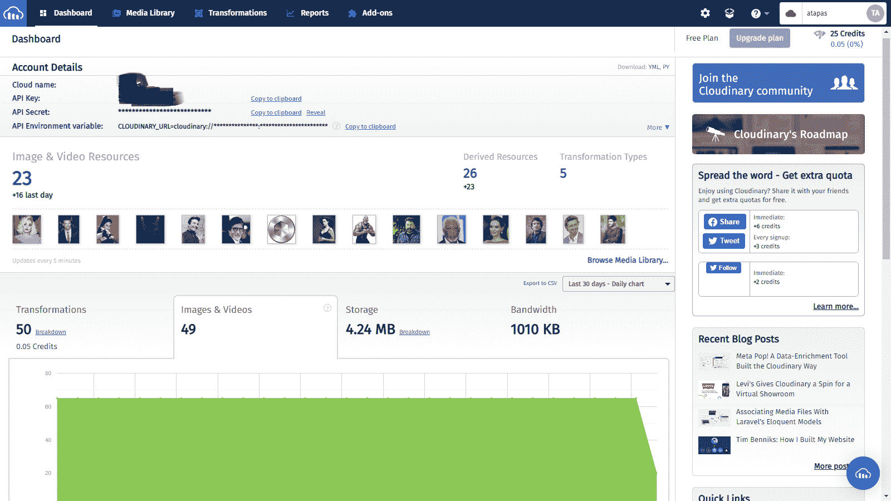

接下来，上传您选择的图像，以便在`image gallery`中使用。您可以创建一个文件夹，并随意命名。在我的例子中，我将其命名为`artists`,并将图片上传到其中。

注意，当我们集成`Cloudinary`和`Gatsby`时，我们将使用这个文件夹名。

请选择每个图像并添加一个`Title`和`Description`。我们将在图库中分别使用这两位元信息作为图片标题和替代文本。

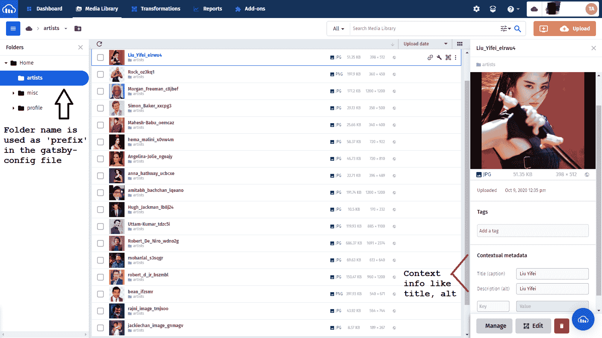

仅此而已。请不要与任何人分享 API 秘密和密钥。现在让我们来看一下`Gatsby`所需的设置。

## **如何设置盖茨比**

一个基于`gatsby`的项目需要`node.js`才能工作。确保安装了 Node.js。你可以在这里的[下载并安装`node.js`。](https://nodejs.org/en/download/)

成功的安装将使用以下命令显示节点版本:

```
node -v
```

### **创建项目目录**

创建一个项目目录来组织源代码。让我们创建一个名为`imaginary`的目录。

```
mkdir imaginary

cd imaginary
```

### **初始化项目**

有大量的[启动项目](https://www.gatsbyjs.com/starters/)来创建一个`gatsby`应用。虽然入门项目简化了许多复杂性，但同时对于像我们这样简单的应用程序来说，它们可能有点难以承受。

记住这一点，我们将自己初始化一个简单的`gatsby`项目。

打开命令提示符并键入以下命令来初始化 Node.js 支持的项目:

```
npm init -y
```

### **盖茨比:安装和初始设置**

全局安装`gatsby-cli`工具。这个工具将帮助我们在 Gatsby 环境中工作。

```
 npm install -g gatsby-cli
```

安装 Gatsby、React 和 ReactDOM 依赖项。如果安装了 yarn，可以使用上述的`npm install`命令或`yarn add`命令。

```
 yarn add gatsby react react-dom
```

我们再添加一个`.gitignore`文件，内容如下:

```
.cache
public
node_modules
*.env
```

您可以选择创建一个 README.md 和许可文件。在这个阶段，我们的项目应该有这些文件夹和文件:

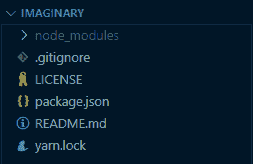

`Gatsby`项目需要一个名为`gatsby-config.js`的特殊配置文件。此时，我们将需要一个空文件。创建一个名为`gatsby-config.js`的文件，内容如下:

```
 module.exports = {
  // keep it empty    
 }
```

现在是时候用`Gatsby`创建我们的第一个页面了。在项目文件夹的根目录下创建一个名为`src`的文件夹。在`src`下创建一个名为`pages`的子文件夹。在`src/pages`下创建一个名为`index.js`的文件，内容如下:

```
import React from 'react';    

  export default () => {    
   return (
      <>    
        <h1>Images to load here...</h1>
      </>        
    )    
  }
```

在这个阶段，我们的项目文件和文件夹应该如下所示:

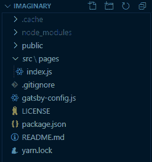

### **让我们运行它**

尝试在命令提示符下使用以下命令在本地运行应用程序:

```
gatsby develop
```

默认情况下，`gatsby`应用在`8000`端口号上运行。打开你最喜欢的浏览器，进入 app @[http://localhost:8000](http://localhost:8000/)。

您应该会看到它像下面的屏幕截图一样运行:

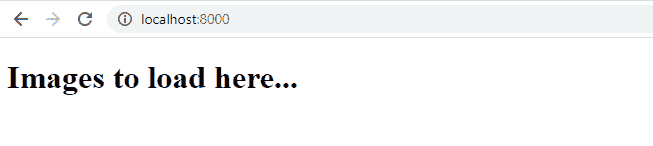

仅此而已。现在，我们已经成功设置了`Cloudinary`和`Gatsby`。是时候让他们走到一起了。

## **云淡风轻&盖茨比，相聚的故事**

框架拥有巨大的社区支持，并且有许多插件来满足关键需求。2020 年初，`Cloudinary`团队[向开发者社区推出了两个超级酷的盖茨比插件](https://cloudinary.com/blog/introducing_cloudinary_s_gatsby_plugins):

*   [`Gatsby-Source-Cloudinary`](https://www.npmjs.com/package/gatsby-source-cloudinary)——帮助在构建时从 Cloudinary 获取存储的图像到 Gatsby 应用/站点。
*   [`Gatsby-Transformer-Cloudinary`](https://www.npmjs.com/package/gatsby-transformer-cloudinary)——帮助从 Gatsby 应用/网站上传本地图片到 Cloudinary。

由于我们只对获取图像到这里的图库感兴趣，我们将只安装`gatsby-source-cloudinary`插件。

我们还将安装一个名为`dotenv`的实用程序包来本地处理环境变量(密钥、API 密钥等等)。

让我们安装它们。打开命令提示符并使用以下命令:

```
yarn add dotenv gatsby-source-cloudinary
```

现在，按照这些步骤将图像导入我们的应用程序。

1.  在项目文件夹的根目录下创建一个`.env`文件，并向其中添加以下内容。请注意，`key-value`对中的值在`Cloudinary`仪表板中可用，就像我们之前看到的一样。

```
CLOUDINARY_CLOUD_NAME=<YOUR_CLOUDINARY_NAME>
CLOUDINARY_API_KEY=<YOUR_CLOUDINARY_API_KEY>
CLOUDINARY_API_SECRET=<YOUR_CLOUDINARY_API_SECRET>
```

2.编辑`gatby-config.js`文件，添加以下内容:

```
 require('dotenv').config();

module.exports = {

    plugins:[
        {
            resolve: `gatsby-source-cloudinary`,
            options: {
              cloudName: process.env.CLOUDINARY_CLOUD_NAME,
              apiKey: process.env.CLOUDINARY_API_KEY,
              apiSecret: process.env.CLOUDINARY_API_SECRET,
              resourceType: `image`,
              prefix: `artists/` ,
              context: true,
              tags: true,
              maxResults: 50
            }
          }
    ]

}
```

这里发生了一些事情。我们告诉`gatsby`使用带有几个参数的`gatsby-source-cloudinary`插件。

使用`dotenv`包从`.env`文件中获取参数`cloudName`、`apiKey`和`apiSecret`。我们还将`resourceType`值指定为`image`，因为我们对获取其他类型的媒体不感兴趣。

`prefix`参数值应该与 Cloudinary 中的图像文件夹名称相同。

我们将`context`和`tags`指定为 true，以获取图像的上下文元数据和标签信息。我们还将`maxResults`设置为 50，这样我们就不会受限于默认值 10。

3.接下来，在`src`下创建一个名为`components`的文件夹，并在其中创建一个名为`Gallery.js`的文件。`Gatsby`使用`graphQL`从 markdown、JSON 和 Excel 等各种来源查询数据。

在我们的例子中，我们将使用`Cludinary`作为源，使用已经配置好的`gatsby-source-cloudinary`插件来查询图像。

4.现在编辑`Gallery.js`文件，添加以下内容:

```
 import React from 'react';
import {useStaticQuery, graphql} from 'gatsby';

const Gallery = () => {
    const data = useStaticQuery(
        graphql`
        query CloudinaryImage {
            allCloudinaryMedia {
            edges {
                node {
                    secure_url
                    context {
                        custom {
                            alt
                            caption
                        }
                    }
                    resource_type
                }
            }
            }
        }`
    );
    const images = data.allCloudinaryMedia.edges;
    return (
        <div className="container">
            {images.map((image, index) => (
                <figure className="wave" key={`${index}-image`}>
                    
                    </img>
                    <figcaption>{image.node.context.custom.caption}</figcaption>
                </figure>
                ))
            }
        </div>
    )
};

export default Gallery;
```

如上所述，我们使用一个`graphQL`查询来获取源图像路径和上下文信息。我们使用这些信息循环遍历并添加带有标题的图像。

5.下一步是编辑`index.js`文件以导入`Gallery.js`文件并使用它。

```
import React from 'react';
import Gallery from '../components/Gallery';

export default () => {    
    return (
      <>    
        <Gallery />
      </>        
    )    
}
```

如果您已经在运行`gatsby develop`，请停止并再次运行。在浏览器中再次访问应用程序。您应该会看到从`Cloudinary`获取所有图像的应用程序。

但是等等，看起来没有承诺的那么优雅。我们必须在这里做一些工作。

在文件夹`src\components`下创建一个名为`gallery.css`的文件，并在其中添加以下内容:

```
body {
    background: #000000 url("https://res.cloudinary.com/atapas/image/upload/v1602214656/misc/6284_n48wtw.jpg") repeat-x center top;
    color: #FFFFFF;
}

.container {
    margin-top: 55px;
}

.wave {
    float: left;
    margin: 20px;
    animation: wave 
               ease-in-out 
               1s 
               infinite 
               alternate;
    transform-origin: center -20px;
}

.wave:hover {
    animation-play-state: paused;
}

.wave img {
    border: 5px solid #f8f8f8;
    display: block;
    width: 200px;
    height: 250px;
    background-color: #000;
}

.wave figcaption {
    text-align: center;
}

.wave:after{
    content: '';
    position: absolute;
    width: 20px; 
    height: 20px;
    border: 1.5px solid #ffffff;
    top: -10px; 
    left: 50%;
    z-index: 0;
    border-bottom: none;
    border-right: none;
    transform: rotate(45deg);
}

.wave:before{
    content: '';
    position: absolute;
    top: -23px;
    left: 50%;
    display: block;
    height: 44px;
    width: 47px;
    background-image: url(https://res.cloudinary.com/atapas/image/upload/v1602212639/misc/screw-head_oglfcu.png);
    background-size: 20px 20px;
    background-repeat: no-repeat;
    z-index: 16;
}

@keyframes wave {
    0% { transform: rotate(3deg); }
    100% { transform: rotate(-3deg); }
}
```

6.将`gallery.css`文件导入到`Gallery.js`文件中

```
import './gallery.css';
```

仅此而已。你应该会看到这个程序看起来比以前好多了，就好像图像挂在墙上，里面有动画一样。


## **让我们部署应用程序**

最后一步是公开部署应用程序，以便我们展示它。

首先，在 GitHub 中创建一个资源库，并推送源代码。然后用 [Netlify](https://www.netlify.com/) 创建一个账户登录。

按照以下简单步骤将您的应用部署到内置 CI/CD 支持的 Netlify CDN。

*   从 Git 创建一个新站点
*   验证您的`Github`帐户并选择图片库项目。在我的例子中，项目名称是`imaginary`。
*   在下一步中，以`gatsby build`的形式提供关于构建命令的信息，并以`public/`的形式发布目录。
*   接下来点击`Site settings`告诉`netlify`关于`Cloudinary`云的名字、秘密密钥、API 密钥等等。
*   浏览到`Environment`选项并点击`Edit variables`按钮。
*   添加如下所示的三个变量，其值显示在您的`Cloudinary`仪表板中。
*   浏览到`Deploys`选项并触发全新部署。
*   您可以将网站名称更改为符合您需要的名称。对我来说，是[https://imaginary.netlify.app/](https://imaginary.netlify.app/):

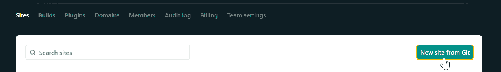

New site from Git

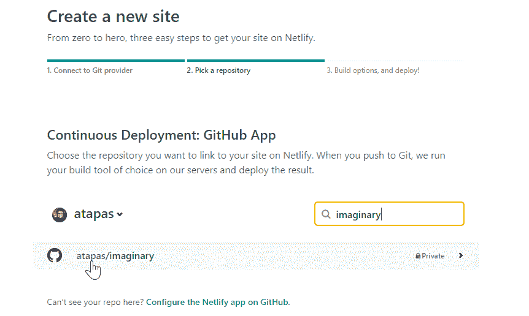

Create a new site

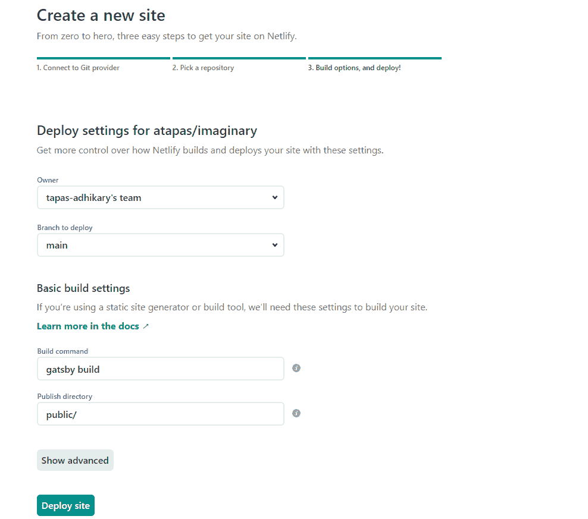

Parameters for the site

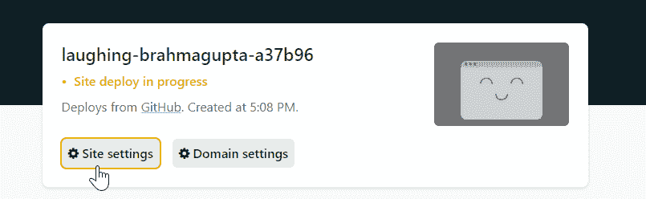

Site settings

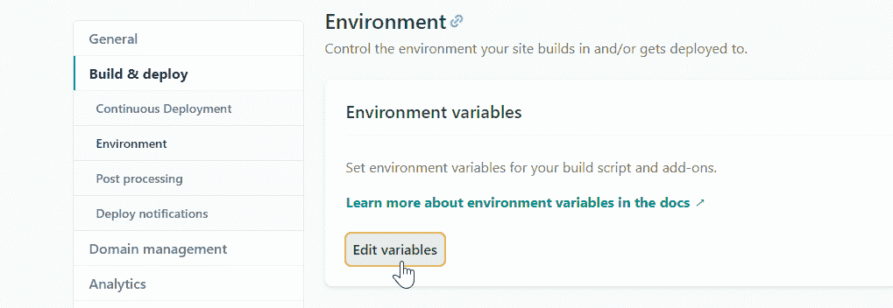

Add environment variables

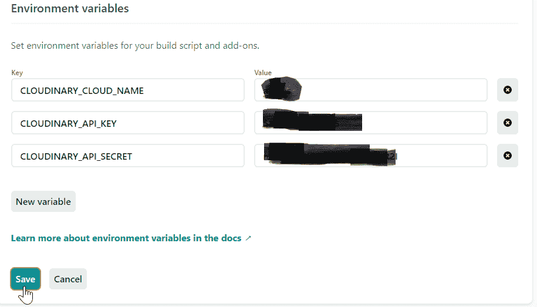

Add all of them

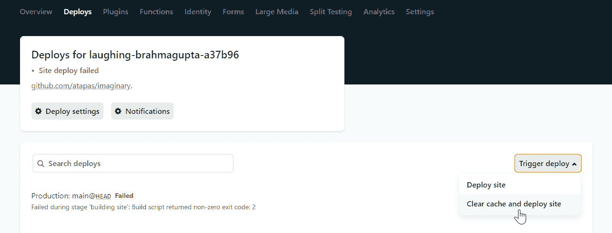

Trigger a fresh deploy

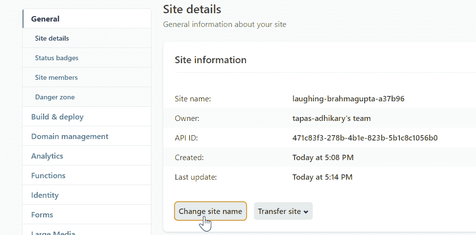

Optionally to change the site name

现在我们结束了。我们的应用程序已经公开运行。

## ******总之******

希望你喜欢阅读这篇文章。在以后的文章中，我们将看到如何使用另一个 gatsby-cloudinary 插件将图像上传到`Cloudinary`服务器，以添加到我们的图库中。

您可能也会喜欢这些文章:

*   我用 CSS 动画制作了一个图片库。以下是我学到的。
*   [面向所有人的 JAMstack:简介](https://blog.greenroots.info/jamstack-for-all-an-introduction-cke2fxc5800jvabs15lhn4a9x)
*   什么是静态站点生成器，如何选择？

如果这篇文章是有用的，请分享它，这样其他人也可以阅读它。你可以在 Twitter 上@我( [@tapasadhikary](https://twitter.com/tapasadhikary) )发表评论，或者随时关注我。