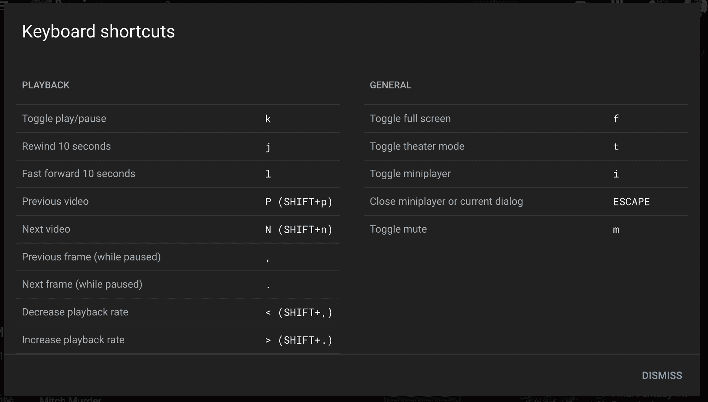
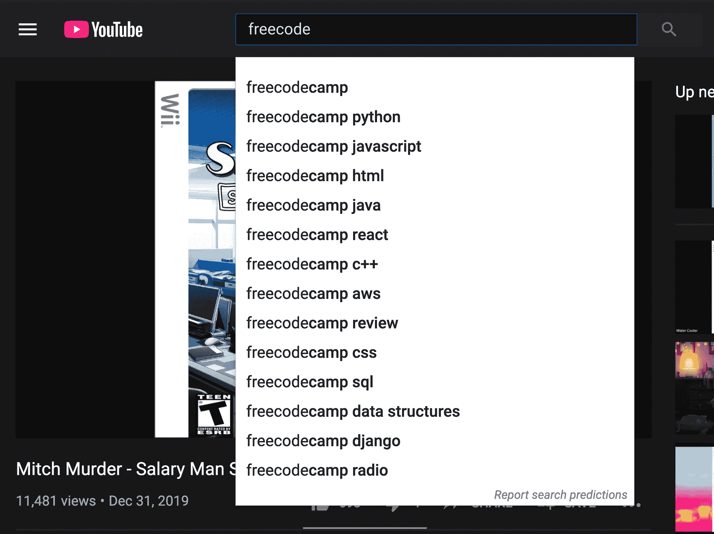
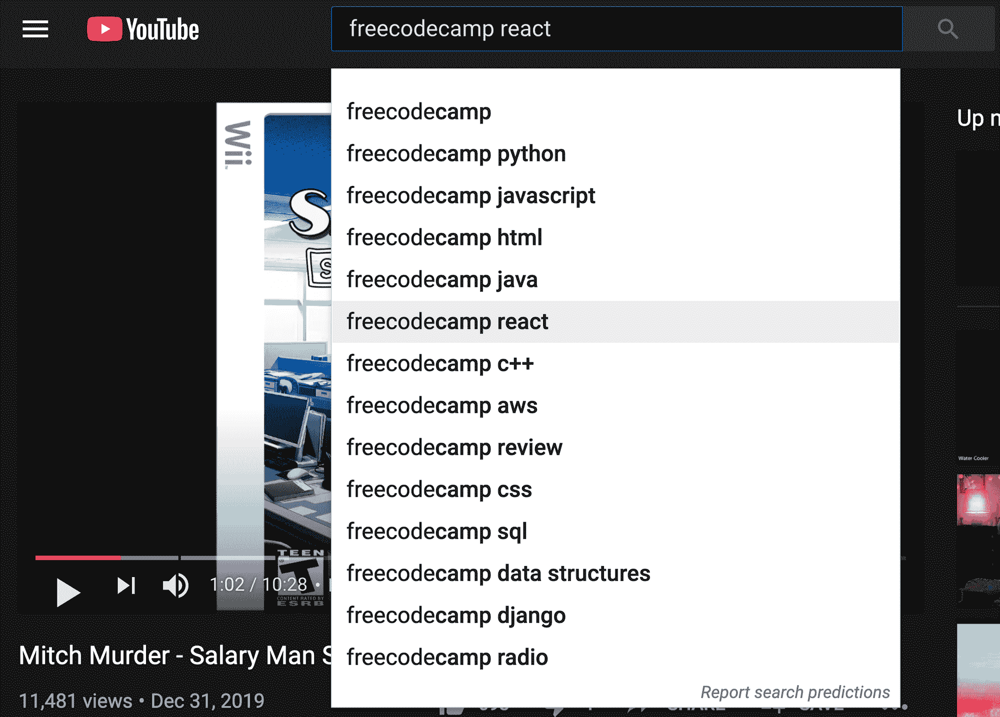
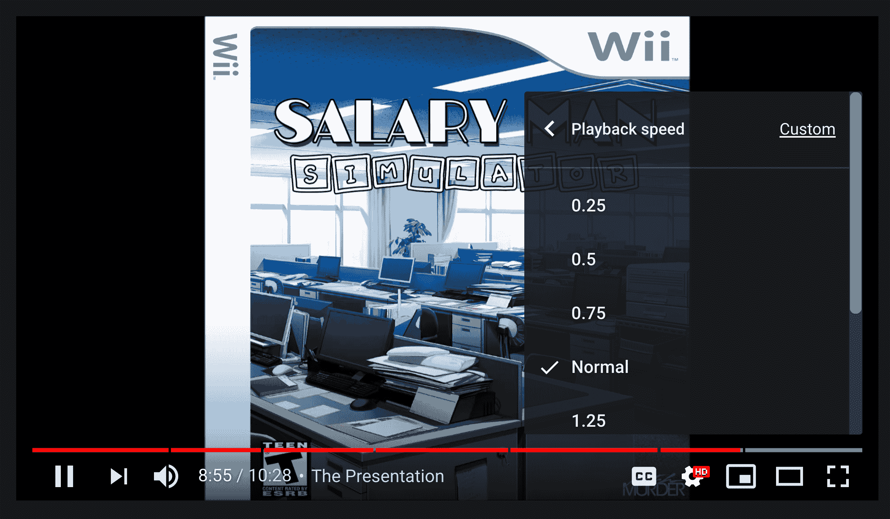
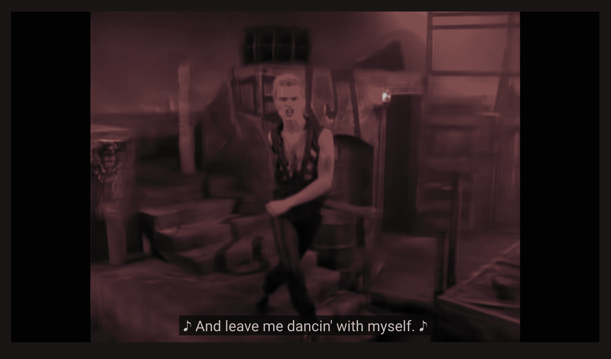
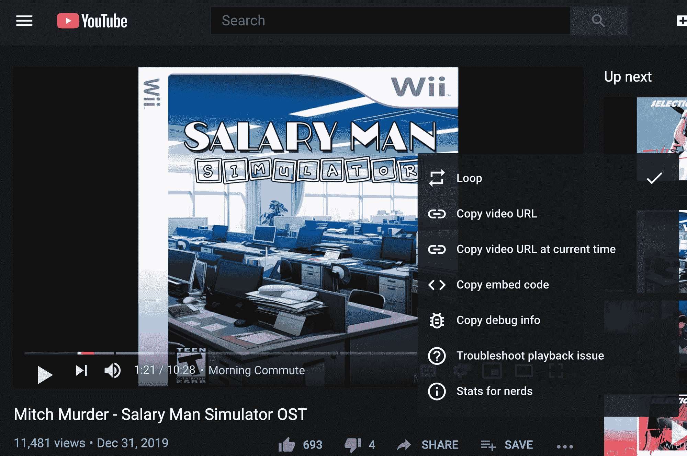

# 像专家一样学习 YouTube 键盘快捷键——逐帧、重复、回放速度、字幕等等

> 原文：<https://www.freecodecamp.org/news/youtube-keyboard-shortcut-hotkey-list-repeat-speed-subtitles/>

YouTube 现在是网络上最常用的网站。但是很少有人知道可以让你成为 YouTube 超级用户的便捷键盘快捷键。

在本教程中，我将向你展示如何在观看 YouTube 时感觉自己像一个键盘后面的艺术大师。

这些键盘快捷键比点击 YouTube 菜单要快得多。它们还能让您更好地控制观看体验。

## 如何在 YouTube 上显示官方快捷方式表

YouTube 有一个很好的表格来显示它的一些快捷方式。您可以在观看视频时随时按下`shift + /`弹出此对话框。

它看起来是这样的:

YouTube's official list of shortcuts. (You can pop this up at any time on YouTube by pressing `shift + /`)

你可以通过点击退出键来关闭这个弹出窗口。

我先给你看这个，这样你会记得它是存在的，可以参考。

但是如果你真的想学习所有这些捷径，我建议你把这篇文章收藏起来。因为我要教你很多秘密捷径，YouTube 也没有列在这个表格里。？

## 日常使用的 11 个最重要的 YouTube 键盘快捷键

我将按重要性顺序介绍这些键盘快捷键，以及它们能为你节省多少时间。

### 键盘快捷键#1:如何使用热键选择搜索框

你可以随时点击`/`键直接跳到 YouTube 导航中的搜索框。

YouTube's search box, which you can access at any time with the `/` key.

这是非常方便的，因为你可以点击`/`然后开始输入你的查询，所有这些都是一个动作，不需要使用你的鼠标。

你知道你可以使用上下箭头来选择搜索结果吗？只需点击`return`键即可运行所选的搜索。

You can use the up and down arrows to select a search query to run.

您可以通过点击`escape`键折叠搜索框及其搜索预测下拉菜单。

### 键盘快捷键#2:如何通过热键暂停和取消暂停 YouTube 视频

您可以通过按空格键或`k`键暂停和取消暂停视频。

### 键盘快捷键#3:如何使用热键全屏浏览 YouTube

您可以随时按下`f`键进入全屏模式。你可以通过再次按下`f`键(或者按下`escape`键)来退出全屏。

### 键盘快捷键#4:如何将 YouTube 视频静音

您可以随时按下`m`键将 YouTube 静音。

您可以通过再次点击`m`来取消静音。

### 键盘快捷键#5:如何通过改变播放速度来加快或减慢视频播放速度

YouTube 提供 8 种回放速度选项:

*   0.25 倍
*   0.5 倍
*   0.75 倍
*   常态
*   1.25 倍
*   1.5 倍
*   1.75 倍
*   2.0x

YouTube's Playback Speed Menu, accessible by clicking the gear and choosing "playback speed"

这是一个重要的特性，原因如下:

1.  如果你赶时间，可以用更快的速度看 YouTube，节省时间。我个人看大部分视频都是 2.0x 的速度。
2.  但是如果视频使用的是你不太熟悉的语言，你可能想看得慢一点。例如，每当我观看西班牙语或日语等非英语语言的视频时，我可能会将速度减慢到 0.75 倍或 0.5 倍，以便更容易理解人们在说什么。
3.  如果你正在学习一种乐器，放慢视频速度可以让你更容易跟上老师，或者阅读音符。我经常以 0.5x 的速度开始一段音乐，然后推进到 0.75x 的速度，最终正常速度。
4.  您可以将任何一首 80 年代的流行歌曲的速度降低到 0.5 倍，使之成为一首蒸汽波歌曲。这比打自己的头安全多了。？

您可以通过点按 YouTube 齿轮来访问这些速度控制，然后选取“回放速度”并从那里更改它。但这需要点击 3 或 4 次。

使用播放速度控制热键要快得多:

*   按下`shift + .`将视频加速 25%
*   按下`shift + ,`将视频速度减慢 25%

你可以按住热键将速度调到最大 2.0 倍，或者最小 0.25 倍。

### 键盘快捷键#6:如何让 YouTube 视频逐帧前进或后退一帧

如果你愿意，YouTube 可以让你一帧一帧地浏览视频。

首先，按空格键或`k`暂停视频。然后按`.`前进一帧，或按`,`后退一帧。

如果你按住这些键中的一个，你将制作你自己的超慢模式或超慢倒带效果，这对于体育视频来说可能是一种乐趣。

### 键盘快捷键#7:如何从头开始重新播放 YouTube 视频，或者向前跳转

您可以使用数字 0 - 9 跳到 YouTube 视频中的不同点。

按下`0`将重启视频，按下`5`将跳转到视频的正中间。按下`9`将带您进入视频的最后 10%。

### 键盘快捷键#8:如何打开隐藏式字幕

一些 YouTube 视频为聋人和重听人社区自动生成了隐藏字幕。

如果你在看非母语的视频，这些也会很有帮助。他们还可以把 YouTube 视频会议变成即兴的卡拉 ok 会议。

您可以通过按下`c`键随时打开或关闭这些按钮。

您也可以更改标题的语言。但是要做到这一点，你需要用鼠标点击齿轮图标。

### 键盘快捷键#9:如何倒回或快进 5 秒(或 10 秒)

您可以使用左右箭头来倒回或快进 10 秒钟。你可以按住这些键跳过视频的整个部分(或者使用我刚才介绍的数字键)。

这些箭头键向前和向后跳 5 秒钟。

但是你知道吗，你还可以在 10 秒的时间增量内前后跳跃？您可以分别使用`j`和`l`键来完成此操作。

容易记住这一点的一个方法是将`j`、`k`和`l`按钮分别视为倒带、暂停/播放和快进。

YouTube 对此有两种不同的方法，这有点傻，但作为一个键盘快捷键爱好者，我没有抱怨。

### 键盘快捷键#10:如何调高和调低 YouTube 视频的音量

当然，您的键盘可能有自己的音量控制。但是，如果你只是想调低 YouTube 视频的音量，这样你就可以在超长变焦通话中听一些堵塞的声音，那该怎么办呢？

YouTube 给了你一个简单的方法来调整 YouTube 视频的音量:上下箭头。

有 20 种不同的音量可供你收听 YouTube(增量为 5%)。

### 键盘快捷键#11:如何播放下一个视频(或播放列表中的下一个视频)

如果你点击`shift + n`，你可以完全跳过当前视频，开始播放 YouTube 的“下一个”视频。

如果你碰巧在看一个播放列表，这将把你带到播放列表中的下一个视频。

作为一个额外的热键:如果你碰巧在播放列表的中间，你可以点击`shift + p`移动到播放列表中的前一个视频。

现在我已经介绍了这些有用的键盘快捷键，这里有一些需要你使用鼠标的有用的快捷键。

## 如何访问 YouTube 的秘密右键菜单

YouTube 也有一个秘密的右键菜单。这不同于你的浏览器的普通右键菜单，只有当你右击一个视频本身时才会显示出来。

### 如何使用循环选项重复播放 YouTube 视频

如果你右击一个视频，YouTube 会给你打开“循环”的选项这将导致视频反复播放，直到您关闭选项卡或关闭选项。

当你想一遍又一遍地听一首歌或一张专辑时，这是一个很有用的功能(就像我写这篇文章时一样)。)

### 如何为书呆子访问 YouTube 视频统计

YouTube 还提供了关于网速和视频播放的详细数据。

You can access these stats by right-clicking the video then choosing "Stats for nerds" from the drop-down menu.

例如，您可以看到 YouTube 视频的当前分辨率、当前连接速度、音量和“缓冲区健康状况”

YouTube 没有太多计算缓冲健康的方法，但它似乎代表了在当前连接下视频预加载的效果。

## 如果你练习的话，YouTube 快捷键可以帮你节省很多时间。

我希望这些建议能帮助你节省时间，并在使用 YouTube 时感觉更强大。

freeCodeCamp(我在 2014 年创立的非营利组织)在 YouTube 上有数百个编程教程。我们有大量数学、计算机科学和技术主题的免费完整课程。这是一个练习你新学到的 YouTube 快捷技巧的完美地方。？

你可以[在这里](https://www.youtube.com/c/freecodecamp?sub_confirmation=1)浏览 freeCodeCamp 的 YouTube 课程。