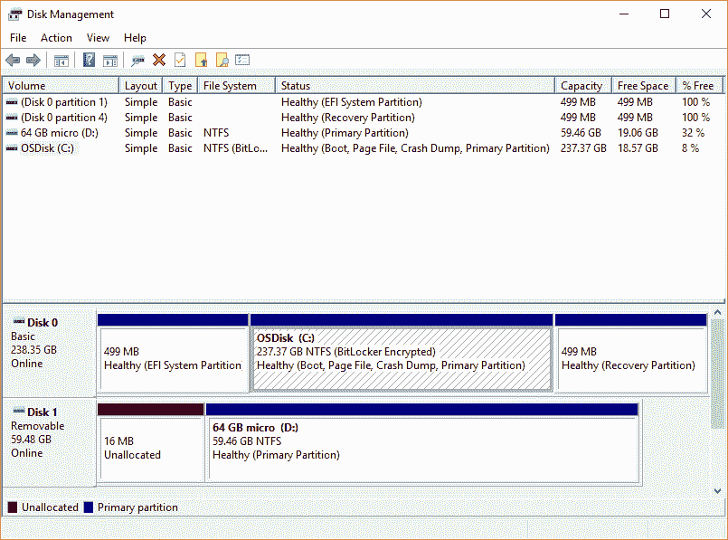
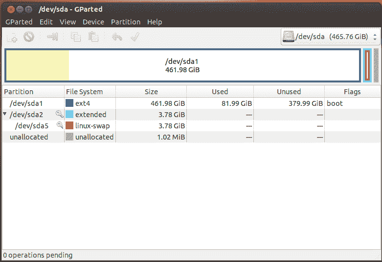
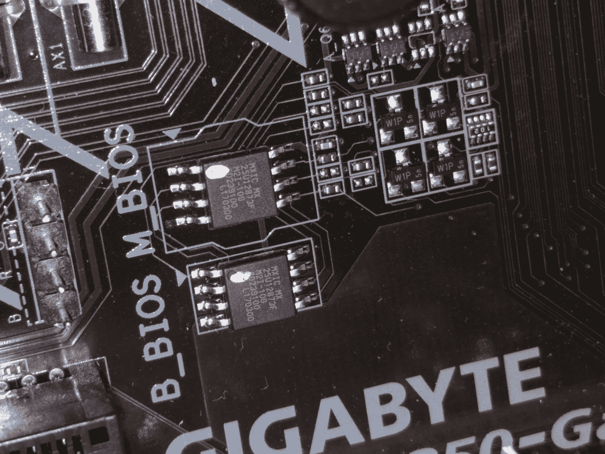
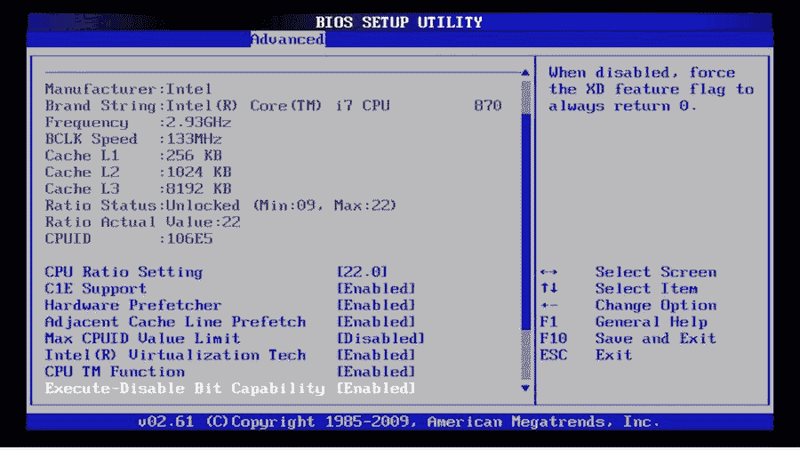
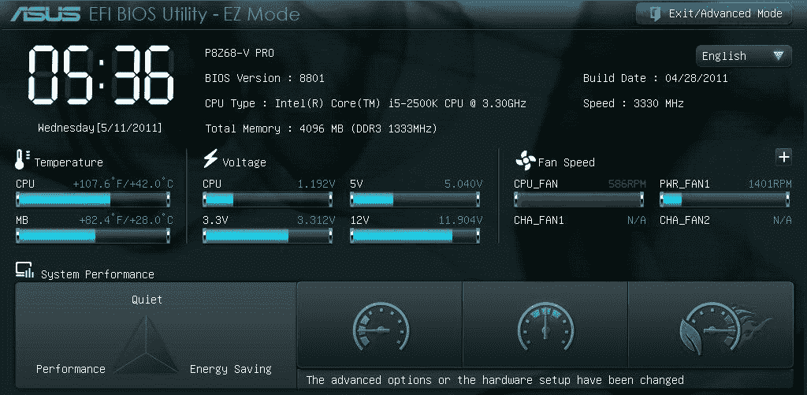

# MBR 与 GPT:MBR 分区和 GPT 分区有什么区别？[已解决]

> 原文：<https://www.freecodecamp.org/news/mbr-vs-gpt-whats-the-difference-between-an-mbr-partition-and-a-gpt-partition-solved/>

如果你正在建造一台个人电脑，你可能会被问到你想如何安装你的操作系统——MBR 还是 GPT？

MBR 和 GPT 分区之间的区别非常明显。但是有许多背景信息可以帮助您更清楚地了解每种类型的分区表，以及何时应该选择其中一种。

在本文中，我们将深入了解什么是分区，MBR 和 GPT 分区之间的区别，您是否应该从一种类型的分区升级到另一种分区，等等。

## 什么是隔断？

分区是硬盘驱动器(HDD)或固态驱动器(SSD)的虚拟分区。每个分区的大小可以不同，通常具有不同的功能。

例如，在 Windows 中通常有一个小的恢复分区和一个标记为`C:`的大文件系统分区。`C:`分区是大多数人所熟悉的，因为它是你通常安装程序和存储各种文件的地方。

Windows Disk Manager – [Source](https://docs.microsoft.com/en-us/windows-server/storage/disk-management/overview-of-disk-management)

在 Linux 中，通常有一个根分区(`/`)，一个用于帮助内存管理的交换分区，以及一个大的`/home`分区。`/home`分区类似于 Windows 中的`C:`分区，因为它是你安装大部分程序和存储文件的地方。

GParted in Linux – [Source](https://bbs.archlinux.org/viewtopic.php?id=155698)

如果你的电脑是从商店买的，并且已经安装了操作系统，那么制造商已经处理好了分区。你不需要担心它们，除非你想在同一个硬盘或 SDD 上实现双启动 Windows 和 Linux。

即使你自己安装操作系统，大多数时候安装程序会建议默认分区和分区大小。还是那句话，你通常不需要做任何调整。

现在您已经对分区有了一个较高层次的概述，我们可以深入了解 MBR 和 GPT 分区之间的区别。

**注意:**从现在开始，我将使用术语“硬盘”来指代硬盘和固态硬盘。

## MBR 和 GPT 分区概述

在将一个驱动器划分为单独的分区之前，需要将其配置为使用特定的分区方案或表。

分区表告诉操作系统驱动器上的分区和数据是如何组织的。例如，上面的截图显示了驱动器上的分区表，每个单独的分区显示为一个矩形块。

有两种主要类型的分区表:MBR 和 GPT。

MBR 代表主引导记录，是驱动器开头的一点保留空间，包含有关分区如何组织的信息。MBR 还包含启动操作系统的代码，它有时被称为引导加载程序。

GPT 是 GUID 分区表的缩写，是一个较新的标准，正在慢慢取代 MBR。

与 MBR 分区表不同，GPT 存储关于所有分区如何组织以及如何在整个驱动器中引导操作系统的数据。这样，如果一个分区被擦除或损坏，仍然有可能引导和恢复一些数据。

如果你的电脑是在最近五年左右买的，它很可能使用的是 GPT 分区表，而不是旧的 MBR 表。

## MBR 与 GPT 分区之间的差异

MBR 和 GPT 分区之间有很多不同，但是我们将在这里讨论一些主要的不同。

首先，MBR 分区表的最大容量只有 2tb 左右。MBR 可以使用大于 2tb 的驱动器，但只会使用驱动器的前 2tb。驱动器上剩余的存储空间将被浪费。

相比之下，GPT 分区表提供的最大容量为 9.7 兆字节。1 zetabyte 大约是 10 亿 TB，所以你不太可能很快用完空间。

其次，MBR 分区表最多可以有 4 个独立的分区。然而，这些分区中的一个可以被配置成一个*扩展分区*，它是一个可以被分割成 23 个附加分区的分区。所以一个 MBR 分区表可以拥有的绝对最大分区数是 26 个分区。

GPT 分区表允许多达 128 个独立的分区，这对大多数实际应用程序来说绰绰有余。

由于 MBR 较旧，它通常与较旧的遗留 BIOS 系统配对，而 GPT 则在较新的 UEFI 系统上找到。这意味着 MBR 分区具有更好的软件和硬件兼容性，尽管 GPT 正开始迎头赶上。

在本文的稍后部分，我们将简要介绍传统 BIOS 和 UEFI。

## 你应该从 MBR 升级到 GPT 吗？

如果您的一个驱动器当前正在使用 MBR 分区表，您可能会问自己是否应该升级到较新的 GPT 标准。

简而言之，大概不会。俗话说，如果它没坏，就不要修理它。

很容易破坏驱动器的 MBR 扇区，使其无法再次启动。然后你要么需要用 Windows 或 Linux 创建一个恢复 USB 驱动器并尝试修复 MBR，要么彻底清除驱动器并重新安装操作系统。

从经验来说，这不值得头痛。

也就是说，在某些情况下，您可能会考虑从 MBR 升级到 GPT。

例如，您可能想将驱动器升级到 2tb 以上，或者您需要 26 个以上的分区。即使在这些情况下，您也需要确保您的硬件甚至可以支持 GPT 分区表和 UEFI BIOS。

如果你已经做了调查，确定你想去 GPT，确保你的硬盘和所有重要数据都有备份。最坏的情况是，您将能够回滚，而不必重新安装一切，从头开始。

## BIOS 概述

之前提过几次 BIOS。虽然这超出了本文的范围，但是对 BIOS 的基本理解对于理解 MBR 和 GPT 分区之间的最后一个主要区别是必要的。

BIOS 代表基本输入/输出系统，是存储在计算机主板芯片上的软件，当你第一次打开它时运行。

A BIOS chip on a Gigabyte motherboard – [Source](https://forums.tomshardware.com/threads/gigabyte-ab350-gaming-3-cpu-led-on-no-posting.3103246/)

BIOS 做的事情包括配置键盘、鼠标和其他硬件，设置系统时钟，测试内存等等。然后，它寻找一个驱动器，并在该驱动器上加载引导加载程序，该驱动器可以是 MBR 或 GPT 分区表。

通常，当你第一次打开电脑时，你会看到电脑或主板制造商的标志。

通常在徽标下面会有一条消息，说明按哪个键来配置计算机的 BIOS。该键通常是 Delete、Escape 或 F2，尽管它因制造商而异。

如前所述，有两种主要类型的 BIOS–传统 BIOS 和 UEFI BIOS:

A Legacy BIOS configuration screen – [Source](https://fossbytes.com/intel-end-legacy-bios-support-2020-uefi/)

A UEFI BIOS Configuration screen – [Source](https://www.tested.com/tech/pcs/2894-what-you-should-know-about-uefi-and-windows-boot-times/)

传统的 BIOS 比较旧，完全是键盘驱动的。它们的用户界面通常很简单，背景颜色要么是黑色，要么是蓝屏。

UEFI 代表统一可扩展固件接口，可以被认为是一种较新类型的 BIOS。UEFI 通常包括显示风扇速度、温度和 CPU 时钟速度的图形，有时可以用鼠标或触控板进行控制。

## MBR 和 GPT BIOS

因为 MBR 是一个较老的标准，它与传统的 BIOS 系统成对出现(传统的 BIOS 只能访问带有 MBR 分区的驱动器)。这不一定是件坏事，因为对传统 BIOS 的支持更好了。

但是，MBR 分区最明显的限制之一是它只能处理高达 2tb 的驱动器。

较新的 GPT 标准与 UEFI BIOS 系统配对。虽然对 GPT 和 UEFI BIOS 的支持没有 MBR/传统 BIOS 多，但它正在取得进展。

越来越多的制造商正在转向 UEFI BIOS，这反过来要求驱动器使用更新的 GPT 格式。但对 GPT 格式化驱动器的需求带来了更高容量和多达 128 个分区的优势。

## 最后

虽然理解 MBR 和 GPT 分区之间的区别有点像剥洋葱，但希望你没有被撕坏。

如果您想要快速了解 MBR 和 GPT 分区之间的区别，这里有一个方便的表格:

|  | 主引导记录 | 通用终端 |
| --- | --- | --- |
| 最大生产能力 | 2TB | 97 亿兆字节(约 97 亿兆兆字节) |
| 最大分区 | Twenty-six | One hundred and twenty-eight |
| 分区/引导数据位置 | 在驾驶开始时 | 在整个驾驶过程中 |
| BIOS 类型 | 传统 BIOS | UEFI |

另外，请不要像我年轻时的自己一样——在修改分区之前，请确保您有备份。实际上，做两个备份。