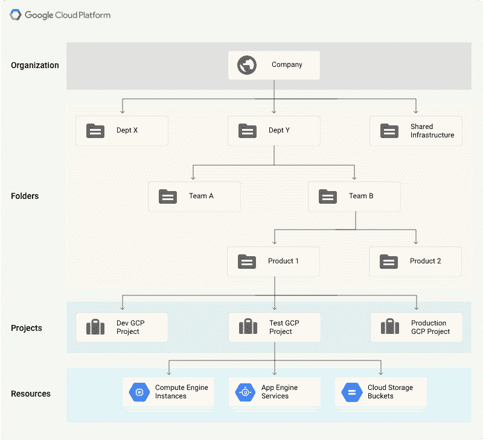
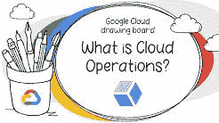
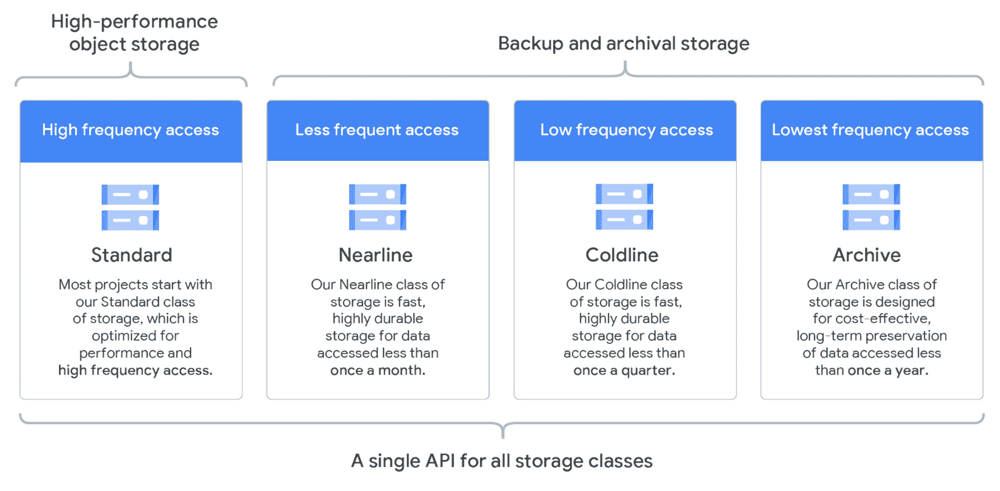
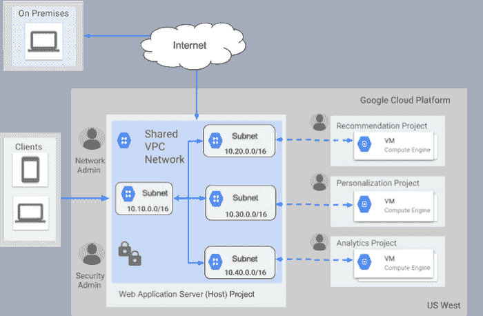
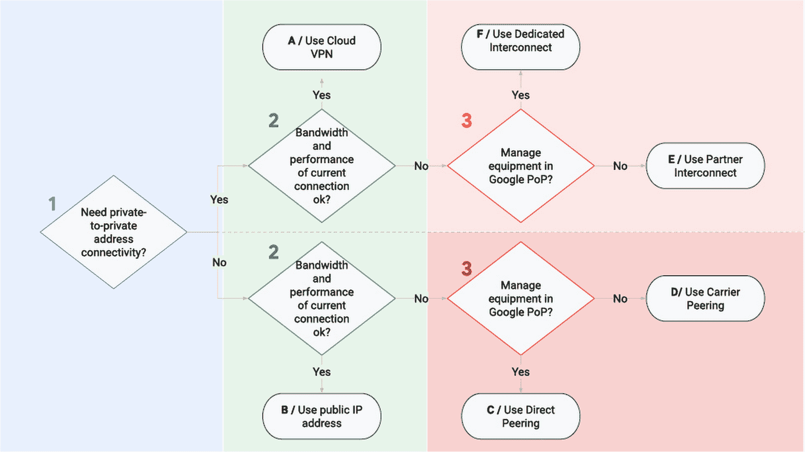
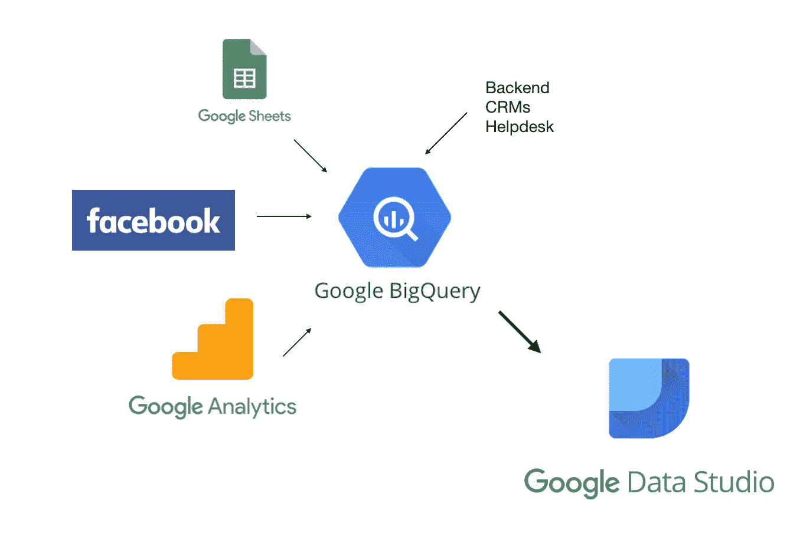
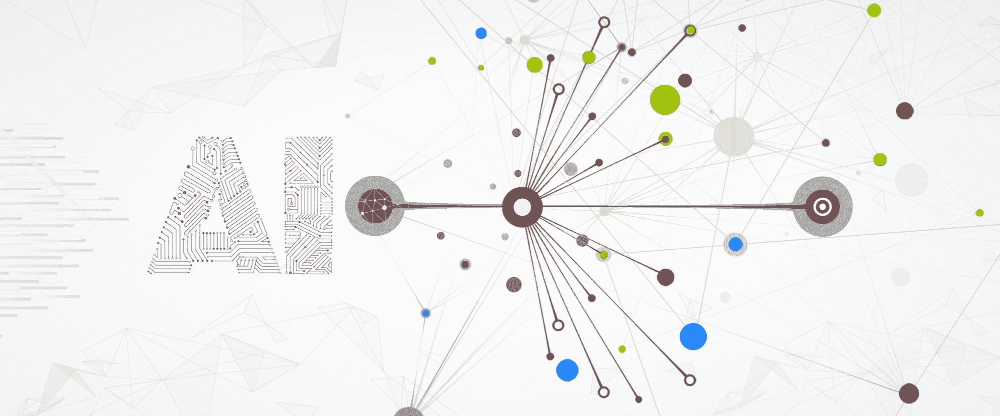
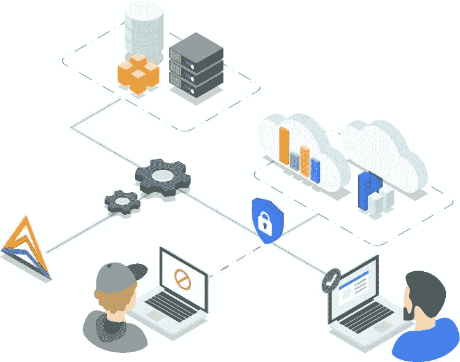

# 谷歌云平台教程:和 GCP 一起从零到英雄

> 原文：<https://www.freecodecamp.org/news/google-cloud-platform-from-zero-to-hero/>

您是否具备设计移动游戏分析平台的知识和技能，来收集、存储和分析大量的批量和实时数据？

嗯，看完这篇文章，你会的。

我的目标是用一篇文章带你在谷歌云平台(GCP)从零到英雄。我将向您展示如何:

*   免费使用 GCP 帐户
*   降低 GCP 基础设施的成本
*   组织你的资源
*   自动化资源的创建和配置
*   管理操作:日志记录、监控、跟踪等等。
*   存储您的数据
*   部署您的应用和服务
*   在 GCP 创建网络，并将其与您的本地网络连接
*   使用大数据、人工智能和机器学习
*   保护您的资源

一旦我解释了这个列表中的所有主题，我将与您分享我所描述的系统的解决方案。

如果你不明白其中的某些部分，你可以回到相关章节。如果这还不够，请访问我提供的文档的链接。

你准备好接受挑战了吗？ 我从老 GCP 职业认证考试中选了几道题。它们将测试你对本文中解释的概念的理解。

我建议试着自己解决设计和问题*，如果有必要的话可以查阅指南。一旦有了答案，就将其与建议的解决方案进行比较。*

*试着超越你正在阅读的内容，问问你自己如果需求 X 改变了会发生什么:*

*   *批处理与流数据*
*   *区域性与全球性解决方案*
*   *少量用户对大量用户*
*   *与实时应用相比，延迟不是问题*

*以及你能想到的任何其他场景。*

*在一天结束的时候，你得到的报酬不仅仅是你所知道的，而是你的思考过程和你所做的决定。这就是为什么锻炼这项技能至关重要。*

*在文章的最后，如果你想继续了解 GCP，我会提供更多的资源和后续步骤。*

## *******如何入门 G****oogle****C****loud****P****latform****for****free***

*GCP 目前提供 3 个月的免费试用，并有 300 美元的免费积分。你可以用它来开始，玩 GCP，并运行实验来决定它是否是你的正确选择。*

*****你不会在你的**** 试用期结束时 ****被充**** ****。除非您决定升级您的计划，否则您将收到通知，您的服务将停止运行。*****

*我强烈建议用这个试验来练习。要学习，你必须 ****自己尝试事情**** ，面对问题，打破事物，并解决它们。如果你不去尝试，这个指南(或者官方文档)再好也没用。*

## ***您为什么要将服务迁移到谷歌云平台？***

*使用 GCP 的资源，如存储或计算能力，可以带来以下好处:*

*   *无需预先为硬件投入大量资金*
*   *无需每隔几年就升级您的硬件并迁移您的数据和服务*
*   *能够根据需求进行扩展，只为您消耗的资源付费*
*   *快速创建概念证明，因为资源调配可以非常快速地完成*
*   *保护和管理您的[API](https://cloud.google.com/endpoints/docs)*
*   *不仅仅是基础设施:数据分析和机器学习服务在 GCP 都有*

*GCP 让你以经济的方式实验和使用你需要的资源变得容易。*

## *如何优化您的虚拟机以降低 GCP 的成本*

*一般来说，你只会在你的实例运行 的时候被 ****收费。谷歌不会为停止的实例向你收费。但是，如果它们消耗资源，如磁盘或保留的 IP，您可能会产生费用。*****

*这里有一些方法可以优化在 GCP 运行应用程序的成本。*

### *定制机器类型*

*GCP 为不同的[机器系列](https://cloud.google.com/compute/docs/machine-types)提供预定义数量的 RAM 和 CPU:*

*   ***。为各种工作负载提供最佳性价比。***
*   *****内存优化。非常适合内存密集型工作负载。它们比其他类型的机器提供更多的内存。*****
*   *******。它们提供最高的每内核性能，并针对计算密集型工作负载进行了优化*******
*   *******。这些机器类型分时共享一个物理核心。对于运行小型应用程序来说，这可能是一种经济有效的方法。*******

*****此外，您可以根据自己的需要创建自己的定制机器。*****

### *****可抢占虚拟机*****

*****您可以使用可抢占的虚拟机来节省高达 80%的成本。它们是容错、非关键应用 的理想 ****。您可以使用关机脚本将作业进度保存在永久磁盘中，以便从停止的地方继续。*********

***谷歌可能会在任何时候停止你的实例(有 30 秒的警告)，并总是在 24 小时后停止它们。***

***为了降低虚拟机关闭的几率，Google 建议:***

*   ***使用 ****许多小实例**** 和***
*   ***在 ****非高峰**时段**运行您的作业。***

*******注意**** :启动和关闭脚本也适用于不可抢占的虚拟机。您可以使用它们来控制机器启动或停止时的行为。例如，安装软件、下载数据或备份日志。***

***有两个选项可以定义这些脚本:***

*   ***当您在 Google 控制台中创建实例时，有一个用于粘贴代码的字段。***
*   ***使用元数据服务器 URL 将您的实例指向存储在 Google 云存储中的脚本。***

***后者是首选，因为它更容易创建许多实例和管理脚本。***

### ***持续使用折扣***

***您使用虚拟机(和云 SQL 实例)的时间越长，折扣就越高，最高可达 30%。谷歌会自动为你做到这一点。***

### ***承诺使用折扣***

***如果您承诺在 1 到 3 年内使用一定数量的 CPU 和 RAM 资源，您可以获得高达 57%的折扣。***

***要估算你的成本，使用[价格计算器](https://cloud.google.com/products/calculator)。这有助于防止你的账单出现任何意外，并创建[预算警报](https://cloud.google.com/billing/docs/how-to/budgets)。***

## *****[如何管理 GCP 的资源](https://cloud.google.com/resource-manager/docs)*****

***在这一部分，我将解释如何管理你的谷歌云资源。***

### *****[资源层次](https://cloud.google.com/resource-manager/docs/cloud-platform-resource-hierarchy)*****

******

***通过资源管理器可以管理四种类型的资源:***

*   *****组织资源。它是资源层次结构中的根节点。它代表一个组织，例如，一个公司。*****
*   *********项目资源**** 。例如，将项目分为生产环境和开发环境。他们是 ****所需的**** 创造资源。*****
*   *******文件夹资源**** 。它们提供了额外的项目隔离级别。例如，为公司的每个部门创建一个文件夹。***
*   *******资源**** 。虚拟机、数据库实例、负载平衡器等等。***

***有 ****配额**** 限制您可以创建的最大资源数量，以防止意外的计费高峰。但是，大多数配额可以通过开立支持票证来增加。***

***GCP 中的资源通过父/子关系遵循**层次结构，类似于传统的文件系统，其中:*****

*   *********的权限是随着我们向下的层级**** 继承的。例如，授予的权限和组织级别将传播到所有文件夹和项目。*****
*   ***更宽松的父策略总是会否决更严格的子策略。***

***这种层次结构有助于您管理资源的常见方面，如访问控制和配置设置。***

***您可以创建超级管理员帐户，该帐户可以访问组织中的所有资源。因为它们非常强大，所以确保你遵循了谷歌的最佳实践。***

### ***标签***

***标签是键值对，可用于组织 GCP 中的资源。将标签附加到资源(例如，虚拟机)后，您可以基于该标签进行筛选。这也有助于将你的账单按标签分类。***

***一些常见的使用案例:***

*   ***环境:生产、测试等等。***
*   ***团队或产品所有者***
*   ***组件:后端、前端等等。***
*   ***资源状态:活动、存档等。***

### ***标签与网络标签***

***这两个相似的概念似乎会产生一些混淆。我总结了下表中的差异:***

| 标签 | 网络标签 |
| --- | --- |
| 适用于任何 GCP 资源 | 仅适用于 VPC 资源 |
| 只是组织资源 | 影响资源的工作方式(例如:通过应用防火墙规则) |

 ***### **[【cloud iam】](https://cloud.google.com/iam/docs)**

简单来说，Cloud IAM 控制 ****谁可以在哪个资源**** 上做什么。资源可以是虚拟机、数据库实例、用户等等。

需要注意的是，权限不是直接分配给用户的。而是捆绑成 **角色** ，分配给 **成员** 。 **策略** 是一组成员到一个角色的一个或多个绑定的集合。


### 身份

在 GCP 的一个项目中，身份由谷歌账户代表，在 GCP 之外创建，并由电子邮件地址定义(不一定是@gmail.com)。有不同的类型:

*   ****【谷歌账户*】****。来代表人们:工程师、管理员等等。
*   ****服务账户**** 。用于识别非人类用户:应用程序、服务、虚拟机等。认证过程由 **账户密钥** 定义，可以由 Google 管理，也可以由用户管理(仅针对用户创建的服务账户)。
*   ****Google Groups**** 是 Google 和服务账号的集合。
*   ****G 套件域***** 是您可以用来识别组织的账户类型。如果您的组织已经在使用[活动目录](https://en.wikipedia.org/wiki/Active_Directory)，它可以使用[云身份](https://cloud.google.com/identity/docs)与云 IAM 同步。
*   ****allAuthenticatedUsers****。来代表 GCP 的任何经过身份验证的用户。
*   ****allUsers**** 。代表任何人，不管是否经过认证。

关于服务账户，谷歌的一些最佳实践包括:

*   不使用默认服务帐户
*   应用最小特权原则。例如:
    1。限制谁可以充当服务帐户
    2。仅授予该帐户所需的最低权限集
    3。为每项服务创建服务帐户，仅使用帐户所需的权限

### 角色

一个角色是一个 ****权限的集合**** 。有三种类型的角色:

*   ****本原**** 。适用于整个项目的原始 GCP 角色。有三个同心角色: ****查看者********编辑者********拥有者**** 。编辑器包含查看器，所有者包含编辑器。
*   ****预定义的**** 。提供对特定服务的访问，例如 storage.admin
*   ****风俗**** 。允许您创建自己的角色，结合您需要的特定权限。

分配角色时，也要遵循最小特权原则。一般来说， ****比**** 更喜欢预定义的原始角色。

### **[云部署管理器](https://cloud.google.com/deployment-manager/docs)**

Cloud Deployment Manager 可以自动执行可重复的任务，例如为任意数量的机器进行供应、配置和部署。

它是谷歌的 **基础设施作为代码** 服务，类似于 Terraform——虽然你只能部署 GCP 资源。它被 [GCP 市场](https://cloud.google.com/marketplace)用来创建预配置部署。

您在 YAML 文件中定义您的配置，列出您想要创建的资源(通过 API 调用创建)及其属性。资源由其 ****名称**** (VM-1，disk-1)****类型**** (compute.v1.disk，compute.v1.instance)和 ****属性**** (zone:europe-west4，boot:false)定义。

为了提高性能，资源被并行部署。因此你需要 ****使用引用**指定任何依赖关系。**例如，在创建永久磁盘 disk-1 之前，不要创建虚拟机 VM-1。相比之下，Terraform 会自己找出依赖关系。

您可以使用模板模块化您的配置文件，以便它们可以独立地更新和共享。模板可以在 Python 或 Jinja2 中定义。模板的内容将被内联到引用它们的配置文件中。

部署管理器将创建一个清单，其中包含您的原始配置、您导入的任何模板以及您想要创建的所有资源的扩展列表。

## **[【云操作】](https://cloud.google.com/stackdriver/docs)**



Operations 提供了一套工具，用于监视、记录、调试、错误报告、分析和跟踪 GCP 中的资源(AWS 甚至是内部部署)。

### **云日志**

云日志是 GCP 实时日志管理的集中解决方案。对于您的每个项目，它允许您存储、搜索、分析、监控和警告日志记录数据:

*   默认情况下，数据将存储一段时间。保留期因日志类型而异。超过此保留期后，您将无法检索日志。
*   可以出于不同目的导出日志。为此，您创建一个**，它由一个 ****过滤器**** (选择您想要记录的内容)和一个 ****目的地**** : Google 云存储(GCS)用于长期保留，BigQuery 用于分析，或者 Pub/Sub 用于将其流式传输到其他应用程序。**
*   **您可以在云监控中创建基于日志的指标，甚至在出现问题时收到警报。**

**日志是 ****日志条目**** 的命名集合。日志条目记录状态或事件，并包括其日志的名称，例如，compute.googleapis.com/activity.有两种主要类型的日志:**

****首先，用户日志:****

*   **这些是由您的应用程序和服务生成的。**
*   **它们使用安装在虚拟机上的云日志 API、客户端库或[日志代理](https://cloud.google.com/logging/docs/agent)写入云日志。**
*   **它们从常见的第三方应用程序(如 MySQL、MongoDB 或 Tomcat)流式传输日志。**

****二、安全日志，分为:****

*   **审计日志，用于管理更改、系统事件和对资源的数据访问。例如，谁创建了一个特定的数据库实例，或者谁记录了一个[实时迁移](https://cloud.google.com/compute/docs/instances/live-migration)。必须明确启用数据访问日志，这可能会产生额外费用。其余是默认启用的，不能禁用，并且是免费的。**
*   **访问透明度日志，用于 Google 员工在访问您的资源时采取的措施，例如调查您向支持团队报告的问题。**

#### **VPC 流量测井**

**它们是特定于 VPC 网络的(我将在后面介绍)。VPC 流日志记录了 VM 实例发送和接收的网络流 的 ****样本，稍后可以在云日志中访问。******

**它们可用于监控网络性能、使用情况、取证、实时安全分析和费用优化。**

******注**** :您可能希望记录您的账单数据以供分析。在这种情况下，你做 **而不是** 创建一个水槽。您可以直接将报告导出到 BigQuery。**

### ****云监控****

**云监控让您可以监控应用程序和基础架构的性能，在仪表板中直观显示性能，创建[正常运行时间检查](https://cloud.google.com/monitoring/uptime-checks)以检测停机的资源，并根据这些检查向[发出警报](https://cloud.google.com/monitoring/alerts)，以便您可以修复环境中的问题。您可以在 GCP、AWS 甚至内部监控资源。**

**建议为云监控创建一个单独的项目，因为它可以跨多个项目跟踪资源。**

**此外，建议在您的虚拟机中安装一个监控代理，以便将应用程序指标(包括许多第三方应用程序)发送到云监控。否则，云监控将只显示 CPU、磁盘流量、网络流量和正常运行时间指标。**

#### **警报**

**要接收警报，您必须声明一个 ****警报策略**** 。警报策略定义了服务被视为不健康的 ****条件**** 。当条件满足时，将创建一个新的事件并发送通知(通过电子邮件、Slack、SMS、PagerDuty 等)。**

**一个策略属于一个单独的工作区，该工作区最多可以包含 500 个策略。**

#### **找到；查出**

**跟踪帮助 ****找到服务中的瓶颈**** 。您可以使用该服务来计算处理一个请求需要多长时间，哪个微服务需要最长的响应时间，从哪里着手减少整体延迟，等等。**

**默认情况下，对于运行在 Google App Engine (GAE) -标准环境上的应用程序，它是启用的，但也可以用于运行在 GCE、GKE 和 Google App Engine Flexible 上的应用程序。**

#### **错误报告**

**错误报告将汇总并显示用 Go、Java、Node.js、PHP、Python、Ruby 或. NET 编写的在 GCE、GKE、GAP、云函数或云运行上运行的服务中产生的错误。**

#### **调试**

**Debug 允许您在不停止服务的情况下检查应用程序的状态。目前支持 Java、Go、Node.js 和 Python。它自动与 GAE 集成，但可以在 GCE、GKE 和云上使用。**

#### **轮廓**

**持续从应用程序中收集 CPU 使用和内存分配信息的探查器。要使用它，您需要安装一个分析代理。**

## ****如何在 GCP 存储数据****

**在这一部分，我将介绍 Google 云存储(适用于任何类型的数据，包括文件、图像、视频等等)，GCP 提供的不同数据库服务，以及如何决定哪种存储方式最适合您。**

### ****[【谷歌云存储(GCS)](https://cloud.google.com/storage/docs)****

****

**GCS 是 Google 的 ****非结构化数据**** 的存储服务:图片、视频、文件、脚本、数据库备份等等。**

**对象被放置在 ****桶**** 中，它们从桶中继承权限和存储类。**

**[存储类别](https://cloud.google.com/storage/docs/storage-classes)为存储您的数据提供不同的 SLA，以最大限度地降低您的使用案例的成本。可以更改 bucket 的存储类(在某些限制下)，但它只会影响添加到 bucket 的新对象。**

**除了 Google 的控制台，您还可以使用 [gsutil](https://cloud.google.com/storage/docs/gsutil) 从命令行与 GCS 交互。您可以使用指定:**

*   ******多线程更新**** 需要上传大量小文件时。该命令看起来像 gsutil -m cp 文件 gs://my-bucket)**
*   ******并行更新**** 需要上传大文件时。欲了解更多详情和限制，请访问此[链接](https://cloud.google.com/storage/docs/gsutil/commands/cp#parallel-composite-uploads)。**

**将文件上传到 GCS 的另一个选项是[存储传输服务(STS)](https://cloud.google.com/storage-transfer/docs) ，该服务将数据从以下位置导入 GCS 存储桶:**

*   **AWS S3 桶**
*   **可以通过 HTTP(S)访问的资源**
*   **另一个谷歌云存储桶**

**如果你需要上传大量数据(从数百 TB 到 1 Pb ),考虑使用[数据传输设备](https://cloud.google.com/transfer-appliance/docs/2.2):将你的数据传输到谷歌的设备上。一旦他们将数据上传到 GCS,[数据再水合](https://cloud.google.com/transfer-appliance/docs/2.0/data-rehydration)的过程重新组合文件，以便它们可以再次被访问。**

#### **[对象生命周期管理](https://cloud.google.com/storage/docs/lifecycle)**

**您可以定义规则来确定在满足特定条件时将对对象执行的操作(是将其存档还是删除)。**

**例如，您可以定义一个策略，在 30 天后自动将对象的存储类别从标准更改为近线，并在 180 天后将其删除。**

**这是定义规则的方式:**

```
`{
   "lifecycle":{
      "rule":[
         {
            "action":{
               "type":"Delete"
            },
            "condition":{
               "age":30,
               "isLive":true
            }
         },
         {
            "action":{
               "type":"Delete"
            },
            "condition":{
               "numNewerVersions":2
            }
         },
         {
            "action":{
               "type":"Delete"
            },
            "condition":{
               "age":180,
               "isLive":false
            }
         }
      ]
   }
}`
```

**它将通过 gsutils 或 REST API 调用来应用。也可以通过 Google 控制台创建规则。**

#### **GCS 中的权限**

**除了 IAM 角色之外，您还可以使用访问控制列表(ACL)来管理对存储桶中资源的访问。**

**尽可能使用 IAM 角色，但是记住****ACL****授予对存储桶和 ****单个对象**** 的访问权限，而 ****IAM 角色是项目或存储桶范围的**** 权限。这两种方法协同工作。**

**要向 GCP 以外的用户授予临时访问权限，请使用[签名的 URL](https://cloud.google.com/storage/docs/access-control/signed-urls)。**

#### **桶锁**

**存储桶锁允许您对存储桶中的对象强制执行一个**最短保持期。出于审计或法律原因，您可能需要这样做。****

********桶一旦被锁定，就无法解锁**** 。要删除，您需要首先删除存储桶中的所有对象，只有在它们都达到保留策略指定的保留期后，您才能这样做。只有这样，您才能删除存储桶。****

**您可以在创建存储桶时包括保留策略，或者将保留策略添加到现有存储桶中(它也追溯应用于存储桶中的现有对象)。**

**趣闻:最长保存期 100 年。**

### ****GCP 的关系管理数据库****

**Cloud SQL 和 Cloud Spanner 是 GCP 提供的两种托管数据库服务。如果你不想处理在线维护数据库的所有必要工作，它们是一个很好的选择。您可以随时运行虚拟机并管理自己的数据库。**

#### **[云 SQL](https://cloud.google.com/sql/docs)**

**云 SQL 提供对 GCP 托管 MySQL 或 PostgreSQL 数据库实例的访问。每个实例限于一个 ****单区域**** 和一个 ****最大容量 30 TB**** 。**

**Google 将负责安装、备份、扩展、监控、故障转移和读取副本。出于可用性原因，副本必须定义在与主实例相同但不同的区域中。**

**可以使用 SQL 转储或 CSV 文件格式轻松导入数据(首先将数据上传到 Google 云存储，然后再上传到实例)和导出数据。数据可以压缩降低成本(可以直接导入。gz 文件)。对于“提升和转移”迁移，这是一个很好的选择。**

**如果您需要全球可用性或更多容量，请考虑使用云扳手。**

#### **[云扳手](https://cloud.google.com/spanner/docs)**

**Cloud Spanner 在全球范围内提供，并且可以很好地扩展(水平方向)。**

**这两个特性使得它能够支持与云 SQL 不同的使用情形，而且价格也更高。云扳手不是提升和转移迁移的选项。**

### ****NoSQL 在 GCP 管理数据库****

**类似地，GCP 提供了两个托管 NoSQL 数据库 Bigtable 和 Datastore，以及一个内存数据库服务 Memorystore。**

#### **[数据存储](https://cloud.google.com/datastore/docs)**

**Datastore 是一个完全无操作、高度可伸缩的文档数据库，非常适合 web 和移动应用程序:游戏状态、产品目录、实时库存等。它非常适合:**

*   **用户资料-移动应用**
*   **游戏保存状态**

**默认情况下，数据存储有一个内置的 ****索引**** ，可以提高简单查询的性能。您可以创建自己的指数，称为 ****综合指数**** ，以 YAML 格式定义。**

**如果您需要极高的吞吐量(每秒大量的读/写)，请使用 Bigtable。**

#### **[Bigtable](https://cloud.google.com/bigtable/docs)**

**Bigtable 是一个 NoSQL 数据库，非常适合分析性工作负载，可以在几毫秒内完成大量的写入和读取，并能够存储数 TB 到数 Pb 的信息。它非常适合:**

*   **财务分析**
*   **物联网数据**
*   **营销数据**

**Bigtable 需要创建和配置节点(与完全托管的数据存储或 BigQuery 相反)。您可以在不停机的情况下向群集中添加或删除节点。与 Bigtable 交互的最简单方式是命令行工具 [cbt](https://cloud.google.com/bigtable/docs/cbt-overview) 。**

**Bigtable 的性能将取决于数据库模式的设计。**

*   **每行只能定义一个键，并且必须在同一行中保留与实体关联的所有信息。可以把它想象成一个散列表。**
*   **表是稀疏的:如果没有与列相关的信息，就不需要空间。**
*   **为了提高读取效率，请尝试将相关实体存储在相邻的行中。**

**由于这个主题本身就值得写一篇文章，我推荐你阅读[文档](https://cloud.google.com/bigtable/docs/performance)。**

#### **[记忆恢复器](https://cloud.google.com/memorystore/docs)**

**它提供了 Redis 和 Memcache(内存数据库)的托管版本，从而实现了非常快的性能。实例是区域性的，如云 SQL，容量高达 300 GB。**

### ****如何选择你的数据库****

**谷歌喜欢决策树。这将帮助你为你的项目选择合适的数据库。对于非结构化数据，考虑 GCS 或使用数据流处理它(稍后讨论)。**

****

## **GCP 的社交网络是如何运作的？**

### ****虚拟私有云(VPC)——[见此处文档](https://cloud.google.com/vpc/docs/)——****

**你可以使用谷歌用来运行其服务的网络基础设施:YouTube、搜索、地图、Gmail、Drive 等等。**

**谷歌基础设施分为:**

*   ******地区**** :独立的地理区域，彼此相距至少 100 英里，谷歌在这里托管数据中心。它由 3 个或更多区域组成。例如，美国中央 1。**
*   ******分区**** :一个区域内多个独立的数据中心。比如 us-central1-a。**
*   ****边缘存在点:谷歌网络与互联网其余部分的连接点。****

****GCP 基础设施的设计使得地区间的所有流量都通过全球专用网络传输，从而提高了安全性和性能。****

****在此基础设施之上，您可以为您的资源构建网络，即虚拟私有云。它们是 ****软件定义的网络**** ，所有传统的网络概念都适用于此:****

*   **[子网](https://cloud.google.com/vpc/docs/vpc#subnets_vs_subnetworks)。使用 [CIDR 符号](https://en.wikipedia.org/wiki/Classless_Inter-Domain_Routing)定义的网络逻辑分区。它们只属于一个区域，但可以跨越多个区域。如果您有多个子网(包括连接到 GCP 的本地网络)，请确保 CIDR 范围不重叠。**
*   ******IP 地址**** 。可以是内部的(用于 GCP 内部的私人通信)，也可以是外部的(用于与互联网的其他部分通信)。对于外部 IP 地址，可以使用一个 ****短暂 IP**** 或者付费使用一个 ****静态 IP**** 。通常，您需要一个外部 IP 地址来连接到 GCP 服务。然而，在某些情况下，您可以为只有内部 IP 的实例配置[私有访问](https://cloud.google.com/vpc/docs/private-access-options)。**
*   **[防火墙规则](https://cloud.google.com/vpc/docs/firewalls)，允许或拒绝流入(流入)和流出(流出)虚拟机的流量。默认情况下，拒绝所有入站流量，允许所有出站流量。防火墙规则是在 VPC 级别定义的，但它们 ****应用于使用 ****网络标签**** 或 ****IP 范围**** 的单个实例或实例组**** 。
    ****常见问题**** :如果您知道您的虚拟机工作正常，但您无法通过 HTTP(s)访问它们或无法通过 SSH 访问它们，请查看您的防火墙规则。**



您可以创建 ****混合网络**** 将您的内部基础设施连接到您的 VPC。

当您创建一个项目时，将会创建一个 ****默认网络**** ，每个区域都有子网(自动模式)。您可以删除此网络，但您需要创建至少一个网络才能创建虚拟机。

您还可以创建您的 ****自定义网络**** ，默认情况下不会创建任何子网，您可以完全控制子网创建(自定义模式)。

VPC 的主要目标是网络资源的**分离。GCP 项目是组织资源和管理权限的一种方式。**

**项目 A 的用户需要访问项目 b 中的资源的权限。所有用户都可以访问在他们所属的任何项目中定义的任何 VPC。在同一个 VPC 中，子网 1 中的资源需要被授权访问子网 2 中的资源。**

**就 IAM 角色而言，可以创建网络资源的人(网络管理员，创建子网、虚拟机等)和负责资源安全的人(安全管理员，创建防火墙规则、SSL 证书等)是有区别的。**

**计算实例管理员角色结合了这两种角色。**

**像往常一样，你在 VPC 可以做的事情是有限额和限制的，其中包括:**

*   **项目中 VPC 的最大数量。**
*   **每个 VPC 的最大虚拟机数量。**
*   **没有广播或多播。**
*   **尽管全局负载平衡器支持 IPv6 流量，但 VPC 不能使用 IPv6 进行内部通信。**

### ****如何在多个 VPC 之间共享资源****

#### **[共享 VPC](https://cloud.google.com/vpc/docs/shared-vpc)**

**共享 VPC 是一种在同一组织内不同项目之间共享资源的方式。这允许您按照最小特权的原则，控制计费和管理对不同项目中的资源的访问。否则，你必须把所有的资源放在一个项目中。**

**为了设计共享的 VPC，项目分为三类:**

*   ******主持项目**** 。它是托管公共资源的项目。只能有一个宿主项目。**
*   ******服务项目**** :可以访问宿主项目中资源的项目。项目不能既是宿主又是服务。**
*   ******独立项目**** 。任何不使用共享 VPC 的项目。**

**您将只能在您定义了您的主机和服务项目的 之后创建的 ****资源之间进行通信。在此之前的任何现有资源都不会成为共享 VPC 的一部分。******

#### **[VPC 网络对等](https://cloud.google.com/vpc/docs/vpc-peering)**

**当所有项目属于同一个组织时，可以使用共享 VPCs。但是，如果:**

*   **需要 ****跨 VPCs****私信。**
*   **VPC 在可能属于 ****不同组织**的项目中。****
*   **想要**分散**控制，即不需要定义主机项目，服务器项目等等。**
*   **想要重用现有资源。**

**VPC 网络对等是正确的解决方案。**

**在下一节中，我将讨论如何将您的 VPC 与 GCP 以外的网络连接起来。**

## **如何连接内部和 GCP 基础架构**

****

**将您的内部基础架构连接到 GCP 有三种选择:**

*   **云 VPN**
*   **云互联**
*   **云对等**

**它们中的每一个都有不同的功能、用例以及价格，我将在下面的章节中进行描述。**

### **[云 VPN](https://cloud.google.com/network-connectivity/docs/vpn)**

**有了云 VPN，您的流量通过加密隧道在公共互联网上传输。每个通道的最大容量为每秒 3 Gb，为了获得更好的性能，您最多可以使用 8gb。这两个特点使得 VPN 成为最便宜的选择。**

**您可以在 VPC 和本地网络之间定义两种类型的路由:**

*   ******静态路线**** 。您必须手动定义和更新它们，例如当您添加新的子网时。这不是首选选项。**
*   ******动态路线**** 。使用[云路由器](https://cloud.google.com/network-connectivity/docs/router)为您自动处理(定义和更新)路线。当 [BGP](https://en.wikipedia.org/wiki/Border_Gateway_Protocol) 可用时，这是首选选项。**

**你的流量被 VPN 网关加密和解密(在 GCP，它们是区域资源)。**

**要获得更可靠的连接，可以考虑使用多个 VPN 网关和隧道。在出现故障的情况下，这种冗余保证了流量仍然可以流动。**

### **[云互联](https://cloud.google.com/network-connectivity/docs/interconnect)**

**有了云 VPN，流量通过公共互联网传输。借助云互联，您的内部网络和 VPC 之间有一个**直接物理连接。此选项会更贵，但会提供最佳性能。****

****根据您希望如何实现与 GCP 的连接，有两种类型的互连可用:****

*   ********专用互联**** 。有一条“直通电缆”连接着您的基础设施和 GCP。这是最快的选项，容量为每秒 10 到 200 Gb。然而，它并不是在所有地方都可用:在撰写本文时，仅在全球 62 个地方可用。****
*   ******伙伴互联**** 。您通过服务提供商进行连接。此选项在地理位置上更加可用，但不如专用互连快:从每秒 50 Mb 到每秒 10 Gb。**

### **[云对等](https://cloud.google.com/vpc/docs/using-vpc-peering)**

**云对等不是 GCP 服务，但你可以用它将你的网络连接到谷歌的网络，并访问 Youtube、Drive 或 GCP 服务等服务。**

**一个常见的用例是当你需要连接到谷歌，但不想通过公共互联网。**

### ****其他网络服务****

#### **[负载平衡器(LB)](https://cloud.google.com/load-balancing/docs/load)**

**在 GCP，负载平衡器是在一组实例之间分配用户请求的软件。**

**一个负载平衡器可能有多个与之相关联的后端，这些后端具有为给定请求决定适当后端的规则。**

**有不同类型的负载平衡器。它们的不同之处在于流量类型(HTTP 与 TCP/UDP -第 7 层或第 4 层)，它们处理的是外部流量还是内部流量，以及它们的范围是区域性的还是全球性的:**

*   ****。处理 HTTP(s)请求的全局 LB，根据用户位置(到具有可用实例的最近区域)或 URL 映射将流量分发到多个区域(LB 可以配置为将对**URL/新闻** 的请求转发到后端服务，将**URL/视频** 转发到不同的服务)。它可以接收 IPv4 和 IPv6 流量(但这个流量在 LB 层终止，并作为 IPv4 代理到后端)，并具有对 WebSockets 的本机支持。****
*   ********SSL 代理 LB**** 。 ****全局**** LB 处理加密的 TCP 流量，为你管理 SSL 证书。****
*   ******TCP 代理 LB**** 。 ****全局**** LB 处理未加密的 TCP 流量。像 SSL 代理 LB 一样，默认情况下，它不会保留客户端的 IP，但这是可以改变的。**
*   ******网络负载均衡器**** 。基于 IP 地址和端口处理 TCP/UDP 外部流量的区域 LB。**
*   ******内部负载均衡器**** 。类似于网络 LB，但用于内部流量。**

**对于视觉学习者:**

****

#### **[云 DNS](https://cloud.google.com/dns/docs)**

**云 DNS 是 Google 托管的[域名系统(DNS)](https://en.wikipedia.org/wiki/Domain_Name_System) 主机，用于内部和外部(公共)流量。它将像 https://www.freecodecamp.org/的 T2 这样的网址映射到一个 IP 地址。这是 GCP 唯一一个 100% SLA 的服务——100%时间可用。**

#### **[谷歌云 CDN](https://cloud.google.com/cdn/docs)**

**云 DNS 是谷歌的[内容交付网络](https://en.wikipedia.org/wiki/Content_delivery_network)。如果您有不经常更改的数据(图像、视频、CSS 等。)将它缓存在靠近用户的地方是有意义的。云 CDN 提供 90 Edges Presence Point(POP)来缓存靠近最终用户的数据。**

**在第一次请求之后，静态数据可以存储在 POP 中，通常比主服务器更靠近用户。因此，在后续请求中，您可以更快地从 POP 中检索数据，并减少后端服务器的负载。**

## **在 GCP 哪里可以运行您的应用程序？**

**我将介绍您的代码在 GCP 可以运行的 4 个地方:**

*   **谷歌计算引擎**
*   **谷歌库比厄引擎**
*   **应用引擎**
*   **云函数**

****

******注**** :还有第 5 个选项:Firebase 是谷歌的移动平台，帮助你快速开发应用。**

### ****计算引擎****

**计算引擎允许您在 GCP 启动虚拟机。这一部分将会更长，因为 GCE 提供了 GKE 和 GAE 运行的基础架构。**

**在简介中，我谈到了可以在 GCE 中创建的不同类型的虚拟机。现在，我将介绍在哪里存储数据，如何备份数据，以及如何用您需要的所有数据和配置创建实例。**

#### **存储虚拟机数据的位置:磁盘**

**你的数据可以保存在 ****持久盘********本地固态硬盘**** ，或者 ****云存储**** 。**

##### ****[持久盘](https://cloud.google.com/persistent-disk)****

**持久磁盘提供持久可靠的块存储。它们不在机器本地。相反，它们是联网连接的，这有其利弊:**

*   **即使实例正在使用中，磁盘也可以调整大小、连接或从虚拟机中分离。**
*   **它们具有很高的可靠性。**
*   **磁盘可以在实例被删除后继续存在。**
*   **如果您需要更多空间，只需连接更多磁盘。**
*   **更大的磁盘将提供更高的性能。**
*   **由于是联网连接，它们的性能不如本地选项。SSD 持久磁盘也可用于要求更高的工作负载。**

**每个实例都需要一个引导磁盘，并且它必须是这种类型。**

##### ****[本地 SSD](https://cloud.google.com/local-ssd)****

**本地固态硬盘连接到虚拟机，为其提供高性能的临时存储。到目前为止，您可以将多达八个 375GB 的本地 SSD 连接到同一个实例。但是，如果虚拟机被终止，这些数据将会丢失。**

**本地 SSD 只能在创建时连接到计算机，但您可以将本地 SSD 和永久磁盘连接到同一台计算机。**

**这两种类型的磁盘都是分区资源。**

##### ****云存储****

**我们在上一节中已经广泛讨论了 GC。GCS 不是文件系统，但是您可以使用 [GCS-Fuse](https://cloud.google.com/storage/docs/gcs-fuse) 在 Linux 或 macOS 系统中将 GCS buckets 挂载为文件系统。您还可以让应用程序使用标准文件系统语义下载和上传数据到 GCS。**

#### **如何备份您的虚拟机数据:快照**

**快照是磁盘的备份。为了减少空间，它们是以增量方式创建的:**

*   **备份 1 包含您的所有磁盘内容**
*   **备份 2 仅包含自备份 1 以来已更改的数据**
*   **备份 3 仅包含自备份 2 以来已更改的数据，依此类推**

**这足以恢复您的磁盘状态。**

**尽管可以在不停止实例的情况下拍摄快照，但最佳做法是至少减少其活动，停止向磁盘写入数据，并刷新缓冲区。这有助于您确保获得磁盘内容的准确表示。**

#### **[图像](https://cloud.google.com/compute/docs/images)**

**映像是指为实例创建引导磁盘所需的操作系统映像。有两种类型的图像:**

*   ******公共图像**** 。它们由 Google、开源社区和第三方供应商提供和维护。一旦创建了项目，就可以使用了。任何人都可以使用**
*   ******自定义图片**** 。您创建的图像。**
*   **它们链接到创建它们的项目，但是您可以与其他项目共享它们。**
*   **您可以从 ****永久磁盘**** 和 ****其他镜像**** 中创建镜像，它们都来自同一个项目或从另一个项目共享。**
*   **相关图像可以分组到 ****图像族**** 中，以简化不同图像版本的管理。**
*   **对于基于 Linux 的映像，您也可以通过将它们作为 tar.gz 文件导出到云存储来共享它们。**

**您可能会问自己，图像和快照之间有什么区别。主要是， ****他们的目的**** 。快照是作为磁盘的增量备份拍摄的，而创建映像是为了启动新的虚拟机和配置实例模板。**

****映像与启动脚本的注意事项:****

**对于简单的设置，启动脚本也是一个选项。它们可用于快速测试更改，但与使用安装、配置所有必需软件的映像相比，虚拟机需要更长时间才能准备就绪。**

#### **实例组**

**实例组允许您将一组实例视为一个单元，它们有两种形式:**

*   ******非托管实例组**** 。由一组需要单独配置设置的异类实例组成。**
*   ******托管实例组(MIG)。**** 这是可能时的首选。所有的机器看起来都一样，这使得配置它们、在多个区域中创建它们(高可用性)、在它们变得不健康时替换它们(自动修复)、平衡它们之间的流量以及在它们的流量增加时创建新的实例(水平扩展)变得很容易。**

**要创建一个 MIGs，您需要定义一个 ****实例模板**** ，指定您的机器类型、区域、操作系统映像、启动和关闭脚本等等。实例模板是不可变的。**

**要更新 MIG，您需要创建一个新模板，并使用 ****托管实例组更新**** 来将新版本部署到组中的每台机器。**

**这个功能可以用来创建 [canary 测试](https://martinfowler.com/bliki/CanaryRelease.html)，首先将您的更改部署到一小部分机器上。**

**访问此[链接](https://cloud.google.com/compute/docs/instance-groups/distributing-instances-with-regional-instance-groups)了解更多有关 Google 建议的信息，以确保通过托管实例组部署的应用程序即使在整个区域出现故障的情况下也能处理负载。**

#### **GCE 的安全最佳实践**

**要提高 GCE 中基础设施的安全性，请查看:**

*   **[屏蔽的虚拟机](https://cloud.google.com/security/shielded-cloud/shielded-vm)**
*   **[防止从公共互联网访问实例](https://cloud.google.com/solutions/connecting-securely)**
*   **[可信映像](https://cloud.google.com/compute/docs/images/restricting-image-access#:~:text=Use the Trusted image feature,images%2C disks%2C and snapshots.)确保您的用户只能从 ****特定项目**** 中的映像创建磁盘**

### ****[App 引擎](https://cloud.google.com/appengine/docs)****

**当你想专注于代码并让 Google 处理你的基础设施时，App Engine 是一个很好的选择。你只需要选择你的应用将被部署的区域(一旦设置，就不能改变)。它的主要用例包括网站、移动应用和游戏后端。**

**您可以通过命令行或 Google 控制台轻松更新正在运行的应用程序版本。**

**此外，如果您需要为您的应用程序部署一个有风险的更新，您可以在 canary 部署的旧版本和有风险的版本之间划分流量。一旦您对结果感到满意，您就可以将所有流量路由到新版本。**

**有两种应用引擎环境:**

*   ******标准**** 。这个版本可以快速伸缩(甚至到零个实例)以适应需求。目前，仅支持几种编程语言(Go、Java、PHP 和 Python)，并且您无法访问 VPC(包括 VPN 连接)。它可以缩减到零个实例。**
*   ******灵活。你的代码在 GCE 的 Docker 容器中运行，因此比标准环境更加灵活。但是，创建新实例比较慢，并且不能缩减到零个实例。它适用于更稳定的流量。******

**无论环境如何，都没有前期成本，您只需按使用量付费(按秒计费)。**

******Memcache**** 是一个内置的应用程序引擎，让您可以在 ****共享**** 缓存(默认，免费选项)或 ****专用**** 缓存之间选择，以获得更好的性能。**

**请访问此链接，了解更多关于您应该遵循的[最佳实践](https://cloud.google.com/appengine/docs/standard/java/memcache#best_practices)的信息，以最大限度地提高您的应用性能。**

### ****[【Google Kubernetes 引擎(GKE)](https://cloud.google.com/kubernetes-engine/docs)****

**[Kubernetes](https://kubernetes.io/) 是一个开源的 ****容器编排系统**** ，由 Google 开发。**

**Kubernetes 本身是一个非常广泛的话题，我不会在这里讨论。你只需要知道 GKE 使你在 GCP 上运行和管理你的 Kubernetes 集群变得容易。**

**Google 还提供了[容器注册表](https://cloud.google.com/container-registry)来存储你的容器图像——把它想象成你的私人 Docker Hub。**

******注意**** :您可以使用[云构建](https://cloud.google.com/cloud-build/docs)在 GCP 运行您的构建，并生成 Docker 映像并将它们存储在容器注册表中。Cloud Build 可以从 Google Cloud Storage、 [Cloud Source Repository](https://cloud.google.com/source-repositories/docs) 、GitHub 或者 Bitbucket 导入你的代码。**

### ****[云功能](https://cloud.google.com/functions/docs)****

**云函数相当于 AWS 中的 Lambda 函数。云功能有 ****无服务器**** 。它们让您专注于代码，而不用担心代码运行的基础设施。**

**使用云功能， ****可以轻松响应事件**** ，例如上传到 GCS 桶或发布/订阅主题中的消息。您只需为您的函数为响应事件而运行的时间付费。**

## ****如何在 GCP 使用大数据****

### ****[BigQuery](https://cloud.google.com/bigquery/docs/)****

****

**BigQuery 是谷歌的无服务器数据仓库，为 Pb 级数据库提供分析能力。**

**BigQuery 会自动备份您的表，但是为了安全起见，您总是可以将它们导出到 GCS 这会产生额外的成本。**

**数据可以成批接收(例如，从 GCS bucket)或从多种格式的流中接收:CSV、JSON、Parquet 或 Avro(最具性能)。此外，您可以查询驻留在外部源中的数据，这些外部源称为联合源，例如 GCS 存储桶。**

**您可以使用 SQL 通过**

*   **谷歌控制台。**
*   **[命令行](https://cloud.google.com/bigquery/docs/bq-command-line-tool)，运行`bq query 'SELECT field FROM ....`等命令**
*   **REST API。**
*   **使用客户端库的代码。**

**[用户自定义函数](https://cloud.google.com/bigquery/docs/reference/standard-sql/user-defined-functions)允许你将 SQL 查询和 JavaScript 函数结合起来创建复杂的操作。**

**BigQuery 是一个列式数据存储:记录存储在列中。表是列的集合，数据集是表的集合。**

**作业是加载、导出、查询或复制 BigQuery 代表您运行的数据的操作。**

**视图是由 SQL 查询定义的虚拟表，当您希望准确控制他人可以访问的内容时，视图在与他人共享数据时非常有用。**

**与表相关的两个重要概念是:**

*   ******分区表**** 。为了限制需要查询的数据量，可以将表划分为多个分区。这可以基于摄取时间或包括时间戳或日期列或整数范围来完成。这样就可以很容易地查询特定的时间段，而不用查询整个表。为了降低成本，您可以定义一个到期期限，在此期限后分区将被删除。**
*   **[****簇表****](https://cloud.google.com/bigquery/docs/clustered-tables) 。数据按列进行聚集(例如，order_id)。查询表时，将只读取与该列关联的行。BigQuery 将根据一个或多个列自动执行这种聚类。**

**使用 IAM 角色，您可以在项目、数据集或视图级别控制访问，但不能在表级别 控制 **。对于 BigQuery 来说，角色很复杂，所以我建议查看一下[文档](https://cloud.google.com/bigquery/docs/access-control#predefined_roles_comparison_matrix)。****

**例如，jobUser 角色只允许您运行作业，而 User 角色允许您运行作业和创建数据集(但不能创建表)。**

**您的成本取决于您在 BigQuery 中存储和传输了多少数据，以及您查询了多少数据。为了降低成本，BigQuery 自动缓存以前的查询(每个用户)。可以禁用此行为。**

**当您 90 天不编辑数据时，它会自动移动到更便宜的存储类别。你为你所使用的付费，但是有可能选择统一费率(只有当你需要超过默认分配的 2000 个[槽位](https://cloud.google.com/bigquery/docs/slots)时)。**

**查看这些链接，了解如何[优化您的性能](https://cloud.google.com/bigquery/docs/best-practices-performance-overview)和[成本](https://cloud.google.com/blog/products/data-analytics/cost-optimization-best-practices-for-bigquery)。**

### ****[云 Pub/Sub](https://cloud.google.com/pubsub/docs)****

**Pub/Sub 是 Google 的 ****全托管消息队列**** ，允许你解耦发布者(向队列添加消息)和订阅者(从队列消费消息)。**

**虽然和[卡夫卡](https://kafka.apache.org/)类似，但 Pub/Sub 并不是直接的替代品。它们可以在同一管道中组合(Kafka 部署在内部，甚至部署在 GKE)。有开源插件将卡夫卡连接到 GCP，像[卡夫卡连接](https://www.confluent.io/hub/confluentinc/kafka-connect-gcp-pubsub)。**

**发布/订阅保证每条消息至少传递一次，但不保证消息会按顺序处理。它通常连接到数据流来处理数据，确保消息按顺序处理，等等。**

**发布/订阅支持推和拉模式:**

*   ******推。**** 消息被发送给订户，从而降低延迟。**
*   ******拉。**** 订阅者从主题中提取消息，更适合大量消息。**

### ****云发布/订阅 vs 云任务****

**[云任务](https://cloud.google.com/tasks/docs)是另一个完全托管的服务，用于异步执行任务和管理服务间的消息。但是，云任务和发布/订阅之间存在差异:**

*   **在发布/订阅中，发布者和订阅者是分离的。出版商对他们的订户一无所知。当它们发布消息时，它们隐式地导致一个或多个订阅者对发布事件做出反应。**
*   **在云任务中，发布者保持对执行的控制。此外，云任务提供了发布/订阅无法提供的其他功能，如计划特定的交付时间、交付率控制、可配置的重试、队列中各个任务的访问和管理、任务/消息创建重复数据删除。**

**更多详情，请查看此[链接](https://cloud.google.com/tasks/docs/comp-pub-sub)。**

### ****[云数据流](https://cloud.google.com/dataflow/docs/)****

**云数据流是 Google 对 ****流和批量数据处理**** 的托管服务，基于 [Apache Beam](https://beam.apache.org/documentation/) 。**

**您可以定义将转换数据的管道，例如，在数据被另一个服务(如 BigQuery、BigTable 或 Cloud ML)接收之前。同一管道可以处理流数据和批处理数据。**

**一种常见的模式是将数据流式传输到 Pub/Sub，比方说从[物联网设备](https://cloud.google.com/solutions/iot)传输，在数据流中处理，并存储在 BigQuery 中进行分析。**

**但是 Pub/Sub 并不保证消息被推送到主题的顺序就是消息被消费的顺序。然而，这可以通过数据流来完成。**

### ****[云数据报](https://cloud.google.com/dataproc/docs)****

**Cloud Dataproc 是 Google 管理的 Hadoop 和 Spark 生态系统。它让您可以轻松地创建和管理集群，并在不使用集群时将其关闭，以降低成本。**

**Dataproc 只能用于处理批处理数据，而 Dataflow 也可以处理流数据。**

**Google 建议使用 Dataproc 来提升和利用您的本地 Hadoop 集群到云的迁移:**

*   **降低成本在不使用群集时将其关闭。**
*   **利用谷歌的基础设施**
*   **使用一些可抢占的虚拟机来降低成本**
*   **添加更大的(SSD)永久磁盘以提高性能**
*   **BigQuery 可以代替 Hive，BigTable 可以代替 HBase**
*   **云存储取代了 HDFS。只需将您的数据上传到 GCS，并将前缀 hdfs://更改为 gs://**

**否则，你应该选择云数据流。**

### ****[Dataprep](https://cloud.google.com/dataprep/docs)****

**Cloud Dataprep 为您提供了一个基于 web 的 ****界面，在处理之前清理和准备您的数据**** 。输入和输出格式包括 CSV、JSON 和 Avro 等。**

**定义转换后，数据流作业将运行。转换后的数据可以导出到 GCS、BigQuery 等。**

****

### ****[云作曲家](https://cloud.google.com/composer/docs)****

**Cloud Composer 是谷歌全面管理的 [Apache 气流](https://airflow.apache.org/)服务，用于创建、调度、监控和管理工作流。它为您处理所有的基础设施，因此您可以集中精力结合我上面描述的服务来创建您自己的工作流。**

**在引擎盖下，将创建一个 GKE 集群，其中有气流，GCS 将用于存储文件。**

### ****[GCP 的 AI 和机器学习](https://cloud.google.com/products/ai)****

**涵盖机器学习的基础知识将需要另一篇文章。因此，在这里，我假设您熟悉它，并将向您展示如何在 GCP 培训和部署您的模型。**

**我们还将看看有哪些 API 可以在您的服务中利用 Google 的机器学习能力，即使您不是这方面的专家。**

****

#### **[AI 平台](https://cloud.google.com/ai-platform/docs)**

**AI 平台为你提供了一个 ****全托管平台**** 来使用像 [Tensorflow](https://www.tensorflow.org/) 这样的机器学习库。你只需要专注于你的模型，谷歌将处理训练它所需的所有基础设施。**

**在你的模型被训练之后，你可以用它来获得在线和批量预测。**

#### **[云汽车](https://cloud.google.com/automl)**

**谷歌让你用 ****你的数据来训练他们的模型**** 。您可以利用模型来构建基于自然语言处理(例如，文档分类或情感分析应用)、语音处理、机器翻译或视频处理(视频分类或对象检测)的应用程序。**

## ****如何在 GCP 探索和可视化您的数据****

### ****[云数据工作室](https://cloud.google.com/bigquery/docs/visualize-data-studio)****

**Data Studio 允许您基于驻留在谷歌服务(YouTube Analytics、Sheets、AdWords、本地上传)、谷歌云平台(BigQuery、Cloud SQL、GCS、Spanner)和许多第三方服务中的数据创建 ****可视化和仪表板**** ，将您的报告存储在 Google Drive 中。**

**Data Studio 不是 GCP 的一部分，而是 ****G-Suite**** 的一部分，因此其权限不是使用 IAM 管理的。**

**除了数据存储、BigQuery 中的查询等等，使用 Data Studio 没有额外的成本。 ****缓存**** 可以用来提高性能，降低成本。**

### ****[云数据实验室](https://cloud.google.com/datalab/docs)****

**Datalab 让您 ****在 BigQuery、ML Engine、Compute Engine、云存储和 Stackdriver 中探索、分析和可视化数据**** 。**

**它基于 Jupyter 笔记本，支持 Python、SQL 和 Javascript 代码。您的笔记本可以通过云资源存储库共享。**

**Cloud Datalab 本身是免费的，但它会在 GCE 中创建一个虚拟机，您将为此付费。**

## ****[GCP](https://cloud.google.com/security/)保安****

****

### ****谷歌云平台上的加密****

**谷歌云使用通过 [Boring SSL](https://boringssl.googlesource.com/boringssl/) 实现的 [AES](https://en.wikipedia.org/wiki/Advanced_Encryption_Standard) 对静态数据(存储在磁盘上的数据)和传输中的数据(在网络中传输的数据)进行加密。**

**你可以自己管理加密密钥(将它们存储在 GCP 或本地)或让谷歌处理它们。**

#### **[静态加密](https://cloud.google.com/security/encryption-at-rest/default-encryption)**

**默认情况下，GCP 会对存储在**中的数据进行加密。你的数据将被分成块。每个数据块分布在不同的机器上，并用一个唯一的密钥加密，这个密钥叫做 ****数据加密密钥(DEK)**** 。****

**密钥由 Google 生成和管理，但是您也可以自己管理密钥，我们将在本指南的后面看到这一点。**

#### **[传输中的加密](https://cloud.google.com/security/encryption-in-transit)**

**为了增加额外的安全层，两个 GCP 服务之间或从您的基础设施到 GCP 的所有通信都在一个或多个网络层加密。如果你的信息被拦截，你的数据不会被泄露。**

### ****[【云密钥管理服务(KMS)](https://cloud.google.com/kms/docs)****

**正如我前面提到的，你可以让 Google 为你管理密钥，也可以自己管理。**

**谷歌 KMS 是允许你 ****管理你的加密密钥**** 的服务。您可以创建、轮换和销毁对称加密密钥。所有与钥匙相关的活动都记录在日志中。这些密钥被称为 ****客户管理加密密钥**** 。**

**在 GCS 中，它们用来[加密](https://cloud.google.com/storage/docs/encryption/customer-managed-keys#:~:text=Data%20Encryption%20Options.-,Overview,are%20stored%20within%20Cloud%20KMS.):**

*   **对象的数据。**
*   **对象的 CRC32C 校验和。**
*   **对象的 MD5 哈希。**

**Google 使用服务器端的键来处理其余的元数据，包括对象的名称。**

**用于加密数据的 dek 也使用密钥加密密钥(kek)进行加密，这一过程称为信封加密。默认情况下，kek 每 90 天轮换一次。**

**值得注意的是，KMS 不储存秘密。KMS 是啤酒的集中存放地。只有 GCP 需要的密钥来加密存储在其他地方的秘密，例如在[秘密管理](https://cloud.google.com/solutions/secret-manager/)中。**

******注**** :对于 GCE 和 GCS，你有可能把你的密钥保存在内部，让 Google 检索它们来加密和解密你的数据。这些被称为 ****客户提供的按键**** 。**

**身份感知代理允许您通过 HTTPs****控制对**** GCP 应用程序的访问，而无需安装任何 VPN 软件或在您的应用程序中添加额外的代码来处理登录。**

**您的应用程序对公共互联网可见，但只有授权用户才能访问，实现了零信任安全访问模型。**

**此外，通过 TCP 转发，您可以防止 SSH 之类的服务暴露给公共互联网。**

### ****[云甲](https://cloud.google.com/armor/docs)****

**云装甲保护您的基础设施免受[分布式拒绝服务(DDoS)](https://en.wikipedia.org/wiki/Denial-of-service_attack) 攻击。您可以定义规则(例如，加入白名单或拒绝某些 IP 地址或 CIDR 范围)来创建安全策略，这些策略在现场级别(更靠近攻击源)实施。**

**Cloud Armor 为您提供了在激活策略之前预览策略效果的选项。**

### ****[云端数据防丢失](https://cloud.google.com/dlp/docs)****

**数据丢失防护是一项全面管理的服务，旨在帮助您发现、分类和保护敏感数据，例如:**

*   ******【PII】**【人物身份信息】 :姓名、社会保险号、驾照号、银行账号、护照号、电子邮件地址等等。****
*   ******秘密******
*   ******国书******

**DLP 与 GCS、BigQuery 和 Datastore 集成在一起。此外，数据的来源可以在 GCP 以外。**

**你可以指定你感兴趣的数据类型，称为 info type，定义你自己的类型(基于单词和短语的字典或者基于 regex 表达式)，或者让 Google 使用默认类型，这对于大量数据来说可能很耗时。**

**对于每个结果，DLP 将返回该数据与特定信息类型匹配的可能性:可能性 _ 未指定、非常 _ 不太可能、不太可能、可能、可能、非常可能。**

**在检测到一段 PII 后，DLP 可以对其进行转换，使其无法映射回用户。DLP 使用多种技术来识别您的敏感数据，如令牌化、存储桶和日期转换。DLP 还可以检测和编辑图像中的敏感数据。**

### ****[VPC 服务控制](https://cloud.google.com/vpc-service-controls/docs/overview)****

**VPC 服务控制有助于防止数据泄露。它允许您定义想要保护的资源的边界。您可以定义可以从哪些服务和哪些网络访问这些资源。**

### ****[云网页安全扫描器](https://cloud.google.com/security-command-center/docs/concepts-web-security-scanner-overview)****

**云网络安全扫描器扫描运行在计算引擎、GKE 和应用引擎中的应用程序，查找常见漏洞，如纯文本密码、无效标题、过期库和[跨站点脚本攻击](https://en.wikipedia.org/wiki/Cross-site_scripting)。它模拟了一个真实的用户试图点击你的按钮，在你的文本域中输入文本，等等。**

**它是[云安全指挥中心](https://cloud.google.com/security-command-center/docs)的一部分。**

## ****更多 GCP 资源****

*   **[谷歌云解决方案架构参考](https://gcp.solutions/)**
*   **[GCP 行业解决方案](https://cloud.google.com/solutions/#section-1)**
*   **[GCP Youtube 频道](https://www.youtube.com/user/googlecloudplatform)**
*   **[GCP 实验室](https://cloud.google.com/training/free-labs)**

**如果你有兴趣了解更多关于 GCP 的知识，我建议你查看不同认证的自由练习考试。无论你是否在为 GCP 做准备，你都可以用它们来寻找你知识中的空白:**

*   **[专业云开发者](https://cloud.google.com/certification/sample-questions/cloud-developer)**
*   **[专业云数据工程师](https://cloud.google.com/certification/sample-questions/clouddata-engineer)**
*   **[专业云网工程师](https://cloud.google.com/certification/sample-questions/cloud-network-engineer)**
*   **[专业云安全工程师](https://cloud.google.com/certification/sample-questions/cloud-security-engineer)**
*   **[专业云开发工程师](https://cloud.google.com/certification/sample-questions/cloud-devops-engineer)**
*   **[专业云机器学习工程师](https://cloud.google.com/certification/sample-questions/cloud-devops-engineer)**
*   **[专业云架构师](https://cloud.google.com/certification/sample-questions/cloud-architect)**

******注:**** 部分问题基于案例分析。考试中会提供案例研究的链接，这样你就有完整的上下文来正确理解和回答问题。**

## ****考验你知识的时候到了****

**我从上面的一些考试中提取了 10 个问题。其中一些非常简单。当有多个可行的解决方案时，其他人需要深入思考并决定什么是最佳解决方案。**

### ****问题 1****

**您的客户正在将他们的企业应用程序迁移到 Google Cloud。安全团队希望详细了解组织中的所有资源。您使用资源管理器将自己设置为组织管理员。**

**在遵循 Google 建议的实践时，您应该给安全团队分配哪些云身份和访问管理(Cloud IAM)角色？**

**A.组织查看者，项目所有者**

**B.组织查看器，项目查看器**

**C.组织管理员、项目浏览器**

**D.项目所有者、网络管理员**

### ****问题 2****

**您的公司希望尝试低风险的云。他们希望将大约 100 TB 的日志数据归档到云中，并在那里测试他们可用的无服务器分析功能，同时将这些数据作为长期灾难恢复备份保留下来。**

**他们应该采取哪两个步骤？(选择两项)**

**A.将日志加载到 BigQuery 中。**

**B.将日志加载到云 SQL 中。**

**C.将日志导入云日志记录。**

**D.将日志插入云 Bigtable。**

**E.将日志文件上传到云存储。**

### ****问题 3****

**您的公司希望跟踪某人是否在为预定会议预留的会议室中。**

**在三大洲的五个办公室中有 1000 个会议室。每个房间都配备了一个运动传感器，每秒钟都会报告其状态。**

**您希望支持该传感器网络的数据接收需求。接收基础设施需要考虑设备连接不一致的可能性。**

**您应该设计哪种解决方案？**

**A.让每台设备创建到计算引擎实例的持久连接，并将消息写入自定义应用程序。**

**B.让设备轮询与云 SQL 的连接，并定期将最新消息插入特定于设备的表中。**

**C.让设备轮询与云发布/订阅的连接，并定期向所有设备的共享主题发布最新消息。**

**D.让设备创建与云端点前端的应用引擎应用的持久连接，云端点接收消息并将其写入云数据存储。**

### ****问题 4****

**为了降低成本，工程总监要求所有开发人员将其开发基础设施资源从内部虚拟机(VM)迁移到 Google Cloud。**

**这些资源在一天中经历多个启动/停止事件，并且需要状态持续。**

**您被要求设计在 Google Cloud 中运行开发环境的流程，同时为财务部门提供成本可见性。**

**你应该采取哪两个步骤？(选择两项)**

**A.使用持久磁盘来存储状态。根据需要启动和停止虚拟机。**

**B.在停止虚拟机之前，在所有永久磁盘上使用- auto-delete 标志。**

**C.应用虚拟机 CPU 利用率标签，并将其包含在 BigQuery 计费导出中。**

**D.使用 BigQuery 计费导出和标签将成本与组相关联。**

**E.将所有状态存储在本地 SSD 中，拍摄永久磁盘的快照并终止虚拟机。**

### ****问题 5****

**数据库管理团队请求您帮助他们提高运行在 Compute Engine 上的新数据库服务器的性能。**

**该数据库用于导入和规范化公司的绩效统计数据。它是用运行在 Debian Linux 上的 MySQL 构建的。他们有一个 n1-standard-8 虚拟机和 80gb SSD 分区永久磁盘，在下一次维护事件之前无法重新启动。**

**他们应该如何改变才能尽快以经济高效的方式从该系统中获得更好的性能？**

**A.将虚拟机的内存增加到 64 GB。**

**B.创建一个运行 PostgreSQL 的新虚拟机。**

**C.将 SSD 永久磁盘的大小动态调整为 500 GB。**

**D.将他们的性能指标仓库迁移到 BigQuery。**

### ****问题 6****

**您的组织在同一个 Google Cloud 虚拟专用云(VPC)中部署了一个 3 层 web 应用程序。**

**每一层(web、API 和数据库)都独立于其他层进行扩展。网络流量应该通过 web 到达 API 层，然后到达数据库层。流量不应在 web 和数据库层之间流动。**

**您应该如何以最少的步骤配置网络？**

**A.将每一层添加到不同的子网。**

**B.在单个虚拟机上设置基于软件的防火墙。**

**C.向每层添加标签，并设置路由以允许所需的流量。**

**D.向每层添加标记，并设置防火墙规则以允许所需的流量。**

### ****问题 7****

**您正在 Google Cloud 上开发一个应用程序，它将在用户的照片中标记著名的地标。您面临着快速开发预测模型的竞争压力。你需要保持低服务成本。**

**你该怎么办？**

**A.构建一个调用云视觉 API 的应用程序。检查生成的 MID 值以提供图像标签。**

**B.构建一个调用云视觉 API 的应用程序。将客户端图像位置作为 base64 编码的字符串传递。**

**C.用 TensorFlow 建立和训练分类模型。使用人工智能平台预测部署模型。将客户端图像位置作为 base64 编码的字符串传递。**

**D.用 TensorFlow 建立和训练分类模型。使用人工智能平台预测部署模型。检查生成的 MID 值以提供图像标签。**

### ****问题 8****

**您设置了一个自动伸缩的托管实例组，为即将到来的发布提供 web 流量。**

**将实例组配置为 HTTP(S)负载平衡器的后端服务后，您会注意到虚拟机(VM)实例每分钟都会被终止和重新启动。实例没有公共 IP 地址。**

**您已经使用 curl 命令验证了适当的 web 响应来自每个实例。您希望确保后端配置正确。**

**你该怎么办？**

**A.确保存在允许 HTTP/HTTPS 上的源流量到达负载平衡器的防火墙规则。**

**B.为每个实例分配一个公共 IP，并配置防火墙规则以允许负载平衡器访问实例公共 IP。**

**C.确保存在防火墙规则，以允许负载平衡器运行状况检查到达实例组中的实例。**

**D.用负载平衡器的名称在每个实例上创建一个标记。配置防火墙规则，将负载平衡器的名称作为源，将实例标记作为目标。**

### ****问题 9****

**您创建了一个每天运行的作业，将高度敏感的数据从本地位置导入云存储。您还可以通过运行在计算引擎实例上的 Kafka 节点将流数据插入到云存储中。**

**您需要加密静态数据，并提供自己的加密密钥。你的密钥不应该存储在谷歌云中。**

**你该怎么办？**

**A.创建一个专用服务帐户，并使用静态加密来引用存储在云存储中的数据和计算引擎数据，作为 API 服务调用的一部分。**

**B.将您自己的加密密钥上传到云密钥管理服务，并使用它来加密您在云存储中的数据。使用您上传的加密密钥并将其作为 API 服务调用的一部分进行引用，以加密托管在计算引擎上的 Kafka 节点中的数据。**

**C.将您自己的加密密钥上传到云密钥管理服务，并使用它来加密托管在计算引擎上的 Kafka 节点中的数据。**

**D.提供您自己的加密密钥，并将其作为 API 服务调用的一部分进行引用，以加密云存储和托管在计算引擎上的 Kafka 节点中的数据。**

### ****问题 10****

**您正在 Google Cloud 上设计一个关系型数据存储库，以便根据需要进行扩展。这些数据在事务上是一致的，可以从世界上的任何地方添加。您希望监控和调整输入流量的节点数，输入流量可能会出现不可预测的峰值。**

**你该怎么办？**

**A.使用云扳手存放。监控存储使用情况，并在利用率超过 70%时增加节点数量。**

**B.使用云扳手存放。监控 CPU 利用率，如果在您的时间跨度内利用率超过 70%,则增加节点数。**

**C.使用云 Bigtable 进行存储。监控存储的数据，如果利用率超过 70%，则增加节点数。**

**D.使用云 Bigtable 进行存储。监控 CPU 利用率，如果在您的时间跨度内利用率超过 70%,则增加节点数。**

#### **答案**

1.  **B**
2.  **阿、英**
3.  **C**
4.  **a，D**
5.  **C**
6.  **D**
7.  **B**
8.  **C**
9.  **D**
10.  **B**

## ****回到最初的命题****

**在本文的开始，我说过你将学习如何设计一个移动游戏分析平台，该平台收集、存储和分析来自大量数据和实时事件的大量玩家遥测数据。**

**那么，你认为你能做到吗？**

**拿起一支笔和一张纸，试着根据我在这里描述的服务提出你自己的解决方案。如果你陷入困境，以下问题可能会有所帮助:**

*   **平台需要从游戏中收集实时事件:**
*   **游戏可能会在哪里运行？**
*   **你如何将游戏中的流媒体数据传输到 GCP？**
*   **你怎么能储存它？**
*   **如何收集和存储批量数据的上传？**
*   **你能分析所有接收到的数据吗？需要处理吗？**
*   **您可以使用哪些服务来分析数据？如果低延迟现在成为新的需求，这种情况会有什么变化？**

**我故意用一种非常模糊的方式来定义这个问题。当你面临这种挑战时，这就是你所能预料到的:不确定性。收集需求并记录您的假设是您工作的一部分。**

**如果你的解决方案看起来不像谷歌的 T1，也不用担心。这只是一种可能的解决方案。学习设计复杂的系统是一项需要花费一生才能掌握的技能。幸运的是，你正朝着正确的方向前进。**

## ****结论****

**这本指南将帮助你开始学习 GCP，并给你一个广阔的视角来看你可以用它做什么。**

**完成本指南或任何其他相关指南后，你绝不可能成为专家。真正学习的唯一方法是通过练习。**

**比起阅读或观看 ，你在实践中学到的东西要多得多。如果你认真学习的话，我强烈推荐你使用免费的试用版和代码实验室。

您可以访问我的博客[www.yourdevopsguy.com](https://www.yourdevopsguy.com/)和[在 Twitter 上关注我](https://twitter.com/CodingLanguages)获取更多高质量的技术内容。**

******免责声明:**** 在发表本文时，我不在谷歌工作，也从未在谷歌工作过。我想整理和总结我通过谷歌文档、YouTube 视频、我参加的课程以及最重要的通过在工作中使用《GCP 日报》的实践所获得的知识。**

**所有这些信息都是免费的。您在这里看到的图形、数字和版本来自我发表本文时的文档。为确保您使用的是最新数据，请访问官方文档。*****