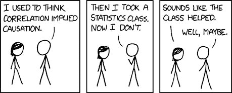

# 在本实践课程中学习数据科学的基础知识

> 原文：<https://www.freecodecamp.org/news/hands-on-data-science-course/>

美国薪酬最高的职位之一是“数据科学家”。如果你了解数据科学，它会带来很多就业机会。

我们在 freeCodeCamp.org YouTube 频道上发布了一门实践课程，将向您传授数据科学的基础知识。本课程将向您介绍数据科学中最常用算法背后的理论和代码。

本课程由 Marco Peixeiro 开发。Marco 是一名经验丰富的数据科学家和教师。

在本课程中，您将学习什么是数据科学，以及如何为数据科学设置您的计算机。您还将学习数据科学中常用算法的理论和实际实现。

When working with data, remember that correlation does not imply causation. [source: [XKCD](https://xkcd.com/552/)]

对于本课程，我们建议您已经掌握一些基本的 Python 和统计学知识，您也可以在 freeCodeCamp 上学习这些知识:

*   [4 小时免费 Python 基础课程](https://www.freecodecamp.org/news/learn-python-basics-in-depth-video-course/)
*   [免费 8 小时大学级统计课程](https://www.freecodecamp.org/news/free-statistics-course/)

以下是本数据科学课程涵盖的主题:

*   数据科学导论
*   设置您的电脑
*   线性回归
*   分类
*   重采样和正则化
*   决策树
*   SVM
*   无监督学习

在 freeCodeCamp.org YouTube 频道观看完整的课程(2 小时观看)。