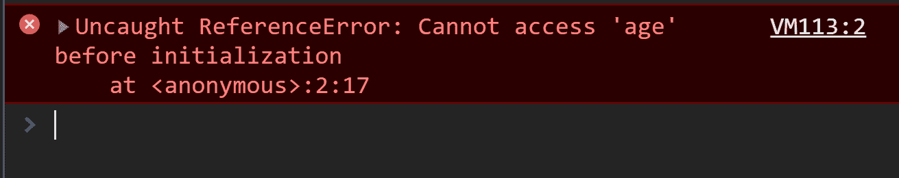

# JavaScript 中的时间死区(TDZ)是什么？

> 原文：<https://www.freecodecamp.org/news/what-is-the-temporal-dead-zone/>

我知道时间死区听起来像科幻小说里的短语。但是理解你日常使用的(或者想要了解的)术语和概念是有帮助的。

系好安全带，因为事情变得复杂了。

你知道在 JavaScript 中我们可以添加`{ }`来增加我们想要的范围级别吗？

所以我们总是可以做以下事情:

```
{ { { { { { var madness = true } } } } } }
```

Hopefully, you don't see this in production code!

我已经包括了这个细节，以确保接下来的例子有意义(因为我不想假设每个人都知道它)。

在 ES6 之前除了`var`之外没有其他方法声明变量。但是 ES6 给我们带来了`let`和`const`。

`let`和`const`声明都是块范围的，这意味着它们只能在它们周围的`{`和`}`中被访问。`var`则相反，没有这种限制。

这里有一个例子:

```
let babyAge = 1;
let isBirthday = true;

if (isBirthday) {
	let babyAge = 2; 
}

console.log(babyAge); // Hmmmm. This prints 1
```

Two unique variables, with different values.

发生上述情况是因为`babyAge`到 2 的重新声明只在`if`块内可用。除此之外，第一个`babyAge`被使用。你能看出它们是两个不同的变量吗？

相比之下，`var`声明没有块范围:

```
var babyAge = 1;
var isBirthday = true;

if (isBirthday) {
	var babyAge = 2; 
}

console.log(babyAge); // Ah! This prints 2
```

One variable with it's value re-declared. 

`let` / `const`和`var`的最后一个显著区别是，如果在声明`var`之前访问它，它是未定义的。但是如果你对`let`和`const`做同样的事情，他们会抛出一个`ReferenceError`。

```
console.log(varNumber); // undefined
console.log(letNumber); // Doesn't log, as it throws a ReferenceError letNumber is not defined

var varNumber = 1;
let letNumber = 1;
```

他们抛出错误都是因为时间死区。

## 解释了时间死区

这就是 TDZ:描述变量不可及的状态的术语。它们在范围内，但是没有声明。

`let`和`const` 变量从它们的封闭范围开始一直存在于 TDZ 中，直到它们被声明。

你也可以说，变量从它们被绑定的地方(当变量被绑定到它所在的作用域时)一直存在于 TDZ 中，直到它被声明(当在内存中为该变量保留一个名称时)。

```
{
 	// This is the temporal dead zone for the age variable!
	// This is the temporal dead zone for the age variable!
	// This is the temporal dead zone for the age variable!
 	// This is the temporal dead zone for the age variable!
	let age = 25; // Whew, we got there! No more TDZ
	console.log(age);
}
```

The temporal dead zone captured and catalogued.

你可以在上面看到，如果我在 age 变量声明之前访问它，它会抛出一个`ReferenceError`。因为 TDZ。

但是`var`不会那样做。与其他声明不同，`var`只是默认初始化为`undefined`。

## 声明和初始化有什么区别？

这是一个声明变量和初始化变量的例子。

```
function scopeExample() {

    let age; // 1
    age = 20; // 2
    let hands = 2; // 3
}
```

Declaring vs Initialising a variable.

声明一个变量意味着我们在内存中的当前范围内保留这个名字。在注释中标记为 1。

初始化变量就是设置变量的值。在评论中被标为 2。

或者你可以在一行中同时做这两件事。在评论中被标为 3。

我再重复一遍:`let`和`const` 变量从它们的封闭范围开始就存在于 TDZ 中，直到它们被声明。

那么从上面的代码片段来看，`age`的 TDZ 在哪里呢？还有，`hands`有 TDZ 吗？如果是的话，手的 TDZ 的起点和终点在哪里？

<details><summary>Check your answer</summary> The hands and age variables both enter the TDZ.

The TDZ for hands ends when it gets declared, the same line it gets set to 2\.

The TZ for age ends when it gets declared, and the name reserved in memory (in step 2, where I commented).</details>

## 为什么 TDZ 会被创造出来？

让我们回到第一个例子:

```
{
    // This is the temporal dead zone for the age variable!
    // This is the temporal dead zone for the age variable!
    // This is the temporal dead zone for the age variable!
    // This is the temporal dead zone for the age variable!
    let age = 25; // Whew, we got there! No more TDZ
    console.log(age);
}
```

如果我们在 TDZ 中添加一个`console.log`,您会看到这个错误:



为什么 TDZ 存在于作用域顶部和变量声明之间？具体原因是什么？

**是因为吊装。**

解析和执行代码的 JS 引擎有 2 个步骤要做:

1.  将代码解析成抽象语法树/可执行字节代码，以及
2.  运行时执行。

步骤 1 是提升发生的地方，这是由 JS 引擎完成的。本质上，它会将所有变量声明移动到它们作用域的顶部。举个例子:

```
console.log(hoistedVariable); // undefined
var hoistedVariable = 1;
```

明确地说，这些变量在代码中并不是物理移动的。但是，结果在功能上与下面的相同:

```
var hoistedVariable;

console.log(hoistedVariable); // undefined
counter = 1;
```

`const`和`let`的唯一区别是当它们被提升时，它们的值不会默认为`undefined`。

只是为了证明`let`和`const`也是葫芦，这里举个例子:

```
{
    // Both the below variables will be hoisted to the top of their scope!
	console.log(typeof nonsenseThatDoesntExist); // Prints undefined
	console.log(typeof name); // Throws an error, cannot access 'name' before initialization

	let name = "Kealan";
}
```

上面的代码片段证明了`let`明显高于其声明的位置，因为引擎提醒了我们这个事实。它知道`name`的存在(它被声明了)，但是在它被初始化之前我们不能访问它。

如果这有助于你回忆，就这样想。

当变量被提升时，`var`在提升过程中得到默认初始化为其值的`undefined`。`let`和`const`也被吊起，但是当它们被吊起的时候不要被放到`undefined`上。

这是我们拥有 TDZ 的唯一原因。这就是为什么它发生在`let`和`const`而不是`var`身上。

## 更多 TDZ 的例子

也可以为默认函数参数创建 TDZ。大概是这样的:

```
function createTDZ(a=b, b) {
}

createTDZ(undefined, 1); 
```

抛出一个`ReferenceError`，因为变量`a`的求值试图在被 JS 引擎解析之前访问变量`b`。在被解析之前，函数参数都在 TDZ 内部。

由于 TDZ，即使像`let tdzTest = tdzTest;`这样简单的事情也会抛出错误。但是这里的`var`只会创建`tdzTest`并将其设置为`undefined`。

还有最后一个也是[相当高级的例子](https://github.com/google/traceur-compiler/issues/1382#issuecomment-57182072)来自 Erik Arvindson(他参与了 ECMAScript 规范的发展和维护):

```
let a = f(); // 1
const b = 2;
function f() { return b; } // 2, b is in the TDZ 
```

One final TDZ example.

可以关注评论的数字。

在第一行中，我们调用`f`函数，然后尝试访问`b`变量(它抛出一个`ReferenceError`，因为`b`在 TDZ 中)。

## 为什么我们会有 TDZ？

Alex Rauschmayer 博士有一篇关于*为什么*TDZ 存在的精彩[帖子，主要原因是:](https://2ality.com/2015/10/why-tdz.html)

它帮助我们捕捉错误。

在声明变量之前尝试访问它是错误的，也不应该是可能的。

它也为`const`给出了更多预期的和理性的语义(因为`const`是被提升的，如果一个程序员试图在运行时声明之前使用它会发生什么？当它被吊起的时候，它应该保持什么样的变量？)，并且是 ECMAScript 规范小组决定的最佳方法。

## 如何避免 TDZ 引起的问题

相对简单地说，一定要确保在你的作用域的顶部定义你的`let`和`const`。