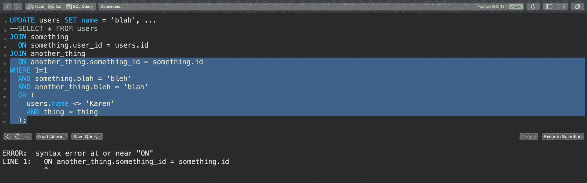
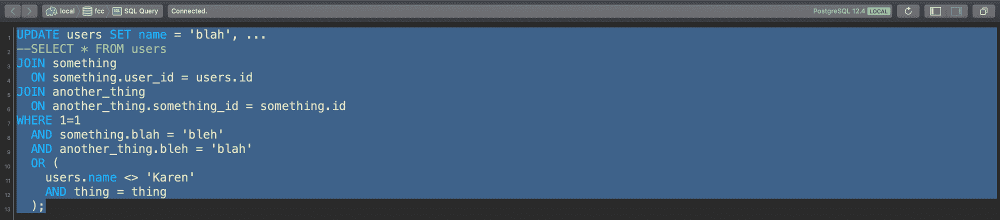
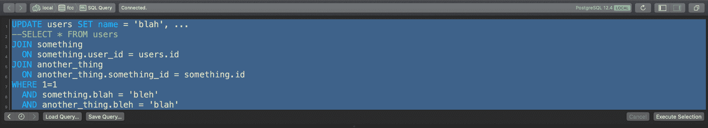
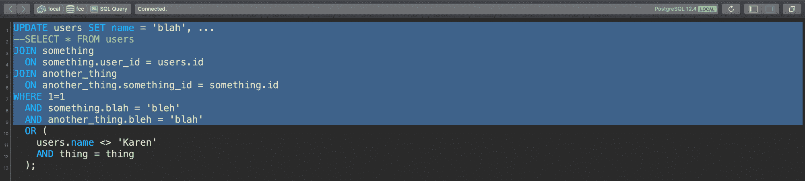

# 如何不中断生产——我的两大编码错误以及如何避免它们

> 原文：<https://www.freecodecamp.org/news/production-mistakes-and-how-to-fix-them/>

在这篇文章中，我将与你分享我最大的两个制作错误。

幸运的是，他们只有两个人。

这并不是说我在制作中没有犯过太多的错误——我犯过——但是这两个错误特别要求我和团队的其他成员集思广益，努力挽回损失。

当你的错误需要一个五人团队在一天的剩余时间里来修复时，它往往会留在记忆库里。

我并不为这些错误感到羞耻——当时确实有点尴尬——但这是诚实的错误，错误是会发生的。

我与你分享这些故事，这样你就能知道当你在生产中不可避免地打破某些东西时该怎么做。如果你在开发领域呆得够久，你会的。

但是，没有人会失去理智。*【剧透】*我既没有被解雇，也没有受到真正的斥责。人们会犯错误，你的团队和公司里的其他人都明白这一点。

## 测试、希望和祈祷

随着时间的推移，开发界已经采用了一些实践来帮助减少错误的可能性和严重性。

我们编写自动化测试。我们在试运行环境中测试变更。我们做代码审查。我们系统化或脚本化我们的部署过程。

所有这些做法每天都会捕捉或消灭不计其数的臭虫。

但是，不管所有这些实践和过程，错误仍然会发生。最终我们还是人类，人类会犯错误。

我们错过了边缘案例。我们忘记检查 IE9 中的布局。我们删除了错误的记录。通过向部署脚本传递错误的参数，我们关闭了一半的互联网。

我与你分享的错误介于两者之间，第一个错误始于我的第一份开发工作。

## 第一份工作——第一个错误。

我在我的第一份开发工作中犯了第一个错误。

我做这份工作可能只有一年左右，我所在的团队构建了内部应用程序来帮助推动公司正在做的其他工作。

我们构建了客户支持和管理工具，但我们也设置和管理了数据库和基于这些数据库之上的 web 服务，这些数据库为公司的产品提供了动力。

简而言之，我们负责许多非常重要且(过于)复杂的 SQL 查询和数据库。

这是我的第一份开发工作，我拼命以最快的速度学习 SQL。

我们有一个 QA 环境(*“quality assurance”*)，也就是一个测试环境，其中有每个数据库的副本供测试，像我这样的新开发人员没有获得生产数据库的写权限(理应如此)。

为了在生产中进行更改，我首先必须针对本地数据库编写并测试查询。

在我认为它在本地是好的之后，我必须请求一个更有经验的团队成员进行“代码”审查，他将审查查询，如果它是可靠的，就在 QA 环境中运行任何结构化迁移。之后，我可以在 QA 中再次测试。

一旦我确信我的查询在 QA 中有效，我就必须请求另一次代码审查，并要求在生产中执行该查询。

一切都很好，对吗？大量的实践空间和大量的检查点，以确保投入生产的东西是可靠的。

### 穿上我的大男孩裤

在成功地重复这个过程一段时间后，我开始获得对其中两个数据库的生产写访问权限，这些数据库是我熟悉的，并且与我的工作直接相关。

我已经证明了我是谨慎的，我可以信任生产访问(你已经知道这是怎么回事)。

如果您不熟悉 SQL，可以运行几种不同类型的查询。

有时您只想检索信息，有时您想插入、更新或删除信息。

您编写的大多数查询都是`SELECT`——检索信息的查询。你只是偶尔做一个`INSERT`、`UPDATE`或`DELETE`。

所以，大多数时候你的查询是无害的。A `SELECT`不会改变任何数据，也没有出错的风险。

但是，有时候你确实需要改变这些数据——这时候你必须非常非常小心。

### 出了差错

我甚至不记得我在做什么任务，也不记得我为什么要做这件事。

我现在唯一记得的就是那份该死的声明。

我正在更新一些涉及客户信息的东西——更新他们的姓名、电子邮件或地址。

我写了一份我认为正确的声明，并作为一个`SELECT`来测试它:

```
--UPDATE users SET name = 'blah', ...
SELECT * FROM users
WHERE ... 
```

注意在`SELECT`上面被注释掉的`UPDATE`语句。这是我在这份工作中学到的一种方便的格式，有助于减少运行查询时的错误。

首先你用你想要设置的值写一个**注释掉的** `UPDATE`语句。接下来，在语句下面编写一个`SELECT` *，并使用`SELECT`来测试和最终确定查询结果。*

通过注释掉第一条语句，您消除了在准备好之前意外运行`UPDATE`的可能性。运行该语句的唯一方法是取消注释(这需要一个操作)，或者突出显示注释后面的文本以及查询的其余部分，然后运行它(这也是一个有意的操作)。

这个小技巧防止了许多错误。但是回到我的查询写作。

当我准备好时，我所要做的就是取消注释`UPDATE`行，注释掉`SELECT`行，然后点击 run。

现在，与我当时编写的查询相比，我上面展示的示例语句已经大大简化了。

我当时写的声明是一份相当复杂的声明。它有许多连接、子查询，并且它正在检查一些订单或产品或其他东西——不仅仅是简单的`WHERE id = blah`之类的事情。

它可能看起来更像这样:

```
--UPDATE users SET name = 'blah', ...
SELECT * FROM users
JOIN something
  ON something.user_id = users.id
JOIN another_thing
  ON another_thing.something_id = something.id
WHERE 1=1
  AND something.blah = 'bleh'
  AND another_thing.bleh = 'blah'
  OR (
    users.name <> 'Karen'
    AND thing = thing
  ); 
```

(这不是一个*“鱼有这么大”*的故事我发誓。)

我检查了我得到的用户是我所期望的用户。我已经在本地验证了它，在 QA 中测试了它，并且我已经得到了一个团队成员的批准，可以在生产中运行它(看，这不是我的错(我在开玩笑))。

这就是问题所在。在我告诉你这是什么之前，我会给你一点专业建议，防止它发生在你身上。

当运行一个将对数据库进行写操作的查询时:**将光标从查询的底部拖到查询的顶部。**

你说为什么把它从底部拖到顶部？好问题。

### 从底部到顶部

假设我从该查询的底部开始，将光标向上拖动一半并运行该查询:



Dragging bottom to top but incomplete

会发生什么？

嗯，没什么。

我没有选择有效的查询。查询解析器将抛出一个错误，并说*傻约翰，这不是一个有效的查询，你这只笨鹅。*

哦，谢谢查询解析器！没什么大不了的。我再试一次:



Dragging bottom to top complete

现在我已经选择了完整的查询，它运行了。耶！

没事吧。

现在，如果您正在处理这个查询，并且由于窗口的大小或查询工具的滚动位置，您从查询的顶部开始并拖动到底部，会怎么样呢...



Dragging top to bottom with what you think is the full query

这个查询运行了——但是糟糕！查询的其余部分在我的可视区域之外，我只包含了我的`WHERE`子句的一半！



Dragging top to bottom but missing part of the query!

就这样，事情发生了。`UPDATE`出了差错。

这正是我所做的。

我运行了查询的一部分，它缺少一些过滤条件来适当地限制我所操作的结果集，**,最后我将整个`users`表更新为一个人的信息。**

我们系统中的每个用户现在都是“主街大道 1234 号的约翰·史密斯”。

我犯了一个错误，当我意识到这个问题时已经太晚了。

那我做了什么？

## 秘密秘密一点也不好玩。秘密的秘密伤害了某人。”——《办公室》第三季第十五集

这里是第一个要点(除了那个甜蜜的*从下到上*的查询提示):**如果你犯了一个错误——告诉别人。立刻。**

试图隐藏或忽略你所犯的错误是非常诱人的——尤其是如果它很严重的话。我去过那里。我感受到了那些冲动。

你意识到你的错误，恐惧开始出现。哦，不，我做了什么。

发生这种情况时，有几件事需要记住:

*   每个有一定经验的开发人员都会犯生产错误
*   这些错误中有许多是时间敏感的
*   我不知道有谁因为一个诚实的错误而被解雇

每个开发人员都犯过生产错误。我犯过错误，我还会再犯(但希望不是同样的错误)。任何会因此批评你的人要么是没有经验，要么是个混蛋。不管怎样，你都不应该在乎。

许多这样的错误也是“时间敏感的”这意味着您越早解决问题或恢复变更，造成的损害就越小。等待承认问题会导致更困难的修复过程。

在我犯过的所有错误和我见过的其他人犯过的所有错误中，我不知道有任何一个人因为一个诚实的错误而被解雇甚至受到严厉的责备。

我认为这是因为编程很难，任何成功进入领导层的人都做过类似或更糟糕的事情。

所以你应该这么做:

*   承认吧
*   赶紧承认吧
*   *努力帮助修复它*

*承认错误。不要推卸责任或找借口——只需解释哪里出了问题，你看到了什么或做了什么。*

*一旦发现问题，立即通知你的老板或团队领导。你发出的警报的严重程度可能与错误的大小成正比。*

> *“哎呀，我搞砸了该字段的验证，我继续做了另一个 PR 来修复它。”*

*如果是小事，也许你可以做一个新的公关来解决它，并告诉别人来审查它。小问题，小解决——没什么大不了的。*

*如果，*每一次*，您用整个表中的一个值更新一个生产表——您很快就会发出警报。*

### *更新整个表*

*当*哦不*开始时，我抓住我的团队领导，告诉他发生了什么。*

*谢天谢地，他对此很冷静，我们开始着手试图挽回。*

*糟糕的数据库更新的不幸之处在于，没有一种简单的方法来恢复这种更改。您不能只是恢复一些提交并重新部署—数据库是有原因的*持久*存储。*

*当数据出现问题时，您有几个选择:*

1.  *编写一个新的查询来撤消数据(如果可能的话)*
2.  *加载数据库备份，找到正确的数据，取出数据，运行新的更新*
3.  *前往墨西哥*

*尽管第三条听起来很诱人，我们还是选择了第二条。*

*这发生在近十年前，所以当时的 devops 有些不同。*

*该公司管理他们自己的服务器和数据库，并有“磁带备份”他们也只保留每日备份，所以我们最多只能获得前一天的数据。*

*不用说，这将是痛苦的。*

*长话短说，我们尝试看看是否有办法重新创建原始数据并重新更新它。几个小时后，我们将数据恢复到了原始状态，但这并不是故事的重要部分。*

*重要的是承认错误。尝试修复它。学习，不要让它再次发生。*

*如果你犯了一个错误，你的队友将会非常感激你积极地尝试并改正它。即使只是结对，看着他们解决问题，也要参与进来。*

*最后，从错误中吸取教训，不要再犯同样的错误。*

*(将底部拖到顶部。)*

## *错误 2: 7 年后...*

*在那段时间之后，我享受了大约七年的无失误期——至少对于重大失误来说是这样。*

*七年后的今天，我戴着*高级软件工程师*(*wooooo*)的闪亮帽子，而不是初级开发人员的头衔。*

*就像平常的一天一样。编写代码，推进代码，审查代码，部署代码——只是对代码进行全面的综合粉碎。*

*我在空闲时间收到一个关于一群失败的后台工作人员的 ping。我的同事说这看起来和我最近合并的上一个公关有关。*

> *"好的，谢谢，我会去看看的"，我回答道。*

*是的，肯定有很多工作失败了，而且越积越多。*

*我没有太惊慌。后台作业通常以*“幂等”*的方式编写——它们通常在失败时重新运行是安全的。大多数后台排队系统也有一种内置的方法，可以在作业失败后自动重试。*

*然而，没过多久，事情就变得更糟了。*

*警钟开始响起——或者更现实地说——待命室里松懈的通知开始响起。*

*超时一次又一次。数据库使用率达到 100%。整个系统陷入了僵局。所有公司的产品都停止了生产。*

**哦不**

*我不知道为什么会这样，但我知道这很糟糕。*

*所以我做了我知道要做的唯一一件事:注销并前往莫西——我的意思是立即告诉某人。*

*我们进入了 Zoom 呼叫(在 Zoom 为全世界所熟知之前*感谢 2020* )。*

*当我们调查此事时，我们注意到一个特定的查询需要很长时间才能完成。*

*这个查询的每个实例都需要几分钟的时间来运行，而且每分钟都有越来越多的实例被启动。*

*我们开始查看问题似乎来自的代码库区域中最近的提交，我们发现了一些可疑之处:**我的最后一个拉请求。***

*在这个拉取请求中，我更新了一个后台作业并更改了它的行为。*

*这个项目是一个 [Ruby on Rails](https://rubyonrails.org/) 的代码库，我所做的更改是这样的——但是如果你以前从未见过 Rails，不要担心，我会解释每一行:*

```
*`def run(some_status)
  items = Item.where(status: some_status).all

  items.each do |item|
    # do some database querying and updating
  end
end`* 
```

*这个后台作业调用一个函数`run`，一个状态值作为一个参数传入(`some_status`)。*

*该函数的第一行从数据库中查询一些记录。*

*这一行使用来自 Rails 框架的 *ActiveRecord* 部分的方法，但它实际上只是一些围绕基本 SQL 查询的漂亮包装器。*

```
*`items = Item.where(status: some_status).all`* 
```

*这一行实际上只是一个简单的 SQL 语句:*

```
*`SELECT *
FROM items
WHERE status = ?`* 
```

*当查询运行时，`some_status`的值被绑定到查询中的占位符(`?`)，然后被执行。*

*在数据库返回查询结果后，Rails 获取这些记录并从中创建漂亮整洁的 Ruby 对象。*

*所以总的来说，我们查询`items`表，其中`status`是某个值。*

*(同样，这可能不完全是我正在做的，但它足够接近于说明这个场景。)*

*接下来的几行是对我们检索的项目的简单循环，对于每个项目，我们做一些更多的数据库查询，然后更新关于该项目的一些信息。*

```
*`items.each do |item|
  # do some database querying
  # then update the item
end`* 
```

*很简单，对吧？去拿东西。循环播放这些内容。更新资料。*

*然而，这里有一件事我没有意识到——而且是一件大事。*

## *小 ol`NULL`—或`nil`*

*`status`字段没有`NOT NULL`约束。这意味着`status`字段可以是`NULL`—或者在 Ruby land 中是:`nil`(或者在其他语言中是`null`)。*

*人们很容易习惯于基于 id 之类的东西进行查询，因为您知道 id 总是存在的。类似的一行...*

```
*`items = Item.where(id: list_of_ids).all`* 
```

*...不会产生同样的问题。通过 ID 查找记录的查询(ID 列表为空)不会返回任何结果，因此不会执行任何操作。*

*但在这种情况下，问题就来了。这部分代码:*

```
*`items = Item.where(status: some_status).all`* 
```

*按照特定的状态查找所有的`Item`记录——通过`some_status`参数传递的状态。*

*但是，该列值可以是`NULL`(或`nil`)。*

*因此，如果`some_status`参数*碰巧在*中作为`nil`被传递，它将试图查找`status = nil`所在的所有`Item`记录。*

*好吧，但这听起来不坏，对不对？*

*好吧，糟糕的下一层是这个`items`表包含了**4000 万行——其中大部分没有状态。***

*这个小函数最初试图加载一些记录，遍历它们，并做一些工作，现在*遍历整个表。**

*因此，当每一个以稳定的时间间隔(如果我没记错的话，大约每隔 15 分钟)启动的数百或数千个作业启动时，它们中的每一个都开始对表中的几乎每条记录执行非常昂贵的查询。*

*仅仅这一点可能就足以摧毁整个系统，但实际上情况变得更糟了。*

*你看，我并不期望传入一个`nil`值。这个`nil`值还破坏了任务应该执行的一些代码，因此这些任务开始依次失败。*

*通常这没什么大不了的，但是在大多数系统中，当后台作业失败时，它会在短时间内重新排队。*

*因此，不仅所有这些非常昂贵的工作都失败了，而且它们都失败了，并在短时间内再次开始——它们只是不断堆积。*

*失败的任务最终会遇到一批新的任务，这些新的任务在它们自己的时间间隔内开始，系统就此陷入停顿。*

*最后一根稻草是，这个后台工作应该做的工作是**更新所有这些记录。***

*这意味着我要遍历这个表**中的每一条记录，并再次用坏数据更新整个表。***

*幸运的是，我有一个可取之处。*

*此查询的结果未排序。这意味着默认情况下，首先返回表中最早的(或第一个)记录。*

*这可能看起来不相关，但第一个和最早的记录实际上是遗留数据，因此更新这些记录远不如客户每天交互的记录糟糕。*

*此外，作业在执行和重新启动的早期不断崩溃，这导致作业只能一遍又一遍地更新表中相同的小而旧的部分。*

*这意味着这些作业永远不会到达表中更新、更相关的行。*

*基本上，在关闭并再次尝试之前，该作业只更新了表中很小的、无关紧要的一部分(如果我没记错的话，大约 4000 万行中只有几千行)。*

*这就好像我在走向人行横道时被绊倒了——这让我没有被将要冲过停车标志的车撞上。*

### *简单的解决办法*

*当我们在 Zoom call 上查看我的 PR 时，有人最终发现了错误，并指出了令人不快的行(通过他们的`status`查找记录的查询)。*

*甚至在他们把问题大声说出来之后，我还是没有看出来。在他们试图再次解释之后(也许下次再解释)，终于明白了。*

*这是一行欺骗性的代码，就像这样:*

```
*`items = Item.where(status: some_status).all`* 
```

*按状态查找项目——看起来不错。如果你不小心的话，你会像我一样，错过关键`nil`案例的查找。*

*幸运的是，解决这个问题非常简单。如果状态为`nil`，保护功能并像这样快速返回:*

```
*`def run(some_status)
  return if some_status.nil?

  items = Item.where(status: some_status).all

  ...
end`* 
```

*如果您不熟悉 Ruby 和 Rails，这个一行程序只是一种语法糖:*

```
*`def run(some_status)
  if some_status == nil
    return
  end

  items = Item.where(status: some_status).all

  ...
end`* 
```

*基本上，如果`some_status`是`nil`,只要从函数中早点返回，*就可以离开那里了。**

*这是我们最终部署的修复，在一些服务器重新启动并停止后台作业和长时间运行的查询的装载队列后，事情最终恢复正常。*

*由于是 2019 年，我们有了更好的备份解决方案。我们加载了一个最近的备份，并(小心地)创建了一个 update 语句，将数据恢复到以前的状态。*

**update gate 2019*终于结束了。*

## *我们能从中学到什么*

*从这些故事中有一些重要的教训。*

*首先是**更新语句很吓人。***

*我的两个错误都是更新语句。当更新(或删除)记录时*要格外小心*以确保你要更新的记录是正确的。*

*如果您正在执行一个原始的 SQL 查询，一定要拖动*“从下到上”*，以确保您运行整个语句。如果您通过代码进行更新，请格外小心查询的参数和动态部分。根据您的语言选择`nil`、`NULL`或`null`。*

*第二条重要的经验是**如果出了问题——立即告诉某人*。****

**隐藏或忽视问题只会让事情变得更糟。你越早向你的团队提出一个问题，你就能越早阻止损害继续发生，从长远来看，这将为你省下一大笔痛苦。**

**第三:我不知道有谁因为犯错而被解雇。**

**在这两种情况下，我的团队意识到这是一个诚实的错误。**

**后来，我们做了一点回顾，以确定它是如何发生的，以及我们可以做些什么来避免将来犯同样的错误。**

**错误往往来自同一个根本原因:急于完成工作。**

**迫在眉睫的截止日期、疲惫的头脑以及没有足够仔细地审查 PRs 会导致许多错误从缝隙中溜走。**

## **向前**

**我很高兴知道在我犯下另一个可怕的错误(开玩笑)之前，我还有六年的美好时光。**

**我知道我会再次犯错——错误是难免的。**

**但是，这些错误并没有毁掉我的职业生涯，也没有让我感到羞愧。这只是一个错误。我试着从中吸取教训，我希望通过阅读这篇文章，你也能从我的错误中吸取教训，而不必亲身经历。**

**如果你喜欢这篇文章，[你可以在 Twitter](https://twitter.com/johnmosesman) 上关注我，我会在那里谈论一些事情——职业发展和如何成为一名成功的开发人员。我也在我的网站上写同样的主题[。](https://johnmosesman.com/)**

**感谢阅读！**

**约翰**