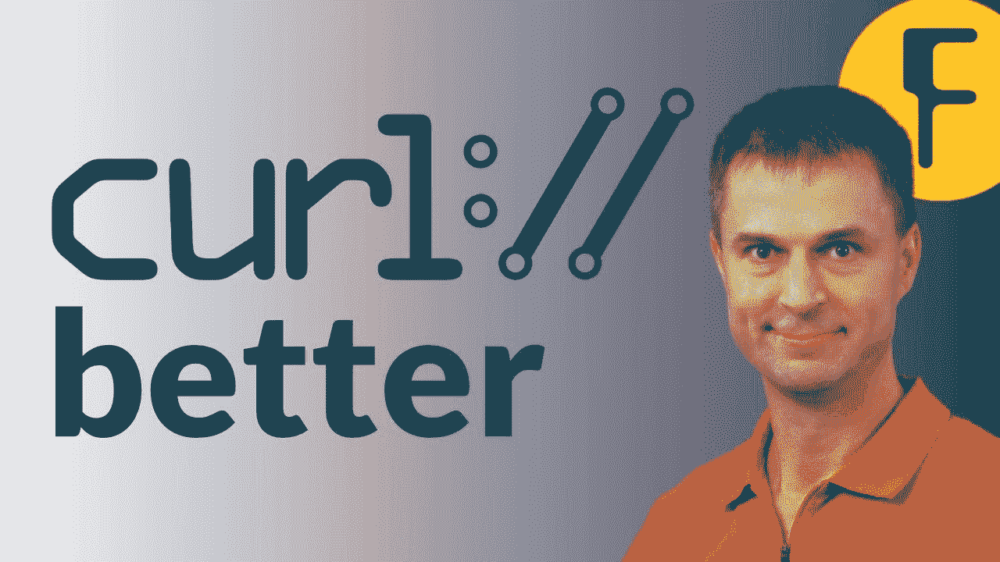
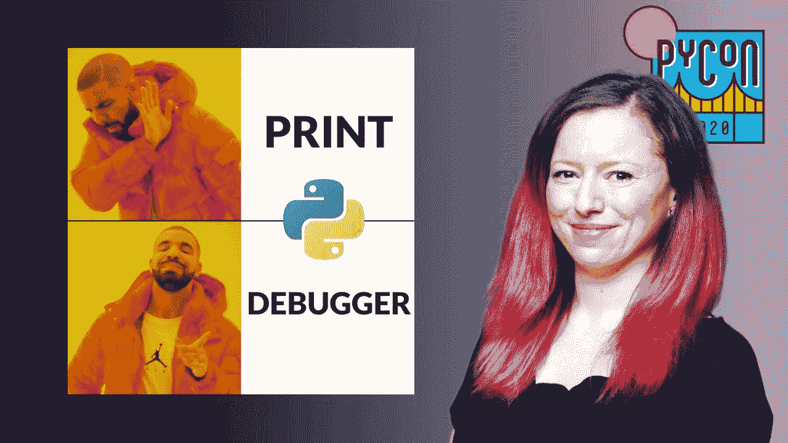
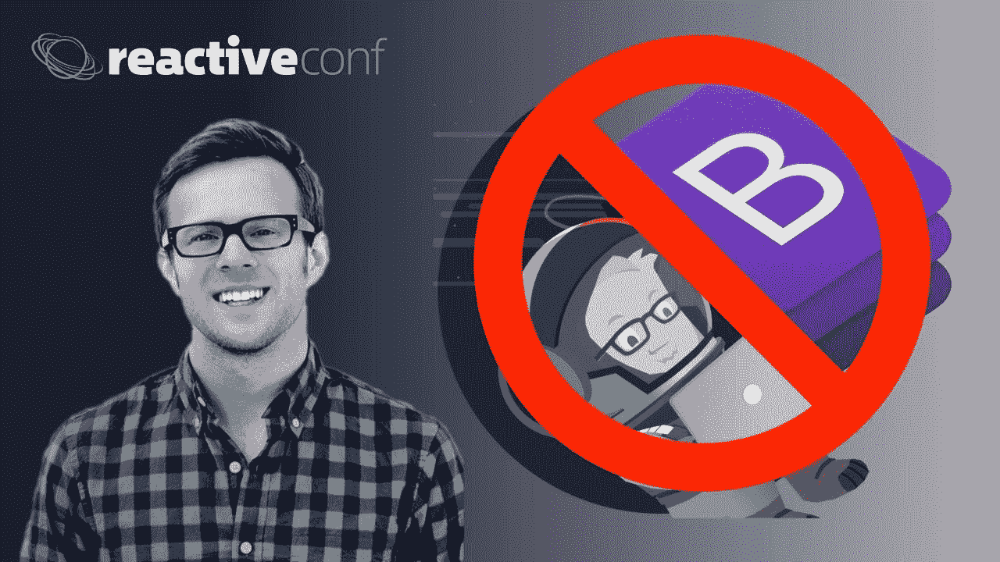

# 如何随时免费观看会议技术讲座(并拓展您的开发技能)

> 原文：<https://www.freecodecamp.org/news/watch-tech-talks-whenever-you-want-from-conferences-around-the-world/>

你早上吃早餐的时候做什么？

我个人喜欢在专家向我解释一个新的计算机科学概念时，进行一次技术演讲，然后坐下来。

全世界每年都有数百场与编码相关的会议。而且你经常可以从技术讲座中听到关于重要项目的见解——直接来自他们的创始人和维护者。

An image from a freeCodeCamp tech talk video by Daniel Stenberg, Swedish developer and creator of the popular curl Linux library

## 自由代码营谈论 YouTube 频道

寻找完整长度技术演讲的最好地方是 freeCodeCamp Talks 频道。我们从周一到周五发布开发者的新谈话。

我们的非营利组织与 PyCon 和世界各地的数十个其他技术会议合作，免费为您带来精彩的技术讲座-只需通过您的手机或笔记本电脑即可。

你可以把这些谈话融入到你的日常生活中。或者你可以把它们一起放进你自己的迷你技术会议，在一个周末尽情观看。

An image from Nina Zakharenko's PyCon talk about pdb and other Python debugging tools and techniques

## 这些技术讲座是什么样的？他们关注什么话题？

其中大部分时长约 30 分钟。以下是我们发表的一些主题:

*   函数式编程
*   渗透测试
*   前端开发
*   Python 库
*   Web 组件
*   机器人学
*   还有更多。

An image from Scott Tolinksy's talk about how to build your own CSS Design System instead of just using popular CSS tools like Bootstrap and Foundation

## 听起来不错。哪里可以订阅 freeCodeCamp Talks？

你可以[免费订阅这个频道](https://www.youtube.com/channel/UCVk8weS4S2kJfja72fTxh5A?sub_confirmation=1)。

另外，一定要点击小“铃”来打开通知。当我们发布新视频时，YouTube 会通知您。

同样，我们计划每周一至周五继续发布新的谈话。我们已经有 35 场直播讲座，我们希望最终能有数千场讲座。

想象一下，亚历山大的虚拟图书馆充满了开发人员的智慧和善良。这就是我们的目标。

如果你自己在一次活动中做了一次技术演讲，并希望我们将其发布并向全球免费代码营社区宣传，请务必发送电子邮件给负责演讲频道的 Beau Carnes。他也许能报道这件事。

## 原来的 freeCodeCamp YouTube 频道呢？

还在继续坚挺！

我们每周都会在那里发布几个视频，包括许多完整长度的编程课程。你可以在这里免费订阅。(还是那句话，一定要打铃，这样当我们发布新课程时，YouTube 会通知你。)

快乐编码。