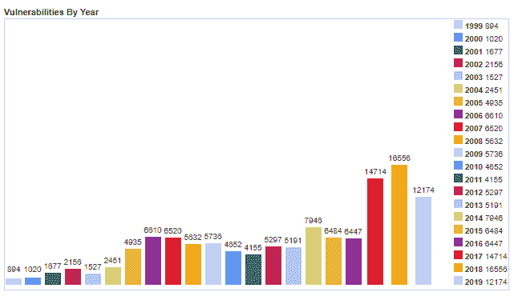

# 如何在你的代码中捕捉黑客

> 原文：<https://www.freecodecamp.org/news/how-to-catch-hackers-in-your-code/>

如果黑客在生产中滥用你的软件，你会怎么做？

这不是一个假设的问题。他们可能正在做这件事。

您可能正在考虑您所做的所有安全设计选择，或者您所应用的预防性技术，因此没有什么可担心的。

如果是这样，那太好了——即使总有被忽略的东西，你也应该总是考虑你的系统的安全性。

但是防止安全漏洞和宽恕恶意企图之间有着巨大的差异。

我们抓住那些试图侵入我们软件的黑客并采取行动怎么样？在这篇文章中，我将尝试给你一些实用而简单的例子，在你的代码中尽早发现典型的黑客行为。

## 为什么要抓恶意企图？

预防安全漏洞还不够吗？我能听到你说，“只要我写安全的代码，我不在乎黑客是否玩弄我坚如磐石的软件。所以，我为什么要关心恶意企图？”

我们先来回答这个有效的问题。

一个有点复杂的软件很难一直保持安全。更高的复杂性意味着在您设计、实现、部署或维护代码时，黑客会滥用更多的潜在弱点。

看看这些年来 CVE 的数据就知道了。这是很多:



The number of security bugs published over the years by *cvedetails.com*

此外，由于其性质，安全缺陷不仅仅是您的待办事项中的一个常规项目。如果漏洞被利用，会有一些令人讨厌的后果:失去信任，坏名声，甚至经济损失。

因此，安全最佳实践，如 [OWASP 应用程序安全验证标准(ASVS)](https://owasp.org/www-project-application-security-verification-standard/) 或 [Mozilla 的安全编码指南](https://wiki.mozilla.org/WebAppSec/Secure_Coding_Guidelines)的存在是为了帮助开发人员生产安全的软件。

然而，由于绕过现有安全控制的新方法或新的弱点几乎每天都会出现，安全界有一种共识，即“没有 100%的安全性。”因此，我们必须始终对安全消息和改进保持警惕和响应。

为了确保软件安全，我们还可以做另外一件事:尽早注意到黑客，在他们做出我们意想不到甚至不知道的事情之前。此外，长时间跟踪他们的恶意行为让我们更加主动。

有一个关于[安全运营中心(SOC)](https://en.wikipedia.org/wiki/Security_operations_center) 的流行概念——SOC 是外包或内部组织中的一种团队。他们的工作是持续监控组织的安全状态。他们通过检测、分析和响应网络安全事件来做到这一点。

SOC 团队寻找异常活动，包括软件安全异常。注意并响应成功或失败的网络攻击的想法使组织在应对威胁时占据上风，这最终通过持续监控缩短了对攻击的响应时间。

一个 SOC 只有从不同的 it 组件来源获得丰富和高质量的输入才能强大。由于我们的软件也是库存的重要组成部分，由我们的软件向 SOC 团队发送的异常行为引起的适当安全警报是非常宝贵的。

## 如何检查异常行为

下面是我们可以在整个代码中实现的一些检查和控制，它们揭示了恶意和异常的行为。

在我们开始之前，我想强调一下，我并不是在这里介绍像 [Web 应用防火墙(WAF)](https://en.wikipedia.org/wiki/Web_application_firewall) 这样复杂的解决方案。相反，我将尝试向您展示代码中的简单条件、智能异常处理和类似的不费吹灰之力的操作可以帮助您在异常行为发生时立即注意到它们。

让我们开始吃吧。

### 零长度或 Null 返回

我们可以采取的检测恶意操作的第一个操作是检查零长度聚合或空返回。

下面是一个简单的代码块来说明这一点:

```
Receipt receipt = GetReceipt(transferId);
if (receipt == null)
{
    // what does this mean?
    // log, notify, alarm
}
```

Get the receipt of a transfer by Id

在这里，我们试图通过参数`transferId`访问最终用户提供的某次转账的收据。

为了防止任何人访问其他人的收据，让我们假设在`GetReceipt`方法内部，我们的开发人员足够聪明来检查`transferId`是否真的属于当前用户。

检查所有权是一个很好的安全最佳实践。

让我们进一步假设，我们通过设计确定每个传输至少应该有一个相关的收据，所以在运行时没有收据是可疑的。为什么？因为得到一张空收据意味着提供的`transferId`不属于当前用户执行的任何转移。

换句话说，当前用户向我们的代码提供了一个伪造的`transferId`,如果这个`transferId`恰好与其他人的事务相关，就等待查看内容。

因为我们有适当的所有权控制，`GetReceipt`方法返回一个空的或 null 收据。那是我们必须采取一些安全措施的地方。

我不会在这篇文章中详细讨论安全措施。然而，安全日志和/或发送详细通知、安全信息和事件管理( [SIEM](https://en.wikipedia.org/wiki/Security_information_and_event_management) )系统是其中两个。

这是另一个例子，说明检查空值如何让我们抓住恶意企图。

考虑我们有以下三个端点，`ShowReceipt`、`Success`和`Error`:

```
// ShowReceipt endpoint
if(CurrentUser.Owns(receiptId))
{
   Session["receiptid"] = receiptId;
   redirect "Success";
}
else
{
    redirect "Error";
}
```

If owned by the current user, store the Id of a receipt in the session and redirect

```
// Success endpoint
receiptId = Session["receiptid"];
return ReadReceipt(receiptId);
```

Restore the Id of a receipt and show it

```
// Error endpoint
return "Error";
```

Show error

这是一个简单的应用程序，显示用户收据的内容。

在`ShowReceipt`中，第一行是重要的一行。它检查最终用户是否给我们发送了一个有效的`receiptId`来查看它的内容。如果没有这种控制，恶意用户可以提供任何`receiptId`并访问内容。

但是，第三行中语句的位置同样重要。如果我们把这一行移动到 If 语句之前，不会破坏任何东西。然而，它会产生我们试图通过检查最终用户是否要求有效收据来避免的同样的安全问题。

请花一点时间来确保您理解为什么会出现这种情况。

现在，我们将这条线放在正确的位置是一个好主意，这创造了另一个注意恶意尝试的机会。那么，在`Success`端点，如果我们从`Session`得到 null `receiptId`意味着什么呢？

这意味着有人正在调用这个端点，就在他们用别人的`receiptId`向`ShowReceipt`端点发出请求之后。即使他们因为所有权检查而把`Error`重定向回来！

当然，以我们在一线的控制力，这是不可能的。

因此，`Success`端点是一个写入安全日志条目的好地方，当我们从`Session`得到空值`receiptId`时，它会向我们的监控解决方案发送任何通知。

```
// Success endpoint (Revisited)
receiptId = Session["receiptid"];
if(receiptId == null)
{
    // log, notify, alarm
}
return ReadReceipt(receiptId);
```

Check if no Id is stored previously in the Session

### 目标异常处理

异常处理可能是开发人员在程序执行过程中对任何异常情况做出反应的最重要的机制。

大多数时候，它提供的主要机会是在出现意外问题时清理借用的资源，如文件/网络流或数据库连接。这是一种故障安全行为，让我们编写更可靠的程序。

同时，我们可以有效地使用运行时异常来发现针对我们软件的恶意企图。

这里有一些常见的弱点来源，我们可以利用相关的异常来注意可疑的行为:

*   反序列化
*   密码系统
*   XML 解析
*   正则表达式
*   算术运算

当然，这个列表并不完整。这里我将只介绍其中的几个 API。

让我们从正则表达式开始。下面是一个对用户输入应用严格验证方法的代码块:

```
if(!Regex.IsMatch(query.Search, @"^([a-zA-Z0-9]+ ?)+$"))
{
    return RedirectToAction("Error");
}
```

Validate a search parameter with a whitelist regular expression pattern

这里使用的正则表达式模式是一个可靠的白名单模式，这意味着它检查什么是预期的输入。而不是其他不安全的方式，即检查什么是已知的坏。

尽管如此，下面是相同代码块的一个更安全的版本:

```
if(!Regex.IsMatch(query.Search, @"^([a-zA-Z0-9]+ ?)+$", 
                  RegexOptions.Compiled, TimeSpan.FromSeconds(10)))
{
    return RedirectToAction("Error");
}
```

Wait a maximum of 10 seconds for the regular expression to complete

这是`IsMatch`方法的重载版本，其中最后一个参数是关键。

它强制规定正则表达式在运行时的执行时间不能超过 10 秒。如果是这样，这意味着有可疑的事情发生，因为所使用的模式并不复杂。

有一个实际的安全弱点可能被用来滥用这种叫做 [ReDoS](https://en.wikipedia.org/wiki/ReDoS) 的模式，尽管我在这里不会深入讨论它的细节。但简而言之，最终用户可以发送下面的字符串作为搜索参数，让我们的后端痛苦不堪，白白耗费大量 CPU 资源。

注意末尾的引号(并且不要在生产中尝试这个！):

aaaaaaaaaaaaaaaaaaaaaaaaaaaaaaaaaaaaaaaaaaaaaaaaaaaaaaaaaaaa！

问题是，执行时间实际超过 10 秒会怎么样？

的。NET 环境抛出一个异常，即`RegexMatchTimeoutException`。因此，如果我们专门捕捉到这个异常，我们现在就有机会报告这个可疑的事件或对此做些什么。

这是最后的代码块:

```
try
{
    if(!Regex.IsMatch(query.Search, @"^([a-zA-Z0-9]+ ?)+$", 
                        RegexOptions.Compiled, TimeSpan.FromSeconds(10)))
    {
        return RedirectToAction("Error");
    }
}
catch(RegexMatchTimeoutException rmte)
{
    // log, notify, alarm
}
```

If the execution lasts more than 10 seconds, RegexMatchTimeoutException is thrown

我们可以利用异常的另一个重要场合是 XML 解析。下面是一个示例代码块:

```
XmlReader xmlReader = XmlReader.Create(input);
var root = XDocument.Load(xmlReader, LoadOptions.PreserveWhitespace);
```

Read an XML file as input and parse it

输入的 XML 被送入`XmlReader.Create`，然后我们得到根元素。黑客可以通过提供一些恶意的 XML 文件来滥用这段代码，当这些文件被上述代码解析时，就会将我们的服务器的所有权交给他们。

吓人吧？这个安全漏洞被称为 [XML 外部实体](https://en.wikipedia.org/wiki/XML_external_entity_attack) (XXE)攻击，和正则表达式漏洞一样，我不会在这里详细讨论。

然而，为了防止这个超级致命的弱点，我们通过`XmlReaderSettings`忽略了文档类型定义(DTD)的使用。所以现在，已经没有 XXE 安全漏洞的可能性了。

以下是安全版本:

```
XmlReaderSettings settings = new XmlReaderSettings();
settings.DtdProcessing = DtdProcessing.Ignore;

XmlReader xmlReader = XmlReader.Create(input, settings);
var root = XDocument.Load(xmlReader, LoadOptions.PreserveWhitespace);
```

In order to prevent XXE security bug, ignore any DTD processing in the input XML

我们可以像这样留下代码，然后继续前进。然而，如果黑客仍然试图徒劳地滥用这种攻击，我们最好能够捕捉到这种行为，并产生一个无价的安全警报:

```
try
{
    XmlReaderSettings settings = new XmlReaderSettings();
    settings.DtdProcessing = DtdProcessing.Ignore;

    XmlReader xmlReader = XmlReader.Create(input, settings);
    var root = XDocument.Load(xmlReader, LoadOptions.PreserveWhitespace);
}
catch(XmlException xe)
{
    // log, notify, alarm
}
```

If the input XML content tries to refer to DTD, XmlException is thrown.

此外，为了防止误报，您可以使用`XmlException`实例提供的消息内容进一步定制catch 块。

有一个通用的编程最佳实践，它拒绝在 catch 块中使用泛型`Exception`类型。我们所展示的也是一个很好的支持案例。另一个拒绝使用空 catch 块的最佳实践也是如此，当代码中出现异常行为时，它实际上什么也不做。

显然，这里没有空的 catch 块，我们有很好的机会对恶意的尝试做出反应。

### 输入标准化

从定义上来说，规范化就是得到某个东西最简单的形式。事实上，规范化就是用于这个目的的术语。但是很难发音，所以，还是坚持正常化吧。

当然，“事物的最简单形式”有点抽象。我们所说的“最简单的形式”是什么意思？

以身作则总是好的。这里有一个字符串:

% 3cscscript % 3e

根据 [URL 编码](https://en.wikipedia.org/wiki/Percent-encoding)，这个字符串不是最简单的形式。因为如果我们对它应用 URL 解码，我们得到这个:

<剧本>

根据 URL 编码转换标准，这是原始字符串的最简单形式。

我们怎么知道的？我们知道它并不是因为它现在对我们来说是可以理解的。我们知道它是因为如果我们再次应用 URL 解码，我们将得到相同的字符串:

<剧本>

这意味着 URL 解码不再成功地转换它。我们找到了最简单的形式。标准化可能需要一个以上的步骤，因为最初可能会多次应用编码。

URL 编码只是用于规范化的转换的一个例子，换句话说，就是解码。HTML 编码、JavaScript 编码和 CSS 编码是广泛用于标准化的其他重要编码/解码方法。

多年来，攻击者找到了绕过防御系统的真正技术。他们最常用的技术之一是编码。他们在最初的恶意输入上使用疯狂的编码技术，以愚弄应用程序周围的防御。

历史上充满了这样的例子，你可以阅读其中最著名的一个例子的细节，这个例子叫做[发生在 21 世纪初的微软臭名昭著的 IIS 点点攻击](https://en.wikipedia.org/wiki/Directory_traversal_attack#Directory_traversal_on_Microsoft_Windows)。

由于黑客在发送恶意输入时很大程度上依赖于编码技术，规范化可能是捕捉这些输入的最有效、最简单的方法之一。

以下是经验法则:我们递归地对用户输入应用 URL/HTML/CSS/JavaScript 解码，直到输出不再改变。如果输出是不同于原始输入的字符串，这意味着我们可能有一个可能的恶意请求。

下面是传说中的 OWASP ESAPI Java 的简化版本，它实现了这个想法:

```
int foundCount = 0;
boolean clean = false;
while(!clean)
{
    clean = true;
    // whatever codes you want; URL/Javascript/HTML/...
    Iterator i = codecs.iterator();
    while (i.hasNext())
    {
        Codec codec = (Codec)i.next();
          String old = input;
          input = codec.decode(input);
          if (!old.equals(input))
         {
            if (clean)
           {
               foundCount++;
            }
            clean = false;
        }
    }
}
```

当代码块结束时，如果`foundCount`的值大于或等于 2，那意味着什么？这意味着有人正在向我们的应用程序发送多个编码输入，这种情况发生的几率非常小。

普通用户不会向我们的应用程序发送多个编码字符串。这很有可能是一个恶意用户。我们必须用原始输入记录这个事件，以便进一步分析。

上述机制虽然是软件本身的一部分，但其功能就像应用程序前面的过滤器。它运行在每一个不可信的输入上，给我们一个了解恶意企图的机会。

但是，您可能会怀疑这种验证方式会导致额外的延迟。如果你不想加入，我可以理解。

这是另一个在文件上传或下载过程中使用规范化来捕获恶意企图的例子。考虑以下代码:

```
if (!String.IsNullOrEmpty(fileName))
{
    fileName = new FileInfo(fileName).Name;
    string path = @"E:\uploaded_files\" + fileName;
    if (File.Exists(path))
    {
        response.ContentType = "image/jpg";
        response.BinaryWrite(File.ReadAllBytes(path));
    }
}
```

这里我们从客户端获得一个`fileName`参数，定位它指向的图像，读取并显示内容。这是一个下载示例。这也可能是一个上传场景。

尽管如此，为了防止客户端随意操纵`fileName`参数，我们利用了`FileInfo`类的`Name`属性。这将只得到`fileName`的名称部分，即使客户端发送给我们的不是我们所期望的(即带有伪造路径的文件名，如下所示):

../../WebSites/Cross/Web.config

在这里，恶意客户端想要通过使用我们的代码来读取敏感的`Web.Config`文件的内容。只获取文件名部分，我们排除了这种可能性。

这很好，但是我们仍然可以做一些事情:

```
if (!String.IsNullOrEmpty(fileName))
{
    string normalizedFileName = new FileInfo(fileName).Name;
    if (normalizedFileName != fileName)
    {
        // log, notify, alarm
        response = ResponseStatus.Unauthorized;
    }

    string path = @"E:\uploaded_files\" + fileName;
    if (File.Exists(path))
    {
        response.ContentType = "image/jpg";
        response.BinaryWrite(File.ReadAllBytes(path));
    }
}
```

Use normalization on the input *fileName* and find out any anomalies

我们将规范化版本的`fileName`与其自身(原始输入)进行比较。如果它们不同，这意味着有人试图向我们发送一个被操纵的`fileName`，我们采取适当的行动。

正常情况下，浏览器只是以最简单的形式发送上传的文件名，不做任何转换。

出于论证的目的，当用户上传文件时，我们甚至可能不使用文件名。我们可能会生成一个`GUID`并使用它来代替。

尽管如此，对所提供的文件名应用这种控制仍然很重要，因为无论如何，黑客肯定会利用该参数。

### 针对白名单的输入无效

白名单是“只接受预期的”。换句话说，如果我们遇到一些我们不期望的输入，我们会拒绝它。

这种输入验证策略是迄今为止我们拥有的最安全、最有效的策略之一。通过在整个软件中一致地使用这种策略，您可以关闭恶意用户可能攻击您的许多已知和未知的场所。

这种构建软件的方式就像构建一个封闭的城堡，只有完全受控的门可以向外打开，如果这有任何意义的话。

好了，回到我们的话题。

让我们用一个简单的场景来分析白名单。假设我们的用户在注册时可以自由选择他们自己的用户名。在编码之前，作为一项要求，我们被告知用户名应该是什么样子。

然后，为了符合这一要求，我们可以很容易地设计一些严格的规则，在我们接受用户名输入之前对其应用。如果输入通过了测试，我们就接受。否则，我们拒绝输入。

不过，白名单规则可能有不同的形式。有些可能包含预期硬编码值的列表，其他可能检查输入是否是整数。其他的可能是正则表达式的形式。

以下是用户名的正则表达式示例:

这个正则表达式是一个非常严格的白名单模式。它匹配字符为 a-z、A-Z 或 0-9 的所有字符串。不仅如此，输入的长度应该最少 4 个字符，最多 15 个字符。

正则表达式开头的帽子和结尾的美元字符表示应该对整个输入进行匹配。

现在假设在运行时我们得到下面的输入，它不会通过我们的正则表达式测试:

奥尼尔

这是否意味着我们的软件面临着黑客？

输入似乎是无辜的。然而，也有可能是这样的情况，恶意用户只是在采取行动之前，尝试存在一个 [SQL 注入](https://en.wikipedia.org/wiki/SQL_injection)安全漏洞，这也被称为侦察。

无论如何，仍然很难从这个特殊的案例中推断出任何恶意。

然而，我们仍然可以使用其他形式的失败白名单来抓住黑客，例如针对预期硬编码值列表的失败输入尝试。

一个很好的例子就是 [JSON Web Token (JWT)](https://en.wikipedia.org/wiki/JSON_Web_Token) 标准。当我们希望第三方给我们发送一个声明，我们可以验证并信任其中的数据时，我们使用 JWT。

该标准有一个简单的 JSON 结构:一个头、一个体和一个签名。标题包含如何生成并验证该特定声明。正文包含声明本身。签名是用来验证的。

例如，当我们从第三方(比如用户)获得以下令牌时，我们使用它在头值中呈现的算法来验证它。

在这种情况下，令牌本身告诉我们应该在头数据和主体数据上使用加密哈希 [HMACSHA256](https://en.wikipedia.org/wiki/HMAC) 算法(令牌中的 HS256 是一个简短版本),以测试它是否生成相同的给定签名。

如果它产生相同的签名值，那么令牌是可信的，我们可以信任主体:

```
// Header
{
 "alg" : "HS256",
 "typ" : "JWT"
}
// Body
{
  "userid": "johndoe@gmail.com",
  "name": "John Doe",
  "iat": 1516239022
}
// Signature
AflcxwRJSMeKKF2QT4fwpMeJf36POk6yJV_adQssw5g
```

A JWT token dissected into its individual parts

我们可以很容易地使用各种外部库来生成和验证 jwt。他们中的一些有严重的安全缺陷，让任何 JWT 被视为一个真实的令牌。

以下是这些库的问题所在。

当我们应该验证的令牌包含如下所示的头时会发生什么？我只是在这里展示了头部，但它也包含了主体和签名部分:

```
// Header
{
 "alg" : "None",
 "typ" : "JWT"
}
```

Only the header part of a JWT token with *None* as the value of the algorithm.

看起来，对于这个特定的令牌，一些 JWT 验证库只是原样接受主体，而没有任何验证，因为`None`表示没有算法被应用于签名产生。

换个角度来看，这意味着任何终端用户都可以向我们发送令牌中的任何`userid`,我们不会对它进行任何验证，让他们登录。

避免这种和类似的安全问题的最好方法是在我们这边保留一个有效的算法列表。在这种情况下，列表可能只包含一个有效的算法。

此外，最好不要处理我们在 JSON Web 令牌的头部分中得到的算法，不管它是什么。

但是你可能已经猜到了，这里有一个巨大的机会。我们可能只是从头部分获取算法值，即使不使用也要检查。如果值不是我们期望的，比如说 HS256，那就意味着有人在捣鬼。

同样的方法可以用于呈现给最终用户的任何硬编码值列表，以及我们期望作为输入获得的值列表。

例如，如果我们在一个选择框中提供一个城市列表，我们确信当表单被提交时，我们将得到其中的一个。如果我们得到一个完全不同的值，那么我们面对的用户或自动化工具的行为肯定有问题。

### 针对 AuthN 和 AuthZ 的操作

从安全角度来看，软件最关键的部分之一是认证和授权机制。在这些地方，我们强制要求只有我们认识的人才能访问应用程序，并且他们只能访问自己角色内的某些部分。

换句话说，我们的用户不应该在没有任何凭证验证的情况下使用我们应用程序的某些部分，他们也不应该访问他们没有任何特权的部分。

针对这两种机制有各种各样的攻击场景，但是，针对身份验证的最明显的攻击场景是暴力破解。它正在一个接一个地尝试一组预先填充或即时生成的凭证，希望其中一个或多个能够起作用。

当然，有众所周知的方法来防止这种攻击:使用[验证码](https://en.wikipedia.org/wiki/CAPTCHA)或对有问题的 IP 地址或用户名进行限制。

通常，认证攻击是众所周知的，并且当注意到时，已经被记录并且可能被输入到安全监控系统中。

对授权的攻击也是如此。

当我们的应用程序向用户返回 403 响应时，很容易生成安全日志和警报。这个众所周知的 HTTP 响应是授权问题的指示器，所以记录它是明智的。

然而，到目前为止，身份验证和授权案例都有可能产生错误警报。但是，我仍然鼓励在发生这些情况时记录和生成警报。

现在，让我们专注于一个更可靠的案例。每当我们使用模型-视图-控制器(MVC)框架时，我们都为我们的`Action`方法参数利用内置的自动绑定特性。因此，我们使用的 MVC 框架负责将 HTTP 请求中的参数自动绑定到我们的模型对象上。

这让我们松了一口气，因为使用框架的底层 API 来获取每个用户的输入在一段时间后会变得很乏味。

如果这种自动绑定变得过于宽松会发生什么？假设我们有一个`User`模型。它可能至少有十个或二十个成员字段。但是为了清楚起见，让我们假设它有一个`FullName`和一个`IsAdmin`成员字段。

第二个成员字段将表示特定用户是否是管理员:

```
public class User
{
    public string FullName { get; set; }
    public bool IsAdmin { get; set; }
}
```

A simplified user model object

为了让用户更新他们自己的个人资料，我们准备了一个`View`，包括适当的表单和绑定。

最后，当提交表单时，控制器动作会将 HTTP 参数自动绑定到一个`User`类实例。然后，也许它会将它保存到数据库中，如下所示:

```
[HttpPost]
public Result Update(User user)
{
    UserRepository.Store(user);
    return View("Success");
}
```

A simple Update Action taking user as a parameter and store it in the DB

显然在这里，恶意的非管理用户也可能设置不需要的模型成员的值，比如`IsAdmin`。由于绑定是自动的，我们的恶意用户可以通过向该操作请求一个简单的 HTTP POST 请求来使自己成为管理员！

通过使用 MVC 模式，我们在 action method 参数中使用的每个模型对最终用户来说都是完全可见和可编辑的。

防止这种情况的最好方法是对`Views`和`Actions`使用额外的`ViewModels`或 DTO 对象，并且只包含允许的字段。例如，这里有一个`UserViewModel`，它只包含`User`模型类的可编辑字段。

```
public class UserViewModel
{
    public string FullName { get; set; }
}
```

A corresponding ViewModel for User model class presented previously

因此，最终用户，尽管她可以向 HTTP POST 请求添加一个额外的`IsAdmin`参数，但该值根本不会用于导致安全问题。太棒了。

但是等等，这里有一个抓住老练黑客的黄金机会。我们仍然在我们的`UserViewModel`中包含`IsAdmin`属性，但是在调用 setter 时生成一个安全日志并可能发出警报，这样如何:

```
public class UserViewModel
{
    public string FullName { get; set; }
    public bool IsAdmin
    {
        set
        {
            // log, alarm, notify
        }
    }
}
```

An IsAdmin setter for a User ViewModel that is used to catch any abnormal set behavior

只要确保我们在从这个`UserViewModel`实例创建一个`User`模型类实例时不使用这个成员字段。

### 多方面的

不可能列出或分类每一个可能的情况，我们可以放置我们的小控件来尽早注意到任何黑客企图。但是，我们还有其他一些机会:

*   如果我们的应用程序提供了一个应该按照特定顺序执行的动作流，那么任何无效的调用顺序都表示异常行为。
*   注入攻击是源于不安全的代码和数据连接的最严重的安全缺陷类别之一。跨站点脚本(XSS)、SQL 注入和目录遍历是这一类别中的一些常见错误。一旦我们使用了像上下文编码、白名单验证和准备好的语句这样的安全结构，我们就可以摆脱它们。然而，不幸的是，一旦这些安全漏洞被修复，没有简单和非黑名单的方法来抓住仍然试图滥用这些安全漏洞的黑客。
*   设置陷阱也是一种捕捉恶意企图的有效方法，但如果这项工作需要大量时间或可能产生假警报，我反对这样做。例如，可以在我们的网页中包含隐藏链接(显示:none ),并在自动安全扫描器访问这些链接时触发安全日志记录(因为它们试图访问它们可以提取的每个链接)。然而，这也可能会对合法的爬虫产生错误的警报，例如 Google。不过，这是一个设计选择，有很多陷阱可以设置，例如不存在但很容易猜测的陷阱:
    *   用户名、密码对，例如臭名昭著的 admin:admin
    *   管理 URL 路径，例如 /admin
    *   HTTP 头、参数，例如 IsAdmin

## 结论

> “宽恕并不意味着认可已经发生的事情。而是选择超越它。”罗宾·夏尔马

让针对我们软件的恶意企图不被注意是不可原谅的天真，而我们已经有了工具来做其他事情。宽恕是一种至高无上的道德品质，但我们必须对我们的准则周围的危险活动保持警惕。

尽管软件开发有混乱的一面，但在这个充满黑客的世界里，开发安全代码是一项重要的生存技能。

此外，通过在我们的代码中以精确的方式注意恶意活动，并为 SOC 团队生成安全日志条目和警报，我们有机会进一步提高这一技能。

对我们代码中的恶意行为采取措施，就像你在本文中读到的只是导致黑客滥用的编码错误之一。我鼓励你检查我的[黑客滥用在线训练的编码错误](https://www.udemy.com/course/coding-mistakes-that-hackers-abuse/?referralCode=DB84A20CFA4F65DDE427)以便掌握剩下的。