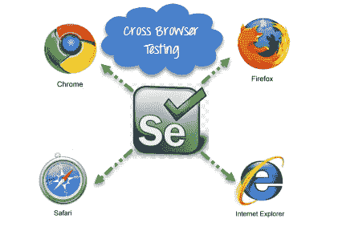
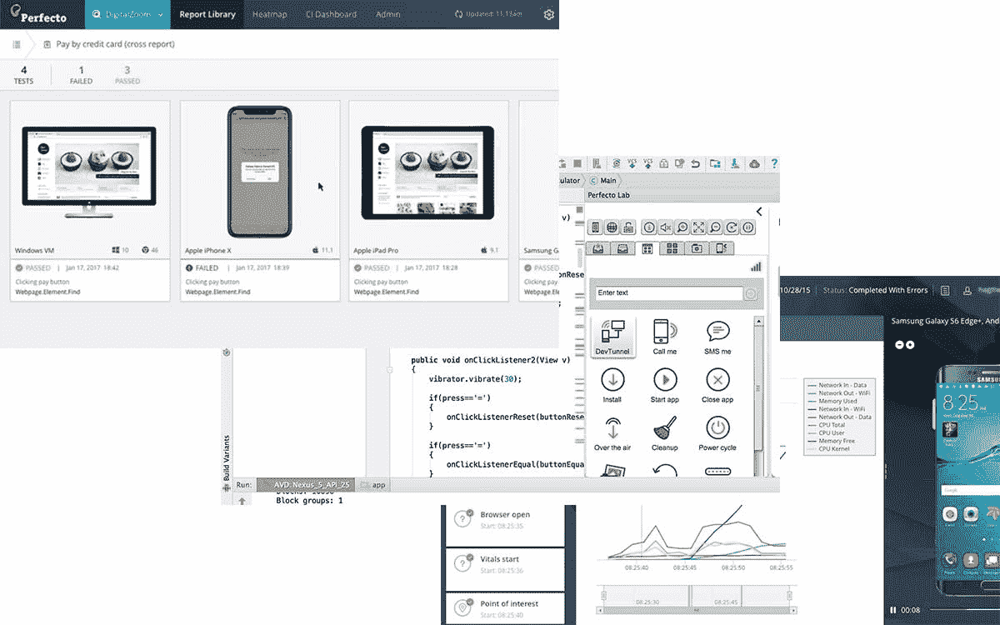
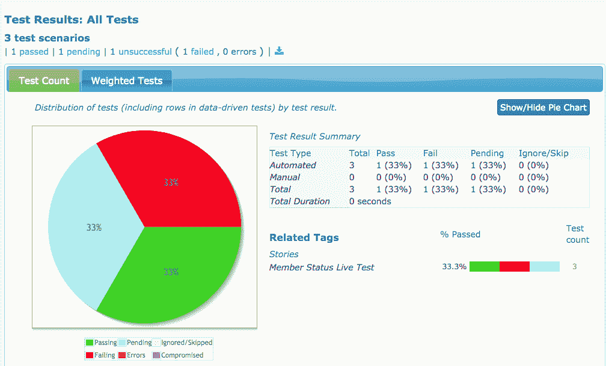
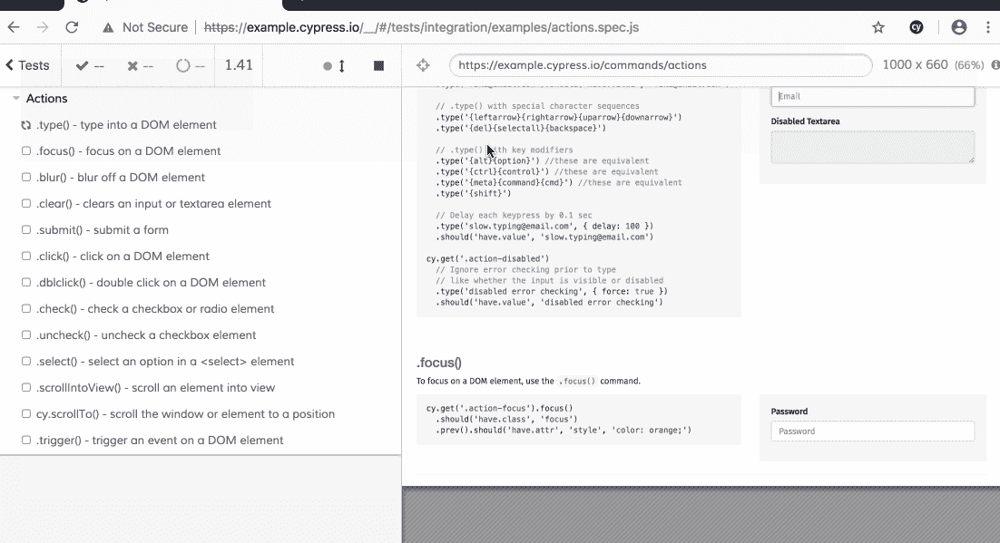
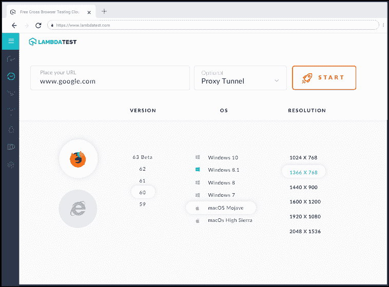
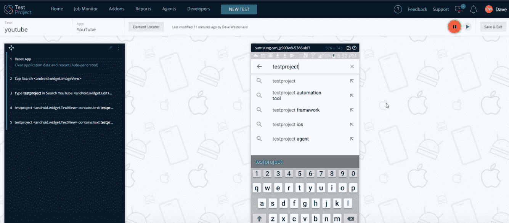
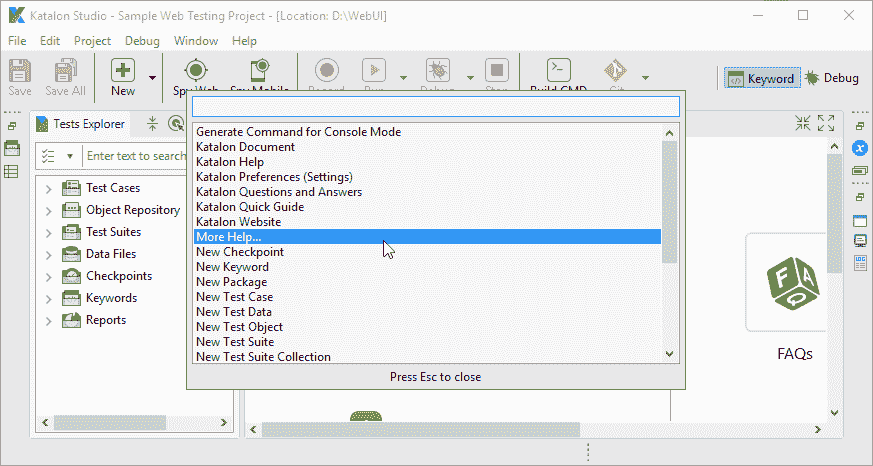
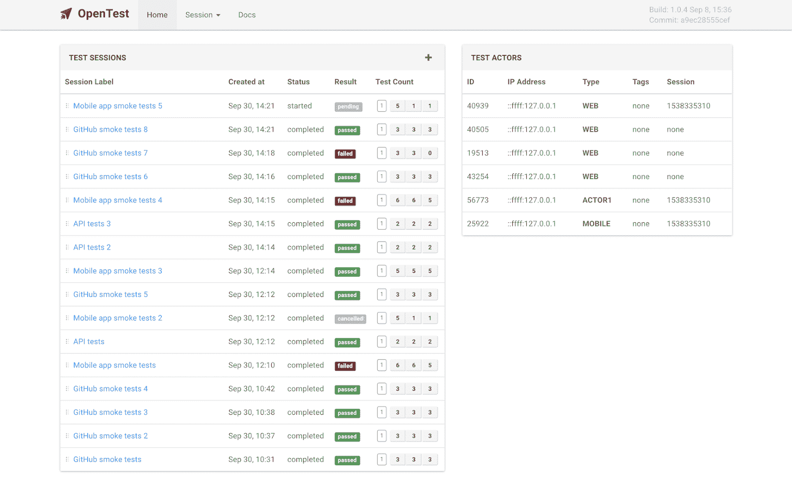

# 开发人员的最佳自动化测试工具

> 原文：<https://www.freecodecamp.org/news/best-automation-testing-tools-for-developers/>

测试驱动开发是每个软件开发人员都应该在他们的项目中实现的东西。

然而，使用 [TDD](https://www.guru99.com/test-driven-development.html) 的成功高度依赖于开发人员在实现代码和应用程序测试时的生产力。

这就是自动化工具的用武之地。

下面是 10 个推荐的测试自动化框架/平台的列表，以及它们特性的简短总结。

## [硒](https://www.selenium.dev/)

可以说，Selenium 是最流行的自动化测试框架。它是一个基于浏览器的框架，可以在不同的操作系统和浏览器上工作。

它具有 Selenium IDE，这是 Chrome 和 Firefox 的扩展，允许记录和回放用户交互。对于扩展测试(即在几台机器上运行)，Selenium Grid 是首选工具。

该框架中最流行的工具是 Selenium Webdriver，它是特定于语言的绑定集合，允许创建基于浏览器的回归测试。

## [很好。我](https://www.perfecto.io/)

Perfecto 是一个 web 和移动应用测试框架。它是作为 SaaS 工具交付的，允许测试工程师从任何地方运行他们的测试。

web 测试工具为不同操作系统和浏览器上的应用程序提供并行测试。它允许运行大量的日常测试，测试速度比其他任何框架都快 50%。

移动测试工具允许工程师在仿真器和实际设备上进行测试。就像 web 测试工具一样，它允许每天进行大量的测试运行(10，000 次执行)。

## [宁静](http://www.thucydides.info/#/)

Serenity BDD 的口号是“有风格的自动化验收测试”。这是因为 Serenity 的独特角度正在帮助测试人员编写世界级的测试报告和文档。

测试从创建用户故事和验收标准开始。然后 Serenity 会自动执行验收标准。测试被自动分解成各个步骤，使它们更具可读性。开发人员可以很容易地针对实际的应用程序执行运行这些测试。

一旦测试完成，Serenity 就会创建详细的报告，包括测试截图和所有相关信息，比如错误消息和执行时间。

## [柏树](https://www.cypress.io/)

Cypress 是用于前端或端到端自动化测试的一个很好的工具。

在项目中安装 Cypress 就像运行简单的`npm install cypress`或`yarn add cypress`命令一样简单。习惯于单元测试工具如 [Jest](http://jestjs.io/) 或 [Mocha](https://mochajs.org/) 的 JavaScript 开发人员会发现编写 Cypress 测试脚本轻而易举。

它的仪表板通过允许根据浏览器类型、环境、包类型等对测试进行分组，使得测试更加强大和快速。并行化特性允许开发人员运行更多测试，并轻松测试更多特性。

## [λ测试](https://www.lambdatest.com/)

LambdaTest 是一款针对桌面和 web 应用的领先测试自动化软件。

它允许对公共托管和本地机器托管的 web 应用程序和网站进行实时和交互式测试。

LambdaTest 还允许开发人员使用其浏览器测试网格运行 Selenium 测试脚本。这是一个非常强大和通用的套件，还集成了 CI/CD 工具，如 Jenkins、Circle CI 和 Travis CI。

现在，最酷的部分是它允许地理测试，这意味着 web 应用程序可以根据它们在世界上的哪个位置被访问来测试它们的性能。

## [TestProject.io](https://testproject.io/)

TestProject 的社区可能是测试社区中最大的社区之一。它是一个端到端和 API 云托管的测试框架。

作为一个开源项目，用户可以很容易地获得更新，甚至可以参与它的改进。它可以与 Selenium 及其所有预打包的依赖项一起使用。

凭借其无数的集成工具，它允许在不同的浏览器上测试，甚至在 Docker 中测试。

TestProject 最好的一点是它允许非编码人员通过它的无脚本测试记录器来执行测试。

## [目录工作室](https://www.katalon.com/homepage/?pk_abe=AB_testing_Homepage_08_2020&pk_abv=layout2)

另一个开源 API、web 和移动测试套件是 Katalon Studio。它是整个列表中最完整的测试套件之一，具有记录、自动生成测试脚本和强大的集成等特性。

这是一个易于开始的测试框架(是的，即使对于非编码人员来说也是如此)，但是对于扩展来说足够强大。

Katalon Studio 与现有的 CI/CD 设置配合良好。例如，很容易将其与 Github 或 Gitlab 的持续测试工具集成。这对于敏捷团队来说非常有用。

## [开放测试](https://getopentest.org/)

OpenTest 是另一个开源工具，可以自动测试 API、web、移动和桌面应用程序。它主要用于功能测试。

它仍然有很多限制，因为有些测试场景还不被支持。然而，它对初学者和非编码人员都非常好，因为它使用简单的英语关键字来编写测试动作。

它的一些最显著的特性包括使用 Selenium 的 web 测试、使用 Appium 的移动测试、关键字驱动测试、并行测试和数据驱动测试。

## [AccelQ](https://www.accelq.com/)

AccelQ 是一个基于人工智能的无代码测试自动化平台。因此，它最适合用于敏捷开发，因为它允许在项目中快速构建和轻松引入变更。

该平台支持 API 和端到端测试。AI 主干提供了预测分析，有助于加速测试脚本的生成。它有一个直观且易于使用的用户界面，即使是初学者也能快速上手。

## 结论

毫不奇怪，选择归结于您的特定用例。

然而，考虑到这些工具的广泛功能，选择一个是可以理解的困难。它们中的许多都是开源的，其美妙之处在于开发团队可以将一个用于特定的项目，而将另一个用于不同的项目。