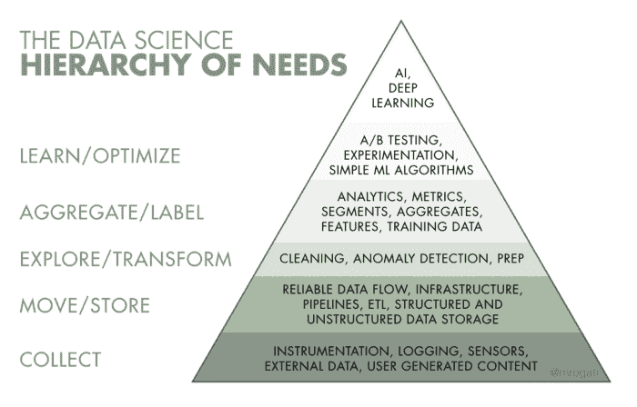
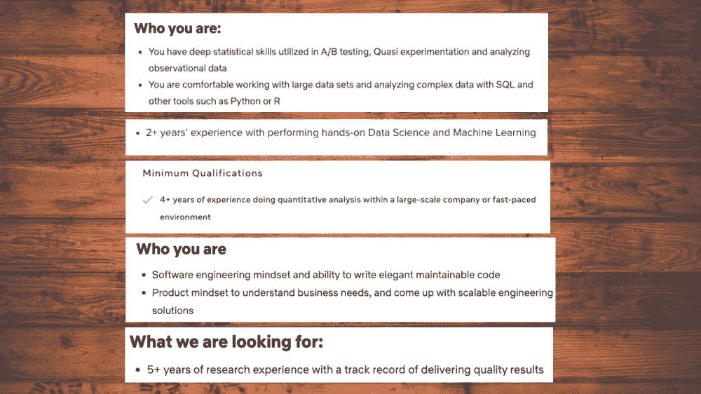
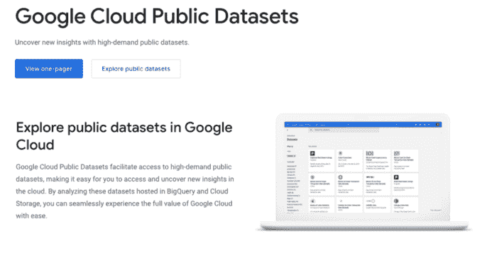
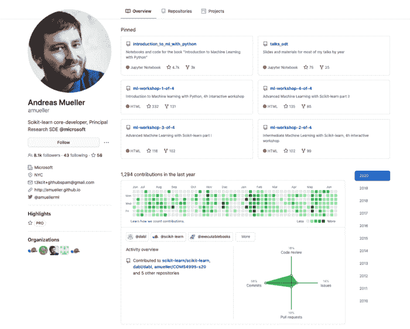
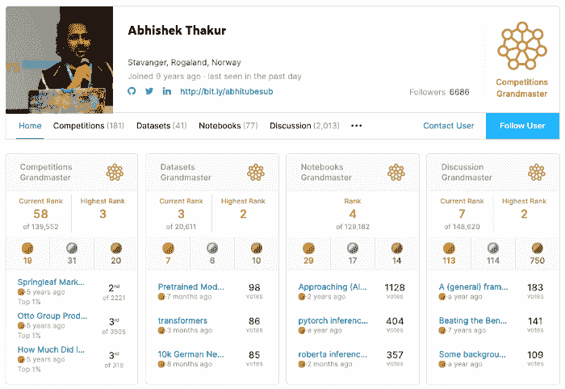
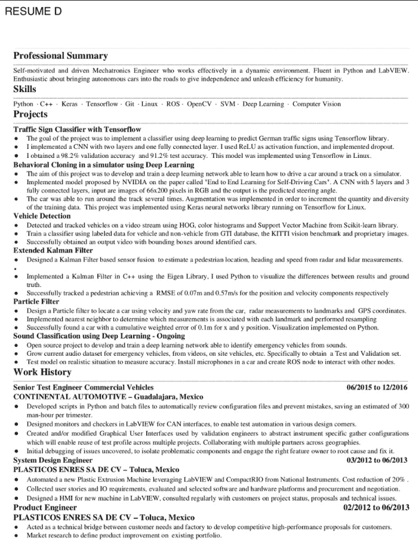

# 如何构建出色的数据科学产品组合

> 原文：<https://www.freecodecamp.org/news/how-to-build-an-awesome-data-science-portfolio/>

如果你简历上的技能部分列出了 Python，R，SQL，机器学习，深度学习，你想知道为什么每次都被拒绝，那就继续读下去吧。

有数百万人在寻找数据科学方面的工作，但机会有限。所以，重要的问题是你怎样才能从群体中脱颖而出？

该指南试图捕捉你需要建立一个牛逼的投资组合的一切——好到他们不能忽视你！

## 你为什么要建立投资组合？

对于一个从顶级大学获得硕士或博士学位的人来说，找工作可能并不困难。该机构为你的简历增加了可信度，而这正是雇主们所期待的。

对于没有相关学位或足够经验的人来说，这种可信度需要通过展示你潜力的优秀作品集来建立。然后，这个作品集就可以作为你能力的证明。

有很多因素可以增加你被雇主注意到的机会。有了聪明的策略和持续的努力，你就能解决它。

让我们在这里建立一个简单的计划，努力找到一份工作！

## 第一步——表明你的身份

从一个职业门户跳到另一个，申请任何提到“数据”的工作都不是明智之举。得知他们拒绝了你，只会增加你的压力和工作量。

### 缩小你的搜索范围

By Monica Rogati — [https://medium.com/hackernoon/the-ai-hierarchy-of-needs-18f111fcc007](https://medium.com/hackernoon/the-ai-hierarchy-of-needs-18f111fcc007)

数据科学领域本身是巨大的。大多数人位于图中所示金字塔的某一层。只有少数人能掌握其中的两三层。

如今，一个数据驱动的组织雇佣了各种职位，以下是这些专业人员解决问题的难度列表:

*   ****数据分析师**** —易到中
*   ****数据工程师**** —中到硬
*   ****ML 工程师**** —中等
*   ****研究/数据科学家**** —努力
*   ****AI 工程师/深度学习从业者**** —非常辛苦

显然，没有一个人能完成所有的任务。你要做的第一件事是确定你已经掌握(或者想要掌握)的技能。基于这些技能，你应该列出你想要的职位描述。

# 第二步——学习职位描述

如果你花足够的时间浏览一堆各种数据的职位描述，你会注意到他们要求经验，即使是对一个刚从大学毕业的人。

你应该明白的第二件事是，有些工作需要更多的通才，比如数据分析。然后是更专注和专注的研究领域，比如对冲基金的研究科学家，这是非常数学化的。

以下是我从一些大型(脸书、网飞)和中型(h20.ai)公司寻找候选人的截图:

研究它们会把我们带回到一个非常重要且常见的问题:

> **如果我是刚从学校毕业的**我该如何补偿经验因素？**

答案是项目！

> **等等！我已经知道……*T3*

这是你可能不知道的——这些项目不可能是你对 MNIST 数据集的分析或解决泰坦尼克号数据集的分类问题。

> 那么，什么样的项目呢？我从哪里得到这些项目？我需要做什么？

为了回答这个问题，让我们开始构建你的投资组合。

# 步骤 3 —通过项目展示专业技能

项目是你经验的唯一替代品。

[Chris Albon](https://chrisalbon.com/) 在 Datacamp 的一次采访中，当被问及人们在寻找他们的第一份工作[时，他们的投资组合中应该有什么时，他说:](https://www.datacamp.com/community/blog/getting-your-first-data-science-job)

> *...w *当有人申请时，他们可以申请的一些最好的东西是他们做过的项目，比如说，新兵训练营或他们的论文研究或类似的东西，我们可以看一看并说，哦，酷，就像你做过一些有趣的事情，你用一些有趣的方式处理过一些数据。**

## 这些项目应该反映什么:

无论您申请哪种档案，您的项目都应该验证四个主要因素:

1.  您对所需的 ****能力**** 的牢牢掌控
2.  您所解决或研究的问题的 ****复杂性****—它可以是一个新颖的问题，也可以是一个常见的企业级问题。
3.  ****领域**** 专业知识——你为了找到问题的答案或构建数据基础设施所做的大量研究。
4.  ****你的意志**** 更进一步，让项目脱颖而出——将你的项目公之于众，或者写博客或发布视频来解释你的发现。

## 要添加到您的投资组合中的项目类型

记住上面提到的因素，这里有一个项目想法的列表，需要真诚的努力，但会增加你的投资组合的重量。

*   ****处理真实数据:**** 如果你能向某人展示你可以处理来自不同来源的原始数据，并回答关于社会法律、金融、医疗保健或任何科学实验的有趣问题，那将会受到高度评价。
*   ****探索** p **公开可用数据集:****

利用公开可用的数据集，探索数据以获得多种见解，定义以前从未问过的问题，挖掘期刊和研究论文以寻找相关材料，然后使用统计模型揭示隐藏的模式。

对公开可用的数据集进行深入分析也是一个很好的起点。

*   ****利用你的好奇心:**** 作为一个好奇的数据专业人士，一定有你觉得耐人寻味的产品/服务/问题。利用这种好奇心去挖掘新的问题。例如，一个体育迷可以着手建立一个仪表板或数据基础设施，管理所有球员的统计数据和表现模式。
*   ****贡献开源**包 **:**** 每个组织都非常重视对机器学习或科学计算包的开源贡献。开发免费的开源软件会大大增加你被录用的机会。可以尝试贡献 [sklearn](https://github.com/scikit-learn/scikit-learn) 、 [numpy](https://github.com/numpy/numpy) 、[熊猫](https://github.com/pandas-dev/pandas)之类的包。这表明你可以处理庞大而复杂的代码库，并且你很了解你的东西。
*   ****构建端到端的项目:**** 证明你是真正的多面手的一个好方法就是构建端到端的项目(更像是产品)。不要停留在寻找解决方案或创建推荐系统或金融科技聊天机器人的原型上。多走一步，部署它，与您的同行分享使用它，收集一些分析。这说明你对自己所做的事情有多大的热情，能去学习新的技术和方法到什么程度。
*   ****技能型项目:**** 确实有人擅长清理数据或者创造有见地的情节或者自动化数据管道。你应该考虑开发自己的 Python 包来自动完成这些清理任务，或者给定一个数据帧，该包应该创建配对图和所有其他可能性来[加速 EDA 过程](https://towardsdatascience.com/how-i-optimized-my-data-analysis-practices-hacks-libraries-you-should-start-using-3a7308b668da)。

## 一些非常酷的投资组合列表可以激发灵感:

*   [https://nycdatascience . com/blog/student-works/improving-a-music-websites-user-experience/](https://nycdatascience.com/blog/student-works/improving-a-music-websites-user-experience/)
*   [http://varianceexplained.org/r/trump-tweets/](http://varianceexplained.org/r/trump-tweets/)
*   [https://nycdatascience . com/blog/student-works/forecasting-cryptocurrences-price-trends/](https://nycdatascience.com/blog/student-works/forecasting-cryptocurrencies-price-trends/)
*   [https://nycdatascience . com/blog/student-works/web-scraping/covid 19s-impact-on-preventable-cancer-risk-in-women-a-call-a-action/](https://nycdatascience.com/blog/student-works/web-scraping/covid19s-impact-on-preventable-cancer-risk-in-women-a-call-for-action/)

## 项目时间表

你在一个项目上花费的时间给出了关于它的复杂性、利基和工作量的线索。它应该帮助你判断这个项目是否值得投资。

你在项目中投入了多少努力来使它更上一层楼取决于很多不同的因素。

只是给你一些量化的东西，如果你已经获得了一个新生的技术，你应该花至少一个月的时间来构建一些具体的东西。

## 如何将这些项目添加到您的投资组合中

一旦你有了几个好的项目可以放入你的作品集，下一步就是以最好的方式包装你的作品。

苹果以包装和设计著称。在展示你的作品之前，要真诚对待你的包装。

以下是你如何增加项目权重的方法:

*   ****GitHub URL:**** 如果你决定添加一个链接到你的 repo，确保 repo 不包含一个 Jupyter 笔记本，它应该有所有其他文件，如`requirements.txt`、`.gitignore`，如果需要的话，还有一个许可证，等等。这样，你将作为一个完整的组合被雇佣，而不仅仅是一个 Jupyter 笔记本电脑专家。
*   ****博客:**** 写下你所取得的成就永远是一个好的实践，对于雇主来说，这能建立对你工作的信任，以及你有效沟通所做工作的能力。
*   ****部署的应用程序:**** 如果你已经部署了你的 ML 驱动的应用程序，提供一个链接让雇主使用它。
*   ****仪表板:**** 如果您对自己的分析感到自豪，您可以着手创建一个仪表板。如果你使用 Python，你可以使用 Voila 或 Dash。如果你是商业分析专家，你可以添加你的 Power BI，或者 Tableau 仪表盘到展示你的分析技巧。

# 第 4 步——社交媒体档案

一份好的社交媒体档案可以帮助你找到下一份理想的工作。GitHub、LinkedIn、Twitter、Kaggle、StackOverflow 和 Medium 是人们用来分享工作/情感、建立网络、消费信息和做广告的主要平台。

组织和招聘人员使用这些平台来接触他们的下一个潜在雇员。

*   ****GitHub:**** 拥有一个良好的 GitHub 档案，在你的库上有很多贡献或明星，会让你成为一个有竞争力的程序员。

*   ****Kaggle:**** 参加 Kaggle 比赛，创建有用的笔记本和数据集也可以帮助你建立一个良好的数据分析师档案。

热沙玛·谢赫的帖子[中的一段摘录](https://reshamas.github.io/to-kaggle-or-not/)说:

> 没错，参加一场 Kaggle 比赛并不能证明一个人有资格成为数据科学家。上一堂课或参加一个会议辅导或分析一个数据集或阅读一本数据科学方面的书也是如此。参加竞赛可以增加你的经验，扩大你的投资组合。它是对您其他项目的补充，而不是对您的数据科学技能的唯一试金石。

*   ****LinkedIn:**** 我个人使用 LinkedIn 获得了我的第一份工作、第一个客户和许多合作者。这是一个一站式平台，你可以与在你梦想的公司工作的人联系，与他们互动，寻找工作，并跟踪有趣的进展。务必阅读[这份完整的数据科学 LinkedIn 个人资料指南](https://www.kdnuggets.com/2019/11/data-science-linkedin-profile-guide.html)来优化你的个人资料。
    ****小贴士:**** 在你要求别人帮忙之前，你应该先准备好提供一些东西。
*   ****Twitter:**** 数据科学领域的所有知名人士都非常频繁地使用 Twitter，你可以与你所在领域的人进行互动。你了解这些人在做什么，以及他们对社会问题的看法。
    你可以用你的推特来推广你的博客、视频和其他发现。人们因为他们的工作和在 Twitter 上的良好追随者，获得了工作邀请、会议邀请、自由职业工作和有影响力的营销合同。

Twitter 上关注的顶级数据科学家:

*   Andreas Mueller — Sci-kit 学习开发者
*   Yann le cunn——脸书首席人工智能科学家
*   [迪安·阿博特](https://twitter.com/deanabb) —首席数据科学家 SmarterHQ
*   [吴恩达](https://twitter.com/AndrewYNg)——Coursera 的联合创始人

还有很多其他的，你可以看看我的个人资料和我在推特上关注的人。

# 第五步——将作品集压缩成一页简历

求职申请中最重要的因素是你的简历，因为它决定了你是否会被列入工作候选人名单。

考虑到你已经具备了良好的状态，是时候把这些信息浓缩到一份优雅简洁的简历中了。

你一定知道，招聘人员不会花超过几分钟的时间浏览你的简历，所以你需要在一页纸内表达你所做的一切。

您的姓名和联系信息之后最重要的部分:

1.  ****总结**** :用 1-2 句话，传达你一直在做的事情和你打算做的事情。
2.  ****技能**** :不要用所有想到的随机技能填满这些。不要在天平上给自己做标记。包含所有主要能力的一行就足够了。
3.  ****项目**** :这应该是新毕业生的主要部分，因为你的经验部分不多。简洁地描述你所取得的成就，在你的作品中加入超链接。争取顶点项目、Kaggle 竞赛、独立研究和项目。这一部分将被称为你的文件夹。
4.  ****课程作业**** :仅添加相关课程作业。如果可以的话，你可以提到你的 GPA。
5.  **(如果你有的话):加上相关的工作经历以及你在公司完成的主要任务。**
6.  ******社交媒体链接:**** 别忘了给你活跃的社交媒体档案添加链接。**

**下面是一份在 Kaggle[career 2018](https://www.youtube.com/watch?v=kBR0EtGOkzc)期间被审核过的好简历的例子:**

**

An example of a good resume presented at Kaggle CareerCon** 

# **行动呼吁**

**你可能还有很多问题。你应该从哪里寻找项目创意？你如何开始？你如何准备面试？还有很多。**

**我一直致力于为每个概要文件创建项目，这是基于我作为 Web 和数据科学轨道的教学设计师的经验。**

**根据你对这篇文章的回应，我将为每个档案创建一个不和谐频道，在那里我将分享项目和完成项目的指令以及与每个项目相关的时间表。**

**我坚信基于项目的教学法，因此我将在项目开发的地方创建大量的内容。我会分享你可以用来学习的资源(其中一些我会自己创建)并成功完成项目。**

**你可以在这里看我的一个例子:【Jupyter 笔记本的新冠肺炎互动分析仪表板。**

**以下是我在 Harshit 的数据科学频道上发表的这篇博文的视频版本:**

 **[https://www.youtube.com/embed/_ANbV9lVA-M?feature=oembed](https://www.youtube.com/embed/_ANbV9lVA-M?feature=oembed)** 

# **[数据科学与 Harshit](https://www.youtube.com/c/DataSciencewithHarshit?sub_confirmation=1)**

 **[https://www.youtube.com/embed/yapSsspJzAw?feature=oembed](https://www.youtube.com/embed/yapSsspJzAw?feature=oembed)** 

**通过这个渠道，我计划推出几个涵盖整个数据科学领域的[系列。以下是你应该订阅](https://towardsdatascience.com/hitchhikers-guide-to-learning-data-science-2cc3d963b1a2?source=---------8------------------)[频道](https://www.youtube.com/channel/UCH-xwLTKQaABNs2QmGxK2bQ)的原因:**

*   **这些系列将涵盖每个主题和子主题的所有必需/要求的高质量教程，如 [Python 数据科学基础](https://towardsdatascience.com/python-fundamentals-for-data-science-6c7f9901e1c8?source=---------5------------------)。**
*   **解释了为什么我们在 ML 和深度学习中这样做的数学和推导。**
*   **[与谷歌、微软、亚马逊等公司的数据科学家和工程师](https://www.youtube.com/watch?v=a2pkZCleJwM&t=2s)以及大数据驱动型公司的首席执行官的播客。**
*   **[项目和说明](https://towardsdatascience.com/building-covid-19-analysis-dashboard-using-python-and-voila-ee091f65dcbb?source=---------2------------------)实施到目前为止所学的主题。**

**如果这个教程有帮助，你应该看看我在 [Wiplane Academy](https://www.wiplane.com/) 上的数据科学和机器学习课程。它们全面而紧凑，帮助您建立一个坚实的工作基础来展示。**