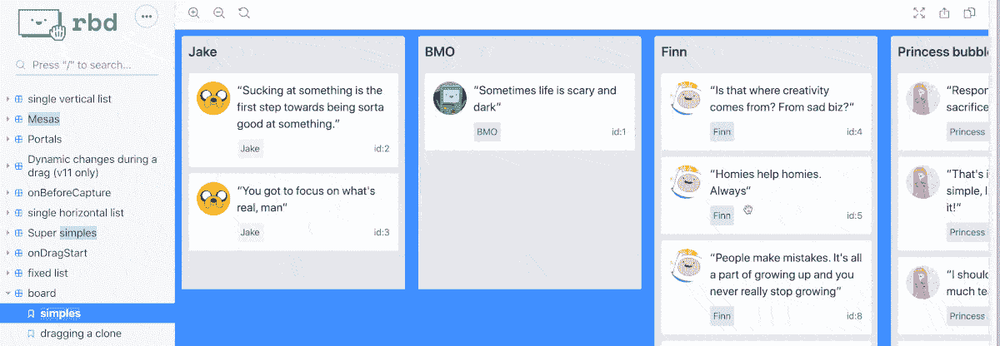
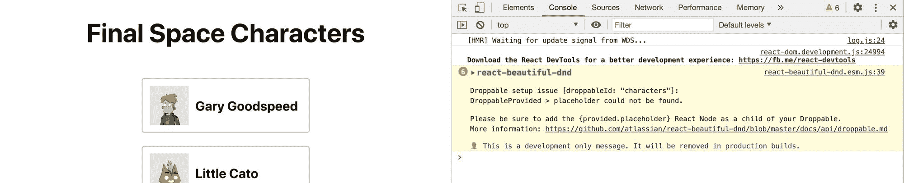
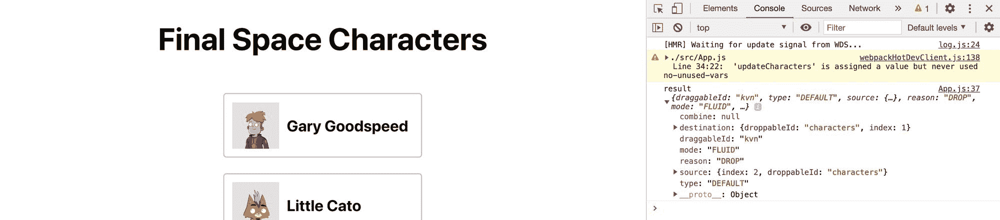
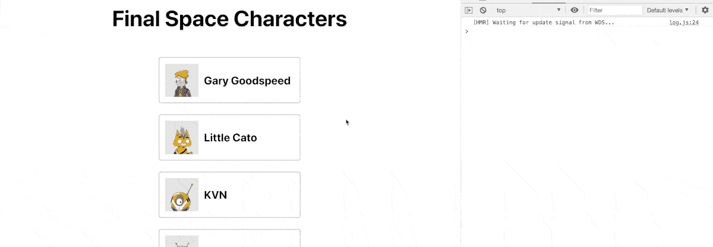

# 如何添加拖放在反应与反应美丽的 DnD

> 原文：<https://www.freecodecamp.org/news/how-to-add-drag-and-drop-in-react-with-react-beautiful-dnd/>

拖放是一种常见的交互技术，它允许人们直观地在页面上移动东西。这可能是重新排序一个列表，甚至是拼一个拼图。

在用 React Beautiful DnD 构建 React 应用程序时，我们如何添加这种交互？

*   [什么是拖放？](#what-is-drag-and-drop)
*   [什么是美丽的 DnD？](#what-is-react-beautiful-dnd)
*   我们要建造什么？
*   [步骤 0:创建一个新的 React.js 应用](#step-0-creating-a-new-react-js-app)
*   [第一步:安装 React Beautiful DnD](#step-1-installing-react-beautiful-dnd)
*   [第二步:用 React Beautiful DnD 制作一个可拖放的列表](#step-2-making-a-list-draggable-and-droppable-with-react-beautiful-dnd)
*   [第三步:用 React Beautiful DnD 重新排序项目后保存列表顺序](#step-3-saving-list-order-after-reordering-items-with-react-beautiful-dnd)

[https://www.youtube.com/embed/aYZRRyukuIw?feature=oembed](https://www.youtube.com/embed/aYZRRyukuIw?feature=oembed)

## 什么是拖放？

拖放就像它听起来的那样——这是一种交互，允许某人点击并拖动一个项目，然后将其放到其他地方，通常会在应用程序中产生副作用。



Moving items on a board

这种效果在待办事项列表或项目管理仪表板等应用程序中非常常见，在这些应用程序中，您需要区分优先级并创建事情应该如何完成的顺序。

虽然拖放可以有一些高级的用例，但我们将在我们的演练中坚持基本的列表功能。

## 什么是美丽的 DnD？

反应美丽的 DnD 是一个从 Atlassian 可访问的拖放库。如果你不知道 Atlassian，他们是吉拉背后的团队。如果你不熟悉吉拉，它可能是目前互联网上最大的敏捷工具。

该团队的目标是在考虑可访问性的情况下提供拖放功能，此外还通过强大的 API 保持其夜间和高性能。

## 我们要建造什么？

我们将从一个简单的列表开始，并添加拖放功能。

在本演练中，我们不会花时间构建列表本身。我们将使用的列表使用一个标准的无序列表(`<ul>`)和列表项(`<li>`)来创建一个列表，并使用一点 CSS 来使它看起来像卡片。

我们将重点放在使用 React Beautiful DnD 添加拖放功能来重新排列列表。

## 步骤 0:创建新的 React.js 应用程序

要开始，我们需要一个简单的应用程序，其中包括一个项目列表。这可以是一个现有的项目，也可以是一个使用您最喜欢的框架的全新项目，如 [Create React App](https://create-react-app.dev/) 。

我使用 Create React app 创建了一个新的应用程序，并添加了一个简单的[结尾空格](https://www.tbs.com/shows/final-space)字符列表。


Final Space characters list

如果您想从同一个地方开始，您可以在那个分支上克隆我的演示库，然后和我一起开始。

该命令将克隆特定分支的[以开始:](https://github.com/colbyfayock/my-final-space-characters/tree/part-0-starting-point)

```
git clone --single-branch --branch part-0-starting-point git@github.com:colbyfayock/my-final-space-characters.git 
```

否则，您可以像平常一样克隆[存储库](https://github.com/colbyfayock/my-final-space-characters)，并检查分支`part-0-starting-point`。

如果您想只看代码，我首先创建了一个对象数组:

```
const finalSpaceCharacters = [
  {
    id: 'gary',
    name: 'Gary Goodspeed',
    thumb: '/images/gary.png'
  },
  ... 
```

然后我遍历它们来创建我的列表:

```
<ul className="characters">
  {finalSpaceCharacters.map(({id, name, thumb}) => {
    return (
      <li key={id}>
        <div className="characters-thumb">
          
        </div>
        <p>
          { name }
        </p>
      </li>
    );
  })}
</ul> 
```

[跟随提交！](https://github.com/colbyfayock/my-final-space-characters/commit/8bfa61c32c1bdace7515a93a14427108056f3814)

## 第一步:安装反应美丽的 DnD

第一步是通过 npm 安装库。

在项目内部，运行以下命令:

```
yarn add react-beautiful-dnd
# or
npm install react-beautiful-dnd --save 
```

这将把库添加到我们的项目中，我们将准备在我们的应用程序中使用它。

## 第二步:用美丽的 DnD 制作一个可拖放的列表

安装了我们的库之后，我们可以给我们的列表提供拖拽的能力。

### 向我们的应用程序添加拖放上下文

在文件的顶部，使用以下命令从库中导入`DragDropContext`:

```
import { DragDropContext } from 'react-beautiful-dnd'; 
```

DragDropContext 将赋予我们的应用程序使用库的能力。它的工作方式类似于 React 的上下文 API，其中库现在可以访问组件树。

注意:如果你计划在多个列表中添加拖放功能，你需要确保你的 DragDropContext 包装了所有的条目，就像在你的应用程序的根目录中一样。不能嵌套 DragDropContext。

我们希望用 DragDropContext 来包装我们的列表:

```
<DragDropContext>
  <ul className="characters">
  ...
</DragDropContext> 
```

在这一点上，应用程序不会有任何变化，它应该仍然像以前一样加载。

### 使我们的名单成为一个可丢弃的区域

接下来，我们要创建一个可拖放的区域，这意味着，这将允许我们提供一个特定的区域，我们的项目可以在其中移动。

首先，将`Droppable`添加到我们的导入文件的顶部:

```
import { DragDropContext, Droppable } from 'react-beautiful-dnd'; 
```

出于我们的目的，我们希望我们的整个无序列表(`<ul>`)成为我们的拖放区，所以我们再次希望用这个组件包装它:

```
<DragDropContext>
  <Droppable droppableId="characters">
    {(provided) => (
      <ul className="characters">
        ...
      </ul>
    )}
  </Droppable>
</DragDropContext> 
```

你会注意到我们这次包装有点不同。首先，我们在我们的`<Droppable>`组件上设置一个`droppableId`。这允许库在交互之间跟踪这个特定的实例。

我们还在组件内部直接创建了一个函数，它传递了`provided`参数。

注意:这个函数可以传入两个参数，包括一个`snapshot`参数，但是我们不会在这个例子中使用它。

[提供的](https://github.com/atlassian/react-beautiful-dnd/blob/master/docs/api/droppable.md#1-provided-droppableprovided)参数包括库正常工作所需的信息和代码引用。

为了使用它，在我们的列表元素上，让我们添加:

```
<ul className="characters" {...provided.droppableProps} ref={provided.innerRef}> 
```

这将为库创建一个引用(`provided.innerRef`)来访问列表元素的 HTML 元素。它还将 props 应用于元素(`provided.droppableProps`)，该元素允许库跟踪移动和定位。

同样，在这一点上，不会有任何明显的功能。

### 使我们的项目可拖动

现在是有趣的部分！

使列表元素可拖放的最后一步是用一个组件包装每个列表项，类似于我们刚才对整个列表所做的。

我们将使用 [Draggable](https://github.com/atlassian/react-beautiful-dnd/blob/master/docs/api/draggable.md) 组件，同样，与 Droppable 组件类似，它将包含一个函数，在这个函数中，我们将把道具传递给我们的列表项组件。

首先，我们需要导入 Draggable 以及其余的组件。

```
import { DragDropContext, Droppable, Draggable } from 'react-beautiful-dnd'; 
```

接下来，在我们的循环中，让我们用`<Draggable />`组件和它的顶层函数包装返回的列表项。

```
{finalSpaceCharacters.map(({id, name, thumb}) => {
  return (
    <Draggable>
      {(provided) => (
        <li key={id}>
          ...
        </li>
      )}
    </Draggable> 
```

因为我们现在在循环中有了一个新的顶级组件，所以让我们将`key`属性从 list 元素移动到 Draggable:

```
{finalSpaceCharacters.map(({id, name, thumb}) => {
  return (
    <Draggable key={id}>
      {(provided) => (
        <li> 
```

我们还需要在`<Draggable>`上设置两个加法道具，一个`draggableId`和一个`index`。

我们想将`index`作为参数添加到我们的`map`函数中，然后在我们的组件中包含这些属性:

```
{finalSpaceCharacters.map(({id, name, thumb}, index) => {
  return (
    <Draggable key={id} draggableId={id} index={index}> 
```

最后，我们需要在列表元素本身上设置一些道具。

在我们的列表元素中，添加这个`ref`并扩展来自`provided`参数的附加属性:

```
<Draggable key={id} draggableId={id} index={index}>
  {(provided) => (
    <li ref={provided.innerRef} {...provided.draggableProps} {...provided.dragHandleProps}> 
```

现在，如果我们刷新页面，将鼠标悬停在列表项上，我们就可以拖动它们了！


Dragging items on a list

但是，您会注意到，当您开始移动一个项目时，页面的底部似乎有点混乱。我们的列表项和页脚有一些溢出问题。

你还会注意到，在开发者控制台中，美丽的 DnD 反应给我们一个警告信息，说我们缺少一个叫做占位符的东西。



Console warning - placeholder could not be found

### 添加 React Beautiful DnD 的占位符

React Beautiful DnD 的部分要求是，我们还包括一个占位符项目。

这是他们提供的现成的东西，但这是用来填充我们之前拖动的项目所占用的空间。

另外，我们希望在可删除的顶级列表组件的底部包含`provided.placeholder`，在我们的例子中是在`<ul>`的底部:

```
<Droppable droppableId="characters">
  {(provided) => (
    <ul className="characters" {...provided.droppableProps} ref={provided.innerRef}>
      ...
      {provided.placeholder}
    </ul>
  )}
</Droppable> 
```

如果我们开始在浏览器中拖动东西，我们可以看到我们的页面流没有问题，内容停留在它应该在的地方！


Dragging items with fixed spacing

最后一个问题是，当你移动东西时，它不会停留，那么我们如何保存我们的项目的顺序呢？

[跟随提交！](https://github.com/colbyfayock/my-final-space-characters/commit/5ec5ee6c3e7de5b67a8fd46fdfbf157312bc8c00)

## 第三步:用美丽的 DnD 重新排序后保存列表顺序

当我们移动我们的物品时，它们会在落地的地方停留片刻。但是在 React Beautiful DnD 完成它的工作后，我们的组件树将被重新绘制。

当组件重新呈现时，我们的项目会回到原来的位置，因为我们从未将它保存在 DnD 的内存之外。

为了解决这个问题，`DragDropContext`引入了一个`onDragEnd`属性，允许我们在拖动完成后触发一个函数。该函数传入包含项目新顺序的参数，以便我们可以为下一个渲染周期更新状态。

### 在状态下保存我们的列表项

首先，让我们将我们的项目存储在 state 中，这样我们就可以在两次循环之间进行更新。

在文件的顶部，将`useState`添加到 React 导入:

```
import React, { useState } from 'react'; 
```

然后，我们将使用默认的项目列表来创建我们的状态。

将以下内容添加到我们的应用程序组件的顶部:

```
const [characters, updateCharacters] = useState(finalSpaceCharacters); 
```

因为我们将更新我们的新`characters`状态来提供我们的列表项和它们的顺序，所以我们现在想要替换我们映射到新状态的数组:

```
<ul className="characters" {...provided.droppableProps} ref={provided.innerRef}>
  {characters(({id, name, thumb}, index) => { 
```

如果我们保存并刷新我们的页面，什么都不会改变！

### 拖动项目时更新状态

现在我们有了状态，我们可以在列表项被拖动的任何时候更新状态。

我们添加到页面中的`DragDropContext`组件接受一个属性`onDragEnd`。顾名思义，每当有人停止拖动列表中的某个项目时，就会触发一个函数。

让我们添加一个函数`handleOnDragEnd`作为我们的道具:

```
<DragDropContext onDragEnd={handleOnDragEnd}> 
```

接下来，我们需要该函数实际存在。

我们可以在我们的状态下定义一个函数:

```
function handleOnDragEnd(result) {
} 
```

我们的函数接受一个名为`result`的参数。

如果我们将`console.log(result)`添加到函数中，并移动列表中的一个项目，我们可以看到它包含了在我们的移动操作之后应该更新的状态的细节。



Dragged item result

特别是，我们希望在`destination`和`source`属性中使用`index`值，它告诉我们被移动的项目的索引，以及该项目的新索引在项目数组中应该是什么。

因此，利用这一点，让我们将以下内容添加到我们的函数中:

```
const items = Array.from(characters);
const [reorderedItem] = items.splice(result.source.index, 1);
items.splice(result.destination.index, 0, reorderedItem);

updateCharacters(items); 
```

我们正在做的是:

*   我们创建了一个`characters`数组的新副本
*   我们使用`source.index`值从新数组中找到我们的项目，并使用`splice`方法移除它
*   这个结果是析构的，所以我们最终得到一个新的对象`reorderedItem`,这是我们拖动的项目
*   然后，我们使用我们的`destination.inddex`将该项添加回数组，但是在它的新位置，再次使用`splice`
*   最后，我们使用`updateCharacters`函数更新我们的`characters`状态

现在保存我们的函数后，我们可以移动我们的角色，他们保存他们的位置！


Drag item with saved state

### 防止错误被拖出边界

我们实现的一个问题是，如果有人没有在我们定义的容器中拖动项目，我们会得到一个错误。



Error when dragging out of container

问题是，当我们将它拖出定义的容器时，我们没有目的地。

为了避免这种情况，我们可以简单地在代码上方添加一个语句来移动我们的项目，检查目的地是否存在，如果不存在，就从函数中退出:

```
function handleOnDragEnd(result) {
  if (!result.destination) return; 
```

如果我们重新加载页面，并试图再次拖动我们的项目，我们的项目会毫无错误地恢复到原始位置！


Snap back when dragged out of container

[跟随提交！](https://github.com/colbyfayock/my-final-space-characters/commit/ad4f4733a974a27f5a2cfc8e366c2390809b74ca)

## 我们还能对美丽的 DnD 做些什么？

### 拖放时的自定义样式

当移动项目时，DnD 将提供给定状态的快照。有了这些信息，我们可以应用自定义的样式，这样当我们移动项目时，我们可以显示列表的活动状态，或者我们移动的项目，或者两者都显示！

[https://react-beautiful-dnd.netlify.app/?path =/story/single-vertical-list-basic](https://react-beautiful-dnd.netlify.app/?path=/story/single-vertical-list--basic)

### 在不同列表之间拖动

如果你以前使用过 Trello 或类似的工具，你应该熟悉不同栏的概念，你可以在它们之间拖动卡片，这样你就可以优先安排和组织你的任务和想法。

这个库允许您做同样的事情，提供将项目从一个可拖动区域拖放到另一个区域的能力。

[https://react-beautiful-dnd.netlify.app/?path =/story/multiple-vertical-lists-stress-test](https://react-beautiful-dnd.netlify.app/?path=/story/multiple-vertical-lists--stress-test)

[](https://twitter.com/colbyfayock)

*   [？在 Twitter 上关注我](https://twitter.com/colbyfayock)
*   [？订阅我的 Youtube](https://youtube.com/colbyfayock)
*   [✉️注册我的简讯](https://www.colbyfayock.com/newsletter/)
*   [？赞助我](https://github.com/sponsors/colbyfayock)