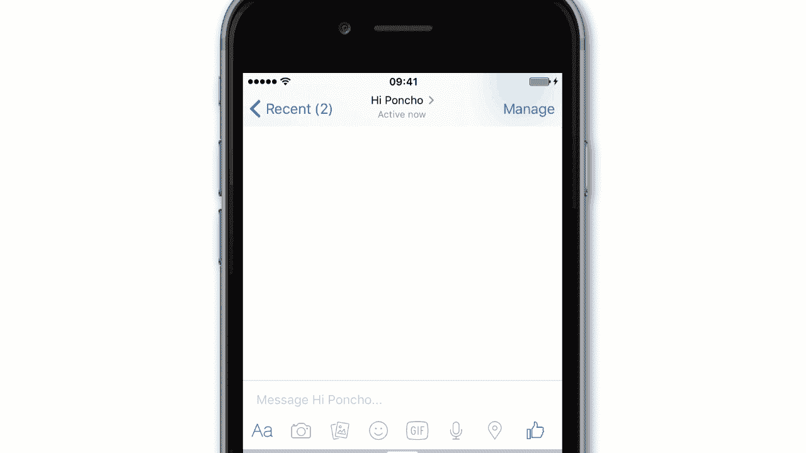
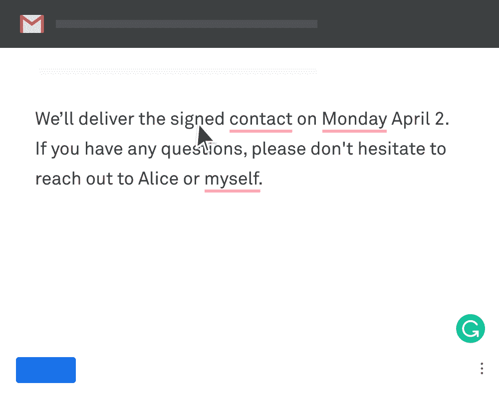

# 什么是自然语言处理？面向初学者的 NLP 定义和教程

> 原文：<https://www.freecodecamp.org/news/what-is-natural-language-processing-an-nlp-definition-and-tutorial-for-beginners/>

自然语言处理(NLP)是帮助计算机解释自然人类语言的机器学习的分支。

这听起来可能很熟悉——

**嘿 Siri，明天早上 6 点设个闹钟。**

搞定——你的闹钟定在明天早上 7 点。

你有没有想过像 Siri 和 Alexa 这样的设备是如何理解和解释你的声音的？当他们不能接受某些条款时，你是否感到有些恼火？答案是自然语言处理(NLP)。

NLP 是人工智能的一个分支，它使用计算机科学和语言学来帮助计算机理解“人类语言”

NLP 的目的是在人类语言和计算机命令行界面之间架起一座桥梁。

人类有数百种语言。而计算机只有一种母语，叫做机器语言。

你的计算机和智能设备中的所有进程通过数百万个 0 和 1 进行通信，以执行特定的功能。机器代码是人类无法理解的，这使得 NLP 成为人机交互的关键部分。

让我们看看 NLP 的一些核心用例，以及一些真实的应用程序。

# **自然语言处理的用例**

## 情感分析

如今，人们通过调查、客户反馈和社交媒体平台来表达他们的反馈。

因此，组织必须依赖能够理解通过文本表达的人类情感的软件来理解客户的反馈。

这些分析用于调整产品和服务，以满足客户的期望。情感分析是实现这一目标的重要工具。

情感分析是识别文本中表达的观点并理解作者对所讨论的产品或服务的态度是积极、中立还是消极的过程。

实时情绪分析有助于实时识别关键问题。

例如，每当危机或丑闻由于社交媒体上不断升级的抗议而影响到一个组织时，情绪分析模型就可以提供帮助。企业可以依靠这些模型来快速识别问题，并在问题变得不可收拾之前站在客户面前解决问题。

这里有一篇 MonkeyLearn 的文章，深入解释了情绪分析。

## 垃圾邮件过滤

NLP 也广泛用于垃圾邮件过滤。垃圾邮件过滤器的功能是发现不想要的电子邮件，并将它们发送到一个单独的文件夹中，而不是常规的收件箱中。

使用机器学习中的分类模型可以实现简单的垃圾邮件过滤。但是 NLP 更擅长区分有用的邮件和真正的垃圾邮件。

NLP 技术，如 [n-gram 建模](https://devopedia.org/n-gram-model)应用于电子邮件，以比传统分类模型更高的准确度将它们分类为垃圾邮件或垃圾邮件。

## 聊天机器人

聊天机器人是一种人工智能(AI)软件，可以模拟用自然语言与用户进行对话。这是自然语言处理的高级实现，让我们更接近于以类似于人与人对话的方式与计算机交流。

聊天机器人使用自然语言处理、自然语言理解和自然语言生成的组合来实现对话式用户界面。

聊天机器人对客户支持非常有帮助，为企业节省时间和金钱。由于客户提出的大多数问题都是常见问题，它们可以由聊天机器人处理。这有助于客户服务代理优先处理重要的客户查询，从而确保整体客户满意度。

# **使用自然语言处理的产品**

我们日常使用的许多产品都没有意识到它们是由 NLP 支持的。这里有一些最受欢迎的。

## **Siri / Alexa / Cortana**

每个领先的科技巨头都开发了自己的虚拟助手，为用户提供完整的体验。

Alexa、Cortana、Siri、Google Assistant 使用广泛。这些程序不仅可以控制你的智能手机，还可以控制大量兼容的智能设备，如空调、智能电视、灯等。

NLP 是这些虚拟助手必不可少的一部分。它用于检测、解释和理解文本或语音命令，以执行所请求的功能。

所有这些助理都在通过人工智能和机器学习不断进化，以扩大他们响应的准确性。

## **语法**

Grammarly 已经成为全世界人们使用的最流行的写作工具之一。这是一个迷人的工具，可以在你的写作中建议不同类型的变化。

除了检查拼写和语法，Grammarly 还可以检查主动语态和被动语态的用法、文档的语气、句子的复杂性，并可以根据您的写作目标提出修改建议。

你可能想知道语法是如何工作的。与流行的观点(某种写作机器人正在检查你的工作)相反，人工智能和自然语言处理是 Grammarly 功能背后的主要驱动力。它提供了不同类型的功能和选项来检查你的写作。

Grammarly 的 AI 系统由各种各样的 NLP 算法组成，可以处理不同的写作风格和音调。

Grammarly 背后的整个机器学习系统相当了不起。它不断更新，成为互联网上最好的写作助手。

NLP 允许从语法上处理英语写作，并执行各种任务以生成完整的报告。这些任务包括写作改进、可读性评分、情感分析，以及使用备选单词、短语和句子结构的建议。

## **谷歌翻译**

语言翻译是自然语言处理的一个重要应用。在将文档和音频从一种语言翻译成另一种语言所需的工作和人力方面，它为组织节省了数十亿美元。

谷歌翻译可能是最受欢迎和最有效的翻译工具。它利用人工智能、机器学习和自然语言处理将文本从一种语言翻译成另一种语言。截至目前，谷歌翻译支持 101 种语言。

值得注意的是，翻译是一个非常棘手的过程，因为软件必须理解每个单词、短语和句子结构才能准确翻译。

为了解决这些问题，谷歌翻译不断更新，以提高语言翻译的质量和准确性。

## **自动更正**

拼写检查是一个被低估的工具，它在我们的日常生活中是无价的。不是每个人都能写出没有任何拼写或语法错误的完美句子。在这种情况下，拼写检查在提高写作方面发挥了巨大的作用。

除此之外，自动纠错在智能手机中非常普遍，因为它允许你立即写下你的想法，而不用担心拼写。它(通常)会消除你的信息中的拼写错误，改善交流。

## **自动完成**

Autocomplete 是 NLP 的另一个有用的应用程序，几乎每个 web /移动应用程序都使用它，包括像 Google 这样的搜索引擎。

自动完成功能使用其他客户以前执行的搜索，帮助您快速找到您要找的内容。

最终，自动完成搜索提高了客户满意度，因为他们能够更快、更准确地找到所需的产品、服务或任何其他信息。

同样，自动建议有助于快速发送电子邮件和信息。由于 NLP 的进步，你只需点击一下鼠标就可以选择合适的单词甚至短语。

我们每天都在使用这些功能，却没有意识到它们是自然语言处理的应用。

# 结论

世界上有数百种语言使交流成为一种复杂的现象。语言也因文化不同而不同。

这些语言在写作风格、句法和语法规则方面有很大的差异。同样，不同的口音和方言也会导致交流中的重大差异。

NLP 是一个发展中的概念，仍然需要大量的研究和创新来迎合各种各样的用例。

随着深度学习，句法和语义学习也成为 NLP 的重要组成部分。它们有助于消除语言歧义并提高基于 NLP 的产品和服务的质量。

**喜欢这篇文章？** [******加入我的简讯******](http://tinyletter.com/manishmshiva)***每周一获取我的文章和视频汇总***