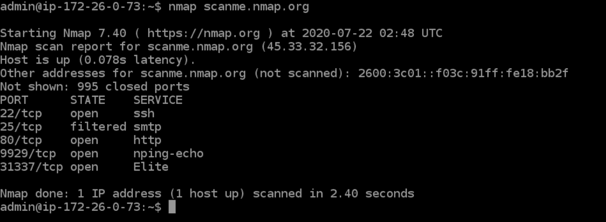
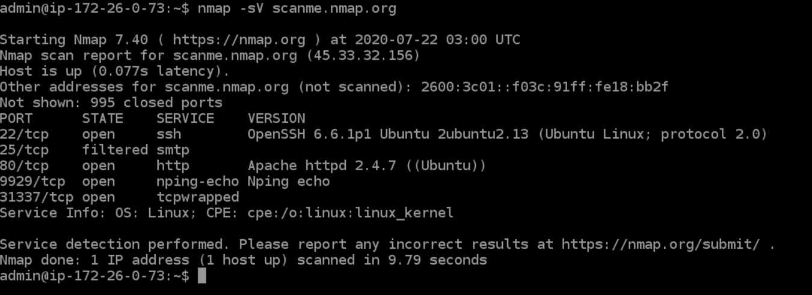
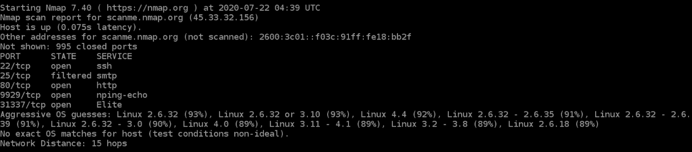
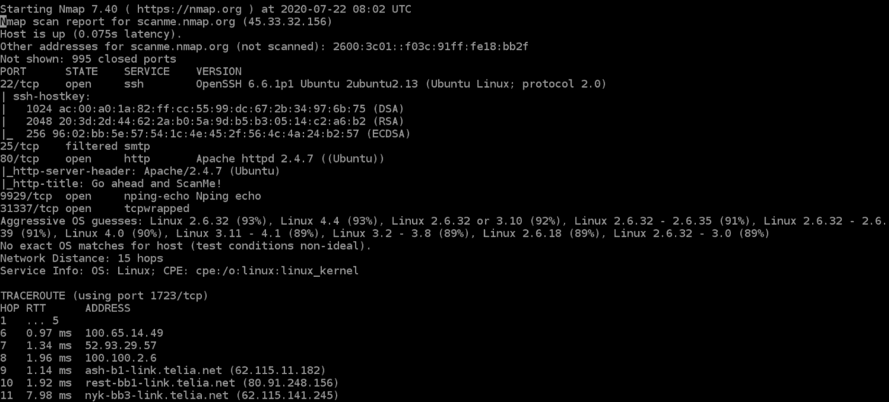
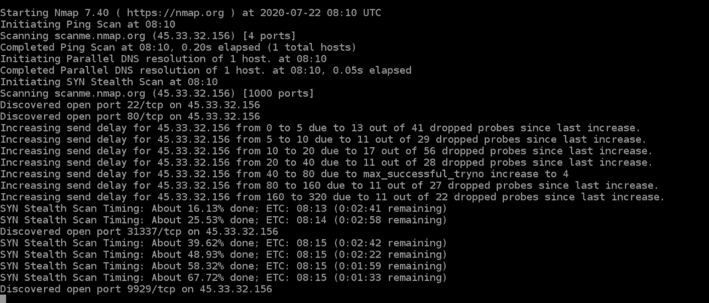
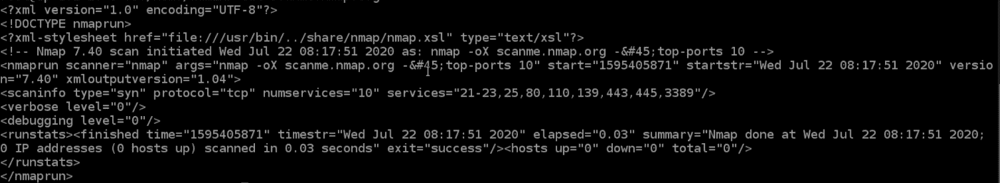
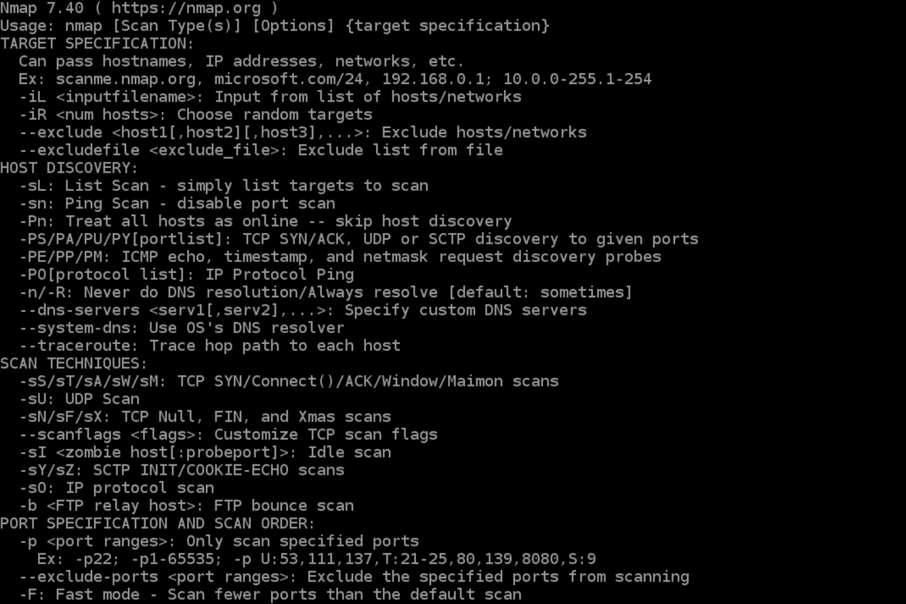
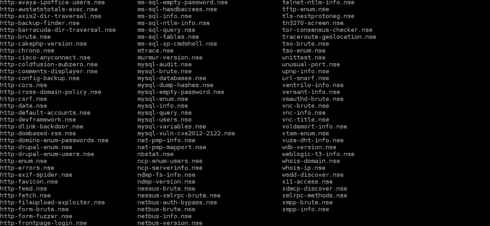
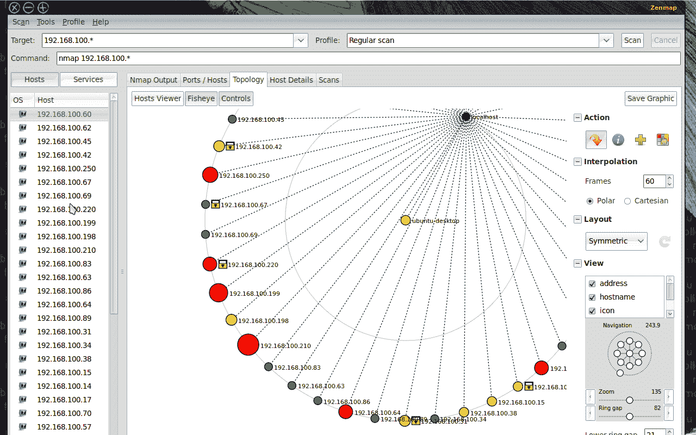

# 什么是 Nmap 以及如何使用它——有史以来最伟大的扫描工具教程

> 原文：<https://www.freecodecamp.org/news/what-is-nmap-and-how-to-use-it-a-tutorial-for-the-greatest-scanning-tool-of-all-time/>

Nmap 是渗透测试人员使用的最著名的扫描工具。在本文中，我们将了解 Nmap 的一些核心特性以及一些有用的命令。

# 什么是 Nmap？

Nmap 是网络映射器的缩写。它是一个开源的 Linux 命令行工具，用于扫描网络中的 IP 地址和端口，并检测已安装的应用程序。

Nmap 允许网络管理员发现哪些设备正在他们的网络上运行，发现开放的端口和服务，并检测漏洞。

Gordon Lyon(化名 Fyodor) 编写 Nmap 作为一种工具，帮助轻松绘制整个网络的地图，并找到其开放的端口和服务。

Nmap 已经变得非常受欢迎，出现在《黑客帝国》和热门系列《机器人先生》等电影中。

# 为什么使用 Nmap？

与其他扫描工具相比，安全专家更喜欢 Nmap 的原因有很多。

首先，Nmap 帮助您快速规划网络，无需复杂的命令或配置。它还通过 Nmap 脚本引擎支持简单的命令(例如，检查主机是否启动)和复杂的脚本。

Nmap 的其他功能包括:

*   能够快速识别单个或多个网络上的所有设备，包括服务器、路由器、交换机、移动设备等。
*   帮助识别系统上运行的服务，包括 web 服务器、DNS 服务器和其他常见应用程序。Nmap 还可以以合理的准确度检测应用程序版本，以帮助检测现有漏洞。
*   Nmap 可以找到设备上运行的操作系统的信息。它可以提供详细的信息，比如操作系统版本，使得在渗透测试期间计划额外的方法变得更加容易。
*   在安全审计和漏洞扫描期间，您可以使用 Nmap 脚本引擎中的现有脚本，通过 Nmap 攻击系统。
*   Nmap 有一个名为 Zenmap 的图形用户界面。它帮助您开发网络的可视化映射，以获得更好的可用性和报告。

# 命令

让我们看一些 Nmap 命令。如果你没有安装 Nmap，你可以[从这里](https://nmap.org/download.html)获取。

## 基本扫描

扫描网络上的活动设备列表是网络映射的第一步。为此，您可以使用两种类型的扫描:

*   ****Ping 扫描—**** 扫描给定子网上启动并运行的设备列表。

```
> nmap -sp 192.168.1.1/24
```

*   ****扫描单个主机—**** 扫描单个主机的 1000 个已知端口。这些端口是 SQL、SNTP、apache 等流行服务使用的端口。

```
> nmap scanme.nmap.org
```



## 秘密扫描

秘密扫描是通过发送 SYN 数据包并分析响应来执行的。如果收到 SYN/ACK，说明端口是打开的，可以打开 TCP 连接。

然而，隐形扫描永远不会完成[三次握手](https://www.geeksforgeeks.org/tcp-3-way-handshake-process/)，这使得目标很难确定扫描系统。

```
> nmap -sS scanme.nmap.org
```

您可以使用 ****'-sS'**** 命令来执行秘密扫描。请记住，秘密扫描速度较慢，不像其他类型的扫描那样具有攻击性，因此您可能需要等待一段时间才能得到响应。

## 版本扫描

寻找应用程序版本是渗透测试中至关重要的一部分。

这让您的生活更加轻松，因为您可以从[常见漏洞和利用(CVE)](https://cve.mitre.org/) 数据库中为服务的特定版本找到现有漏洞。然后你可以用它来攻击一台使用类似 [Metasploit](https://en.wikipedia.org/wiki/Metasploit_Project) 的利用工具的机器。

```
> nmap -sV scanme.nmap.org
```

要进行版本扫描，请使用'-sV '命令。Nmap 将提供一个服务列表及其版本。请记住，版本扫描并不总是 100%准确，但它确实让您离成功进入系统更近了一步。



## 操作系统扫描

除了服务及其版本，Nmap 还可以使用 TCP/IP 指纹提供有关底层操作系统的信息。Nmap 还会在操作系统扫描期间尝试查找系统正常运行时间。

```
> nmap -sV scanme.nmap.org
```

您可以使用像 osscan-limit 这样的附加标志将搜索限制在几个预期的目标上。Nmap 将显示每个操作系统猜测的置信度百分比。

再说一次，操作系统检测并不总是准确的，但它有助于笔测试人员更接近他们的目标。



## 侵略性扫描

Nmap 具有主动模式，支持操作系统检测、版本检测、脚本扫描和跟踪路由。您可以使用-A 参数来执行主动扫描。

```
> nmap -A scanme.nmap.org
```

主动扫描提供的信息比常规扫描好得多。但是，积极的扫描也会发出更多的探测，并且更有可能在安全审计期间被检测到。



## 扫描多台主机

Nmap 能够同时扫描多台主机。当您管理庞大的网络基础设施时，该功能非常方便。

您可以通过多种方法扫描多台主机:

*   将所有 IP 地址写在一行中，以便同时扫描所有主机。

```
> nmap 192.164.1.1 192.164.0.2 192.164.0.2
```

*   使用星号(*)一次扫描所有子网。

```
> nmap 192.164.1.*
```

*   添加逗号来分隔地址结尾，而不是键入整个域。

```
> nmap 192.164.0.1,2,3,4
```

*   使用连字符指定 IP 地址的范围

```
> nmap 192.164.0.0–255
```

## 端口扫描

端口扫描是 Nmap 最基本的功能之一。您可以通过几种方式扫描端口。

*   使用-p 参数扫描单个端口

```
> nmap -p 973 192.164.0.1
```

*   如果您指定端口类型，您可以扫描有关特定连接类型的信息，例如 TCP 连接。

```
> nmap -p T:7777, 973 192.164.0.1
```

*   可以通过用连字符分隔来扫描一系列端口。

```
> nmap -p 76–973 192.164.0.1
```

*   您也可以使用 ****-top-ports**** 标志来指定要扫描的前 n 个端口。

```
> nmap --top-ports 10 scanme.nmap.org
```

## 从文件扫描

如果您想要扫描大量的 IP 地址列表，可以通过导入包含 IP 地址列表的文件来完成。

```
> nmap -iL /input_ips.txt
```

上述命令将在“input_ips.txt”文件中生成所有给定域的扫描结果。除了简单地扫描 IP 地址，您还可以使用其他选项和标志。

## 详细程度和导出扫描结果

渗透测试可以持续几天甚至几周。导出 Nmap 结果有助于避免重复工作，并有助于创建最终报告。让我们看看导出 Nmap 扫描结果的一些方法。

### 详细输出

```
> nmap -v scanme.nmap.org
```

详细输出提供了有关正在执行的扫描的附加信息。监视 Nmap 在网络上执行的逐步操作非常有用，尤其是当您是扫描客户端网络的局外人时。



### 正常输出

Nmap 扫描也可以导出到文本文件。它将与原始命令行输出略有不同，但它将捕获所有重要的扫描结果。

```
> nmap -oN output.txt scanme.nmap.org
```


### XML 输出

Nmap 扫描也可以导出到 XML。这也是大多数笔测试工具的首选文件格式，使其在导入扫描结果时易于解析。

```
> nmap -oX output.xml scanme.nmap.org
```



### 多种格式

您还可以使用-oA 命令一次性导出所有可用格式的扫描结果。

```
> nmap -oA output scanme.nmap.org
```

上述命令会将扫描结果导出到三个文件中— output.xml、output。Nmap 和 output.gnmap。

## Nmap 帮助

Nmap 有一个内置的帮助命令，列出了您可以使用的所有标志和选项。考虑到 Nmap 附带的命令行参数的数量，这通常很方便。

```
> nmap -h
```



# Nmap 脚本引擎

Nmap 脚本引擎(NSE)是一个非常强大的工具，您可以使用它来编写脚本和自动化许多网络功能。

您可以找到大量分布在 Nmap 上的脚本，或者根据您的需求编写您自己的脚本。您甚至可以使用 [Lua 编程语言](https://en.wikipedia.org/wiki/Lua_(programming_language))修改现有的脚本。



NSE 还有攻击脚本，用于攻击网络和各种网络协议。

深入研究脚本引擎超出了本文的范围，所以这里有更多关于 Nmap 脚本引擎的信息。

## Zenmap

Zenmap 是 nmap 的图形用户界面。这是一个免费的开源软件，可以帮助您使用 Nmap。



除了提供可视化网络映射，Zenmap 还允许您保存和搜索您的扫描以备将来使用。

Zenmap 非常适合想要测试 nmap 功能而不需要通过命令行界面的初学者。

# 结论

Nmap 显然是网络的“瑞士军刀”,这要归功于它的多功能命令库。

它可以让您快速扫描和发现有关您的网络、主机、端口、防火墙和操作系统的重要信息。

Nmap 有许多设置、标志和首选项，可帮助系统管理员详细分析网络。

如果你想深入学习 Nmap，[这里有一个很好的资源给你](https://github.com/jasonniebauer/Nmap-Cheatsheet)。

**喜欢这篇文章？** [******加入我的简讯******](http://tinyletter.com/manishmshiva)***每周一获取我的文章和视频汇总***