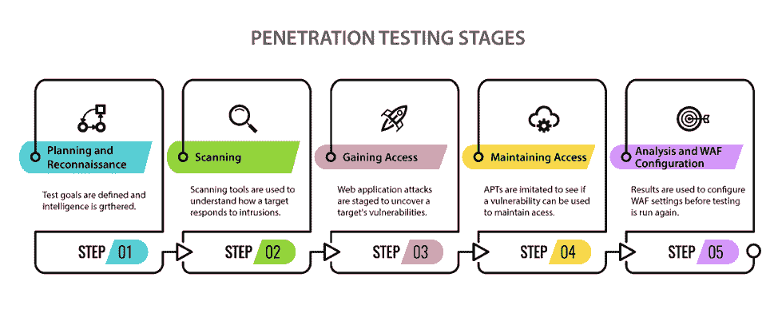
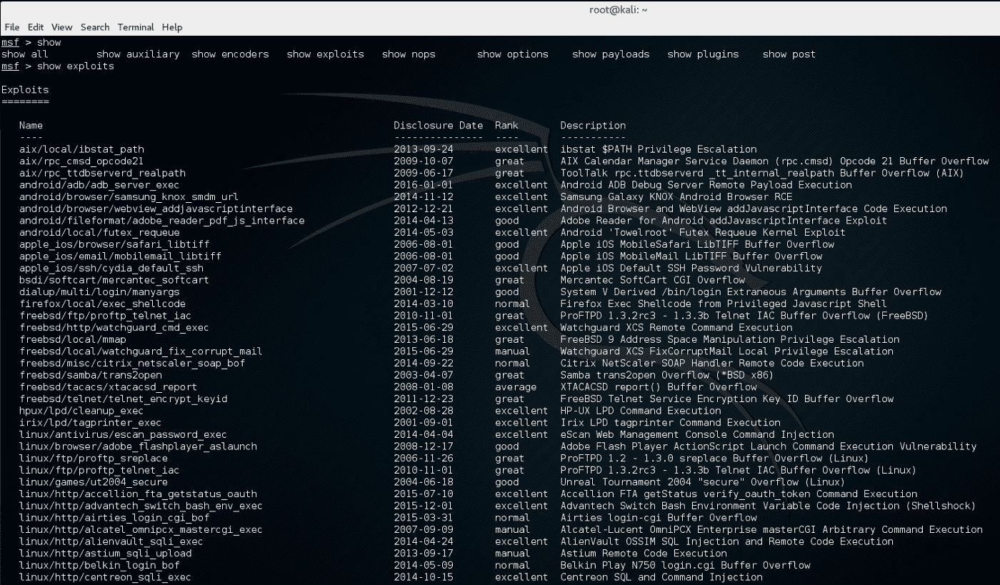
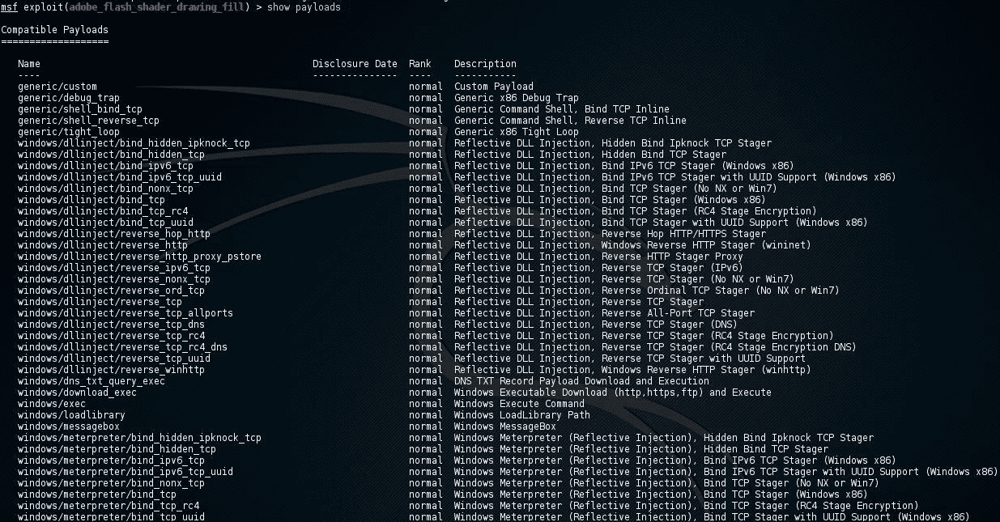
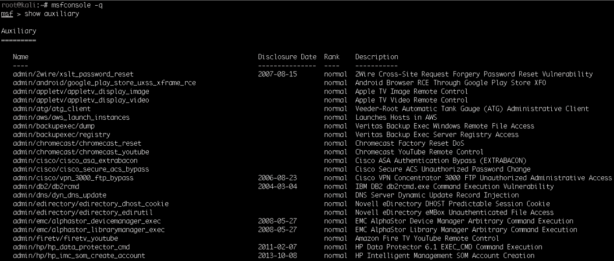
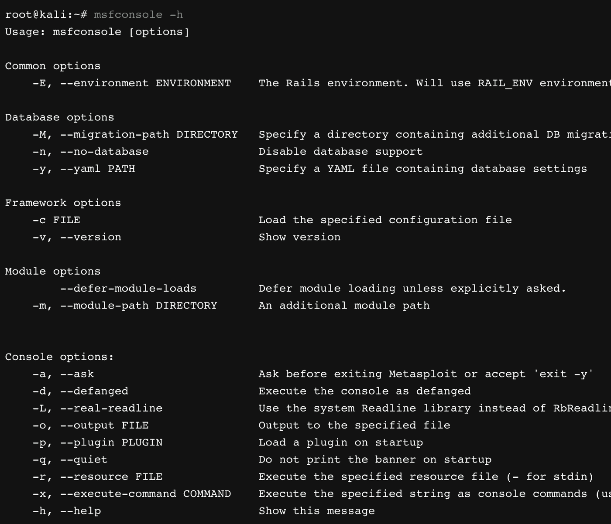
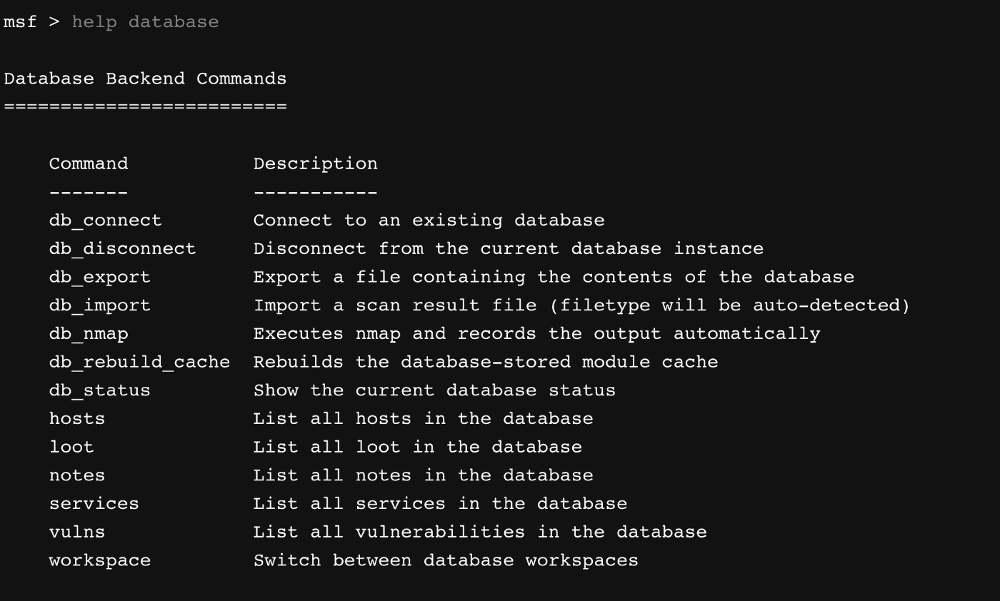
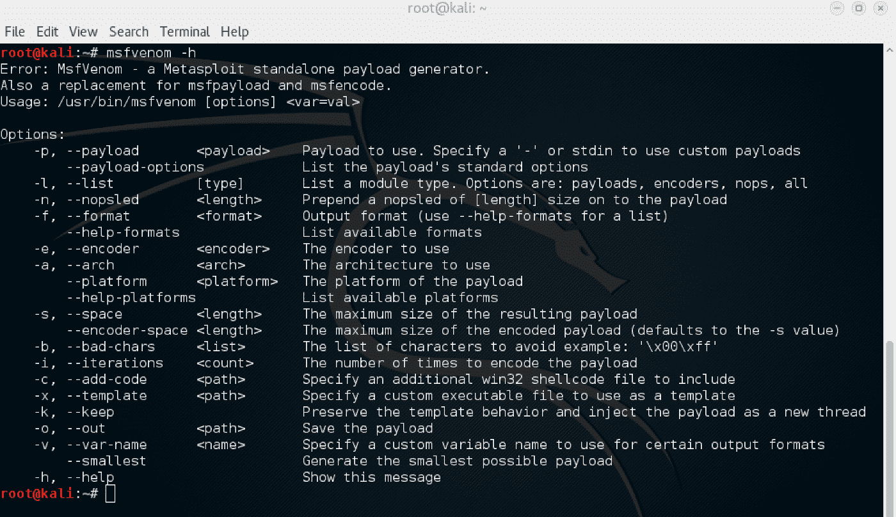
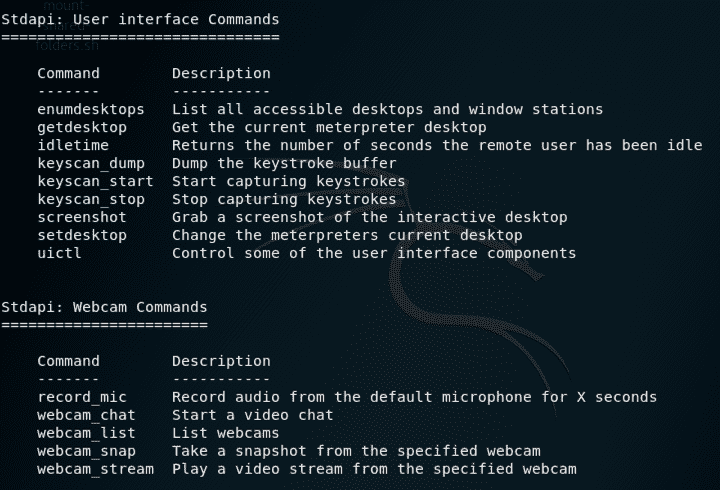
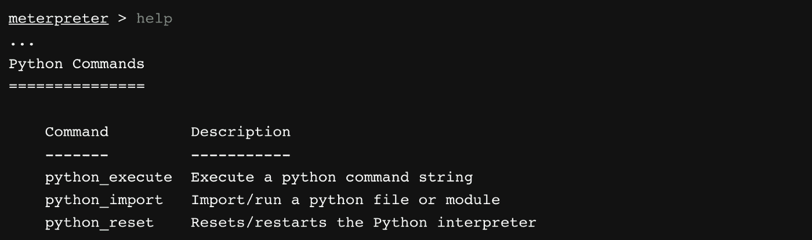
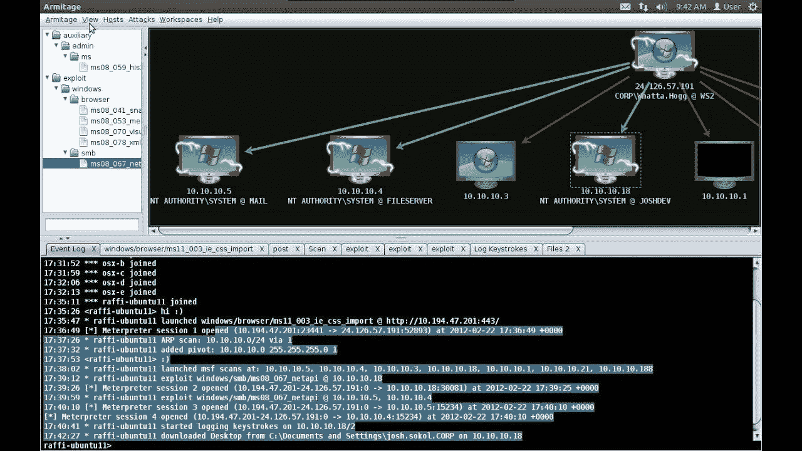

# Metasploit —功能强大的利用框架的演练

> 原文：<https://www.freecodecamp.org/news/metasploit-a-walkthrough-of-the-powerful-exploitation-framework/>

Metasploit 可以处理从扫描到利用的所有事情。在本文中，我们将看看是什么使 Metasploit 成为最通用的渗透测试工具包。

# 渗透测试简介

如果您是渗透测试的新手，在我向您介绍一个开发工具之前，让我解释一下它是什么。

渗透测试是 ****有权限的黑客**** 。你可能在电视上看到过很酷的黑客攻击计算机系统却没有被抓住。但在现实世界中并不是这样。

如果你未经许可黑了某人，你很有可能会进监狱。所以如果你是怀着恶意打算学黑客的话，我对你造成的任何伤害都不负责。我所有的文章都是纯教育性的。

那么，如果黑客技术不好，为什么一开始还要学它呢？默认情况下，互联网上的每台设备都是易受攻击的，除非有人对其进行保护。

渗透测试人员的工作是像黑客一样思考并攻击他们组织的系统。渗透测试人员然后通知组织关于漏洞的信息，并建议修补它们。

渗透测试是业内收入最高的工作之一。由于互联网上的设备数量呈指数级增长，笔测试人员总是短缺。

我最近写了一篇关于作为网络安全工程师你应该知道的十大工具的文章。如果你有兴趣了解更多关于网络安全的知识，请点击这里查看文章。

没错。说够了鼓励的话。让我们看看市场上最酷的笔测试工具之一——Metasploit。

# Metasploit —完整的框架

Metasploit 是一个渗透测试框架，帮助您发现和利用系统中的漏洞。从扫描仪到第三方集成，它为您提供了您在整个[渗透测试生命周期](https://www.freecodecamp.org/news/ethical-hacking-lifecycle-five-stages-of-a-penetration-test/)中所需的一切。

这包括侦察、扫描、利用、权限提升和维护访问。

Metasploit 是一个用 Ruby 编写的开源框架。它被设计成一个可扩展的框架，所以如果你想用 Ruby 构建定制的特性，你可以通过插件轻松实现。

Metasploit 背后的公司 Rapid7 提供了一个具有高级功能的[高级版 Metasploit。](https://www.metasploit.com/)

Metasploit 还经常更新在[常见漏洞和暴露(CVE)中发布的新漏洞。](https://cve.mitre.org/)因此，如果发现并公布了新的漏洞，您可以立即开始扫描您的系统。

Metasploit 内置了反取证和规避工具。还预装在 [Kali 操作系统](https://www.kali.org/)中。

# 成分

现在您已经知道了什么是 Metasploit，让我们来看看 Metasploit 的核心概念。

Metasploit 为您提供了一些关键组件来查找和利用网络上的漏洞。这包括利用，有效载荷，辅助，等等。让我们详细看一下其中的每一个。

## 利用

漏洞是利用系统中的漏洞的一段代码。这些攻击根据漏洞的严重程度执行特定的操作。

漏洞利用可以利用软件漏洞、硬件漏洞、[零日漏洞](https://en.wikipedia.org/wiki/Zero-day_(computing)#:~:text=A%20zero%2Dday%20(also%20known,actively%20exploited%20in%20the%20wild.)等等。一些常见的利用包括缓冲区溢出、SQL 注入等。

Metasploit 提供了许多利用方法，您可以根据目标系统中的现有漏洞加以利用。这些攻击可以分为两种类型:

*   ****主动利用—**** 主动利用会在目标系统上运行，利用系统，给你访问权限或执行特定任务，然后退出。
*   ****被动利用**** —被动利用会等到目标系统连接到利用。这种方法经常被互联网上的黑客用来要求你下载文件或软件。一旦你这样做了，你就把自己和一个运行在黑客电脑上的被动漏洞连接起来了。

## 有效载荷

有效载荷是贯穿漏洞利用的一段代码。您利用漏洞进入系统和有效负载来执行特定的操作。

例如，您可以使用一个键盘记录器作为有效载荷以及一个漏洞。一旦攻击成功，它将在目标系统中安装键盘记录程序。

Metasploit 提供了一个很好的负载集合，比如 reverse shells、bind shells、Meterpreter 等等。

有一些有效载荷将与大多数漏洞一起工作，但是需要一些研究来找到将与漏洞一起工作的正确有效载荷。

一旦您选择了一个漏洞，您可以使用 Metasploit 中的“show payloads”命令列出将与该漏洞一起工作的有效负载。

Metasploit 中有几种类型的有效负载。您最终使用最多的是这三种类型:

*   ****单打****——独立工作的有效载荷，例如键盘记录器。
*   ****Stagers**** —与他人合作的有效载荷，例如两个有效载荷:一个用于与目标建立连接，另一个用于执行指令。
*   ****Meterpreter**** —高级有效载荷，驻留在目标的内存中，难以追踪，可以随意加载/卸载插件。下面在 Meterpreter 上有一个部分我会详细解释。

## 助动词

辅助设备是帮助您执行自定义功能而不是利用系统的模块。这包括端口扫描器、模糊器、嗅探器等等。

例如，您可以使用[证书辅助工具](https://www.offensive-security.com/metasploit-unleashed/scanner-http-auxiliary-modules/)来检查网络上过期的 SSL 证书。这对于系统管理员自动化证书管理非常有用。

如果熟悉 Ruby，可以自己写辅助。如果您想每周扫描一次网络的特定漏洞，您可以编写自己的自定义辅助模块来完成这项工作。

然后，您可以使用它来扫描您的网络，而不是使用现有的扫描器，如 Nmap。

# 工具

现在您已经知道了 Metasploit 是如何工作的，让我们看看 Metasploit 提供的工具。

## **msfconsole**

MsfConsole 是 Metasploit 的默认接口。它为您提供了与 Metasploit 框架交互所需的所有命令。

熟悉 CLI 需要一点时间，但是一旦熟悉了，就很容易使用了。此外，MsfConsole 是访问 Metasploit 所有功能的唯一方式。

MsfConsole 还为常用命令提供制表符补全功能。熟悉 MsfConsole 是成为 Metasploit 专业人员的重要一步。

## **msfdb**

如果您经常使用大型网络，您可能需要一个存储数据的地方。这包括扫描结果、登录凭据等。

Metasploit 提供了一个名为 msfdb 的数据库管理工具。msfdb 在 PostgreSQL 数据库的基础上工作，并为您提供了一系列用于导入和导出结果的有用命令。

使用 msfdb，您可以从外部工具(如 Nmap 或 Nessus)导入扫描结果。Metasploit 还提供了一个本机 db_nmap 命令，允许您在 msfconsole 中使用 nmap 扫描和导入结果。

## **大麻雀**

最后我们有 msfvenom(很酷的名字，嗯？).msfvenom 允许你根据你的目标生成自定义的有效载荷。

使用防病毒软件或防火墙可以使目标系统相对安全。在这些情况下，现有的 Metasploit 有效负载可能无法工作，因为它们对于操作系统或服务下的所有系统都是通用的。

msfvenom 是由 Metsploit 拥有的两个较老的工具组合而成的:msfpayload 和 msfencode。msfvenom 允许你为你的攻击创建并[编码](https://techterms.com/definition/encoding)自定义有效载荷。

根据你对目标的额外信息，你可以制作你自己的有效载荷以在你的穿透测试中获得更高的成功率。

# 水表读数器

Meterpreter 是 Metasploit 中的高级有效负载。与执行特定功能的其他有效载荷不同，Meterpreter 是动态的，可以动态编写脚本。

如果您可以利用一个系统并注入 Meterpreter 作为有效负载，您可以做以下一些事情:

*   在您的系统和目标之间建立加密通信。
*   从目标系统转储密码哈希。
*   在目标文件系统中搜索文件
*   上传/下载文件
*   拍摄网络摄像头快照

Meterpreter 也非常隐蔽。由于 Meterpreter 存在于目标的内存中，因此极难检测。使用取证工具也很难追踪 Meterpreter。

您可以使用 Ruby 动态编写 Meterpreter 脚本来执行自定义函数。Meterpreter 还有一个 python 模块，为您提供在目标机器上执行 Python 脚本的附加命令。

# 阿米蒂奇

Armitage 是 Metasploit 的图形用户界面，用 Java 编写。Armitage 被认为是熟悉命令行界面的笔测试人员的一个很好的插件。

Armitage 的核心功能是可视化目标和推荐漏洞。Armitage 也是可脚本化的，这意味着您可以自动化像主机发现这样的冗余任务。

当您在网络中处理大量系统时，Armitage 非常有用。您可以使用 Armitage 的 GUI 来提升权限、浏览文件、转储密码散列等等。

# 摘要

Metasploit 为您提供了一套工具来执行完整的网络安全审计。Metasploit 经常使用常见漏洞和利用数据库中发布的漏洞进行更新。

您还可以通过集成或将其扫描报告导入 Metasploit 来使用其他工具，如 Nmap 和 Nessus。Metasploit 还有一个名为 Armitage 的 GUI 工具，可以让您可视化目标并推荐攻击。

如果您有兴趣了解关于 Metasploit 的更多信息，[请查看由进攻性安全](https://www.offensive-security.com/metasploit-unleashed/)发布的详细参考指南。

**喜欢这篇文章？** [******加入我的简讯******](http://tinyletter.com/manishmshiva)***每周一获取我的文章和视频汇总***