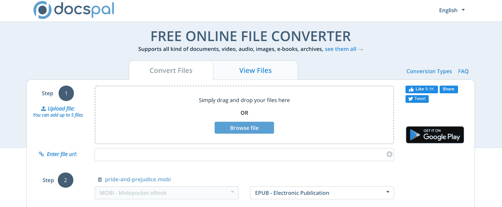
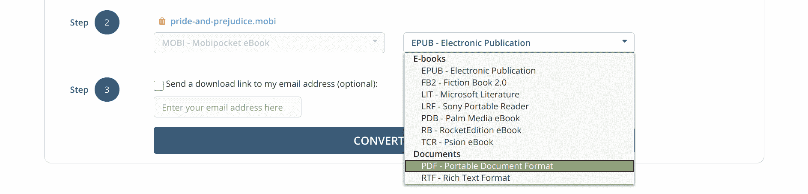
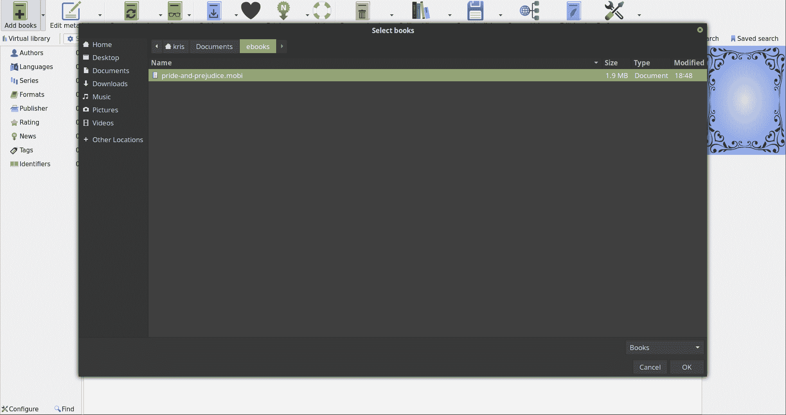
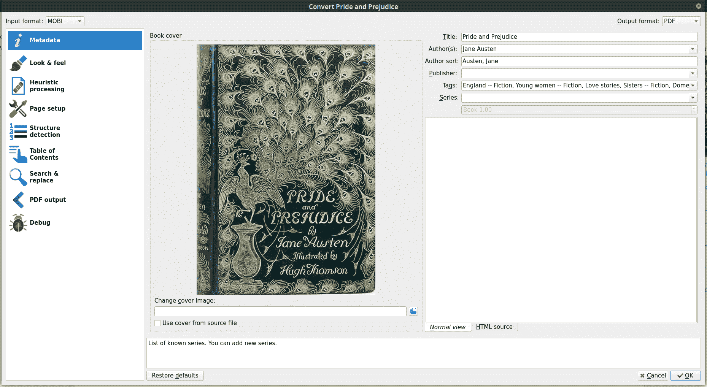

# 如何在浏览器或命令行中转换 Mobi 文件扩展名

> 原文：<https://www.freecodecamp.org/news/mobi-to-pdf-how-to-convert-to-and-from-a-mobi-file/>

如果你最近在网上买了一本书，或者在像[古滕贝格项目](https://www.gutenberg.org/)这样的网站上下载了一本免费的公共领域的书，很有可能是一个`.mobi`文件。但你可能无法打开它，因为你没有安装正确的软件。

在本文中，您将了解什么是`.mobi`文件，以及如何在`.mobi`格式之间转换，以便于在设备之间阅读。

## 什么是`.mobi`文件？

文件是由 Mobipocket 公司为他们的 Mobipocket 阅读器软件创建的电子书文件格式。

亚马逊在 2005 年收购了 Mobipocket，并基于 Kindle 电子书阅读器的文件格式(`.azw`和`.azw3`)建立了`.mobi`格式。因此，在 Kindle 设备上阅读大多数`.mobi`文件是可能的。

## 如何打开一个`.mobi`文件

有很多方法可以打开电子书。常见的建议有[口径](https://calibre-ebook.com/)、 [FBReader](https://fbreader.org/) 、官方 [Kindle app](https://www.amazon.com/b/ref=ruby_redirect?ie=UTF8&node=16571048011) 。

其中，Calibre 和 FBReader 都适用于 Windows、macOS 和 Linux。最重要的是，FBReader 也适用于 Android 和 iOS。

## 如何转换一个`.mobi`文件

无论是在线还是本地，将电子书转换成其他格式都非常简单。

### 如何在线转换成或转换成`.mobi`文件

有很多像 [docspal](https://www.docspal.com/) 这样的网站可以让你上传一个`.mobi`文件，并选择一种格式将其转换成 PDF 格式。转换完成后，您可以下载新文件。

要将`.mobi`文件转换为 PDF，请访问网站并上传文件:



接下来，从右边的下拉菜单中选择您想要将`.mobi`文件转换成的文件类型:



最后，点击“转换”按钮，下载转换后的文件。

如果您想将 PDF 文件转换为`.mobi`格式，也可以这样做——上传 PDF 文件，从右边的下拉菜单中选择`.mobi`,然后点击“转换”按钮。

### 如何在本地计算机上转换为`.mobi`文件

虽然在本地机器上将`.mobi`文件转换成其他格式有点复杂，但是 Calibre 让这变得很容易。

要将一个`.mobi`文件转换成 PDF，首先，[下载](https://calibre-ebook.com/download)并为你的操作系统安装 Calibre。

然后，打开 Calibre，点击右上角的“添加书籍”，选择您的电子书:



Selecting a `.mobi` eBook in Linux Mint

接下来，在 Calibre 图书馆中选择电子书，并点击顶部菜单中的“转换书籍”按钮。

在“转换书籍”菜单中，从右上角的“输出格式”下拉列表中选择 PDF:



最后，点击右下角的“确定”按钮。

转换完成后，您的新 PDF 文件将位于`/Calibre Library/[Book author]/`目录中。

要在 Calibre 中将 PDF 转换为`.mobi`文件，首先添加 PDF 文件，点击“转换书籍”，从“输出格式”下拉列表中选择`.mobi`，然后点击“确定”按钮。

### 如何从命令行转换成`.mobi`文件

如果你想更快地将文件转换为`.mobi`格式，Calibre 提供了一个简洁的命令行工具`ebook-convert`。

**注意:**这些指令是为 Linux 编写的，但也应该适用于 macOS，可能还适用于配置了[WSL(Windows Subsystem for Linux)](https://docs.microsoft.com/en-us/windows/wsl/install-win10)的 Windows。

要将`.mobi`文件转换为 PDF，打开终端，将`cd`转换到包含电子书文件的目录中:

```
cd ~/Documents/ebooks
```

然后，使用以下选项运行`ebook-convert`命令:

```
ebook-convert <from_file>.<from_format> <to_file>.<to_format>
```

例如:

```
ebook-convert pride-and-prejudice.mobi pride-and-prejudice.pdf
```

从 PDF 到`.mobi`同样简单:

```
ebook-convert pride-and-prejudice.pdf pride-and-prejudice.mobi
```

## 结束了

虽然`.mobi`文件是一种较旧的格式，但它们仍然受到很好的支持，并且可以很容易地转换成其他文件格式。您是在线转换文件还是本地转换文件由您决定。

然而，你决定转换你的电子书文件，保持安全，读一本好书。