# 谷歌帐户恢复:如何更改您的 Gmail 密码

> 原文：<https://www.freecodecamp.org/news/google-account-recovery-change-gmail-password/>

您可能出于多种原因想要更改您的 Gmail 密码。也许你忘了，或者你的账户被黑了。

不管是什么原因，都不是太难做到。本指南将带您一步一步地完成这一过程，让您可以放心地登录 Google。

## 如何更改您的 Gmail 密码

如果您知道自己当前的密码，但出于某种原因(很可能是与安全相关的原因)只想更改它，请按照以下步骤进行更新。

### 第一步:登录你的谷歌账户(或者打开它，如果你已经登录)。

注意——这不是 Gmail。这是你在 https://myaccount.google.com 的真实谷歌账户。看起来是这样的:

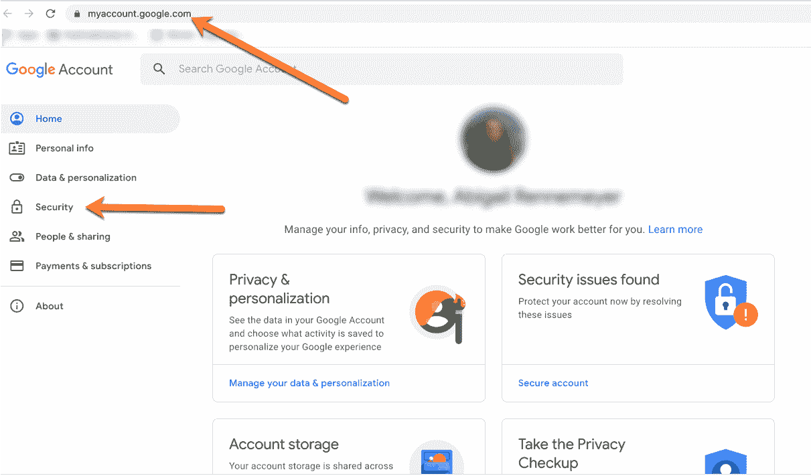

您只需使用您的用户名和当前密码登录即可。

### 步骤 2:找到安全和密码设置

登录到主页后，您会在左侧看到一个菜单栏。找到“安全”标签，并点击它(在上面的照片中指出)。

在安全设置中，您可以向下滚动，直到看到“登录 Google”:

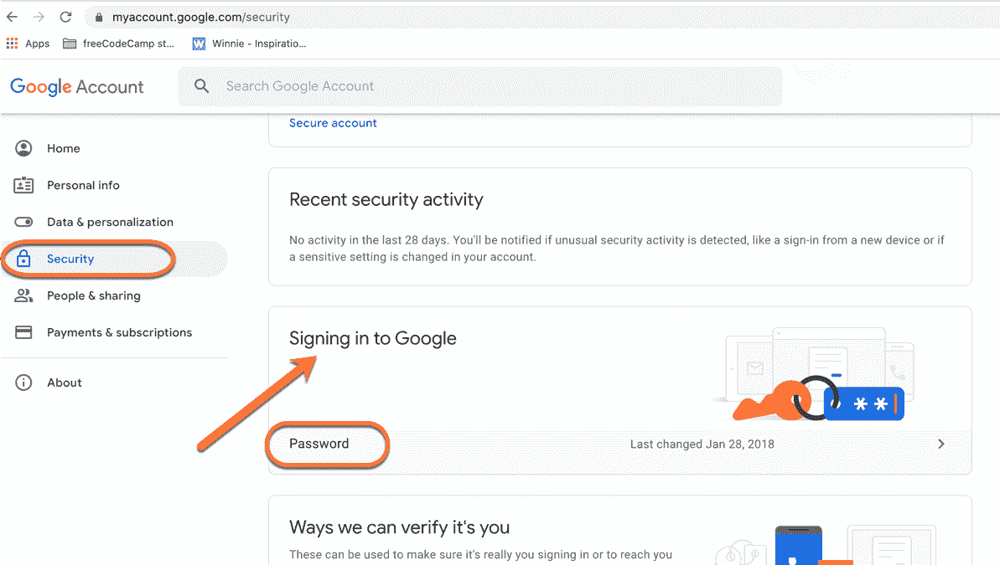

你会看到一个小小的“密码”标签(以及你最后一次更新密码的时间)。如果您单击“密码”选项卡，它会再次将您带到登录页面。

### 第三步:更改您的密码

登录，然后你会看到这个屏幕:

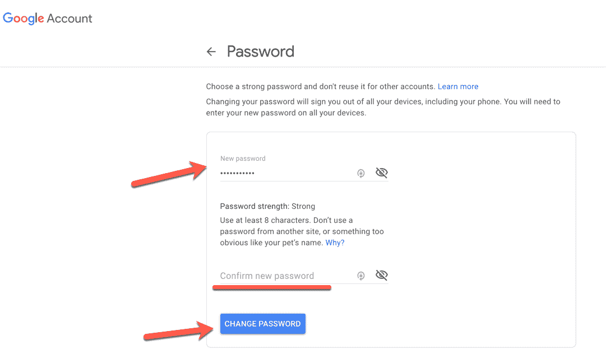

它会要求你输入一个新的密码，甚至会给你一些如何创建一个好的强密码的提示。

提示:如果你有一个密码管理器，比如 LastPass 或 1Password，让它为你生成并保存一个超级安全的密码。

你必须再次输入密码进行确认，然后点击“更改密码”(底部的蓝色大按钮)。现在你可以愉快地重新登录 Gmail、YouTube 和所有其他与谷歌相关的服务。

## 如果您忘记了 Gmail 密码，该怎么办

如果你忘记了你的谷歌密码，不要担心，你可以在几个步骤中重置它。

首先，您需要遵循几个步骤来恢复您的帐户。

### 第一步:告诉谷歌你不记得你的密码了

谷歌需要确定是你在试图恢复你的账户。否则，任何人都可以在未经您允许或您不知情的情况下重置您的密码。

首先，在你输入你的电子邮件地址后，谷歌会要求你输入你记得的最后一个工作密码。但是大概你不记得了，因为你已经忘记了你的密码...

如果你不知道，你可以点击下面的“尝试另一种方法”:

### 第二步:身份验证

单击该按钮后，您将进入一个验证屏幕，屏幕上会显示您选择的另一种通信方式，通常是通过移动设备:

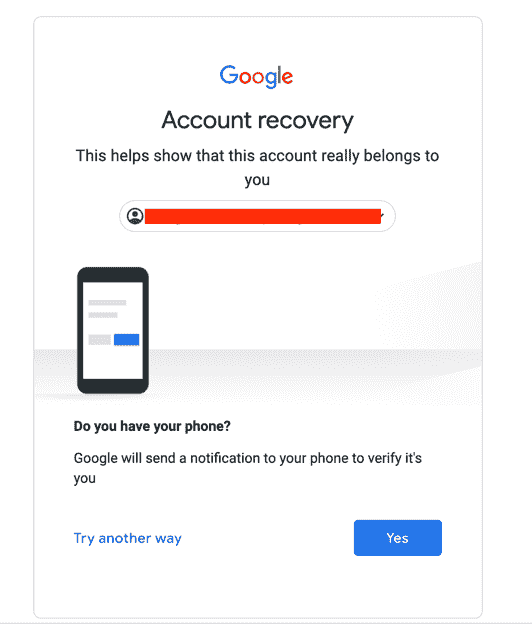

如果您单击“是”，将弹出一个带有数字代码的新屏幕，如下所示:

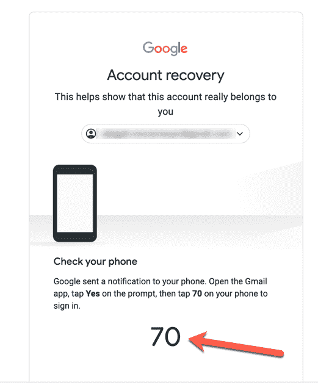

你必须检查你的手机是否有谷歌弹出的小窗口(我的是 Gmail)。当你点击它时(它会在你的主屏幕上弹出，即使你的手机被锁定)，它会带你到这个屏幕:

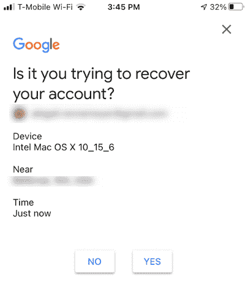

点击“是”，你会看到一个新的屏幕(在你的手机上)，上面有三个数字。其中一个应该与您的帐户恢复页面上的号码相匹配:

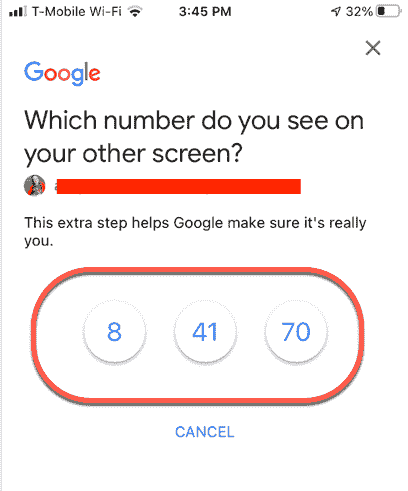

果然，有 70 个匹配项(见上图),所以点击这个数字。

### 步骤 3:最终验证

然后，它会带你到另一个屏幕，要求另一个验证步骤(通常是另一个谷歌可以发送验证码的电子邮件地址):

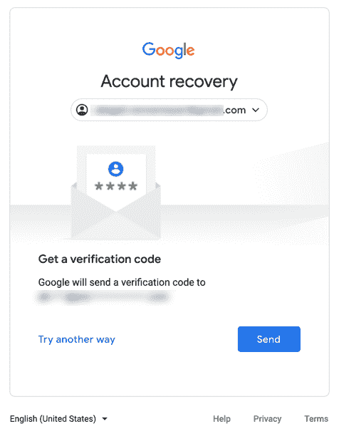

点击“发送”,很快你就会在另一封邮件中收到该代码。当你收到来自谷歌的邮件时，只要打开它——它看起来会像这样(里面有你自己的信息):

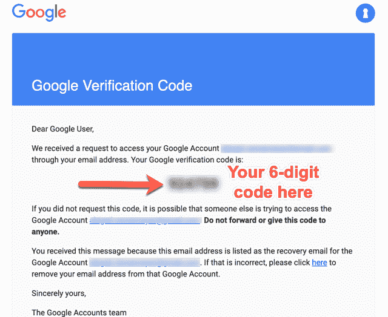

取这个六位数的代码，在谷歌账户恢复过程中出现提示时输入:

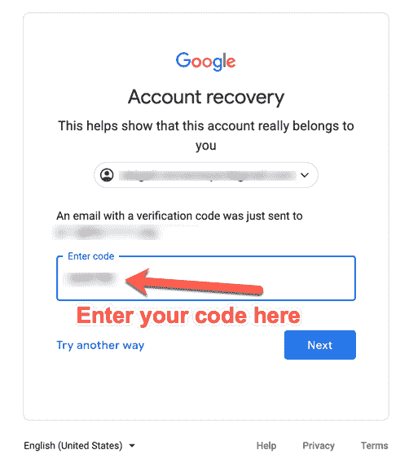

### 第 4 步:输入新密码

输入代码后，单击“下一步”。您将被带到一个屏幕，在那里您需要输入(并重新输入)您新选择的密码。

同样，你可以自己编一个，或者使用密码管理器为你生成一个非常好的密码。

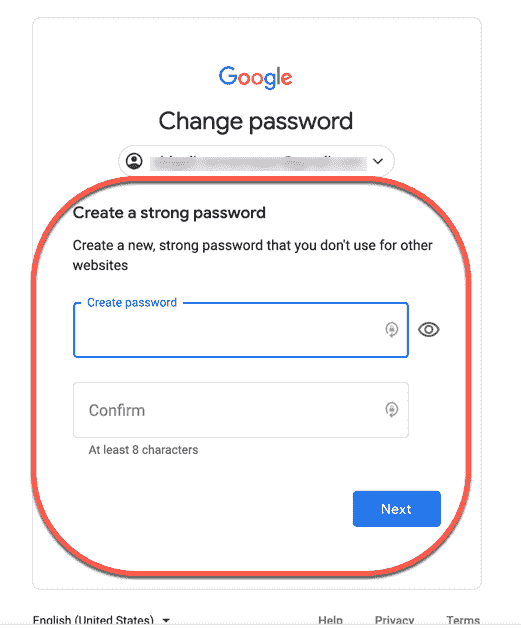

然后点击下一步，你将有一个漂亮的新密码保存在谷歌！只要回到 Gmail，或者任何你想登录的地方，用你的新密码登录。你应该都准备好了！

## 额外提示:如何改变你的谷歌账户验证方法

如果您有一个过时的电子邮件地址设置为您的“备份”或恢复电子邮件地址，您需要更改它。

回到[https://myaccount.google.com/](https://myaccount.google.com/)，再次点击安全选项卡。向下滚动一点，你会看到“我们可以验证它是你的方法。”

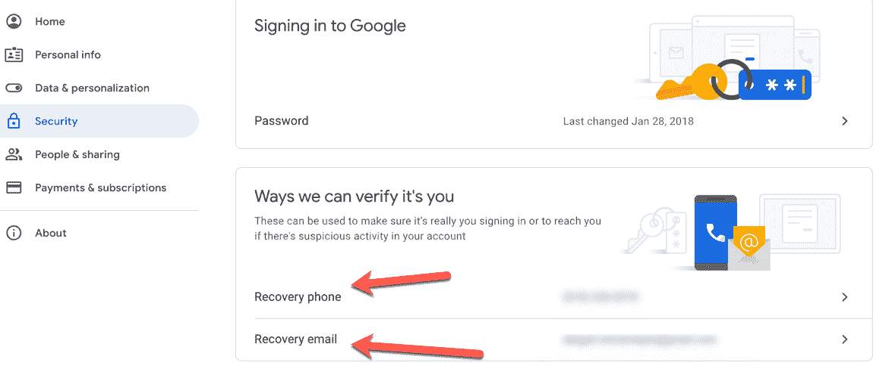

如果您需要更改您的电话号码或电子邮件，只需点击那里，它会带您到一个屏幕，您可以在那里更新信息。首先，谷歌会让你重新登录——因为你必须非常小心。