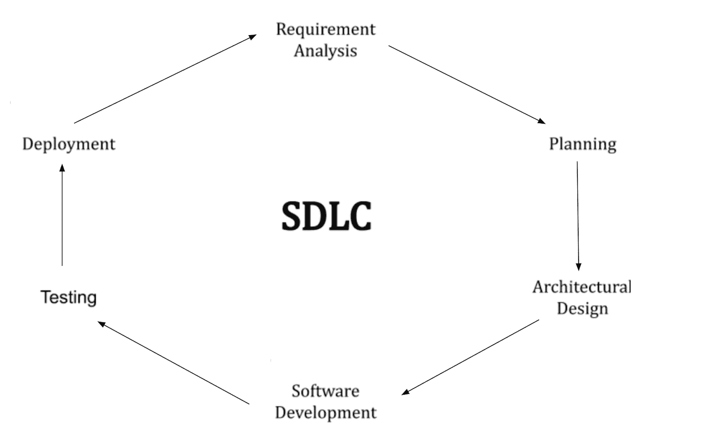

# 什么是 SDLC？解释软件开发生命周期的阶段、方法和过程

> 原文：<https://www.freecodecamp.org/news/what-is-sdlc-software-development-life-cycle-phases-methodologies-and-processes-explained/>

《管理信息技术项目》一书的作者詹姆斯·泰勒指出，“项目生命周期包含了项目的所有活动。”系统开发的目标是实现产品需求。

如果您想要学习如何构建、部署和创建高质量的软件，您将想要遵循一个蓝图。

正如 Taylor 所说，你的目标应该是整体考虑项目的所有活动，以及如何最好地管理每个阶段。

但是应该从哪里开始呢？

一个答案是利用一个框架来指导你的行为和工作流程。

一个特别强大和流行的框架叫做软件开发生命周期过程(SDLC)。

在这篇文章中，我将带你了解以下内容:

1.  SDLC 的工作原理和使用原因
2.  SDLC 的每个阶段以及在使用它时必须了解的最佳实践和方法
3.  最后，我将举例说明 SDLC 方法的好处。

## SDLC 的工作原理和使用原因

SDLC 由六个步骤组成，我在这里用图表表示出来供您参考。

总体而言，SDLC 是一个闭环。这意味着每一步都会影响后面的行动，每一阶段都会提供前瞻性的指导。

这六个阶段旨在以有效的方式相互补充，以回答问题并确保您的开发流程保持一致。

作为学生和软件开发从业者，我试图提取抽象概念并提供一些例子，让你们更容易理解。

例如，如果你努力开发为小时工设计的软件，比如 Zoomshift，或者时间跟踪软件，你可以从“需求分析”阶段开始。

在这里，在这个最基础的层次上，您将弄清楚当涉及到跟踪工时和劳动力时，员工的要求是什么。

你可以通过与小时工交谈来做到这一点。也许你会和领导小时工团队的经理们交谈。

另一个想法是，你可以测试市场上的解决方案，以更好地了解现有软件的缺陷。

您可以做笔记、画草图或构建图表来更深入地理解定性和定量反馈。

只有深刻理解了这些痛点，你才会做好进入 SDLC 下一阶段的准备。

只有这样，你才能开始计划阶段。

需求分析阶段可能会很乏味。

但是，通过这些步骤，您可以缩短上市时间，确保更好的产品产量，节省资金，并增加产品适应市场的可能性。

思考超越时间追踪。

想想你想做什么，你的技术激情在哪里。

找出解决该领域问题的需求。这是你开始的地方。

## SDLC 的各个阶段以及最佳实践和方法

在进入开发旅程的下一阶段之前，必须完成每个步骤。

最重要的是，前三个步骤寻求产生问题的答案，最后三个步骤被优化以提供输出。

*   **需求分析**
*   *回答:需要解决哪些问题？*
*   **策划**
*   *回答:我们想做什么？*
*   **架构/软件设计**
*   答案:我们如何达到我们的目标？
*   **软件开发**
*   *解决:让我们建造*
*   **测试**
*   *解决:让我们确保我们已经建立的工作*
*   **部署**
*   解决方案:让我们拿出我们的解决方案并使用它。

这六个阶段映射到您在确定范围、构建、测试和发布软件时可能已经实现的行为。但是 SDLC 使工作流程标准化和正式化。

这有利于你:通过遵循特定的步骤，你可以很容易地交流你在这个过程中的位置，并告诉别人你的前进方向。

让我们更深入地了解每个阶段，并解释您希望优化的试探性问题和结果。

### 阶段#1:需求分析

SDLC 的这个阶段迫使您从相关的内部和外部利益相关者那里获得反馈和认同。

想想我以前的时间跟踪软件开发的例子。你需要广泛地思考谁是你的“用户”。

一些想法包括你的客户，设计师，你的老板，或者团队中的其他技术代表。

最终你要回答这个问题:需要解决什么问题？我发现在第一阶段做笔记和积极倾听很有帮助。

当你对自己的答案感到非常满意时，你可以进入下一阶段。

### 第二阶段:计划

你在寻求回答这个问题:我们想做什么？这个问题可能会启发你理解你的计划的单位经济学(成本和收益)、风险缓解因素和期望值。

就像计划度假一样，你需要整理好你的东西，考虑好要打包什么行李。

这里有一个相关的例子。

我广泛阅读了 Instagram 的历史。应用程序开发的规划阶段花费了大量时间。这正是社交媒体迅速扩张的时候。

用户如何与产品互动仍然是个未知数。

创始人知道，如果基础体验很强(拍摄、编辑和分享照片)，那么成长、成功和高转化率就会随之而来。这就是他们的计划。

创始人花时间在应用程序和网站设计上，他们知道如果他们计划正确，实际的架构和设计阶段会更顺利。

他们总是向前看一步，思考社交分享和电子商务购物的未来。

为你能控制的事情做计划，留意你不能计划的事情。这将帮助你在进入第三阶段时有一个坚实的基础。

### 阶段 3:架构/软件设计

在这个阶段，你知道你的需求是什么，你想要什么。

在你开始写软件之前，你有坚实的基础来回答下面的问题:我们如何达到我们的目标？简而言之，你需要决定你在优化什么，并为此而设计。

也许你正在构建一个安全的、高性能的、有弹性的和高效的软件。这些原则中哪一个对你最重要，为什么？

第一阶段的涉众同意吗？确保利益相关方完全一致。

在设计阶段之后，你将开始把“手放在键盘上”,从花费的时间和金钱来看，做出改变将变得更加昂贵。小的可变成本会累积起来。

在这个阶段，我建议您考虑几个设计支柱:卓越运营、安全性、可靠性、性能效率和成本优化。

使用这些铲斗来推动最终的设计决策。

### 阶段 4:软件开发

这是构建阶段，在这个阶段，你不寻求回答问题，而是产生结果。

具体来说，你希望表现出对行动的偏好，并开发一个其他人可以体验的原型或系统。

当您开始构建时，遵循前三个阶段非常重要，这样您的输出才能符合预期。

把你的电脑拿出来，确保你的环境有利于工作，拿一个咖啡和保温杯，打开你的显示器。

在这个阶段，你要通过体现建设者的心态来赢得利益相关者的信任。

### 第 5 阶段:测试

我曾经看到同事们穿着 t 恤，上面写着:“砌石头，不要测试太多。”

不吃自己的“狗粮”，就生产不出一个产品的最终版本。

在这个阶段完成时，你能够确保你已经建立的工作。寻找错误或缺陷。获取第二意见。

深入调查，找出会减缓最终产品发布速度的错误。确保强劲的基本面。

### 阶段#6:部署

去拿你的解决方案并使用它。发射。去现场直播。

让第一阶段的涉众在野外使用你的软件。庆祝一下。开始衡量销售参与度。

倾听用户并重复，因为通过用户反馈调查和指导，您可以在第一阶段重新开始界定新的需求。

## 将所有这些整合在一起:SDLC 方法

SDLC 的存在是为了帮助您缩短上市时间，确保更好的产品输出，节省资金，并增加您所构建的产品对您所关心的利益相关者有用的可能性。

SDLC 在软件开发领域特别有帮助，因为它迫使您“在线内着色”

换句话说，SDLC 将迫使您遵循步骤，并确保您在正确的时间出于正确的原因采取正确的行动。

将 SDLC 视为成功的蓝图。盲目地跟随它并不能保证什么，但是它增加了你对结果满意的可能性。

众所周知，软件开发是一个广阔的领域，可以涵盖网站设计工具和在线表单，以及更强大的机器学习或后端系统。

不管你是在浏览器中编码还是做更健壮的开发工作，你都需要一个行动计划。

构建软件可能很难。

这也是有益的。SDLC 是技术工作的指南，但更广泛地说，它可以被认为是生活的指南。

您可以将 SDLC 部署到许多域中。

例如，SaaS 内容编写遵循 SDLC 周期。在写内容之前，作者必须首先定义需求，计划将要写的内容，然后真正落笔。

SDLC 对于技术企业家来说也是一个很好的框架。

我的朋友想开一家 a 公司，并向我和其他人寻求指导。我建议他使用 SDLC 首先进行需求分析，尽管他的野心很大。

我问他:你想解决什么问题？你的用户想要什么？最后，这个平台将如何帮助您实现这些目标？

通过围绕 SDLC 构建这些问题，他能够更好地专注于他的最终解决方案，并为正确的用户构建正确的工具。

他缩小了他的范围，更严格地定义了他的问题空间。他能够在开始做其他事情之前将资源分配到规划阶段。

他接着建立了据我所知最好的 Instagram 增长服务。但是他的领域在不断发展。

现在已经有软件可以大规模地扮演社交媒体日程安排者的角色。最终他将需要回到基础:需求分析。

他的技术的采用证明了 SDLC 在正确应用和执行时，可以带来深远的技术和业务成果。但是随着业务的发展，软件永远不会结束。

因此，循环继续。

无论您正在构建什么——一个公司、一个工具、一个复杂的程序或者一个全新的产品——您都应该明智地部署 SDLC 来确保质量，并帮助您在构建时保持对客户的关注。

“建筑岩石”应该是你的北极星。

SDLC 是一种工具，可以帮助您一路前行。