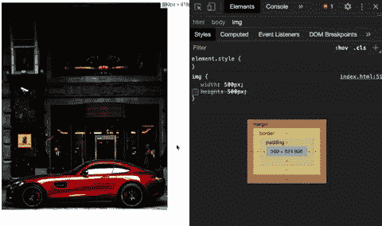
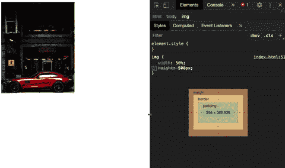
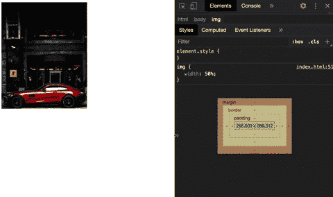
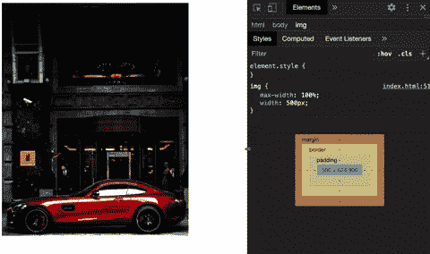
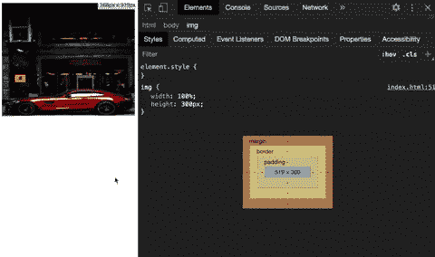
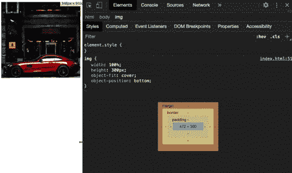

# CSS 响应图像教程:如何用 CSS 使图像响应

> 原文：<https://www.freecodecamp.org/news/css-responsive-image-tutorial/>

今天的大多数网站都有响应。如果你需要在这些网站上居中对齐图片，你需要学习如何使用 CSS 使图片流畅。

几周前，我发布了一个视频教程，解释了如何一步一步地制作一个响应性网站。在视频中，我们制作了一个有反应的图像。但是在这篇文章中，我想给出更多关于如何让图像有反应的细节。

你还会学到一些当你试图使图像具有响应性时会出现的一般性问题，我会试着解释如何解决这些问题。

## 如何用 CSS 使图像具有响应性

### 我应该使用相对单位还是绝对单位？

让图像流畅，或者有反应，其实很简单。当你上传一张图片到你的网站时，它有一个默认的宽度和高度。你可以用 CSS 改变它们。

要使图像具有响应性，您需要为其 width 属性赋予一个新值。然后图像的高度会自动调整。

需要知道的重要一点是，宽度属性应该始终使用相对单位，如百分比，而不是绝对单位，如像素。

```
img {
  width: 500px;
}
```



例如，如果你定义一个 500 像素的固定宽度，你的图像将不会有反应-因为单位是绝对的。

```
img {
  width: 50%;
}
```



这就是为什么你应该分配一个相对单位，比如 50%。这种方法将使你的图像流畅，无论屏幕大小如何，它们都可以自己调整大小。

### 我应该使用媒体查询吗？

我被问得最多的一个问题是，你是否应该使用媒体查询。

媒体查询是 CSS 的另一个重要特性，有助于提高网站的响应能力。我不会在这里进一步详述，但是你可以稍后阅读我的另一篇文章来更详细地了解如何使用媒体查询。

这个问题的答案是:“视情况而定”。如果您希望不同设备的图像大小不同，那么您需要使用媒体查询。否则，你不会。

在这个例子中，你的图像在任何类型的屏幕上都有 50%的宽度。但是，当您想要为移动设备制作全尺寸时，您需要从媒体查询中获得帮助:

```
@media only screen and (max-width: 480px) {
  img {
    width: 100%;
  }
}
```



因此，根据媒体查询规则，任何小于 480px 的设备都将采用屏幕宽度的完整尺寸。

你也可以在下面观看这篇文章的视频版本:

[https://www.youtube.com/embed/5MeogG-ZFs8?feature=oembed](https://www.youtube.com/embed/5MeogG-ZFs8?feature=oembed)

### 为什么 max-width 属性不好？

开发人员制作响应性图像的另一种方法是 max-width 属性。但是，这并不总是最好的方法，因为它可能不适用于每种屏幕尺寸或设备。

在我们继续举例之前，首先要理解 max-width 属性到底是做什么的。

max-width 属性设置元素的最大宽度，不允许该元素的宽度大于其 max-width 值(但可以更小)。

例如，如果图像的默认宽度为 500 像素，而您的屏幕尺寸只有 360 像素，那么您将看不到完整的图像，因为没有足够的空间:

```
img {
  max-width: 100%;
  width: 500px;  // assume this is the default size
}
```



因此，您可以为图像定义一个 max-width 属性，并将其设置为 100%，这将把 500 像素的图像缩小到 360 像素的空间。所以你可以在一个较小的屏幕上看到完整的图像。

好的一面是，由于你使用的是相对单位，图像在任何小于 500 像素的设备中都是流动的。

不幸的是，屏幕尺寸会比 500 像素大一些，但图像不会，因为它的默认宽度是 500 像素。这种方法会破坏图像的响应性。

要解决这个问题，您需要再次使用 width 属性，这使得 max-width 属性没有用。

### 身高呢？

您可能遇到的另一个常见问题与 height 属性有关。通常，图像的高度会自动调整大小，所以你不需要给图像分配高度属性(因为这会破坏图像)。

但是在某些情况下，您可能必须处理高度固定的图像。所以当你给图片指定一个固定的高度，它还是会有反应但是看起来不好看。

```
img {
  width: 100%;
  height: 300px;
}
```



幸运的是，CSS 提供了另一个属性来解决这个问题…

### 解决方案:对象匹配属性

为了对你的图像有更多的控制，CSS 提供了另一个叫做 object-fit 的属性。让我们使用 object-fit 属性并分配一个值，这将使您的图像看起来更好:

```
img {
  width: 100%;
  height: 300px;
  object-fit: cover;
  object-position: bottom;
}
```



如果需要，还可以使用 object-position 属性(除了 object-fit 之外)来聚焦图像的特定部分。许多人不知道对象匹配属性，但它有助于解决这类问题。

我希望这篇文章能帮助你理解和解决你的问题。如果你想了解更多关于 web 开发的知识，请随时查看我的 Youtube 频道。

感谢您的阅读！