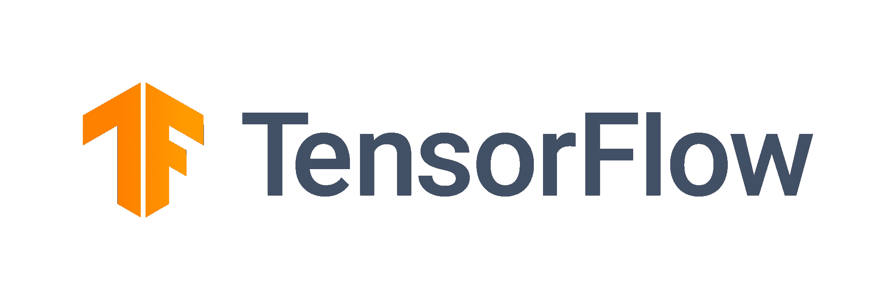
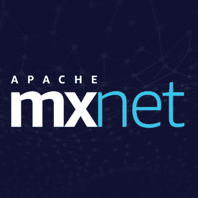
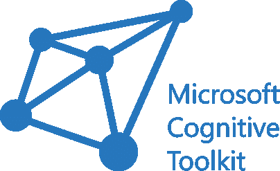
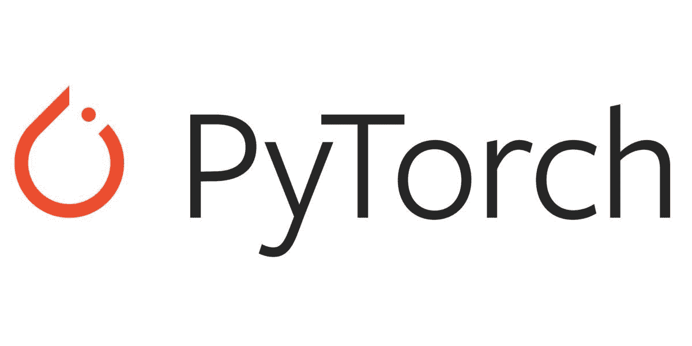
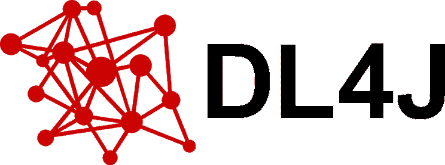

# 深度学习框架对比:MxNet vs tensor flow vs DL4j vs py torch

> 原文：<https://www.freecodecamp.org/news/deep-learning-frameworks-compared-mxnet-vs-tensorflow-vs-dl4j-vs-pytorch/>

现在是做深度学习工程师的大好时机。在本文中，我们将介绍一些流行的深度学习框架，如 Tensorflow 和 CNTK，以便您可以选择最适合您项目的框架。

深度学习是[机器学习](https://www.sas.com/en_in/insights/analytics/machine-learning.html)的一个分支。虽然机器学习有各种算法，但最强大的是神经网络。

深度学习是建立复杂多层神经网络的技术。这有助于我们解决图像识别、语言翻译、自动驾驶汽车技术等棘手问题。

从自动驾驶特斯拉汽车到 Siri 这样的人工智能助手，深度学习的现实应用数不胜数。为了构建这些神经网络，我们使用不同的框架，如 Tensorflow、CNTK 和 MxNet。

如果你是深度学习的新手，[从这里开始](https://www.coursera.org/specializations/deep-learning)做一个很好的概述。

# 结构

如果没有合适的框架，构建高质量的神经网络可能会很困难。有了正确的框架，您只需担心如何获得正确的数据。

这并不意味着光是深度学习框架的知识就足以让你成为一名成功的数据科学家。

*要成为一名成功的深度学习工程师，你需要有坚实的基础概念。*但是合适的框架会让你的生活更轻松。

还有，并不是所有的编程语言都有自己的机器学习/深度学习框架。这是因为不是所有的编程语言都有能力处理机器学习问题。

像 Python 这样的语言因其复杂的数据处理能力而脱颖而出。

让我们来看看目前流行的深度学习框架。每一种都有自己的优点和局限性。至少对这些框架有一个基本的了解是很重要的，这样你才能为你的组织或项目选择正确的框架。

# TensorFlow

TensorFlow 是周围最有名的深度学习库。如果你是数据科学家，你很可能是从 Tensorflow 开始的。它是最有效的开源库之一。

谷歌在开源 TensorFlow 之前，将其作为内部深度学习工具。TensorFlow 支持许多有用的应用程序，包括优步、Dropbox 和 Airbnb。

### 张量流的优势

*   用户友好。熟悉 Python 的话很好学。
*   [Tensorboard](https://www.tensorflow.org/tensorboard) 用于监控和可视化。如果你想看到你的深度学习模型在运行，这是一个很好的工具。
*   社区支持。来自谷歌和其他公司的专家工程师几乎每天都在改进 TensorFlow。
*   您可以使用 TensorFlow Lite 在移动设备上运行 TensorFlow 模型。
*   [Tensorflow.js](https://www.tensorflow.org/js) 让你使用 JavaScript 在浏览器中运行实时深度学习模型。

### 张量流的局限性

*   TensorFlow 相对于 MxNet 和 CNTK 这样的框架来说有点慢。
*   调试可能具有挑战性。
*   不支持 [OpenCL](https://en.wikipedia.org/wiki/OpenCL) 。

# 阿帕奇 MXNet

MXNet 是另一个流行的深度学习框架。MXNet 由 [Apache 软件基金会](https://www.apache.org/)创建，支持多种语言，如 JavaScript、Python 和 C++。MXNet 还得到亚马逊 Web 服务的支持，用于构建深度学习模型。

MXNet 是一个计算效率高的框架，用于商业和学术界。

### Apache MXNet 的优势

*   高效、可扩展且快速。
*   受所有主要平台支持。
*   提供 GPU 支持，以及多 GPU 模式。
*   支持 Scala、R、Python、C++和 JavaScript 等编程语言。
*   简单的模型服务和高性能 API。

### Apache MXNet 的缺点

*   与 TensorFlow 相比，MXNet 的开源社区更小。
*   由于缺乏主要的社区支持，改进、错误修复和其他功能需要更长的时间。
*   尽管被科技行业的许多组织广泛使用，但 MxNet 没有 Tensorflow 受欢迎。

# 微软 CNTK

大公司通常使用微软认知工具包(CNTK)来构建深度学习模型。

虽然由微软创建，但 CNTK 是一个开源框架。它通过使用一系列计算步骤以有向图的形式说明了神经网络。

CNTK 是使用 C++编写的，但它支持各种语言，如 C#、Python、C++和 Java。

微软的支持是 CNTK 的一个优势，因为 Windows 是企业首选的操作系统。CNTK 在微软生态系统中也被大量使用。

使用 CNTK 的流行产品有 Xbox、Cortana 和 Skype。

### 微软 CNTK 的优势

*   提供可靠和卓越的性能。
*   CNTK 的可扩展性使其成为许多企业的热门选择。
*   拥有众多优化的组件。
*   易于与数据处理分析引擎 [Apache Spark](https://spark.apache.org/) 集成。
*   与 Azure Cloud 配合良好，两者都由微软支持。
*   资源使用和管理是高效的。

### 微软 CNTK 的缺点

*   与 Tensorflow 相比，社区支持最少，但有一个专门的微软工程师团队全职工作。
*   显著的学习曲线。

# PyTorch

PyTorch 是另一个流行的深度学习框架。脸书在其人工智能研究实验室(FAIR)开发了 Pytorch 。Pytorch 一直在与谷歌的 Tensorflow 展开激烈竞争。

Pytorch 同时支持 Python 和 C++构建深度学习模型。三年前发布，已经被 Salesforce、脸书和 Twitter 等公司使用。

PyTorch 在图像识别、自然语言处理和强化学习等众多领域大放异彩。它也被牛津大学和 IBM 等组织用于研究。

PyTorch 也是创建计算图形的一个很好的选择。它还支持云软件开发，并提供有用的特性、工具和库。而且和 AWS、Azure 之类的云平台配合的很好。

### PyTorch 的优势

*   用户友好的设计和结构，使构建深度学习模型变得透明。
*   有有用的调试工具，如 PyCharm 调试器。
*   包含许多预先训练的模型，并支持分布式训练。

### PyTorch 的缺点

*   没有像 TensorFlow 那样的监控和可视化界面。
*   相比之下，PyTorch 是一个新的深度学习框架，目前社区支持较少。

# 深度学习 4j

如果你的主要编程语言是 Java，DeepLearning4j 是一个极好的框架。它是一个商业级、开源、分布式深度学习库。

Deeplearning4j 支持所有主要类型的神经网络架构，如 RNNs 和 CNN。

Deeplearning4j 是为 Java 和 Scala 编写的。它还可以与 Hadoop 和 Apache Spark 很好地集成。Deeplearning4j 还支持 GPU，这使得它成为基于 Java 的深度学习解决方案的绝佳选择。

### 深度学习的优势 4j

*   可扩展，可以轻松处理大量数据。
*   与 Apache Spark 轻松集成。
*   优秀的社区支持和文档。

### 深度学习的缺点 4j

*   仅限于 Java 编程语言。
*   与 Tensorflow 和 PyTorch 相比，受欢迎程度相对较低。

# 结论

每个框架都有其优缺点。但是选择正确的框架对于项目的成功至关重要。

您必须考虑各种因素，如安全性、可伸缩性和性能。对于企业级解决方案，可靠性成为另一个主要因素。

如果你刚刚开始，从 Tensorflow 开始。如果您正在构建基于 Windows 的企业产品，请选择 CNTK。如果你更喜欢 Java，选择 DL4J。

希望这篇文章能帮助你为下一个项目选择合适的深度学习框架。如果你有任何问题，联系我。

* * *

**喜欢这篇文章？** [******加入我的简讯******](http://tinyletter.com/manishmshiva)***每周一获取我的文章和视频汇总***