# Dijkstra 的最短路径算法-详细和直观的介绍

> 原文：<https://www.freecodecamp.org/news/dijkstras-shortest-path-algorithm-visual-introduction/>

欢迎光临！如果你一直想学习和理解 Dijkstra 的算法，那么这篇文章就是为你准备的。您将通过一步一步的图形解释看到它在幕后是如何工作的。

**您将了解到:**

*   基本图形概念(快速回顾)。
*   Dijkstra 的算法是用来干什么的。
*   它是如何在幕后通过一步一步的例子工作的。

让我们开始吧。✨

## 🔹图表介绍

我们先来简单介绍一下图。

### 基本概念

图形是用于表示成对元素之间的“连接”的数据结构。

*   这些元素被称为**节点**。它们代表现实生活中的物体、人或实体。
*   节点之间的连接称为**边**。

这是一张图表的图示:

**节点**用彩色圆圈表示，而**边**用连接这些圆圈的线条表示。

**💡提示:**如果两个节点之间有边，则这两个节点是连通的。

### 应用程序

图表直接适用于现实世界的场景。例如，我们可以用图来模拟运输网络，其中节点代表发送或接收产品的设施，边代表连接它们的道路或路径(见下文)。

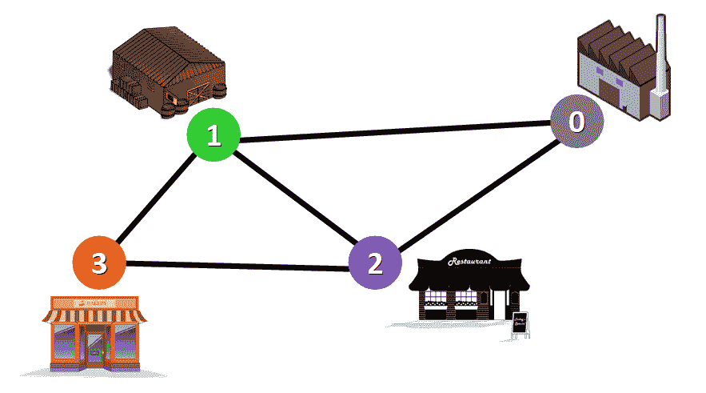

Network represented with a graph

### 图形的类型

图表可以是:

*   **无向:**如果对于每一对连通的节点，你都可以从一个节点双向到另一个节点。
*   **有向:**如果对于每一对相连的节点，你只能以特定的方向从一个节点到另一个节点。我们用箭头代替简单的直线来表示有向边。

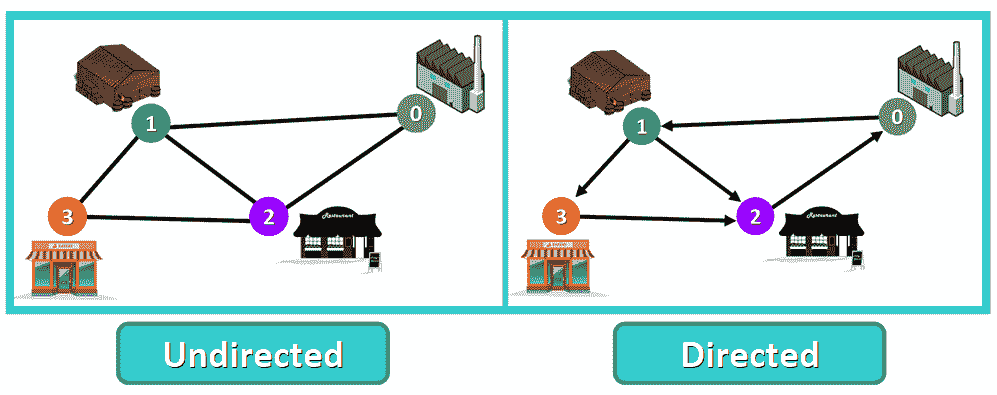

**💡提示:**在本文中，我们将使用**无向图**。

### 加权图

一个**权重图**是一个其边具有“权重”或“成本”的图。边的权重可以表示距离、时间或任何对它所连接的节点对之间的“连接”进行建模的东西。

例如，在下面的加权图中，你可以在每条边旁边看到一个蓝色的数字。这个数字用于表示相应边的权重。

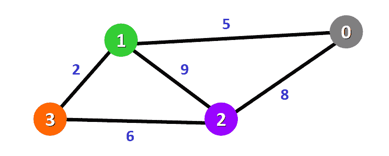

**💡提示:**这些权重对于 Dijkstra 的算法是必不可少的。一会儿你就会明白为什么了。

## 🔸Dijkstra 算法简介

现在你已经知道了图形的基本概念，让我们开始研究这个令人惊奇的算法。

*   目的和使用案例
*   历史
*   算法的基础
*   要求

### 目的和使用案例

用 Dijkstra 的算法，你可以找到一个图中节点之间的最短路径。特别是，您可以**在图**中找到从一个节点(称为“源节点”)到所有其他节点的最短路径，生成一个最短路径树。

这种算法在 GPS 设备中用于查找当前位置和目的地之间的最短路径。它在工业中有着广泛的应用，特别是在需要建模网络的领域。

### 历史

这个算法是由 Edsger W. Dijkstra 博士创造并发表的，他是一位杰出的荷兰计算机科学家和软件工程师。

1959 年，他发表了一篇 3 页长的文章，题为“关于与图有关的两个问题的说明”，其中他解释了他的新算法。

[Dr. Edsger Dijkstra](https://commons.wikimedia.org/wiki/File:Edsger_Dijkstra_1994.jpg) at [ETH Zurich](https://en.wikipedia.org/wiki/ETH_Zurich) in 1994 (image by Andreas F. Borchert)

在 2001 年的一次采访中，Dijkstra 博士透露了他设计该算法的方式和原因:

> 从鹿特丹到格罗宁根的最短路线是什么？是最短路径的算法，我大概 20 分钟设计的。一天早上，我和我年轻的未婚妻在阿姆斯特丹购物，累了，我们坐在咖啡馆的露台上喝一杯咖啡，我只是在想我是否可以这样做，然后我设计了最短路径的算法。正如我所说，这是一个 20 分钟的发明。事实上，它是在三年后的 1959 年出版的。刊物还是挺好看的。它如此漂亮的原因之一是我没有用铅笔和纸来设计它。没有纸和笔，你几乎被迫避免所有可以避免的复杂情况。最终，令我大为惊讶的是，这个算法成了我成名的基石之一。——引自[Edsger w . Dijkstra](https://dl.acm.org/doi/pdf/10.1145/1787234.1787249)的文章 [Edsger W. Dijkstra](https://en.wikipedia.org/wiki/Edsger_W._Dijkstra) 。

⭐:难以置信，对吧？仅用 20 分钟，Dijkstra 博士就设计出了计算机科学史上最著名的算法之一。

### Dijkstra 算法的基础

*   Dijkstra 的算法基本上从您选择的节点(源节点)开始，它分析图形以找到该节点和图形中所有其他节点之间的最短路径。
*   该算法跟踪从每个节点到源节点的当前已知最短距离，并且如果它发现更短的路径，它更新这些值。
*   一旦算法找到了源节点和另一个节点之间的最短路径，该节点就被标记为“已访问”并被添加到路径中。
*   该过程继续，直到图中的所有节点都被添加到路径中。这样，我们就有了一条连接源节点和所有其他节点的路径，这条路径可能是到达每个节点的最短路径。

### 要求

Dijkstra 的算法只能处理权重为**正**的图。这是因为，在这个过程中，边的权重必须相加才能找到最短路径。

如果图中有一个负的权重，那么算法将不能正常工作。一旦一个节点被标记为“已访问”，到该节点的当前路径被标记为到达该节点的最短路径。并且如果在该步骤发生后总权重可以减少，则负权重可以改变这一点。

## 🔹Dijkstra 算法的例子

现在您已经对这个算法有了更多的了解，让我们通过一个循序渐进的例子来看看它在幕后是如何工作的。

我们有这个图表:

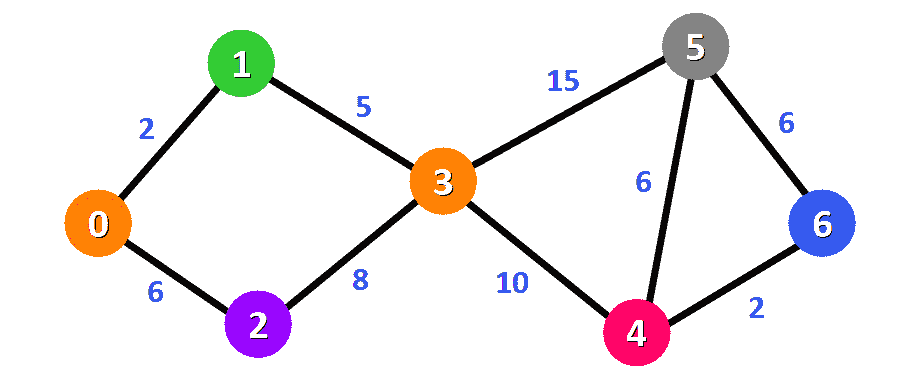

该算法将生成从节点`0`到图中所有其他节点的最短路径。

**💡提示:**对于这个图，我们将假设边的权重代表两个节点之间的距离。

对于图中的每个节点，我们将有从节点`0`到节点`1`，从节点`0`到节点`2`，从节点`0`到节点`3`的最短路径，等等。

最初，我们有这个距离列表(请参见下面的列表):

*   源节点到自身的距离为`0`。对于这个例子，源节点将是节点`0`，但是它可以是您选择的任何节点。
*   从源节点到所有其他节点的距离还没有确定，所以我们最初使用无穷大符号来表示。

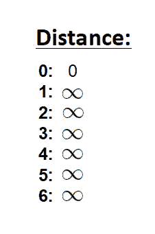

我们还有这个列表(见下文)来跟踪还没有被访问的节点(路径中没有包括的节点):

**💡提示:**记住，一旦所有节点都被添加到路径中，算法就完成了。

由于我们选择从节点`0`开始，我们可以将该节点标记为已访问。同样，我们从未访问过的节点列表中划掉它，并在图中相应的节点上添加红色边框:

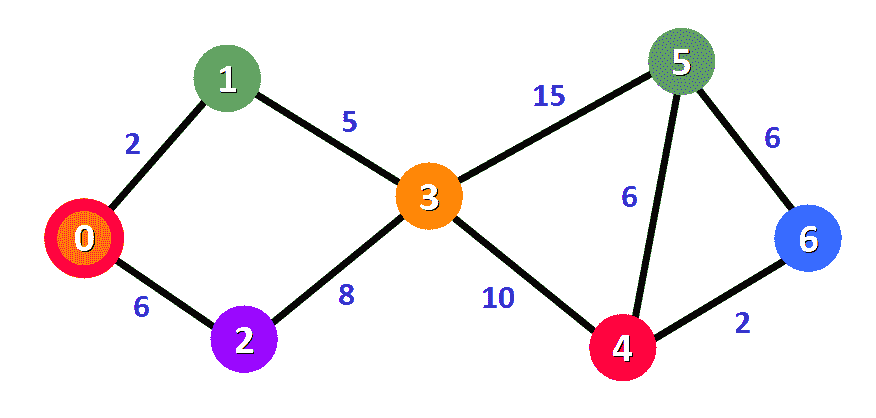

现在我们需要开始检查从节点`0`到其相邻节点的距离。如你所见，这些是节点`1`和`2`(见红色边缘):

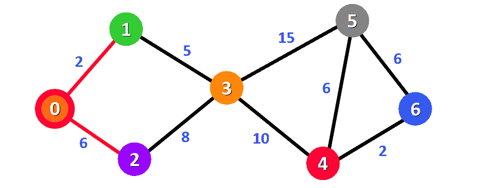

**💡提示:**这并不意味着我们立即将两个相邻节点添加到最短路径中。在向该路径添加节点之前，我们需要检查是否找到了到达该节点的最短路径。我们只是做一个初步的检查过程，看看有哪些选择。

我们需要用将节点`0`连接到节点`0`(源节点)的边的权重来更新从节点`0`到节点`1`和节点`2`的距离。这些权重分别为 2 和 6:

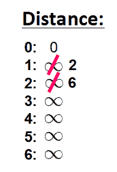

更新相邻节点的距离后，我们需要:

*   基于当前已知的距离，选择离源节点最近的节点。
*   将其标记为已访问。
*   将其添加到路径中。

如果我们检查距离列表，我们可以看到节点`1`到源节点的距离最短(距离为 2)，所以我们将它添加到路径中。

在图中，我们可以用红边来表示:

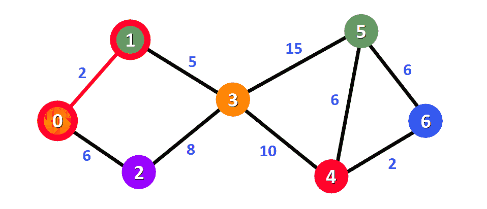

我们在列表中用红色方块标记它，表示它已经被“访问”过，并且我们已经找到了到该节点的最短路径:

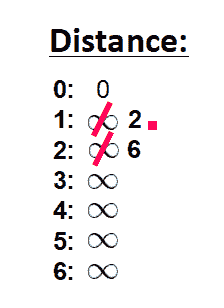

我们从未访问过的节点列表中划掉它:

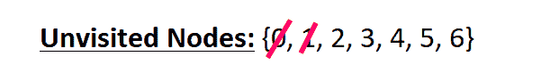

现在我们需要分析新的相邻节点，以找到到达它们的最短路径。我们将只分析与已经是最短路径(用红色边标记的路径)一部分的节点相邻的节点。

节点`3`和节点`2`都与路径中已经存在的节点相邻，因为它们分别直接连接到节点`1`和节点`0`，如下图所示。这些是我们将在下一步中分析的节点。

因为我们已经在列表中记录了从源节点到节点`2`的距离，所以这次我们不需要更新距离。我们只需要更新从源节点到新的相邻节点(节点`3`)的距离:

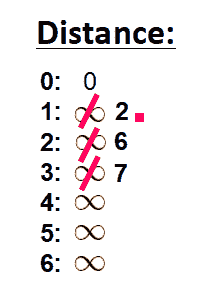

这个距离是 **7** 。我们来看看为什么。

为了找到从源节点到另一个节点(在本例中是节点`3`)的距离，我们将构成到达该节点的最短路径的所有边的权重相加:

*   **对于节点`3` :** ，总距离为 **7** ，因为我们添加了形成路径`0 -> 1 -> 3`的边的权重(边`0 -> 1`为 2，边`1 -> 3`为 5)。

现在我们已经知道了到相邻节点的距离，我们必须选择将哪个节点添加到路径中。我们必须选择到源节点距离最短(当前已知)的**未访问的**节点。

从距离列表中，我们可以立即发现这是距离为 **6** 的节点`2`:

我们以图形方式将它添加到路径中，在节点周围有红色边框和红色边缘:

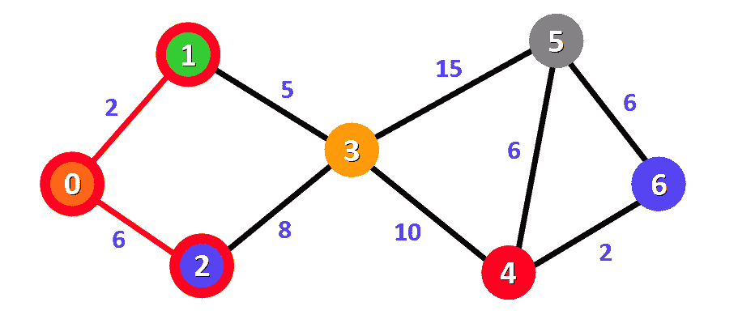

我们还将它标记为已访问，方法是在距离列表中添加一个红色小方块，并将其从未访问的节点列表中划掉:

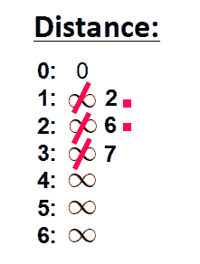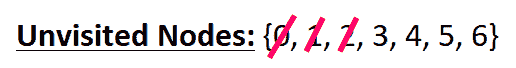

现在我们需要重复这个过程来寻找从源节点到新的相邻节点的最短路径，这个节点就是节点`3`。

你可以看到我们有两条可能的路径`0 -> 1 -> 3`或`0 -> 2 -> 3`。让我们看看如何决定哪一个是最短的路径。

节点`3`在之前记录的列表中已经有一个距离( **7，**见下表)。这个距离是上一步的结果，我们添加了两条边的权重 5 和 2，我们需要穿过这两条边来跟随路径`0 -> 1 -> 3`。

但是现在我们有了另一个选择。如果我们选择沿着路径`0 -> 2 -> 3`，我们将需要沿着两条边`0 -> 2`和`2 -> 3`，它们的权重分别为 **6** 和 **8** 、、，这表示总距离为 **14** 。

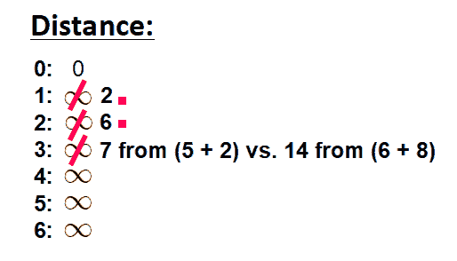

显然，第一个(现有的)距离更短(7 对 14)，因此我们将选择保留原始路径`0 -> 1 -> 3`。**如果新路径更短，我们只更新距离。**

因此，我们使用第一个选项:`0 -> 1 -> 3`将这个节点添加到路径中。

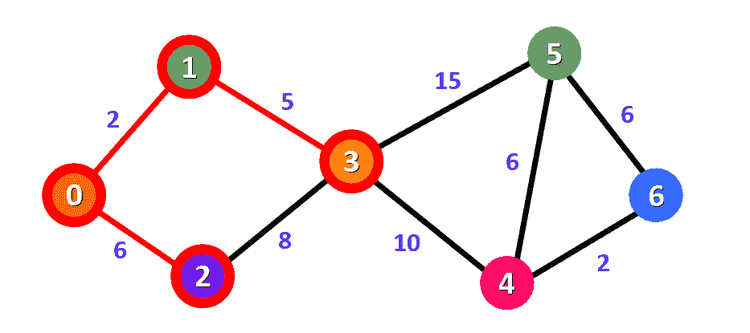

我们将该节点标记为已访问，并将其从未访问节点列表中划掉:

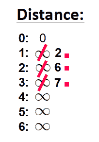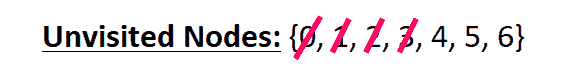

现在我们再次重复这个过程。

我们需要检查到目前为止还没有访问过的新的相邻节点。这一次，这些节点是节点`4`和节点`5`，因为它们与节点`3`相邻。

我们更新这些节点到源节点的距离，如果可能的话，总是试图找到更短的路径:

*   **对于节点`4` :** 距离路径`0 -> 1 -> 3 -> 4`为 **17** 。
*   **对于节点`5` :** 距离路径`0 -> 1 -> 3 -> 5`为 **22** 。

**💡提示:**注意，我们只能考虑延长最短路径(用红色标记)。我们不能考虑将带我们通过没有被添加到最短路径的边的路径(例如，我们不能形成通过边`2 -> 3`的路径)。

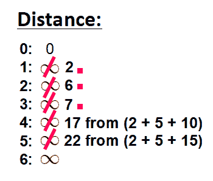

我们需要选择哪个未访问的节点现在将被标记为已访问。在这种情况下，它是节点`4`,因为它在距离列表中距离最短。我们将它添加到图表中:

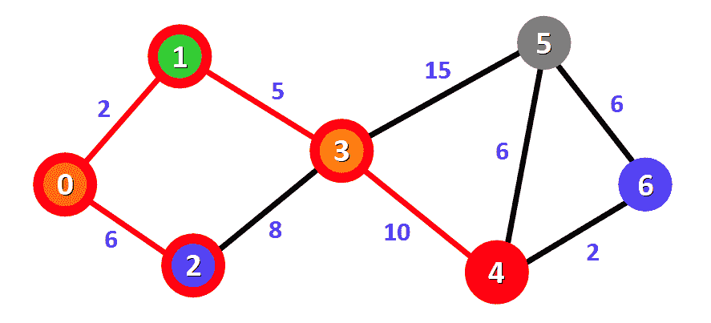

我们还通过在列表中添加一个红色小方块将其标记为“已访问”:

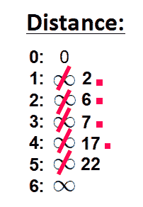

我们将它从未访问节点列表中划掉:

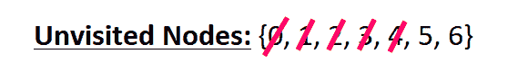

我们再次重复这个过程。我们检查相邻的节点:节点`5`和节点`6`。我们需要分析从已经被标记为已访问并添加到路径中的节点到达它们的每条可能路径。

**为节点`5` :**

*   第一个选项是沿着路径`0 -> 1 -> 3 -> 5`，该路径与源节点的距离为**22**(2+5+15)。该距离已经记录在上一步的距离列表中。
*   第二个选项是沿着路径`0 -> 1 -> 3 -> 4 -> 5`，该路径距离源节点**23**(2+5+10+6)。

显然，第一条路径更短，所以我们选择它作为节点`5`。

**为节点`6` :**

*   可用路径为`0 -> 1 -> 3 -> 4 -> 6`，距离源节点**19**(2+5+10+2)。

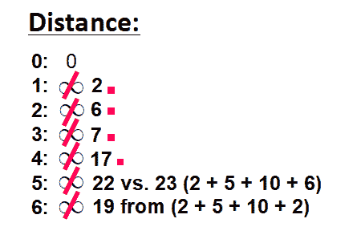

我们将具有最短(当前已知)距离的节点标记为已访问。在本例中，节点`6`。

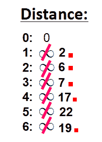

我们将它从未访问节点列表中划掉:

现在我们有了这条路径(用红色标记):

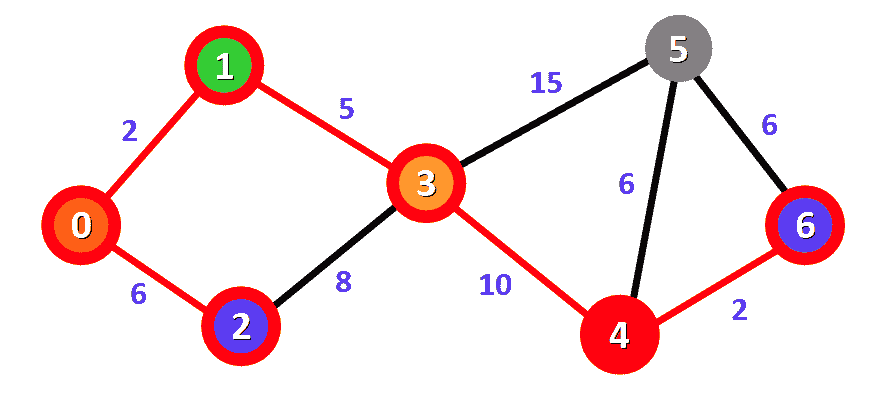

只有一个节点还没有被访问，节点`5`。让我们看看如何将它包含在路径中。

从添加到路径中的节点到节点`5`,我们可以采用三种不同的路径:

*   **选项一:** `0 -> 1 -> 3 -> 5`距离 **22** (2 + 5 + 15)。
*   **选项二:** `0 -> 1 -> 3 -> 4 -> 5`距离 **23** (2 + 5 + 10 + 6)。
*   **选项三:** `0 -> 1 -> 3 -> 4 -> 6 -> 5`距离 **25** (2 + 5 + 10 + 2 + 6)。

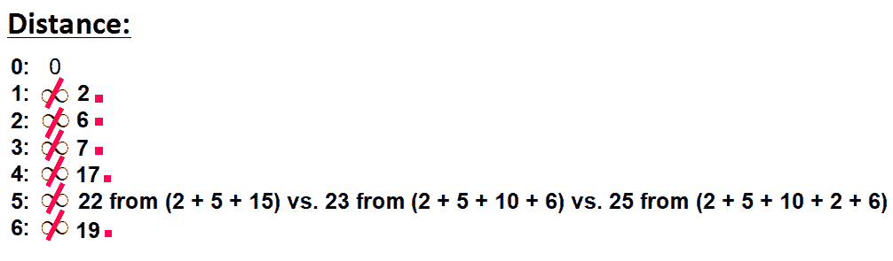

我们选择距离 **22** 的最短路径:`0 -> 1 -> 3 -> 5`。

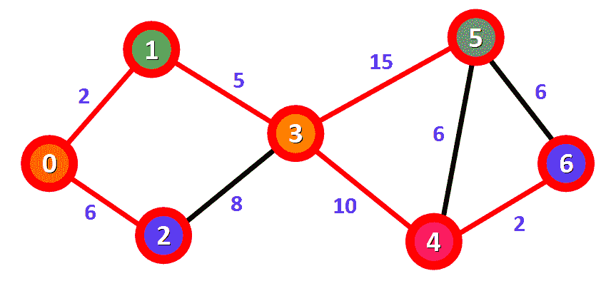

我们将该节点标记为已访问，并将其从未访问节点列表中划掉:

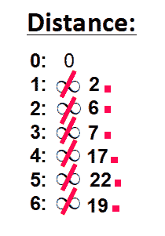

**瞧！**我们得到了从节点`0`到图中每个节点的最短路径的最终结果。

在图中，红线标记了属于最短路径的边。您需要沿着这些边，从节点`0`开始，沿着最短路径到达图中的给定节点。

例如，如果你想从节点`0`到达节点`6`，你只需要沿着红色的边，你将自动沿着最短的路径`0 -> 1 -> 3 -> 4 - > 6`前进。

## 🔸概括起来

*   图形用于对对象、人或实体之间的联系进行建模。它们有两个主要元素:节点和边。节点代表对象，边代表这些对象之间的连接。
*   Dijkstra 的算法寻找给定节点(称为“源节点”)和图中所有其他节点之间的最短路径。
*   该算法使用边的权重来寻找使源节点和所有其他节点之间的总距离(权重)最小的路径。

我真的希望你喜欢我的文章，并觉得它很有帮助。现在你知道 Dijkstra 的算法是如何在幕后工作的了。在推特上关注我[@ estefanicassn](https://twitter.com/EstefaniaCassN)和[查看我的在线课程](https://www.udemy.com/user/estefania-cn/)。