# Visual Studio 代码片段——初学者的权威 VS 代码片段指南

> 原文：<https://www.freecodecamp.org/news/definitive-guide-to-snippets-visual-studio-code/>

代码片段可以为您的编辑器增添一丝魔力。就像咒语一样。说出一个简短的短语(键入前缀)，挥动你的魔杖(按下`Enter`或`Tab`)，然后！一场精彩的赛事在你面前展开。✨

大多数代码编辑器都支持现成的代码片段。我将用来展示代码片段的代码编辑器是 Visual Studio Code (VS Code)，它是当今最流行的编辑器。

此外，有一些“文本扩展器”应用程序，允许您全局使用片段(跨所有应用程序)。我将简要介绍如何利用这些应用程序从 snippets 中获取更多信息。

让我们深入了解所有的事情片段。？

## 定义

> 代码片段是可以插入到文档中的模板。它是通过命令或某些触发文本插入的。

使用代码段，您可以创建样板文件，并插入常用的文本块。总的想法是让你不用一遍又一遍地完全输入同样的东西。？

## 为什么应该使用片段？

我不会用这句话来震惊你:互联网是许多相互矛盾的观点的家园！片段也逃不过这种耻辱，但我不认为这是一个让人血压飙升的话题！

为了平衡起见，我将在这里提出这些意见的一个截面。

你不必选择一个阵营，然后全力支持或全力反对。我建议你采用它们到最适合你的程度。

### 耶营？

*   代码片段可以提高您的工作效率，节省击键次数并减少输入错误。
*   Snippets 让我有更多的精力和乐趣来写我关心并想专注的代码。
*   片段可以帮助你记住包括一些重要的东西！
*   将代码片段集成到您的工作流程中，这无疑会鼓励您减少使用鼠标。写得好的代码片段提供了一个逻辑路径，你可以通过 tab 键浏览，中途停下来编辑，完全按照你想要的方式完成模板，当你完成时，你到达另一边准备写下一行

### 不营地？

*   我避免使用它们，主要是因为我不喜欢依赖任何给定的工具。
*   我从不使用片段。我更喜欢花时间避免重复，而不是让重复变得更容易。
*   我发现在某些时候我忘记了如何在不使用代码片段的情况下编写代码。对于我理解的琐碎的东西，这是可以的，但我不想忘记一些其他的东西！
*   对于我正在寻找的代码，我在网上看到的大部分(如果不是全部)代码片段都有错误。我从来没有找到一个没有浮点误差的数值算法。我无法想象会有任何非常干净的代码片段。

## 什么时候应该使用代码片段？

计算机科学的大巫师之一唐纳德·克努特(Donald Knuth)说:“(代码的)过早优化是万恶之源”。

我认为这也与片段相关。代码片段是对代码生产的优化。如果你不太了解一种语言或框架，那么为该语言或框架实现一系列代码片段可能是不成熟的举动。

如果你觉得舒服，那就试试吧！

## 我用片段做什么

就我个人而言，我经常使用片段，但很明智。我用一套代码片段来做 Markdown 和我使用的大多数语言。

对于框架，我没怎么用过片段。我最近开始为 Vue 使用一些片段，但我只使用样板片段。一旦我的 Vue 智商上升，我可能会采用更多的方法。

我没有用代码片段来做算法。

## 片段的类型

代码片段可以根据代码片段和编辑器之间的交互范围进行分类。

#### 静态片段

您可以将它看作是将一些源文本作为一个命令进行复制和粘贴。

#### 动态片段

可以定制一个动态代码片段，为代码片段的完成提供类似向导的体验。

它可以包括:

*   *制表位*:您可以对可以按顺序跳转的制表位进行编号，
*   *镜像制表位*:有时候你需要在插入文本的几个地方提供相同的值。您可以镜像制表位来实现这一点，任何编辑都会立即反映在相关的制表位中。
*   *占位符*:它是一个带有默认值的制表位，可以在焦点上被覆盖。
*   *选择*:在一个制表位，你会看到一个下拉列表供你选择。
*   *变量*:来自环境的输入值，例如:编辑器中选定的文本、系统日期或剪贴板中的内容。

下面是一个降价片段的示例，它添加了一个包含两个任务的任务列表。它使用*制表位*、*占位符*和*选项*来检查任务。

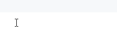

#### 宏片段

魔法的最高境界是能够转换输入。转换允许您在插入变量之前改变变量的值，或者在编辑后改变占位符。

例如，您可能希望在输入类名后将其大写。

你能想到的用正则表达式做的任何事情通常都是可能的。一些编辑器提供了更高级的脚本可能性。

## Visual Studio 代码中的代码段

在 VS 代码中，代码片段出现在**智能感知** ( `Ctrl+Space`给你一个建议列表)，它们与其他建议混合在一起。

您也可以通过使用**‘插入代码片段’命令**在专用代码片段选择器中访问它们。这将该语言的所有用户、扩展和内置代码片段合并到一个列表中。


Emmet 被集成到 VS 代码中，并拥有自己的 CSS 选择器风格的语法，用于插入 HTML 和 CSS 片段。

埃米特确实是它自己的东西，但是机制是一样的。你可以通过 Visual Studio 代码指南中的 [Emmet 来了解 Emmet。](https://code.visualstudio.com/docs/editor/emmet)

### 相关用户设置

如果您正在使用的语言的设置`editor.quickSuggestions`设置为 true，片段将显示为**快速建议**。除 markdown 之外，大多数语言都默认启用快速建议。

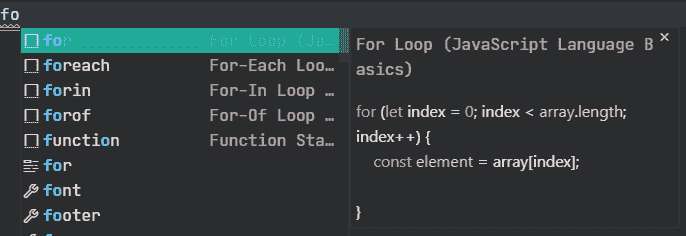

代码片段支持 **tab 补全**。您可以键入代码片段前缀(触发文本)，然后按`Tab`插入代码片段。您可以通过设置`editor.tabCompletion`来启用它。

这些值是:

*   `on`:所有源都启用制表符补全。
*   `off`:禁用制表符补全。这是*的默认值*。
*   `onlySnippets`:仅针对代码片段的制表符补全。

```
"editor.tabCompletion": "onlySnippets", 
```

如果您想控制如何显示**片段建议**，您可以编辑设置`editor.snippetSuggestions`。

这些值是:

*   `top`:在其他建议之上显示片段建议。我用这个值。
*   `bottom`:在其他建议下方显示片段建议。
*   `inline`:显示片段建议和其他建议。这是*的默认值*。
*   `none`:不显示片段建议。

```
"editor.snippetSuggestions": "top", 
```

这些是片段最重要的设置，但还有更多。您可以查看默认设置的[列表以了解更多信息，或者在设置 UI 中进行搜索。](https://code.visualstudio.com/docs/getstarted/settings#_default-settings)

### 有内置的片段吗？

是啊！

但是，它们没有记录在 VS 代码文档中。在 VS 代码中，没有一个中心点来浏览它们。所以，你可能不知道它们是什么。

那么，如何才能找出哪些语言有内置的代码片段呢？

长话短说，我对这种情况感到沮丧，所以我写了一个名为 [**Snippets Ranger**](https://marketplace.visualstudio.com/items?itemName=robole.snippets-ranger) 的扩展，以提供一个很好的 UI 来轻松地探索代码片段。把它想象成一张*活点地图*的片段！

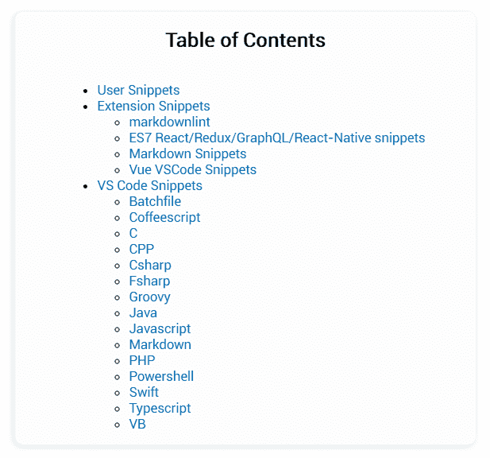

#### 但是我想自己找片段？

你可以的，只是需要多一点努力。

正如我前面提到的，**‘插入代码片段’命令**将显示活动文档语言的所有代码片段。

请记住，这是所有用户、扩展和内置代码片段的*集合*。因此，如果您想知道某种语言是否有内置代码片段，您需要打开该语言的文件，并运行命令来查看该列表。

如果您为该语言安装了 snippets 扩展，使得很难识别哪个是哪个，您可以禁用它以确保只显示内置的 snippets。？

如果您想自己追踪源文件，内置的代码片段位于每个单独的语言扩展目录中。在 Windows 上，该文件位于`«app root»\resources\app\extensions\«language»\snippets\«language».code-snippets`位置。Mac 和 Linux 的位置类似。

### 代码片段扩展

Visual Studio Marketplace 有一个 [snippets 类别](https://marketplace.visualstudio.com/search?target=VSCode&category=Snippets&sortBy=Installs)，在这里你可以找到几乎任何东西的代码片段。

许多编程语言包扩展也包含代码片段(Python、C#、Go、Java 和 C/C++等等)。

### 我怎么写我自己的？

片段文件是用 JSON 编写的。如果愿意，还可以添加 C 风格的注释(技术上是微软的“JSONC”格式)。

您可以为不同的范围创建代码段:全局、工作区和特定的语言。

要创建 snippets 文件，运行**‘首选项:配置用户 Snippets’命令**，打开如下快速选择对话框。您的选择将打开一个文件进行编辑。

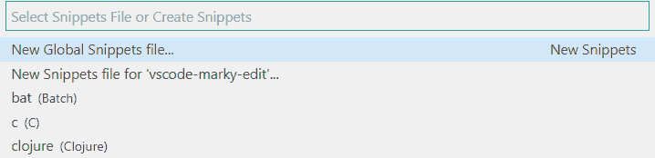

如果您更喜欢在 GUI 中编写代码片段，您可以使用[代码片段生成器 web 应用程序](https://snippet-generator.app)。

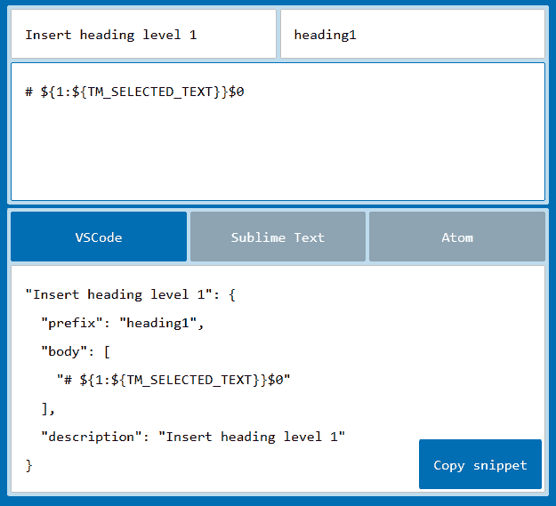

让我们看一个例子来熟悉语法。

#### 例子

下面是 VS 代码附带的一个 markdown 片段。

```
{
    "Insert heading level 1": {
       "prefix": "heading1",
       "body": ["# ${1:${TM_SELECTED_TEXT}}$0"],
       "description" : "Insert heading level 1"
    }
} 
```

该代码片段插入了一个级别 1 标题，该标题将当前选择(如果有)周围的标记包装起来。

代码片段具有以下属性:

1.  “插入标题级别 1”是片段名称。如果没有提供`description`，这是显示在智能感知建议列表中的值。
2.  属性定义了代码片段的触发短语。它可以是一个字符串或字符串数组(如果您想要多个触发短语)。子字符串匹配是在前缀上执行的，因此在这种情况下，键入“h1”将匹配我们的示例片段。
3.  `body`属性是插入编辑器的内容。它是一个字符串数组，是一行或多行内容。内容在插入之前被连接在一起。
4.  属性可以提供关于代码片段的更多信息。它是可选的。
5.  属性允许您指定特定的语言，并且您可以在字符串中提供一个逗号分隔的列表。它是可选的。当然，对于特定于语言的代码片段文件来说，这是多余的。

这个代码片段的主体有 2 个制表位，并使用了变量`${TM_SELECTED_TEXT}`。

让我们进入语法来充分理解这一点。

#### 代码片段语法

VS 代码的代码片段语法与 [TextMate 代码片段语法](https://manual.macromates.com/en/snippets)相同。但是，它不支持“插值外壳代码”和使用`\u`转换。

代码片段的`body`支持以下特性:

#### 1.制表位

制表位由美元符号和序数指定，例如`$1`。`$1`将是第一个位置，`$2`将是第二个位置，依此类推。`$0`是最后的光标位置，退出代码片段模式。

例如，假设我们想要制作一个 HTML *div* 片段，并且我们想要第一个制表位位于开始和结束标记之间。我们还希望允许用户在标签之外跳转以完成代码片段。

然后我们可以做一个这样的片段:

```
{
    "Insert div": {
        prefix: "div",
        body: ["<div>","$1","</div>", "$0"]
    }
} 
```

#### 2.镜像制表位

有时，您需要在插入文本的几个地方提供相同的值。在这些情况下，您可以对制表位重复使用相同的序号，以表示您希望它们被镜像。然后，您的编辑将被同步。

一个典型的例子是多次使用*索引*变量的 *for* 循环。下面是一个用于循环的*的 JavaScript 示例。*

```
{
    "For Loop": {
        "prefix": "for",
        "body": [
            "for (let ${1:index} = 0; ${1:index} < ${2:array}.length; ${1:index}++) {",
            "\tconst ${3:element} = ${2:array}[${1:index}];",
            "\t$0",
            "}"
        ]
	}
} 
```

#### 3.占位符

占位符是带有默认值的制表位。他们用花括号包起来，比如`${1:default}`。占位符文本在焦点上被选中，这样可以很容易地对其进行编辑。占位符可以嵌套，像这样:`${1:first ${2:second}}`。

#### 4.选择

选项在制表位为用户提供一个值列表。它们以逗号分隔的值列表的形式写在管道字符中，例如`${1|yes,no|}`。

这是前面显示的用于插入任务列表的降价示例的代码。选项是“x”或空格。

```
{
  "Insert task list": {
    "prefix": "task",
    "body": ["- [${1| ,x|}] ${2:text}", "${0}"]
} 
```

#### 5.变量

有一个很好的变量可供选择。您只需在名称前加上美元符号来使用它们，例如`$TM_SELECTED_TEXT`。

例如，此代码片段将为任何具有今天日期的语言创建一个块注释:

```
{
    "Insert block comment with date": {
        prefix: "date comment",
        body: ["${BLOCK_COMMENT_START}",
               "${CURRENT_YEAR}/${CURRENT_MONTH}/${CURRENT_DATE} ${1}",
               "${BLOCK_COMMENT_END}"]
    }
} 
```

如果你愿意，你可以为一个变量指定一个默认值，比如`${TM_SELECTED_TEXT:default}`。如果变量没有赋值，则插入默认值或空字符串。

如果您犯了一个错误，包含了一个未定义的变量名，该变量名将被转换为一个占位符。

可以使用以下工作空间变量:

*   `TM_SELECTED_TEXT`:当前选中的文本或空字符串，
*   `TM_CURRENT_LINE`:当前行的内容，
*   `TM_CURRENT_WORD`:光标下的单词或空字符串的内容，
*   `TM_LINE_INDEX`:基于零索引的行号，
*   `TM_LINE_NUMBER`:基于一个索引的行号，
*   `TM_FILENAME`:当前文件的文件名，
*   `TM_FILENAME_BASE`:当前文件的文件名，不含扩展名。
*   `TM_DIRECTORY`:当前文件的目录，
*   `TM_FILEPATH`:当前文档的完整文件路径，
*   `CLIPBOARD`:你剪贴板的内容，
*   `WORKSPACE_NAME`:打开的工作区或文件夹的名称。

可以使用以下与时间相关的变量:

*   `CURRENT_YEAR`:当前年度，
*   `CURRENT_YEAR_SHORT`:当前年份的最后两位数，
*   `CURRENT_MONTH`:两位数的月份(例如“07”)，
*   `CURRENT_MONTH_NAME`:月份的全称(例如‘七月’)，
*   `CURRENT_MONTH_NAME_SHORT`:月份的简称(例如“Jul”)，
*   一个月中的某一天，
*   `CURRENT_DAY_NAME`:一天的名称(例如“星期一”)，
*   `CURRENT_DAY_NAME_SHORT`:一天的简称(例如“Mon”)，
*   `CURRENT_HOUR`:24 小时制的当前小时，
*   `CURRENT_MINUTE`:当前分钟，
*   `CURRENT_SECOND`:当前秒，
*   `CURRENT_SECONDS_UNIX`:Unix 纪元以来的秒数。

可以使用以下注释变量。他们尊重文档语言的语法:

*   `BLOCK_COMMENT_START`:比如 HTML 中的`<!--`，
*   `BLOCK_COMMENT_END`:比如 HTML 中的`-->`，
*   `LINE_COMMENT`:比如 JavaScript 中的`//`。

#### 6.转换

变换可以应用于变量或占位符。如果您熟悉正则表达式(regex ),应该对其中的大部分都很熟悉。

转换的格式是:`${«variable or placeholder»/«regex»/«replacement string»/«flags»}`。类似于 JavaScript 中的[string . protype . replace()](https://developer.mozilla.org/en-US/docs/Web/JavaScript/Reference/Global_Objects/String/replace)。“参数”执行以下操作:

*   `«regex»`:这是一个正则表达式，与变量或占位符的值相匹配。支持 JavaScript regex 语法。
*   `«replacement string»`:这是要用来替换原始文本的字符串。它可以从`«regex»`中引用捕获组，执行大小写格式化(使用特殊函数:`/upcase`、`/downcase`和`/capitalize`，并执行条件插入。参见 [TextMate 替换字符串语法](https://macromates.com/manual/en/regular_expressions#replacement_string_syntax_format_strings)了解更多深入信息。
*   `«flags»`:传递给正则表达式的标志。可以使用 [JavaScript regex 标志](https://developer.mozilla.org/en-US/docs/Web/JavaScript/Guide/Regular_Expressions#Advanced_searching_with_flags_2):
    *   `g`:全局搜索，
    *   `i`:不区分大小写的搜索，
    *   `m`:多行搜索，
    *   `s`:允许`.`匹配换行符，
    *   `u` : Unicode。将模式视为 Unicode 码位序列，
    *   `y`:从目标字符串的当前位置开始，执行匹配的“粘性”搜索。

要引用捕获组，请使用`$n`，其中`n`是捕获组编号。使用`$0`表示整个比赛。

这可能会有点混乱，因为制表位具有相同的语法。请记住，如果它包含在正斜杠中，那么它引用的是一个捕获组。

要完全理解语法，最简单的方法是看几个例子。

| 片段*正文* | 投入 | 输出 | 说明 |
| --- | --- | --- | --- |
| `["${TM_SELECTED_TEXT/^.+$/• $0/gm}"]` | 第 1 行
第 2 行 | 线路 1
线路 2 | 在所选文本的每个非空行前放置一个项目符号。 |
| `["${TM_SELECTED_TEXT/^(\\w+)/${1:/capitalize}/}"]` | 那只猫在垫子上。 | 那只猫在垫子上。 | 将所选文本的第一个单词大写。 |
| `["${TM_FILENAME/.*/${0:/upcase}/}"]` | 示例. js | 举例。射流研究… | 以大写形式插入当前文件的文件名。 |
| `[`
`"[",`
`"${CLIPBOARD/^(.+)$/'$1',/gm}",`
`"]"`
 | 第 1 行
第 2 行 | ['第一行'，'第二行'，] | 将剪贴板的内容转换成一个字符串数组。每个非空行都是一个元素。 |

从上面的第二个例子中可以看出，元字符序列必须转义，例如插入`\\w`作为单词字符。

#### 占位符转换

**占位符转换不允许默认值或选择**！也许称它们为制表位转换更合适。

下面的示例将大写第一个制表位的文本。

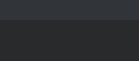

```
{
  "Uppercase first tab stop": {
    "prefix": "up",
    "body": ["${1/.*/${0:/upcase}/}", "$0"]
  }
} 
```

您可以有一个占位符，并在镜像实例上执行转换。不会对初始占位符执行转换。？

你会在什么地方使用这种行为吗？我发现它最初令人困惑，所以它可能对其他人有同样的影响。

```
{
  "Uppercase second tab stop instance only": {
    "prefix": "up",
    "body": ["${1:title}", "${1/(.*)/${1:/upcase}/}", "$0"]
  }
} 
```

### 如何为代码片段分配键盘快捷键？

将您的快捷方式添加到`keybindings.json`。您可以通过运行**‘首选项:打开键盘快捷键文件(JSON)’**命令来打开该文件。

例如，要为内置减价代码段“插入标题级别 1”添加快捷方式:

```
{
    "key": "ctrl+m ctrl+1",
    "command": "editor.action.insertSnippet",
    "when": "editorTextFocus && editorLangId == markdown",
    "args": {
        "langId": "markdown",
        "name": "Insert heading level 1"
    }
} 
```

您可以通过指定想要使用的组合键、命令 ID 和可选的 [when 子句上下文](https://code.visualstudio.com/docs/getstarted/keybindings#_when-clause-contexts)来定义快捷键，用于启用键盘快捷键时的上下文。

通过`args`对象，您可以使用`langId`和`name`属性来定位现有的代码片段。`langId`参数是为其编写代码片段的语言的[语言 ID](https://code.visualstudio.com/docs/languages/identifiers#_known-language-identifiers) 。`name`是在代码片段文件中定义的代码片段的名称。

如果您愿意，可以使用`snippet`属性定义一个内联代码片段。

```
[
  {
    "key": "ctrl+k 1",
    "command": "editor.action.insertSnippet",
    "when": "editorTextFocus",
    "args": {
      "snippet": "${BLOCK_COMMENT_START}${CURRENT_YEAR}/${CURRENT_MONTH}/${CURRENT_DATE} ${1} ${BLOCK_COMMENT_END}"
    }
  }
] 
```

您也可以使用*键盘快捷键 UI* ，但是它不具备添加新快捷键的能力。

UI 的另一个缺点是它不显示`args`对象，这使得查找和编辑自定义快捷方式更加困难。？

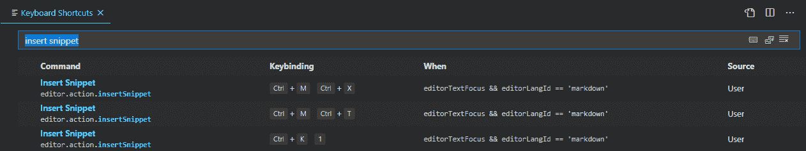

## 风格问题

我发现最初使用 snippet 时，人们倾向于使用缩写前缀来创建 snippet。我需要学习一大串莫名其妙的首字母缩略词才能使用别人的片段吗？

缩写前缀是什么意思？下表列出了来自 [JavaScript (ES6)代码片段](https://marketplace.visualstudio.com/items?itemName=xabikos.JavaScriptSnippets) VS 代码扩展的一些片段。您可以在*触发器*列中看到，列出的前缀是缩写，例如 *fre* 代表“for each”循环。

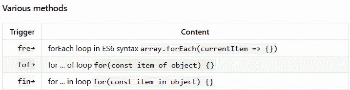

这在两个方面是不必要的。

首先，VS Code 提供的快速建议是从一个**模糊子串搜索**中产生的。如果我输入“fe ”,并且一个代码片段的前缀是“foreach ”,这将匹配并作为一个快速建议提供。

如下图所示，这是第二次匹配。

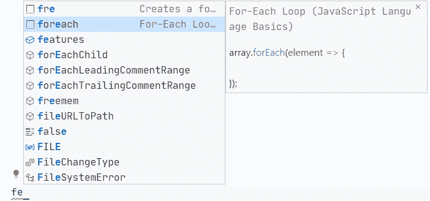

第一个匹配的是 *fre* ，这是来自扩展的一个片段。哪个建议更有描述性？？

如果您对代码片段使用“插入代码片段”命令，这并没有太大的区别。描述字段弥补了这个缺点。我不会以这种方式使用代码片段，所以我更喜欢一个更具描述性的前缀。

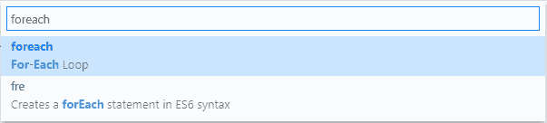

其次， *fre* 是内置片段 *foreach* 的**副本**。

有些人会关闭代码片段的快速建议，而只使用制表符补全。在这种情况下，您需要在没有视觉反馈的情况下键入前缀。有些人可能更喜欢使用缩写前缀来节省击键次数。

相同的模糊子串搜索在后台执行，所以当您点击 tab 时，会插入第一个片段匹配。

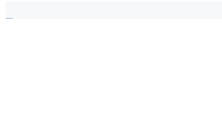

看上面的例子，你可以看到输入“fr”并点击*标签*插入 *fre* 片段。键入“fore”并按 tab 键插入 *foreach* 片段。

因此，如果您真的不想输入，您不需要输入整个前缀！？如果一种语言有许多相似的前缀，我想这是不切实际的。

更实际的做法是正确地学习前缀，并在按 tab 键之前完全键入它们。

根据您对使用代码片段的偏好，有一些权衡。

就我个人而言，我喜欢使用快速建议，因为我喜欢视觉反馈。我将摘录设置为首选建议，这样我就可以输入前缀的缩写版本，而不需要记住它们。

一些片段作者有严格的模式来克服这一点，但这只是我不能轻易进入的东西。

如果你在一门语言中使用了大量的代码片段，你可能想要选择以相似风格编写的代码片段。

如果您在一种语言中为不同的框架和库使用代码片段，它们可能会叠加和重叠。我不需要这么做，但你最终可能需要这么做。

## 全局片段

在代码编辑器之外，您也可以从代码片段中受益。每个应用程序中都有可用的代码片段提供了更多的可能性。

常见的使用案例有:

*   留言的录音回复，
*   自动纠正常见的错别字，
*   向文档添加联系信息或签名，
*   插入日期，
*   选定文本和粘贴文本的格式，
*   为您的搜索引擎或应用程序插入搜索短语，
*   您的电子邮件客户端提供 HTML 代码片段，
*   向文档添加不同的模板。

大多数 snippet 应用程序被吹捧为“文本扩展器”，但是相当多的任务和生产力应用程序也包含 snippet 风格的功能。

全局代码片段**比代码编辑器代码片段**更受限制，因为您不能使用制表位和占位符。在大多数应用程序中，你可以使用一些动态变量，如日期。

### 应用回顾

#### Autohotkey (Windows)

[AutoHotkey](https://www.autohotkey.com/) 是一个**免费的开源脚本语言，让 Windows** 做各种各样的任务。

它有自己独特的语法。您可以安装 [AutoHotKey 扩展](https://marketplace.visualstudio.com/items?itemName=slevesque.vscode-autohotkey)来为 VS 代码添加语言支持，以获得更好的编辑体验。

要定义前缀来触发代码片段插入，可以使用以下格式:`::<<prefix>>::<<text to insert>>`。当您键入“robmail”并点击*空格*或*标签*或*回车*时，以下脚本将插入 Rob 的电子邮件地址。

```
::robmail::rob@someservername.com 
```

当您按下`Ctrl+D`时，以下脚本将插入文本“这是片段文本”。

```
^d::  Send This is the snippet text 
```

可以阅读[文档](https://www.autohotkey.com/docs/AutoHotkey.htm)了解更多。

#### PhraseExpress (Windows、Mac、iOS)

PhraseExpress 是“一个文本扩展软件，它管理常用的文本模板以插入到任何程序中”。

这是一个免费的基于 GUI 的应用程序。它针对的是比*自动热键*更广泛的受众。

相当打磨，好用。您设置它在启动时运行，它将在后台活动。

您的片段可以组织到自定义文件夹中，并使用云服务进行同步。

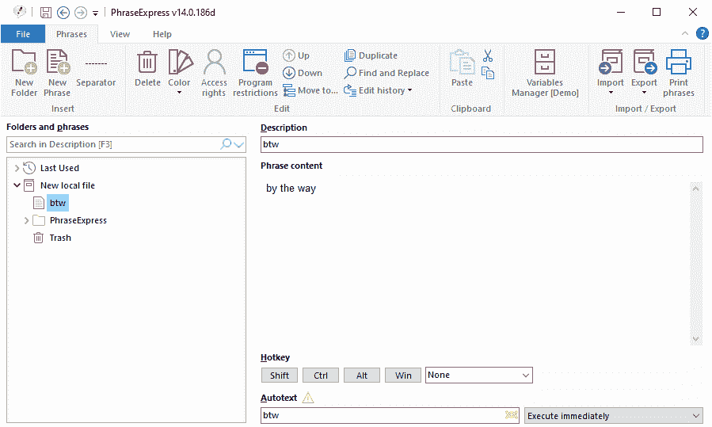

#### 西班牙语(Windows、Mac、Linux)

这是一个用 Rust 编写的**开源跨平台文本扩展器。**

它使用基于文件的配置方法。配置文件写在 [YAML](https://en.wikipedia.org/wiki/YAML) 中。

`default.yml`文件包含主配置。当您键入“robmail”时，下面的配置将插入 Rob 的电子邮件地址。

```
matches:
 - trigger: ":robmail"
   replace: "rob@someservername.com" 
```

您可以**指定初始光标位置**，但是您不能定义制表位。

您可以**添加扩展**来增加 Espanso 的功能。有运行外部脚本的扩展，包括日期，生成随机文本，并包括剪贴板数据。

也就这样了！我希望你今天学到了一些关于片段的知识，你可以用它们来让自己更有效率。