# 金融 Python 初学者算法交易教程

> 原文：<https://www.freecodecamp.org/news/algorithmic-trading-in-python/>

技术已经成为金融领域的一项资产。金融机构现在正在演变成技术公司，而不仅仅是专注于该领域的金融方面。

数学算法带来创新和速度。它们可以帮助我们在市场中获得竞争优势。

金融交易的速度和频率以及庞大的数据量吸引了所有大型金融机构对技术的大量关注。

算法或定量交易是基于数学和统计分析设计和开发交易策略的过程。这是一个极其复杂的金融领域。

本教程是 Python 量化交易的入门指南。你会发现这篇文章非常有帮助，如果你是:

1.  学生或希望成为基金或银行定量分析师的人。
2.  有人正计划开始自己的量化交易业务。

我们将在本帖中讨论以下主题:

*   股票和交易基础
*   从 Quandl API 提取数据
*   股票定价数据的探索性数据分析
*   移动平均线
*   用 Python 制定交易策略
*   可视化策略的性能

在我们深入研究股票定价数据的细节和动态之前，我们必须首先了解金融的基础知识。如果你熟悉金融和交易原理，你可以跳过这一节，点击这里进入下一节。

## 什么是股票？什么是股票交易？

### 股票

股票是公司所有权的一种表现，它以一定的数量发行。这是一种财务担保，确立了你对公司资产和业绩的要求权。

一个组织或公司发行股票来筹集更多的资金/资本，以便扩大规模和从事更多的项目。这些股票随后公开出售和购买。

### 股票交易和交易策略

买卖现有和以前发行的股票的过程称为股票交易。股票的买卖有一个价格，这个价格根据股票市场的供求关系不断波动。

根据公司的业绩和行为，股价可能会上下波动，但股价的波动并不仅限于公司的业绩。

交易员付钱换取公司的所有权，希望进行一些有利可图的交易，并以更高的价格出售股票。

交易者遵循的另一个重要技巧是卖空。这包括借入股票，然后立即卖出，希望以后能以更低的价格买入，然后返还给贷方，并赚取利润。

所以，大多数交易者遵循一个计划和模型来交易。这就是所谓的交易策略。

对冲基金和投资银行的量化交易员设计和开发这些交易策略和框架，并对其进行测试。它需要深厚的编程专业知识和对构建自己的策略所需的语言的理解。

Python 是最流行的编程语言之一，如 C++、Java、R 和 MATLAB。由于其简单的语法、庞大的社区和第三方支持，它正被广泛应用于所有领域，尤其是数据科学领域。

为了充分利用本教程，您需要熟悉 Python 和统计学。请务必温习您的 Python，并查看统计基础知识。

## 从 Quandl API 中提取数据

为了提取股票定价数据，我们将使用 [Quandl API](https://docs.quandl.com/) 。但在此之前，我们先设置一下工作环境。方法如下:

1.  在您的终端中，为项目创建一个新目录(您可以随意命名):

```
mkdir <directory_name>
```

1.  确保你的机器上安装了 [Python 3](https://www.python.org/downloads/) 和 [virtualenv](https://pypi.org/project/virtualenv/) 。
2.  使用`virtualenv <env_name>`创建一个新的 Python 3 virtualenv，并使用`source <env_name>/bin/activate`激活它。
3.  现在，使用 [pip](https://pip.pypa.io/en/stable/installing/) 安装 jupyter-notebook，并在终端中键入`pip install jupyter-notebook`。
4.  同样，安装`pandas`、`quandl`和`numpy`软件包。
5.  从终端运行您的`jupyter-notebook`。

现在，您的笔记本应该在本地主机上运行，如下图所示:

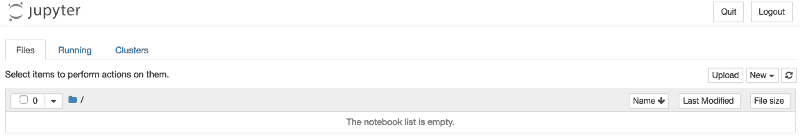

您可以点击右侧的`New`下拉菜单创建您的第一个笔记本。确保您已经在 [Quandl](https://docs.quandl.com/) 上创建了一个帐户。按照这里提到的[步骤](https://docs.quandl.com/docs/python-installation)来创建你的 API 密匙。

一旦你都准备好了，让我们开始吧:

```
# importing required packages
```

```
import pandas as pd
import quandl as q
```

Pandas 将是本教程中使用最严格的软件包，因为我们将进行大量的数据操作和绘图。

导入包之后，我们将使用 Quandl 包向 Quandl API 发出请求:

```
# set the API key
q.ApiConfig.api_key = "<API key>”
```

```
#send a get request to query Microsoft's end of day stock prices from 1st #Jan, 2010 to 1st Jan, 2019

msft_data = q.get("EOD/MSFT", start_date="2010-01-01", end_date="2019-01-01")
```

```
# look at the first 5 rows of the dataframe

msft_data.head()
```

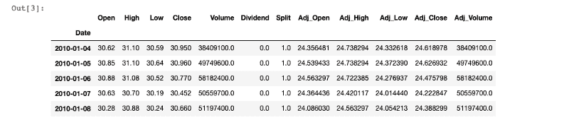

这是微软过去 9 年的 EOD 股票价格数据。您所要做的就是从 Quandl 包中调用`get`方法，并提供股票代码、MSFT 和所需数据的时间范围。

这真的很简单，对吗？让我们进一步理解和探索这些数据。

## 股票定价数据的探索性数据分析

有了数据在手，我们首先要做的就是理解它代表了什么，它封装了什么样的信息。

打印数据帧的信息，我们可以看到它包含的所有内容:

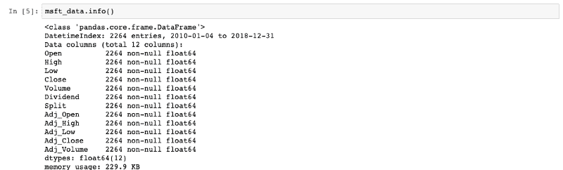

正如上面的截图所示，DataFrame 包含 DatetimeIndex，这意味着我们正在处理时间序列数据。

索引可以被认为是一种帮助我们修改或引用数据的数据结构。时间序列数据是在连续的、等间隔的时间间隔内拍摄的一系列价格快照。

在交易中，EOD 股票定价数据通过定期记录的数据点来捕捉特定时间段内股票的某些参数(如股票价格)的变化。

### 重要术语

看看其他列，让我们试着理解每个列代表什么:

*   开盘价/收盘价—获取股票的开盘价/收盘价
*   Adj_Open/Adj_Close —调整后的开盘价/收盘价是任何给定交易日的股票价格，该价格已被修改，以包括任何股息分配、股票分割和第二天开盘前任何时间发生的其他公司行为。
*   成交量——它记录了在任何一个交易日交易的股票数量。
*   高/低——它跟踪股票在特定交易日的最高价和最低价。

这些是我们此时将重点关注的重要栏目。

我们可以了解数据的汇总统计，它向我们显示行数、平均值、最大值、标准偏差等等。尝试在 Ipython 单元格中运行以下代码行:

```
msft_data.describe()
```

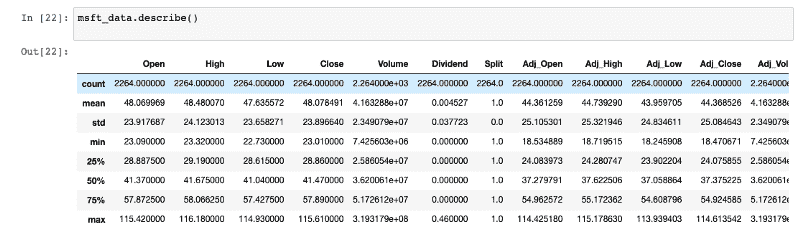

### 重新取样()

Pandas 的 resample()方法用于促进对时间序列数据的频率转换的控制和灵活性。我们可以指定时间间隔，以每月、每季度或每年对数据进行重新采样，并对其执行所需的操作。

```
msft_data.resample('M').mean()
```

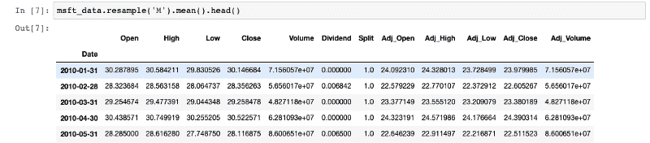

这是一种分析不同时间段股票表现的有趣方法。

### 计算回报

财务回报就是在一项投资中赚或赔的钱。回报可以用投资额随时间的变化来表示。它可以计算为利润与投资比率的百分比。

为此，我们有 pct_change()可供我们使用。以下是计算回报的方法:

```
# Import numpy package
import numpy as np
```

```
# assign `Adj Close` to `daily_close`
daily_close = msft_data[['Adj_Close']]
```

```
# returns as fractional change
daily_return = daily_close.pct_change()
```

```
# replacing NA values with 0

daily_return.fillna(0, inplace=True)
```

```
print(daily_return)
```

这将打印股票每天产生的收益。将这个数乘以 100 将得到百分比变化。

pct_change()中使用的公式是:

> return = {(t 时的价格)—(t-1 时的价格)}/{ t-1 时的价格}

现在，要计算月回报率，你需要做的就是:

```
mdata = msft_data.resample('M').apply(lambda x: x[-1])

monthly_return = mdata.pct_change()
```

将数据重采样到月(工作日)后，我们可以使用`apply()`函数获得该月最后一天的交易。

接受一个函数，并将其应用于熊猫系列的每一行。`lambda`函数是 Python 中的一个匿名函数，可以在没有名称的情况下定义，并且只接受以下格式的表达式:

```
Lambda: expression
```

例如，`lambda x: x * 2`是一个 lambda 函数。这里，x 是参数，`x * 2`是被求值并返回的表达式。

## 交易中的移动平均线

均线的概念将为我们基于动量的交易策略建立基础。

在金融领域，分析师经常需要在一个滑动的时间窗口内不断评估统计指标，这被称为移动窗口计算。

让我们看看如何计算 50 天时间窗内的滚动平均值，并将时间窗滑动 1 天。

### 滚动()

这是为我们表演魔术的神奇功能:

```
# assigning adjusted closing prices to 

adj_pricesadj_price = msft_data['Adj_Close']
```

```
# calculate the moving average
mav = adj_price.rolling(window=50).mean()
```

```
# print the resultprint(mav[-10:])
```

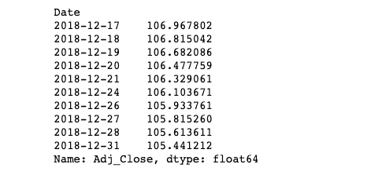

您将看到 50 天的滚动平均值(大约。2 个月)。移动平均线有助于消除数据中的任何波动或峰值，给你一条更平滑的公司业绩曲线。

我们可以画出图来看看区别:

```
# import the matplotlib package to see the plot

import matplotlib.pyplot as plt

adj_price.plot()
```

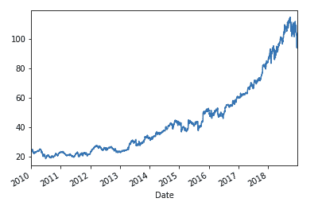

您现在可以绘制滚动平均值():

```
mav.plot()
```

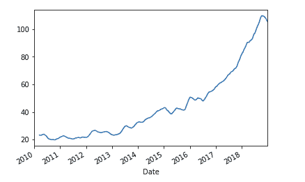

你可以自己看到不同之处，数据中的峰值是如何被消耗的，以给出股票表现的总体情绪。

## 制定交易策略

最后也是最有趣的部分来了:设计和制定交易策略。这将是一步一步的指导开发一个基于动量的简单移动平均交叉(SMAC)策略。

基于动量的策略是基于技术指标，利用市场趋势的持续性。我们购买有上升趋势的证券，卖空有下降趋势的证券。

SMAC 战略是众所周知的示意性势头战略。这是一个只做多的策略。这里的动量是股票的总回报，包括过去 *n* 个月的股息。这 n 个月的*称为回望期。*

回望期有三种主要类型:短期、中期和长期。我们需要为一个特定的时间序列定义两个不同的回顾期。

当较短的回看滚动平均线(或移动平均线)超过较长的回看移动平均线时，就会产生买入信号。当较短的回看移动平均线低于较长的移动平均线时，出现卖出信号。

现在，让我们看看这个策略的代码是什么样子的:

```
# step1: initialize the short and long lookback periods

short_lb = 50long_lb = 120
```

```
# step2: initialize a new DataFrame called signal_df with a signal column

signal_df = pd.DataFrame(index=msft_data.index)signal_df['signal'] = 0.0
```

```
# step3: create a short simple moving average over the short lookback period
signal_df['short_mav'] = msft_data['Adj_Close'].rolling(window=short_lb,                                     min_periods=1, center=False).mean()
```

```
# step4: create long simple moving average over the long lookback period

signal_df['long_mav'] = msft_data['Adj_Close'].rolling(window=long_lb, min_periods=1, center=False).mean()
```

```
# step5: generate the signals based on the conditional statement

signal_df['signal'][short_lb:] = np.where(signal_df['short_mav'][short_lb:] > signal_df['long_mav'][short_lb:], 1.0, 0.0) 
```

```
# step6: create the trading orders based on the positions column

signal_df['positions'] = signal_df['signal'].diff()signal_df[signal_df['positions'] == -1.0]
```

让我们看看这里发生了什么。我们创建了两个回顾期。短期回顾期`short_lb`为 50 天，长期移动平均线的长期回顾期定义为 120 天的`long_lb`。

我们创建了一个新的数据框架，用于捕捉信号。每当使用`np.where`短均线穿过长均线时，就会产生这些信号。它指定`1.0`为真，如果条件为假，则指定`0.0`。

数据框中的`positions`列告诉我们是否有买入信号或卖出信号，或者保持不动。我们基本上是使用 [diff](https://pandas.pydata.org/pandas-docs/stable/reference/api/pandas.Series.diff.html) 来计算信号列与前一行的差异。

在那里，我们用熊猫只用了 6 个步骤就实现了我们的战略。很简单，不是吗？

现在，让我们试着用 Matplotlib 将它可视化。我们需要做的就是初始化一个图表，将调整后的收盘价、短期和长期移动平均线添加到图表中，然后使用上面`signal_df`中的持仓栏绘制买入和卖出信号:

```
# initialize the plot using plt
fig = plt.figure()
```

```
# Add a subplot and label for y-axis

plt1 = fig.add_subplot(111,  ylabel='Price in $')
```

```
msft_data['Adj_Close'].plot(ax=plt1, color='r', lw=2.)
```

```
# plot the short and long lookback moving averages
signal_df[['short_mav', 'long_mav']].plot(ax=plt1, lw=2., figsize=(12,8))
```

```
# plotting the sell signals

plt1.plot(signal_df.loc[signal_df.positions == -1.0].index,                         signal_df.short_mav[signal_df.positions == -1.0],'v',                     markersize=10, color='k')
```

```
# plotting the buy signals

plt1.plot(signal_df.loc[signal_df.positions == 1.0].index,          signal_df.short_mav[signal_df.positions == 1.0],         '^', markersize=10, color='m')         # Show the plotplt.show()
```

在 Jupyter 笔记本中运行上面的单元格将产生如下图所示的图形:

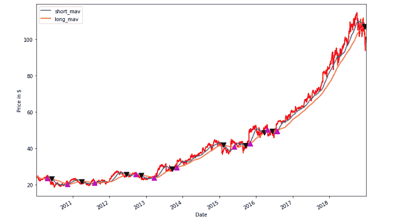

现在，你可以清楚地看到，每当蓝线(短均线)上涨并超过橙线(长均线)时，都有一个粉红色的向上标记，表示买入信号。

卖出信号由黑色向下标记表示，这里的`short_mav`低于`long_mav`。

## 在 Quantopian 上可视化策略的性能

Quantopian 是一个基于 Zipline 的平台，有多种用例。你可以编写自己的算法，访问免费数据，回测你的策略，为社区做贡献，如果你需要资本，可以与 Quantopian 合作。

我们编写了一个算法来回测我们的 SMA 策略，结果如下:

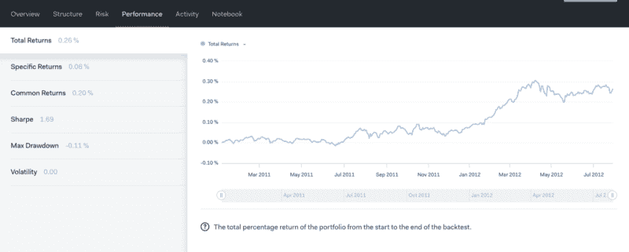

以下是对上述指标的解释:

*   总回报:从回溯测试开始到结束，投资组合的总回报百分比。
*   特定回报:投资组合的总回报和普通回报之间的差额。
*   共同回报:可归因于共同风险因素的回报。有 11 个部门和 5 个风格的风险因素构成了这些回报。风险部分的行业风险和风格风险图表提供了这些因素的更多详细信息。
*   夏普:6 个月滚动夏普比率。这是对风险调整投资的一种衡量。计算方法是将投资组合的超额收益除以无风险利率，再除以投资组合的标准差。
*   最大跌幅:投资组合历史上所有峰谷波动中的最大跌幅。
*   波动性:投资组合回报的标准差。

拍拍自己的背，因为你已经成功地实施了你的量化交易策略！

## 从这里去哪里？

现在你的算法已经准备好了，你需要对结果进行回溯测试，并评估与策略和股票相关的风险相对应的[指标。同样，你可以使用](https://www.investopedia.com/ask/answers/041415/what-are-some-common-measures-risk-used-risk-management.asp)[蓝移](https://blueshift.quantinsti.com/)和[量子理论](https://www.quantopian.com/)来学习更多关于回溯测试和交易策略的知识。

### 更多资源

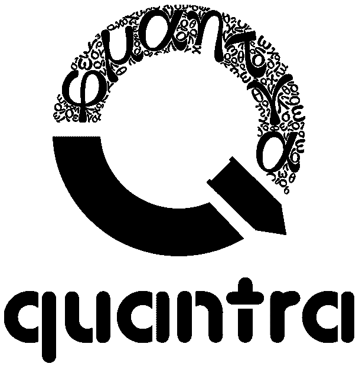

https://quantra.quantinsti.com/learning-track/algorithmic-trading-for-everyone?utm_source=harshit_tyagi&utm_medium=affiliate&utm_campaign=lt_everyone

Quantra 是 QuantInsti 的一个创意。该领域的专家提供了一系列免费和付费的课程，Quantra 提供了一系列基本和高级交易策略的全面指导。

*   [数据科学课程](https://quantra.quantinsti.com/course/introduction-to-data-science?utm_source=harshit_tyagi&utm_medium=affiliate&utm_campaign=data_science) —他们推出了一门关于数据科学的入门课程，帮助您为数据科学项目打下坚实的基础。
*   [新手交易课程](https://quantra.quantinsti.com/learning-track/algorithmic-trading-for-everyone?utm_source=harshit_tyagi&utm_medium=affiliate&utm_campaign=lt_everyone) —从动量交易到基于机器和深度学习的交易策略，像欧内斯特·p·陈博士这样的交易界研究人员是这些利基课程的作者。

#### 免费资源

要了解更多关于交易算法的知识，请查看以下博客:

*   Quantstart —它们涵盖了广泛的回溯测试算法、初学者指南等等。
*   [Investopedia](https://www.investopedia.com/) —你想知道的关于投资和金融的一切。
*   [Quantivity](https://quantivity.wordpress.com/) —算法及其利弊的详细数学解释。

沃伦·巴菲特说他每天阅读 500 页左右，这应该告诉你，要想在金融领域取得成功，阅读是必不可少的。

开始这个交易之旅，你会过着充满兴奋、激情和数学的生活。

# [数据科学与 Harshit](https://www.youtube.com/c/DataSciencewithHarshit?sub_confirmation=1)

[https://www.youtube.com/embed/_ANbV9lVA-M?feature=oembed](https://www.youtube.com/embed/_ANbV9lVA-M?feature=oembed)

通过这个渠道，我计划推出几个涵盖整个数据科学领域的[系列。以下是你应该订阅](https://towardsdatascience.com/hitchhikers-guide-to-learning-data-science-2cc3d963b1a2?source=---------8------------------)[频道](https://www.youtube.com/channel/UCH-xwLTKQaABNs2QmGxK2bQ)的原因:

*   这些系列将涵盖每个主题和子主题的所有必需/要求的高质量教程，如 [Python 数据科学基础](https://towardsdatascience.com/python-fundamentals-for-data-science-6c7f9901e1c8?source=---------5------------------)。
*   解释了为什么我们在 ML 和深度学习中这样做的数学和推导。
*   [与谷歌、微软、亚马逊等公司的数据科学家和工程师](https://www.youtube.com/watch?v=a2pkZCleJwM&t=2s)以及大数据驱动型公司的首席执行官的播客。
*   [项目和说明](https://towardsdatascience.com/building-covid-19-analysis-dashboard-using-python-and-voila-ee091f65dcbb?source=---------2------------------)实施到目前为止所学的主题。了解新的认证、训练营以及破解这些认证的资源，例如谷歌的 [****TensorFlow 开发者证书考试。****](https://youtu.be/yapSsspJzAw)

如果这个教程有帮助，你应该看看我在 [Wiplane Academy](https://www.wiplane.com/) 上的数据科学和机器学习课程。它们全面而紧凑，帮助您建立一个坚实的工作基础来展示。