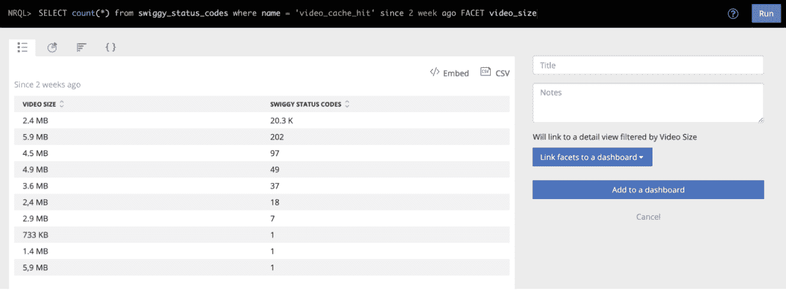

# 如何在你的应用中设置类似 Instagram 的视频故事

> 原文：<https://www.freecodecamp.org/news/video-stories-and-caching-ios/>

这篇文章将教你如何在一个视图中显示多个视频，就像我们在 Instagram Stories 中看到的那样。

我们还将了解如何在用户的设备中缓存视频，以帮助保存用户的数据和网络通话，并平滑他们的体验。

快速注意:这个实现是针对 iOS 的，但是同样的逻辑也可以应用于其他代码库。


一般来说，每当我们想播放一个视频时，我们得到视频的 URL，然后简单地用那个 URL 显示`****AVPlayerViewController****`。

```
let videoURL = URL(string: "Sample-Video-Url")
let player = AVPlayer(url: videoURL!)
let playerViewController = AVPlayerViewController()
playerViewController.player = player
self.present(playerViewController, animated: true) {
    playerViewController.player.play()
}
```

[**AVPlayerViewController.swift**](https://gist.github.com/agammahajan1/5ff1f9c4de360c6df34e8c5270d9873d#file-avplayerviewcontroller-swift)

很简单，对吧？

但是这个实现的缺点是你 ****不能** **customiz** e 它。如果你在一家优秀的产品公司工作，这将是一个日常要求。:D**

或者，我们可以使用`****AVPlayerLayer****`来做类似的工作——但是它允许我们定制视图和其他元素。

```
let videoURL = URL(string: "Sample-Video-Url")
let player = AVPlayer(url: videoURL!)
let playerLayer = AVPlayerLayer(player: player)
playerLayer.frame = self.view.bounds
self.view.layer.addSublayer(playerLayer)
player.play()
```

[AVPlayerLayer.swift](https://gist.github.com/agammahajan1/c488d7f925378d26fcf7e08e611ef46a#file-avplayerlayer-swift)

但是如果要把多个视频组合起来，类似于 ****Instagram stories**** 呢？那我们可能要深入一点。

## 回到问题陈述

现在，让我告诉你我的用例。

在我的公司 Swiggy，我们希望能够显示多个视频，每个视频应该显示 x 次。

最重要的是，它应该有一个类似 Instagram 的故事功能。

*   视频-2 应该在视频-1 之后无缝自动播放，等等
*   它应该跳转到相应的视频每当用户点击左或右。

如果你认为缓存可能是答案，不要担心——我稍后会谈到这一点。

### 一个视图中的多个层

首先，我们需要弄清楚如何在一个视图中添加多个视频。

我们可以做的是创建一个`****AVPlayerLayer****`并将第一个视频分配给它。当第一个视频结束时，我们将下一个视频分配给同一个`****AVPlayerLayer****`。

```
func addPlayer(player: AVPlayer) {
    player.currentItem?.seek(to: CMTime.zero, completionHandler: nil)
    playerViewModel?.player = player
    playerView.playerLayer.player = player
}
```

[Change_Video.swift](https://gist.github.com/agammahajan1/0f951d38e1c280ea4a17de909c567167#file-change_video-swift)

要跳到上一个或下一个视频，我们可以执行以下操作:

*   在视图上添加点击手势
*   如果触摸位置“x”小于屏幕的一半，则分配前一个视频，否则分配下一个视频

```
@objc func didTapSnap(_ sender: UITapGestureRecognizer) {
   let touchLocation = sender.location(ofTouch: 0, in: view)
   if touchLocation.x < view.frame.width/2 {
     changePlayer(forward: false)
     } 
   else {
     fillupLastPlayedSnap()
     changePlayer(forward: true)
    }
}
```

[Handle_Tap.swift](https://gist.github.com/agammahajan1/88782840456c2ed43534e7d947e91ab2#file-handle_tap-swift)

我们走吧。我们现在有了自己的类似 Insta 的故事视频功能。

[https://www.youtube.com/embed/13ZwNq4FnbM?feature=oembed](https://www.youtube.com/embed/13ZwNq4FnbM?feature=oembed)

但是我们的任务还没有完成！

## 现在回到缓存

我们不希望用户每次从一个视频导航到另一个视频时，都从头开始下载视频。

此外，如果视频在下一个会话中再次显示，我们不需要再做一次服务器调用。

如果我们能缓存视频，那么用户的互联网就有救了。服务器上的负载也将减少。

最后，UX 将得到改善，因为用户将不必等待很长时间来加载视频。

****作为一个优秀的开发者，减少****用户的互联网使用量应该是我们的首要任务。****


Less data usage, happy Customer

### 异步加载视频

**我们首先可以用来加载视频的是****load values asynchronously****。**

**根据[苹果文件](https://developer.apple.com/documentation/avfoundation/avasynchronouskeyvalueloading/1387321-loadvaluesasynchronously)、**、**同步加载值:**、****

> ****告诉资产加载尚未加载的所有指定键(属性名)的值。****

**这里的优点是，它保存视频，直到它被渲染。因此，每当用户导航到上一个视频时，它不会从头开始下载视频。它将只下载先前没有渲染的部分。**

**让我们看一个 e **的例子** :假设我们有一个 15 秒长的视频 _1，用户在跳到视频 _2 之前看了 10 秒。**

**现在，如果用户通过点击左侧再次返回到 Video_1，****load values asynchronously****将保存 10 秒的视频，并且将仅下载剩余的(未观看的)5 秒。**

```
`func asynchronouslyLoadURLAssets(_ newAsset: AVURLAsset) {
	DispatchQueue.main.async {
            newAsset.loadValuesAsynchronously(forKeys: self.assetKeysRequiredToPlay) {
                for key in self.assetKeysRequiredToPlay {
                    var error: NSError?
                    if newAsset.statusOfValue(forKey: key, error: &error) == .failed {
                        self.delegate?.playerDidFailToPlay(message: "Can't use this AVAsset because one of it's keys failed to load")
                        return
                    }
                }

                if !newAsset.isPlayable || newAsset.hasProtectedContent {
                    self.delegate?.playerDidFailToPlay(message: "Can't use this AVAsset because it isn't playable or has protected content")
                    return
                }
                let currentItem = AVPlayerItem(asset: newAsset)
                let currentPlayer = AVPlayer(playerItem: currentItem)
                self.delegate?.playerDidSuccesToPlay(playerDetail: currentPlayer)
            }

        }`
```

**[loadValuesAsynchronously.swift](https://gist.github.com/agammahajan1/03908bc99cb730b36aa7ed2bdfba0020#file-loadvaluesasynchronously-swift)**

**你可以在这个[链接](https://developer.apple.com/documentation/avfoundation/avasynchronouskeyvalueloading/1387321-loadvaluesasynchronously)找到更多关于 ****负载值同步**** 的详细信息。**

**这里需要注意的是，它只保存该会话的视频数据。如果用户关闭并返回应用程序，视频必须再次下载。**

**那么我们还有其他选择吗？**

### **在设备中保存视频**

**现在来了 ****视频缓存**** ！**

**当视频渲染完成后，我们可以导出视频并保存到用户的设备上。当视频在他们的下一次会话中再次出现时，我们可以从设备中选择视频并简单地加载它。**

******AVAssetExportSession****
根据[苹果的文档](https://developer.apple.com/documentation/avfoundation/avassetexportsession):**

> ****对资源源对象的内容进行代码转换的对象，以创建由指定导出预设描述的形式的输出。****

**这意味着 AVAssetExportSession 充当导出器，通过它我们可以将文件保存到用户的设备上。我们必须给出输出 URL 和输出文件类型。**

```
`let exporter = AVAssetExportSession(asset: avUrlAsset, presetName: AVAssetExportPresetHighestQuality)
exporter?.outputURL = outputURL
exporter?.outputFileType = AVFileType.mp4

exporter?.exportAsynchronously(completionHandler: {
	print(exporter?.status.rawValue)
	print(exporter?.error)
})`
```

**[AVAssetExportSession.swift](https://gist.github.com/agammahajan1/6e63a8109f80e5562d4c3f4b7776735c#file-avassetexportsession-swift)**

**你可以在这个[链接](https://developer.apple.com/documentation/avfoundation/avassetexportsession)找到更多关于****AVAssetExportSession****的细节。**

**现在唯一剩下的事情就是从缓存中获取数据并加载视频。**

**加载前，检查视频是否存在于缓存中。然后获取本地 URL，并将其同步提供给****load values as。******

```
`if let cacheUrl = FindCachedVideoURL(forVideoId: videoId) {
	let cacheAsset = AVURLAsset(url: cacheUrl)
	asynchronouslyLoadURLAssets(cacheAsset)
}
else {
  asynchronouslyLoadURLAssets(newAsset)
}`
```

**[Fetch_Local_Video.swift](https://gist.github.com/agammahajan1/5aa181ebf04a1455a43c0a8dfbcf2b8e#file-fetch_local_video-swift)**

**缓存将有助于减少大量用户数据的使用以及服务器负载(有时高达数 TB 的数据)。**

## **缓存的其他使用案例**

**我们还可以用缓存处理哪些用例？以下是您可以在这里使用缓存的方式的示例:**

### **确保最佳存储**

**在将视频保存到设备上之前，您应该检查设备上是否有足够的存储空间来保存视频。**

```
`func isStorageAvailable() -> Bool {
   let fileURL = URL(fileURLWithPath: NSHomeDirectory() as String)
   do {
      let values = try fileURL.resourceValues(forKeys: [.volumeAvailableCapacityForImportantUsageKey, .volumeTotalCapacityKey])
      guard let totalSpace = values.volumeTotalCapacity,
      let freeSpace = values.volumeAvailableCapacityForImportantUsage else {
          return false
      }
      if freeSpace > minimumSpaceRequired {
         return true
      } else {
          // Capacity is unavailable
          return false
      }  
    catch {}
    return false
}`
```

**[Storage_Check.swift](https://gist.github.com/agammahajan1/e7b9c38e2c8781369fe408e136dffd2a#file-storage_check-swift)**

### **删除不推荐的视频**

**您可以为每个视频设置一个时间戳，这样您就可以在特定天数后从设备内存中清除旧视频。**

```
`func cleanExpiredVideos() {
        let currentTimeStamp = Date().timeIntervalSince1970
        var expiredKeys: [String] = []
        for videoData in videosDict where currentTimeStamp - videoData.value.timeStamp >= expiryTime {
            // video is expired. delete
            if let _ = popupVideosDict[videoData.key] {
                expiredKeys.append(videoData.key)
            }
        }
        for key in expiredKeys {
            if let _ = popupVideosDict[key] {
                popupVideosDict.removeValue(forKey: key)
                deleteVideo(ForVideoId: key)
            }
        }
    }`
```

**[TimeStamp_Check.swift](https://gist.github.com/agammahajan1/4104b20d062472f8ea8a153355a56e2a#file-timestamp_check-swift)**

### **保持有限数量的视频**

**您可以确保文件中一次只保存有限数量的视频。假设是 10 个。**

**然后当第 11 个视频出现时，你可以让它删除观看次数最少的视频，并用新的视频替换它。这也将有助于您不消耗太多的用户设备内存。**

```
`func removeVideoIfMaxNumberOfVideosReached() {
        if popupVideosDict.count >= maxVideosAllowed {
            // remove the least recently used video
            let sortedDict = popupVideosDict.keysSortedByValue { (v1, v2) -> Bool in
                v1.timeStamp < v2.timeStamp
            }
            guard let videoId = sortedDict.first else {
                return
            }
            popupVideosDict.removeValue(forKey: videoId)
            deleteVideo(ForVideoId: videoId)
        }
    }`
```

**[MaxNumberOfVideos.swift](https://gist.github.com/agammahajan1/e7db93a3660ffca31454226085efdd01#file-maxnumberofvideos-swift)**

### **衡量影响**

**不要忘记添加日志，这样你就可以衡量你的特性的影响。我已经使用了一个定制的新遗迹日志事件来实现这一点:**

```
 `static func findCachedVideoURL(forVideoId id: String) -> URL? {
        let nsDocumentDirectory = FileManager.SearchPathDirectory.documentDirectory
        let nsUserDomainMask = FileManager.SearchPathDomainMask.userDomainMask
        let paths = NSSearchPathForDirectoriesInDomains(nsDocumentDirectory, nsUserDomainMask, true)
        if let dirPath = paths.first {
            let fileURL = URL(fileURLWithPath: dirPath).appendingPathComponent(folderPath).appendingPathComponent(id + ".mp4")
            let filePath = fileURL.path
            let fileManager = FileManager.default
            if fileManager.fileExists(atPath: filePath) {
                NewRelicService.sendCustomEvent(with: NewRelicEventType.statusCodes,
                                                                   eventName: NewRelicEventName.videoCacheHit,
                                                                   attributes: [NewRelicAttributeKey.videoSize: fileURL.fileSizeString])
                return fileURL
            } else {
                return nil
            }
        }
        return nil
    }`
```

**[Logging.swift](https://gist.github.com/agammahajan1/0b262508db828a997bbff6612d25d79c#file-logging-swift)**

**为了将文件大小转换为可读格式，我获取文件大小并将其转换为 Mbs。**

```
`extension URL {
    var attributes: [FileAttributeKey : Any]? {
        do {
            return try FileManager.default.attributesOfItem(atPath: path)
        } catch let error as NSError {
            print("FileAttribute error: \(error)")
        }
        return nil
    }

    var fileSize: UInt64 {
        return attributes?[.size] as? UInt64 ?? UInt64(0)
    }

    var fileSizeString: String {
        return ByteCountFormatter.string(fromByteCount: Int64(fileSize), countStyle: .file)
    }
}`
```

**[File_Convert.swift](https://gist.github.com/agammahajan1/944bb95257681d50667d578ad63af121#file-file_convert-swift)**

**这是你衡量自己影响力的方法:**

****

******总保存数据= n** 请求数量**s*** video _ size = 2.4 MB * 20.3k ~ = 49GB********

**这只是两周的数据。你一整年都在计算。？这将随着时间呈指数增长。**

**就是这样！现在，您已经构建了自己的缓存机制。**

****

# **包扎**

**在本文中，我们看到了如何轻松地在一个视图中集成多个视频，提供类似 Instagram 的故事功能。**

**我们还了解了缓存为什么以及如何在这里发挥重要作用。我们看到了它如何帮助用户保存大量数据并获得流畅的用户体验。**

**如果我遗漏了什么，或者您能想到更多的用例，请务必告诉我。谢谢你的时间。:)**