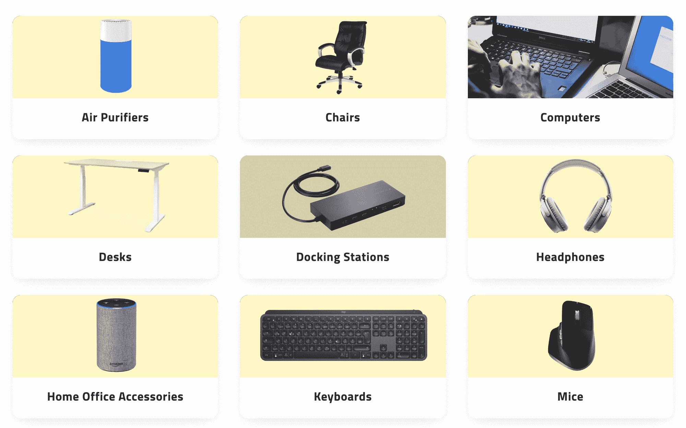
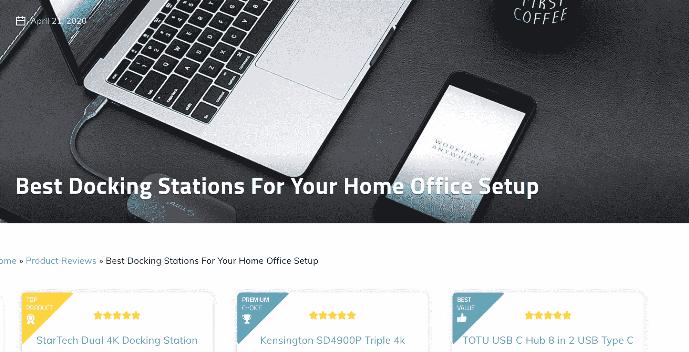

# 如何学习 UX 设计，成为一名自学成才的用户体验设计师

> 原文：<https://www.freecodecamp.org/news/learn-ux-design-self-taught-user-experience-designer/>

在用户体验工作中有一个假设，那就是你正在为其他人构建、设计和设计产品和体验。

很自然地，通过了解人们开始你的 UX 教育之旅，并把他们放在你所做的一切的中心，是至关重要的。

如果你认真学习用户体验(UX)设计，你首先需要了解设计思维的基础。

正如我之前在 [freeCodeCamp](https://www.freecodecamp.org/news/what-is-design-thinking-an-introduction-to-the-design-process-for-entrepreneurs-and-developers/) 中所写的，设计思维是一种运用批判性思维来解决与*人*相关的设计问题的整体方式。

具体来说，设计思维是一种了解、洞察、深入理解人类的方式。

在学习 UX 和学习使用这门学科的语言之前，你需要了解人们，了解他们关心什么，他们是谁，以及他们将如何使用你的解决方案。

因此，对 UX 的介绍首先要把人类经验——人们想要什么、需要什么、价值是什么——放在你的世界观和你所做的一切的中心。

## 如何理解人

为了学习 UX 设计，你必须学会如何提问，而且是正确的问题。

你可能会觉得这过于简单。然而，提问是你自学的用户体验技能将首先发展的地方。

我们每天都问问题。但是我们多久问一次后续问题呢？我们多久练习一次积极倾听来帮助引导对他人和自己的进一步提问？

成为一名自学成才的 UX 设计师的过程是多方面的。

但最重要的是，这个过程始于把人放在你提问和倾听答案的中心。

这里有一个你应该尝试的 UX 实验。问一个朋友或同事“5 个后续问题”,更深入地探究他们的行为并发现有趣的启示。

亚当对采访对象的第一个问题:“你最近一次在网上购买的东西是什么？”

回答:“我在网上买的最后一件东西是大猩猩防滑抗疲劳舒适垫。”

亚当问题 2:“你为什么买这个产品？”

回答:“我购买这款产品是为了保护我的脚踝和膝盖，让我在家工作和站在办公桌前时感觉舒适。”

亚当问题#3:“为什么要保护脚踝和膝盖？”

回答:“我喜欢运动，想确保我的身体保持健康。”

亚当问题 4:“你为什么喜欢运动？”

回答:“打网球能让我释放紧张。”

亚当问题 5:“你为什么紧张？”

回答:“我觉得我的工作压力很大，要求太高。”

在这个真实的例子中，我们可以看到一组问题是如何把我们引向一条有趣而不可预见的道路的。

通过询问我朋友的网购历史，我对他的工作和生活有了新的了解。试探性问题(以及后续问题)让我对这个人有了更深更好的了解。

如果我为 Gorilla Grip 公司做用户体验设计，我可能会在邮件中提到垫子也有助于减轻工作压力。

如果你想了解人们，你需要了解一个人的动机、恐惧和主要的个人驱动力。

只有反复问为什么(或为什么的某种变体)，你才能真正理解客户。从人类开始，逆向工作。

## 在问别人问题之前，先问自己几个问题

在问别人问题之前，你必须先问并回答一些关于你自己的问题。

你擅长问问题吗？如果有，为什么？如果没有，为什么没有？

你擅长主动倾听答案吗？

你会密切关注话语、肢体语言和反馈吗？

你对细节回忆有很强的记忆力吗？你记笔记还是背答案？

你需要仔细琢磨这些答案。用户体验设计师需要密切关注细节。

你如何提高你注重细节的能力？

这里有一个有趣且低成本的练习方法。看一部电视剧或电影，或者读一篇内容丰富的长文章。

消费完内容后，尝试回答以下:

1.  列出节目/文章中提到的几个名字
2.  如果是一场演出:一些角色穿什么样的服装？
3.  如果一篇文章:作者是谁？
4.  这个节目/文章的要点是什么？

如果你和大多数人一样，回答第一个问题对你来说有一定难度。问题#2 和#3 非常具有挑战性。第四个问题很简单。

想想这些问题。

为什么有些很难，有些很容易？这些问题触发了我们记忆的不同方面，以及我们如何分类和储存信息。

当开始与用户接触时，你需要留意你提出的问题和你得到的答案。答案有隐性和显性的内涵和偏向。

仅仅听到用户在说什么是不够的。

你需要理解交流的内容，正确地记住它，并以此为指导。

当你开始自学用户体验之旅时，记住你的用户是你的向导。

但你也是一个向导。你向他人提出的问题类型至关重要。

## 样本问题:自学 UX 会议

现在我想提供一些 UX 的问题，你应该阅读并整合，以便与真实用户进行你的第一次 UX 研究。

当我开始建立一个帮助人们远程工作的网站时，我向朋友和同事提出了以下 UX 问题。

尝试将这些问题用作脚本或指南。如果你认为合适，请随意修改。

1.  我们将会看到一个名为 WFH 顾问的网页。我希望你能对你所看到的给予诚实的反馈。没有任何正确或错误的答案，目标不是测试你，而是测试网站，以便我可以改进它。
2.  你的任何反馈都不会伤害我的感情(哈哈，微笑)好吗？
3.  WFH 顾问是一个帮助远程工作者了解如何在家高效工作的网站。
4.  在这个网站上，你可以阅读关于家庭产品的新工作，如何远程管理你的职业生涯，以及寻找远程工作的文章。有什么问题吗？
5.  你用过网站互动工具吗？
6.  假设你访问了主页。这就是你看到的。(直接在屏幕上展示您的产品样本)。
7.  你认为你在这里看到了什么？

1.  如果你有兴趣阅读这第一篇产品评论，你会怎么做？(轻点链接？是/否)
2.  如果你想看与你在文章中读到的内容相关的其他家居产品作品，你会怎么做？(轻点链接？是/否)。
3.  当你看到“最佳家居产品”列表时，你认为这意味着什么？
4.  你觉得那份名单怎么样？
5.  你在家工作吗？
6.  假设你想买一件产品，你会怎么做？(轻点链接？是/否)
7.  假设您想了解如何在与远程经理一起工作时获得晋升，您会怎么做？(点击文章搜索？是/否)。
8.  好吧，假设我们读过一篇文章。之后你会做什么？(点击下一篇文章或离开网站)。

1.  在用户没有意识到的情况下指出它离开了，去了浏览器。
2.  你认为现在会发生什么？
3.  你还有其他问题或意见吗？
4.  我有三个最后的问题:
5.  根据你今天所见，你会如何描述家庭顾问对朋友的工作？
6.  你建议我如何提高品牌知名度？
7.  最后，您希望看到网站上有什么工作流自动化改进吗？

现在，您有一些实用的、战术性的、随时可以部署的问题要问您的用户。

## 将所有这些集合在一起:UX 问题、洞见和人类设计

在开始 UX 之旅之前，花点时间练习积极倾听。回忆大大小小的细节，并把这些细节写下来。

在风险较低的时候练习——通过电影、文章或书籍——利用你新学到的技能更好地与用户互动。

当你准备好了，就开始使用我提供的标准大纲或脚本与用户交流。

即兴发挥并提出后续问题。探究假设，理解你的偏见(和你的用户的偏见)，并通过问“5 个后续问题”来深入挖掘

如果你实践用户体验设计，你的职业和技能会走上非常有趣的道路。

比如我朋友开了 Everlance，一个里程追踪 app。在读研期间，他花时间作为拼车乘客*和司机*从各个角度全面了解用户体验和常见的痛点。

他很快发现，跟踪联邦报销的里程记录太困难、太麻烦了。

这种洞察力促使他开发软件来解决这个问题。

他穿着用户的鞋子走了一英里。他问了一些问题。他用这些答案来指导他的设计决策。

这种程度的承诺是我们都应该努力争取的。

成为一名用户体验设计师不是一项事务性技能。你不会练习一个月或一年，然后参加考试。

用户体验设计更类似于绘画。

首先你学习颜色。

然后你学习如何握笔。

然后你坐下来练习，练习，再练习。

最终你开始建立一个相关的高质量水彩作品集。

最终成为一名自学成才的用户体验设计师是一次赞美他人的旅程，让人们向你表达他们的愿望、恐惧、希望和困惑。

想想所有受益于 UX 设计应用的领域。

如果你正在构建消费工具，比如剪切粘贴应用，或者你是一个在线表单创建者，你可以利用用户体验设计技能来提升你的技能。

如果你正在建立一个播客目录或合作空间管理软件，你需要了解用户想听什么或如何组织内部空间。

如果你关心创业成长，内容创作，或建立广告创意，你可以应用 UX 设计问题，以更好地指导你的决定和你的文案。

受益于 UX 设计专业知识的领域基本上是无限的。这应该会让你兴奋，因为你可以创造更能引起用户共鸣的信息、产品和体验。

非数字资产也是如此。

考虑一下立式显示器或迷你投影仪。只有通过适度的同理心，以积极倾听为中心的耳朵和心脏，以及帮助他人的强烈愿望，设计师才能制造出如此有用的实物产品。

这篇文章提供了让你开始成为一个更好、更全面的用户体验设计师的要素。

你需要掌握接下来的步骤。

去实践吧。以人为本，倾听、学习和构建。

没有比这更好的起点了。