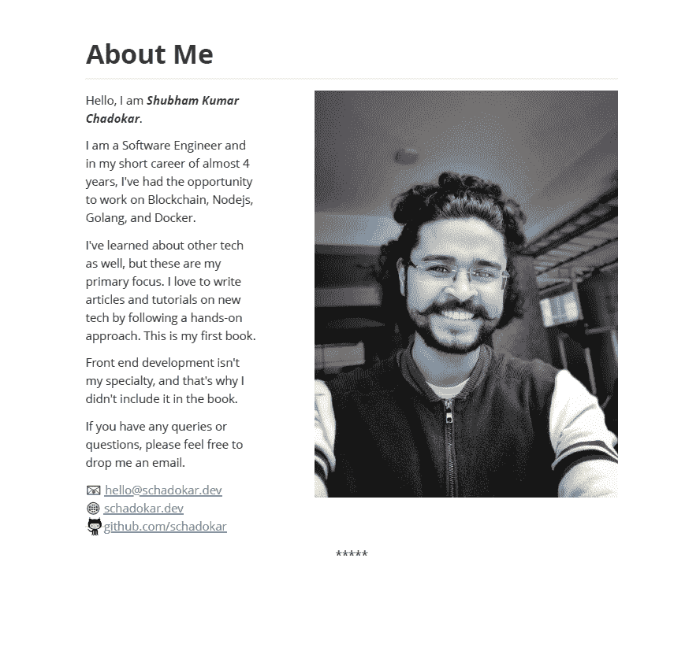
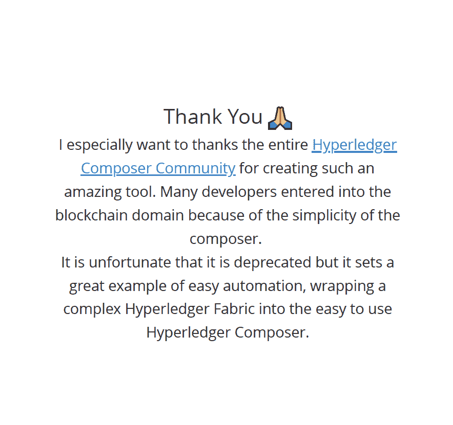

# 如何写你的第一本技术书籍:首次开发作者的工具、技术和资源

> 原文：<https://www.freecodecamp.org/news/how-to-write-your-first-technical-book/>

最近，我写了我的第一本技术书——是的，我终于完成了。？这个项目在我的清单上已经有很长时间了。现在我终于完成了，我想和大家分享我的经验。

在这篇文章中，我试图记录我写这本书的完整旅程。我讨论一切工具、技术和资源的动机和障碍。

我的书重点介绍了 [Hyperledger Composer 区块链](https://schadokar.dev/ebooks/)工具。它是完全免费的，目前只有 PDF 格式。

以上几点对技术博客写作同样有帮助。所以，让我们开始，深入了解我学到的东西。

# 动机

我从 2018 年末开始写技术文章和教程。到目前为止，我对写一篇文章或一个教程的过程已经很适应了。我知道如何处理这篇文章，以及应该使用哪些工具。

但是当涉及到书籍写作——尤其是技术书籍——领域就完全不同了。

我的动机是好奇。我想知道作者是如何写书的。他们的思维过程是怎样的？他们用什么工具？当然，写一本书是什么感觉？？

我是一名软件工程师，从 2018 年开始从事区块链工作。我了解了不同的区块链，比如以太坊和超账本。我也用过很多工具，比如[松露](https://www.trufflesuite.com/)、[混音](https://remix.ethereum.org/)和 [hyperledger 作曲](https://hyperledger.github.io/composer/)。

我想写一些不同的东西，比如**以太坊**或者**超账结构**。

但由于这是我的第一本书，这些主题对我来说并不理想。他们需要更多的时间和精力，而我却无能为力。所以，我选了一个简单的:Hyperledger Composer。

# 第一个障碍

在开始之前，我想知道我应该使用哪个工具或编辑器来写这本书。

我应该用 MS Word，Google Docs，还是用别的？主要问题是如何正确格式化代码片段。这些编辑器不是为技术写作而设计的。

添加代码有不同的方法，但是需要额外的格式化。

我读了很多关于技术书籍写作有哪些好工具的文章。我尝试了很多，但都不满意。我浪费了很多时间寻找完美的工具。

最后，我意识到编辑只是简化了写作过程，让管理这本书更简单。但真正重要的是内容。所以，我不再寻找完美的编辑器，而是去寻找最基础的。

## 基础知识:VS 代码

我用我最喜欢的代码编辑器来写这本书。是的， **VS 代码**？。

在花了几天时间在互联网上搜索之后，没有一篇文章表明你需要任何特定的工具或编辑器来写一本技术书籍。VS 代码或 Atom 就足够了。

我用我最喜欢的减价格式用 **VS 代码**写了整本书。为了让我的写作更容易，我使用了几个降价插件，比如**的多功能降价插件**和**的降价预览增强版**。

第一个插件帮助你写 markdown，而第二个插件帮助预览模式。它显示了将 markdown 转换成 HTML 或其他格式后的外观和行为。

**Markdown All in One** 也有预览模式，但 **Markdown Preview Enhanced** 有多个主题和选项，可以将 Markdown 文件导出为 HTML、PDF 和其他可读格式，如 epub 或 Mobi。

只是提醒一下——那些其他格式要求你在你的机器上安装 **Pandoc** 。

> 我是 Windows 用户。对于 Mac 用户来说，我发现有很多优秀的编辑器，比如 [bear](https://bear.app/) 、 [ulysses](https://ulysses.app/) 等等。

最近，我发现在 **Windows** 和 **MacOS** 上有很多 markdown 编辑器，你可以用它们来写书。查看[概念](https://www.notion.so/)、 [Typora](https://typora.io/) 、 [iA Writer](https://ia.net/writer) 和 [SimpleNote](https://simplenote.com/) 。

底线**不要浪费太多时间去寻找完美的编辑**。开始用你选择的编辑器写吧。随着时间的推移，你会明白的。

# 第二个障碍

然后我开始问自己，应该从哪里开始写？我该怎么写？我应该如何接近它？

简而言之，我想知道我到底应该怎样写这本书，以便读者能从中获得最大的收获。

这些问题让我绞尽脑汁。一开始，我改变了 4 到 5 次我的方法。

在这一点上，我建议花一些时间来真正思考你的方法。因为一旦你读到书的中间，改变它就不是一件容易的事情了。

### 问问题

我问自己关于这本书的这些问题，并记下我的想法。

1.  我的目标受众是谁？他们是初学者、中级还是专家？
2.  他们需要一些关于这个主题的先验知识吗？
3.  我应该如何组织这本书？
4.  我应该如何命名文件或章节，以便容易找到每个主题？
5.  我应该如何跟踪我的进展？
6.  我应该如何维护这本书的章节和草稿的版本？在很多情况下，上一次编辑实际上比当前版本好得多。

这是我问的一些基本问题，它们很有帮助。

## 我的方法

我现在将描述我写这本书的方法。

### 创建待办事项列表

首先，我创建了一个待办事项列表。在这个列表中，我记下了所有的要点、主题、分主题、参考文献、前言、封面、标题等等。

我几乎把所有想到的关于这本书的想法都加了进去。

我建议创建两个待办事项列表:一个在纸上，另一个作为软拷贝。

首先，在纸上记下所有的要点。一旦你记下所有的东西，读 2-3 遍。然后，无论你脑子里冒出什么新想法，都要记下来。

例如，如果你想如何解释一个特定的话题，把它记下来。这会使你的工作容易得多。然后当你开始写那个话题的时候，你可以参考这些笔记。

一旦你在纸上有了一个**待办事项**清单，创建一个软拷贝，并按时间顺序保存所有要点。

这是我的**待办事项**清单过去的样子:

#### 任务

*   [x]索引
*   [x]封面
*   [x] Title
*   [x]副标题
*   [x]前言
*   [x]什么是区块链和 Hyperledger Fabric？
*   [x]Hyperledger Composer 简介
*   [x]环境要求和设置
    *   [x]蓝色
    *   [x] AWS
    *   [x] GCP
*   [x]项目目标
*   [x]Composer 中的项目设置
*   [x]模型文件
    *   [x]定义
    *   [x]建模语言
    *   [x]项目代码
*   [x]脚本文件
    *   [x]定义
    *   [x]语法
    *   [x]项目代码
*   [x]查询文件
    *   [x]定义
    *   [x]查询语言
    *   [x]项目代码
*   [x]文件 ACL
    *   [x]定义
    *   [x]语法
    *   [x]项目代码
*   [x]在 Composer Playground 中部署
*   [x]在 Composer Playground 测试
*   [x]导出。bna
*   [x]编写器 Rest 服务器
*   [x]前端
*   [x]结论
*   [x]参考文献
*   [x]关于我
*   [x]语法检查 1
*   [x]语法检查 2
*   [x]阅读草稿
*   [x]阅读最终草案
*   [x] PDF 格式
*   [x]将页码添加到 PDF
*   [x]新的一章从新的一页开始
*   [x]感谢信
*   [x]许可证
*   [x]端盖

我对我的**待办事项**列表使用了 markdown 格式。你可以使用任何对你来说最简单的格式。

## 从小处着手，但一定要开始

请记住，你不需要按顺序写每个主题。可能有许多主题依赖于以前的主题，但其他主题则不会。

此外，你也不必一次就写完这个话题。无论你觉得什么话题都可以，从这里开始。

你的目标应该是开始这本书。争取在几周内写完你书的 10-20%。一旦开始，它会不断提醒你必须完成这本书。随着时间的推移，你会意识到这变成了一个巨大的动力。

如果有一个话题你不太了解，不要担心。不要犹豫，从互联网上获得帮助。阅读其他人是如何解释的。获得灵感，然后用你的方式写出来。

记住——如果你使用了其他人作品中的任何内容，一定要通知他们，在你的文本中适当引用，并在最后列出他们的作品作为参考。

> 就当这是职业礼貌。疾速追杀？

## 年月日次序

我花了一段时间才理解文件命名约定的重要性。

起初，我开始按照第一章、*和第二章*的命名惯例命名每个主题。结果证明这是个糟糕的主意。

这种命名方案的问题是，您必须维护一个单独的文件来解释文件中的内容。或者你必须打开每一个文件，看看它包含了什么。

另一个问题是，如果你在中间添加了一个新的章节，那么你必须重新命名后面所有的章节。

我发现有两个约定很有帮助，但是每个都有它的缺点。

一种选择是使用 **chapternumber-topic** :将文件命名为章节号，后跟章节的主题。像这样的**10-区块链简介**。

用两位数命名章节号。这将有助于您在不同的文件中为同一章节添加子章节。像这样**11-区块链的历史**。

这种命名约定的另一个好处是，它将按照你的书的章节顺序显示所有的文件。

缺点:在中间添加新的章节需要你重命名后面所有的章节。

第二个选项是使用**文件名作为主题**:将所有文件命名为主题名。这样可以让你自由地随意写主题。你可以在你的待办事项列表中保持这本书的顺序。

**缺点:**所有文件会按字母顺序排列。在 10-15 个文件之后，很难跟踪所有的文件，更难将它们放在一起形成一个草稿。

最后，我采用了第二种方法。对我来说效果不错。

为了创建草稿，我创建了一个 Node.js 脚本。在这个脚本中，我在一个数组中输入了所有的主题。然后，我创建了一个草稿文件，并在其中附加了所有的主题。当然是先读它们？。做软件工程师的一些额外津贴？。

这个剧本是我剪辑时的救星。很多次我更新了里面的主题或图片。我改正了语法错误。在这里，语法真的救了我...但不完全是因为我用的是免费版。？

## 书之旅编年史

写书不是短跑，是马拉松。当你完成一个主题或者一天的工作结束后，总是保存你的工作。

第二天，你可能会对已经完成的同一主题有新的想法。你可能会花上一个小时，但它看起来并不好。在这种情况下，撤销是很好的，但它也有局限性(它的局限性因编辑器而异)。**不要过多测试其极限**。

我没有依赖编辑器或者复制副本，而是使用了 **Git** 进行版本控制。不要以为 **git** 只能用来管理你的代码。这是一个可变的工具，它的应用只受到你的想象力的限制。

对于不了解 **git** 的读者来说:

> Git 是一个分布式版本控制系统，用于在软件开发过程中跟踪源代码的变化。它是为协调程序员之间的工作而设计的，但也可以用来跟踪任何一组文件中的变化。——[维基百科](https://en.wikipedia.org/wiki/Git)

你不必学习 git 的所有知识，就可以用它来写作。像 **init** 、 **add** 、 **commit** 、 **logs** 和 **checkout** 这样的基本命令对于您维护您的版本并保持您的文本可访问性和安全性来说已经足够了。

有很多 Git 代码托管平台可用，像 [GitHub](https://github.com/) 、 [GitLab](https://about.gitlab.com/) 等等。要在这些平台上托管您的图书，您可以遵循以下步骤:

1.  创建一个帐户。我个人的选择是 **GitHub** 。
2.  使用默认选项创建私有存储库。您可以在将来将其可见性更改为公共。
3.  创建存储库后，按照提供的说明进行操作。基本上，在这一步中，您将本地 **Git** 连接到您的托管存储库。
4.  再学两个命令，**推**和**拉**。使用**推送**将本地更改推送到云回购，使用**拉取**从云中获取内容。

在此之后，无论何时你做任何改变，只需**添加**、**提交**和**推送**。很简单，不是吗？？

在几次提交之后，你会觉得使用 **git** 很舒服。

> 查看这篇精彩的文章了解更多:[在一个小时内学会 Git 和版本控制](https://www.freecodecamp.org/news/learn-git-and-version-control-in-an-hour/)

# 我使用的工具和资源

在写作、编辑、格式化和设计这本书的时候，我使用了很多工具和资源。

## 写作

对于写作，我使用了 VS 代码编辑器和一些 markdown 插件，就像我上面讨论的那样。

对于表情符号，我使用了[复制粘贴表情符号](https://getemoji.com/)。

## 编辑

为了纠正语法错误，我使用了 Grammarly 的免费版本。在免费版本中，它纠正了所有的基本错误，如不正确或丢失的冠词、介词、逗号等等。

我用[在线 pdf 编辑器](https://www.ilovepdf.com/add_pdf_page_number)给书添加页码。

## 格式化

我在 VS 代码中使用了预览插件中的 Markdown 来生成 PDF 格式。我使用了默认的 Git markdown 格式。您可以在设置中更改格式。

### PDF 中的分页符

当我以 markdown 格式写作时，PDF 输出是不一致的。例如，它从最后一页开始一个新的主题，而不是从新的一页开始。

为了解决这个问题，我在每个主题的末尾使用了分页符`html`代码。

```
<div style="page-break-after:always;"></div> 
```

这将使随后的内容在新的页面上开始。
你也可以添加页序的结尾，比如* ******** 这个。

```
<div style="page-break-after:always; display:block; text-align:center; border:none">*****</div> 
```

### 关于我页面

在我的书的**关于我**部分，我把内容分成两栏:关于我的简介和个人资料图片。

我花了一段时间才意识到降价形式的全部功能。我们可以在其中添加普通的`html`代码。我的“关于我”页面是这样写的:

```
<div >
  
</div>

Hello, I am **_Shubham Kumar Chadokar_**.

I am a Software Engineer and in my short career of almost 4 years, I've had the opportunity to work on Blockchain, Nodejs, Golang, and Docker.

I've learned about other tech as well, but these are my primary focus. I love to write articles and tutorials on new tech by following a hands-on approach. This is my first book.

Front end development isn't my specialty, and that's why I didn't include it in the book.

If you have any queries or questions, please feel free to drop me an email.

:e-mail: [hello@schadokar.dev](hello@schadokar.dev)
:globe_with_meridians: [schadokar.dev](https://schadokar.dev)
[github.com/schadokar](https://github.com/schadokar) 
```

对于 octacat，我使用了`img`标签。

看起来是这样的。



### 感谢页面

我添加了一个感谢页面，对 **Hyperledger Composer 社区**的工作表示感谢。我试着在页面中间添加内容。

```
<div style="padding-top:40%; text-align: center; font-size:35px;">
Thank You 
</div>
<div style="text-align: center; font-size:25px;">
I especially want to thanks the entire
<a href="https://github.com/hyperledger/composer/graphs/contributors">Hyperledger Composer Community</a> for creating such
an amazing tool. Many developers entered into the blockchain domain because of the simplicity of the composer. <br />
It is unfortunate that it is deprecated but it sets a great example of easy automation,
wrapping a complex Hyperledger Fabric into the easy to use Hyperledger Composer.
</div> 
```

看起来是这样的。



## 书名和副标题

书名应该用几句话或一个短句把书的内容讲清楚。

当你写书的时候，记下你使用的所有关键词。这将有助于你想出一个伟大的标题。你想抓住这本书的精髓，让读者知道，例如，它是理论性的还是更实际的。

副标题应该让读者更详细地了解他们将从本书中获得什么或将要学到什么。

一个一句话的副标题是理想的，不应该超过两句话。不要过度——让读者读这本书。这个想法是让读者在一句话中领略整本书，但仍然不告诉任何东西？。

我的书名是 ***使用 Hyperledger Composer*** 的游戏时间，副标题是**使用 Hyperledger Composer** 在区块链中创建供应链管理项目。

当你开始写你的书时，不要在书名上花太多时间。当你写完的时候，你就能更好地决定书名了。一切都是写出来的，你知道它是怎么回事，别人会从中得到什么。

就我而言，我在出版前的最后一刻更改了书名和书皮。在那之前，就这么无聊？。

## 设计书籍封面

你可能听说过习语**不要以封面来判断一本书。
但残酷的现实是，一本书的封面非常重要。这是这本书的封面。**

尽量保持简单和信息丰富。不要过度。一个简单的标题和一个简短的带有一两张图片的副标题就足够了。

我开始设计书的封面，参考了其他书的内容，并试着用画板编辑它们。结果完全是一场灾难，想不出什么好的。

然后我意识到*设计不是我喜欢的*。我决定为此雇佣一名自由职业者，所以我查看了自由职业者网站，如 **UpWork** 和 **Fiverr** 。

然后，我找到了[**Canva**T3。这是一个非常好的工具。太神奇了！？？？？](https://canva.com)

> Canva 是一个图形设计平台，允许用户创建社交媒体图形、演示文稿、海报和其他视觉内容。它可以在网络和手机上使用，集成了数百万张图片、字体、模板和插图。[维基百科](https://en.wikipedia.org/wiki/Canva)

我使用了 canva 图书封面部分的一个模板，创建了我的图书封面。不错吧？？


## 许可证

我写这本书是出于好奇和好玩。所以，我希望它是免费的，开源的，但我不希望其他人将其货币化。没有执照，就没有限制。

我搜索了一会儿，在 StackOverflow 上找到了一个关于免费许可的很棒的答案，[知识共享许可](https://creativecommons.org/licenses/)。

> Creative Commons 是一个非营利组织，旨在帮助克服知识和创造力共享的法律障碍，以应对世界面临的紧迫挑战。

他们提供了一张[表格](https://creativecommons.org/choose/)，上面有几个关于你想要哪种执照的问题。填好表格，瞧？，你的执照准备好了。复制粘贴或使用嵌入的链接。


# 出版你的书

出版你的书有很多选择。你可以找一家出版社，把你的草稿寄出去。如果他们想出版，你可以去争取一笔交易。

在此之后，出版社负责其他流程，如格式化、编辑你的书、制作吸引人的书皮、所有的许可、出版流程，以及最重要的营销。

简而言之，如果你想将你的书货币化，并且你期望得到一大笔钱，那么出版社是最好的选择。

另一种选择是自助出版。是的，我们可以自助出版我们自己的书。亚马逊的 [Kindle 直接出版](https://kdp.amazon.com/en_US/)为此提供了一个很好的平台。它是免费的，并在全球范围内出版这本书。

每笔销售你将得到 70%的利润。kdp 负责所有的出版过程。你只需要写书，上传，然后格式化。

你只需输入你想要的价格，以及一些关于这本书和你自己的基本信息。你可以关注他们的教程来获得更多信息——他们做得很好。

但我想保持我的书免费，没有耐心进行上述过程。所以，我自己发布，没有借助任何第三方。

我只是把这本书转换成 PDF 格式，并保存在 AWS S3 桶，这样任何人都可以下载它。然后我在自己的网站上托管了这本书。简单。？

# 分享你的作品

一旦你完成了你的杰作，是时候向世界展示了。如果你还没有与出版商合作，或者即使你已经合作了，你也必须传播消息。

以上是我用过的为数不多的几个平台，但是不要限制自己。

## 商务化人际关系网

LinkedIn 是一个专业平台，许多开发人员都在上面，无论他们在技术领域的专业如何。你还会找到各种职业的人，你说吧。

与他们分享你的工作，寻求反馈。90%的情况下你会得到回复。我与 Hyperledger Composer 贡献者之一的 Dan Selmon 以及撰写了许多关于区块链的书籍的 Srinivas Mahankali 分享了我的工作。

他们都很有帮助，并给出了诚实的反馈。我感谢丹，他甚至主动提出在 LinkedIn 和 Twitter 上分享这本书。？

## Reddit

Reddit 是一个社区中心。你会发现这里有许多活跃的社区，涉及各种主题。你只需要加入与你的工作相关的社区，并在那里分享。

你会在 Reddit 上发现很多活跃的成员，在这些团体中，他们不羞于分享他们的观点。如果有改进的空间，他们中的一些人可能会提供帮助。

但是在分享之前，请务必阅读指南。如果你违反了其中的任何一条，他们就会撤掉你的帖子。

## 推特

Twitter 不仅仅是一个人们分享观点的社交平台。所以不要小看它。

如果你喜欢事实和数字，你可以看到:Twitter 上有 13 亿多个账户，3.3 亿月活跃用户，1.52 亿日活跃用户，每天有 5 亿条推文。这是巨大的。

你只需要精心设计你的信息，并在 280 个字符的限制内选择正确的关键词，你就有可能获得大量的受众。

## 博客

做一些研究，找出哪些出版物或数字杂志在你的书的类别中发表了文章。与他们分享你的书籍摘要和细节。

问他们是否可以写一篇关于你的书的文章。或者你可以写一篇关于你的书的文章，并与那些出版物分享草稿。

你也可以尝试许多其他的平台——只要做一点挖掘。

# 结论

这是我第一次写书。这花了一些时间，但很值得。现在，我的作品集上又多了一枚徽章。？

我从这次经历中学到了很多。这篇文章作为我所有学习的文档，提供给任何想写第一本书或下一本书的人。

下面是我迄今为止使用的工具的最终列表。非常欢迎对他人的任何建议。

谢谢你的阅读，别忘了和我分享你的第一本书。？

# 我使用的工具的最终列表

*   **编辑器** : [Visual Studio 代码](https://code.visualstudio.com/)带 2 个 Markdown 插件
*   **版本控制工具** :Git 和 [GitHub](https://github.com)
*   **表情符号** : [复制粘贴表情符号](https://getemoji.com/)
*   **语法检查** : [语法检查](https://app.grammarly.com/)
*   **许可** : [知识共享许可](https://creativecommons.org/licenses/)
*   **封面设计** : [Canva](https://www.canva.com/)
*   **PDF 页码** : [在线 PDF 编辑器](https://www.ilovepdf.com/add_pdf_page_number)
*   **电子书存储** : [AWS S3 桶](https://docs.aws.amazon.com/AmazonS3/latest/dev/UsingBucket.html)。
*   **图书托管**:我博客上的

## 感谢阅读

如果你有任何帮助我改进这篇文章的反馈或建议，请通过 [twitter](https://twitter.com/schadokar1) 或 [email](https://www.freecodecamp.org/news/how-to-write-your-first-technical-book/hello@schadokar.dev) me 与我联系。

*   [阅读我的其他文章](https://schadokar.dev)
*   订阅[我的简讯](https://schadokar.dev/newsletter/)

封面照片由[思想目录](https://unsplash.com/@thoughtcatalog?utm_source=unsplash&utm_medium=referral&utm_content=creditCopyText)上[Unsplash](https://unsplash.com/s/photos/writers?utm_source=unsplash&utm_medium=referral&utm_content=creditCopyText)