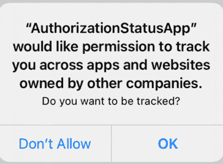

# 如何在 iOS14 中获取广告客户(IDFA)的标识符

> 原文：<https://www.freecodecamp.org/news/how-to-get-the-identifier-for-advertisers-ios14/>

如果这篇文章的标题对你有意义，那么你很可能已经意识到了 iOS14 引发的地震。

随着 iOS14 的发布，应用程序收集用户信息的方式发生了重大变化。其中之一是处理广告商(或 IDFA)的标识符以及应用程序如何访问它。

但是对于那些不知道的人，让我们先解释一下什么是 IDFA，为什么它很重要。

## 什么是 IDFA？

每个 iOS 设备所有者都可以决定他们是否希望被广告公司跟踪。这使得这些公司可以向用户提供针对他们定制的内容(基于他们的在线浏览习惯)。

公司可以通过所谓的 IDFA(广告商的标识符)来做到这一点。这是一个 [UUID](https://en.wikipedia.org/wiki/Universally_unique_identifier#:~:text=A%20universally%20unique%20identifier%20(UUID,%2C%20for%20practical%20purposes%2C%20unique.) 字符串，让广告商将用户与他们的行为匹配起来。

这里有一个 UUID 字符串的例子:123 e 4567-e89b-12 D3-a456–426614174000。

### 那么，我们之前谈到的那些变化是什么呢？

简而言之，应用程序现在需要向用户显示一个对话框，询问他们是否允许应用程序跟踪他们。



The Tracking Authorization Dialog

看起来很不吉利，对吧？

这与 iOS14 之前的工作方式形成了对比，在 IOs 14 之前，你只需检查设备是否启用或禁用了有限的广告跟踪。

苹果操作系统的最新版本(iOS14)已经上市(从 9 月 16 日开始)。使用 IDFA 的开发人员必须对他们的应用程序进行修改，才能兼容 iOS14。

9 月 3 日，苹果发布了一个[更新](https://developer.apple.com/news/?id=hx9s63c5%27)，并将完成这些更新的最后期限推迟到了明年年初:

> “为了给开发者时间做出必要的改变，从明年年初开始，应用程序将被要求获得跟踪用户的许可”

现在我们有一些时间来恢复我们的冷静和呼吸，让我们开始为 2021 年的新常态做准备。

在本文中，我们将介绍一些关于 IDFA 的背景，并了解我们如何从 iOS14 及以后的版本中获取其价值。

## 广告商是如何使用 IDFA 的？

让我们来看一个场景(pre COIVD-19)，你正在 iPhone 上浏览网页，正在为你的下一次度假寻找一家酒店。

你看到的每个广告都会发送一个附有你的 IDFA 的像素。通过匹配您的 IDFA，广告商可以看到您正在查看大量推广酒店的广告，并得出您正在预订酒店房间的结论。

从那里开始，用不了多久，你就会看到很多酒店房间的广告。

这种简单而又深刻的技术在 2012 年 iOS6 中进入了我们的生活。从那以后，很多事情都变了，iOS14 再一次颠覆了这个行业。

**✋* 注意:*要使用这些新的 API，你必须升级/下载 XCode 12* 。*

## 广告跟踪和获得 IDFA

在 iOS14 之前，获得 IDFA 相当简单。

您必须检查[广告跟踪](https://developer.apple.com/documentation/adsupport/asidentifiermanager/1614148-isadvertisingtrackingenabled)是否启用，方法是:

`[[ASIdentifierManager sharedManager] isAdvertisingTrackingEnabled]`

如果它被禁用，这意味着您可以通过 [ASIdentifierManager](https://developer.apple.com/documentation/adsupport/asidentifiermanager) 类获得 IDFA，就像这样:

`[[[ASIdentifierManager sharedManager] advertisingIdentifier] UUIDString];`

很简单，对吧？

**开头的 *iOS10，如果用户禁用了广告追踪，上面的方法会返回一个用零填充的 UUID 字符串。***

*iOS14 的变化之一是检查广告商跟踪是否启用的方法被弃用。那么，从 iOS14 开始，应用程序如何才能获得梦寐以求的 IDFA 呢？*

*他们将不得不使用一个新的 API 向用户显示一个对话框。关于这段对话，我想说几句至理名言:*

*   *只能向用户 ****展示一次*****
*   *在对话框的用户界面中唯一可以改变的是允许跟踪选项( ****)上面的两行:“你想被跟踪吗？”**** )*

*这意味着开发人员需要长时间努力思考如何以及何时将消息呈现给用户。*

## *授权状态*

*在 iOS14 中，创建了一个名为 [App Tracking Transparency](https://developer.apple.com/documentation/apptrackingtransparency?language=objc) 的新框架。这个框架包含一个名为 [ATTrackingManager](https://developer.apple.com/documentation/apptrackingtransparency/attrackingmanager?language=objc) 的类，它提供了一个 API 来:*

1.  *向用户显示一个对话框，请求允许跟踪他们*
2.  *查询授权状态(无论是否显示对话框)*

*我们将首先学习如何获得授权状态。为此，需要调用****trackingAuthorizationStatus*****方法。**

**`ATTrackingManagerAuthorizationStatus status = [ATTrackingManager trackingAuthorizationStatus];`**

 **它将返回具有下列值之一的 NSUInteger:

*   attrackingmanagrauthorizationstatusnotdetermined = 0
*   attrackingmanagrauthorizationstatusrestricted = 1
*   attrackingmanagrauthorizationstatusauthorized = 3
*   attrackingmanagrauthorizationstatusdenied = 2

前三个结果不言自明，所以我们将花一分钟关注最后一个。

当启用/禁用广告跟踪的屏幕被锁定并且此选项设置为启用时，您可以获得受限的授权状态。

苹果公司已经承认了这一点，例如，在被识别为属于儿童的设备中。

## 请求允许跟踪

在查看显示对话框所需的代码之前，您必须首先在 info.plist 文件中包含****nsusetrackingsagedescription*****键。*

*您为该键添加的值将在对话框中显示为前面提到的两行。*

*

***NSUserTrackingUsageDescription in the info.plist file**** 

*为了呈现对话框，我们需要调用[requestTrackingAuthorizationWithCompletionHandler](https://developer.apple.com/documentation/apptrackingtransparency/attrackingmanager/3547037-requesttrackingauthorizationwith?language=objc):*

```
*`[ATTrackingManager requestTrackingAuthorizationWithCompletionHandler:^(ATTrackingManagerAuthorizationStatus status) {
        if (status == ATTrackingManagerAuthorizationStatusDenied) {
            //Logic when authorization status is denied
        } else if (status == ATTrackingManagerAuthorizationStatusAuthorized) {
            //Logic when authorization status is authorized
        } else if (status == ATTrackingManagerAuthorizationStatusNotDetermined) {
            //Logic when authorization status is unknown
        }  else if (status == ATTrackingManagerAuthorizationStatusRestricted) {
            //Logic when authorization status is restricted
        }
    }];`* 
```

 *在本文的第一张图中(你可以看到对话框)，你可以看到我们在 info.plist 文件中写的代码行在对话框中显示为两行。

## 包扎

总之，重要的是要记住，这些变化虽然令人生畏，但不会马上发生。

您还应该确保遵循本文中详述的所有步骤，以免在您的应用程序中遇到崩溃/错误。***