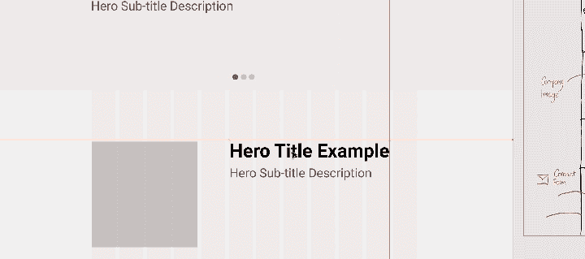
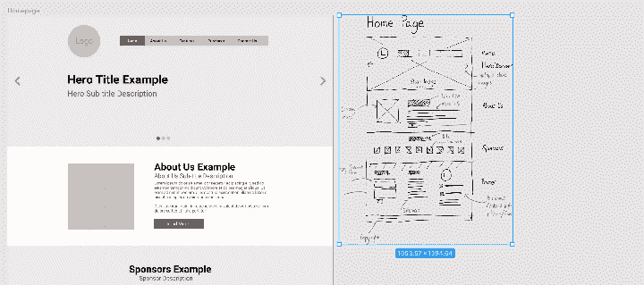
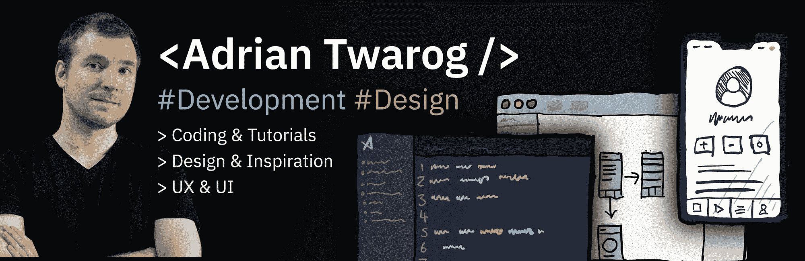

# 如何从线框设计一个网站原型

> 原文：<https://www.freecodecamp.org/news/designing-a-website-ui-with-prototyping/>

你可能听过一句老话:“量两次，切一次。”这就是为什么你应该在建立网站之前就计划好。这就是原型的用武之地。

当我们设计我们的网站时，我们从[线框图](https://www.freecodecamp.org/news/what-is-a-wireframe-ux-design-tutorial-website/)发展到原型设计，最后是完整的设计。

我想通过带你经历整个过程来探索和扩展原型的实际含义。

[https://www.youtube.com/embed/_P3CrgFlXhg?feature=oembed](https://www.youtube.com/embed/_P3CrgFlXhg?feature=oembed)

You can [watch my full course on UI Design and building an Early Prototype on YouTube](https://www.youtube.com/watch?v=_P3CrgFlXhg) or here in this embedded video (36-minute watch)

请注意，我创建了另一个课程，涵盖了设计网站的第一步:建立一个线框。你可以[在这里阅读线框图并观看我的 30 分钟视频课程](https://www.freecodecamp.org/news/what-is-a-wireframe-ux-design-tutorial-website/)。

在本教程中，我们将涵盖:

1.  早期的原型是什么
2.  创建结构:框架、行、列
3.  添加内容:标题，滑块，关于
4.  设计部分
5.  结论:我们从原型制作过程中学到了什么

## 什么是早期原型？

原型通常是设计的二次迭代，因为它建立在线框图的顶部。

线框通常包括通过纸、笔或在线工具绘制的简单草图。接下来，我们建立原型，这是我们的网站或应用程序更完善的样机。

让我们看看我们在上一篇文章中构建的早期线框[:](https://www.freecodecamp.org/news/what-is-a-wireframe-ux-design-tutorial-website/)

The wireframe we created in [my previous wireframing course](https://www.freecodecamp.org/news/what-is-a-wireframe-ux-design-tutorial-website/).

它有许多页面、部分和区域，稍后将在这些地方添加文本和图像。

那么，原型的目标是在视觉上构建它，但不添加颜色或图像。

在这个例子中，我将使用 [Figma](https://www.figma.com/) 来做原型。你可以[在这里](https://www.figma.com/file/mh52sQHBF8Bq2pIZhLKVuh/freeCodeCamp-Website-Ui?node-id=0%3A1)查看整个 Figma 原型。

## 如何创建一个网站原型结构:框架，行，列

当我们创建线框时，我们考虑了网格——但它们是手绘的。

当做一个早期的原型时，我们必须正确地定义它们，以便整个设计遵循网格结构。

在本例中，我将使用 12 列设计，常规宽度为 1140px，这是自举设计中常用的设计。这使我们在网格单元之间有 15-30px 的余量。

稍后，当我们将列折叠为行以获得移动响应时，这将非常有用。

您可以在 Figma 中创建自己的网格结构。但是请注意，您(或其他人)稍后将需要实际编码这些设计。

无论何时你在设计什么东西，一定要考虑到开发者。

## 如何向网站原型添加内容:标题、滑块、部分

与线框不同，我们不再用线条来表示文本，用块来表示标题。相反，我们需要填写样机的内容。

这并不意味着添加颜色或图像。但这意味着我们必须展示真实的文本。

在这个阶段，最好确保页眉和各节显示出它们想要包含的实际内容。这将允许在设计的后期更好地选择颜色和图像。

在示例的这一部分，我构建了带有英雄文本的滑块，并在下面添加了描述。在原型流程的这个阶段，需要注意一些事情:

*   字体大小和位置
*   内容位置和间距
*   段落和内容之间的边距和填充

## 如何设计网站原型的各个部分

对于原型和最终模型，重要的是开始对你的组和部分进行分层。部分可以包括标题、“关于我们”部分和赞助商部分。

您可以在您的 UI 工具中创建组(Figma 通过 Ctrl+G 来实现)。给你的部分贴上标签，并设置不同的背景颜色。这将使识别它们变得容易，并允许你轻松地移动它们。

太多次了，我被要求在分组中上下移动网站的某些部分。通过将你所有的组件分成几个部分，在设计工作的原型阶段，你将会更加轻松。

## 结论:我们从原型制作过程中学到了什么

当我们构建设计的其余部分时，确保这个早期原型不会成为网站设计的完整模型是很重要的。

很容易忘乎所以。但是做一个线框图之后做一个原型的目标是确保我们可以继续规划网站的发展。

在早期规划阶段识别问题并在开始创建完整的设计之前更新它们要容易得多。这种原型制作可能只花你几个小时，但是在以后的过程中可以节省几天的时间。

一旦你完成了多个页面的原型，你就可以进入完整的原型设计阶段了。这将包括搞清楚色彩理论、排版和相应的图像。我们将在下个月本系列的下一篇文章中讨论这个问题。

## 额外收获:添加一个交互式原型运行

对于这个例子，我们只创建了一个页面。也就是说，原型也允许你创建一个站点运行的仿真例子。

这种模拟对于进行演示、测试客户对看到早期模型的真实世界示例的反应以及修改所有链接的流程非常有用。

我希望你喜欢这篇文章。如果你不知道我是谁，我是澳大利亚的阿德里安。？我在 Twitter & YouTube 上有一个小小的频道，所以如果你想了解我更多或者喜欢我的内容，有空可以来看看我？

*   ********Youtube:********[https://youtube.com/adriantwarog](https://youtube.com/adriantwarog)
*   ********碎碎念:********[https://twitter.com/adrian_twarog](https://twitter.com/adrian_twarog)