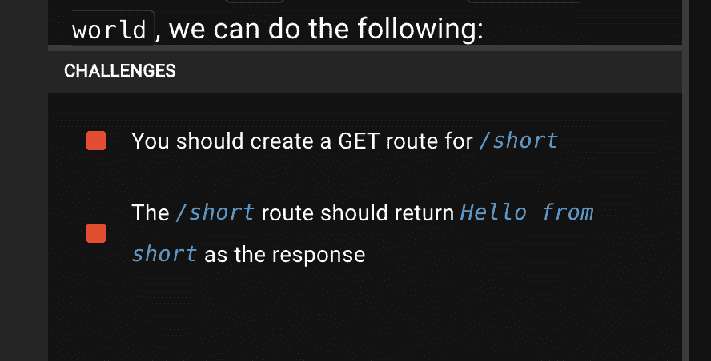
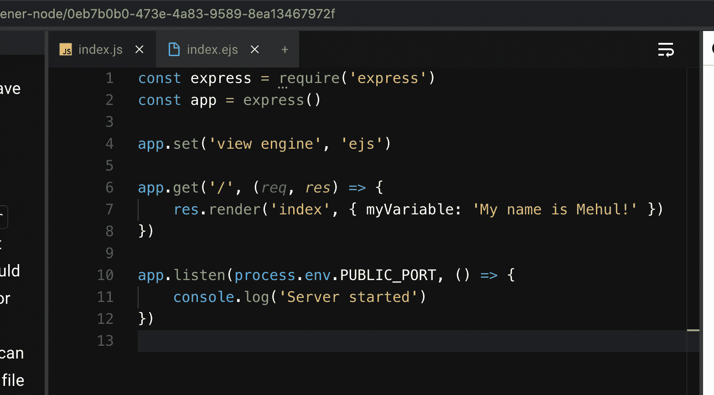
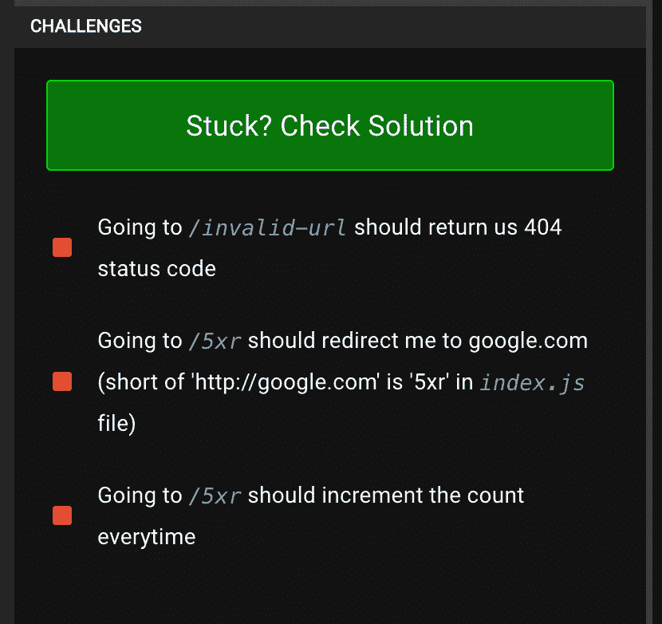

# 通过创建一个 URL Shortener 项目来学习 Node + MongoDB

> 原文：<https://www.freecodecamp.org/news/mongodb-node-express-project/>

如果你想学习一些东西，有什么比围绕你想学的东西建立一个项目更好的方法呢？

在这篇博文中，我们将通过构建一个简单的 URL shortener 应用程序来了解 MongoDB、Mongoose、Node 和其他技术。

网址缩写无处不在，从你在 twitter 上分享的链接到像 bit.ly 这样受欢迎的服务。但是你有没有想过如何为自己创建一个快速的网址缩写呢？

所以我们将通过实践来使用 MongoDB 作为我们的后端解决方案构建一个 URL 缩短器。这个项目会让你对自己的知识充满信心，巩固你所学的每一个概念。让我们开始吧。

## 项目介绍

我们将使用 codedamn 提供的这个免费的[URL shorter 课堂](https://codedamn.com/practice/url-shortener-node),进行实践，并评估我们的进展。

我们将使用以下技术:

*   猫鼬是 ORM
*   MongoDB 作为后端数据库
*   Node.js 作为后端
*   一个简单的嵌入式 JS 文件作为前端

我们将分 7 步完成这个项目，带你从头到尾。我们现在开始做实验。

## 第 1 部分:设置 Express 服务器

首先让我们设置我们的节点服务器。我们将使用 Express 作为这一部分的框架，因为它很容易使用。这是到这部分的[链接。](https://codedamn.com/practice/url-shortener-node/36280bc2-36b5-4f4e-8976-ed4687dc7cbd)

我们可以看到这是一个相当简单的练习。我们必须克服的两个挑战如下:



解决方案可能是这样的:

```
// Initialize express server on PORT 1337
const express = require('express')
const app = express()

app.get('/', (req, res) => {
	res.send('Hello World! - from codedamn')
})

app.get('/short', (req, res) => {
	res.send('Hello from short')
})

app.listen(process.env.PUBLIC_PORT, () => {
	console.log('Server started')
})
```

简单易行。我们使用`app.get`创建另一个 GET 路由，它应该可以完成任务。

## 第 2 部分:设置我们的视图引擎

现在我们已经熟悉了快速安装，让我们看看我们拥有的`.ejs`模板。这是这个部分的[链接。](https://codedamn.com/practice/url-shortener-node/0eb7b0b0-473e-4a83-9589-8ea13467972f)

EJS 引擎允许您通过 Node.js 代码将变量传递到 HTML，并在向服务器发送实际响应之前迭代或显示它们。

快速浏览一下`views/index.ejs`文件。除了可以使用变量之外，它看起来和普通的 HTML 文件很相似。

这是我们当前的`index.js`文件:



现在，你可以看到在`index.js`文件中有一行`app.set('view engine', 'ejs')`。它告诉 Express 使用`ejs`作为默认的模板引擎。

最后，请注意我们使用的是 res.render，并且只传递文件名，而不是完整路径。这是因为 Express 会自动在视图文件夹中查找可用的`.ejs`模板。

我们将变量作为第二个参数传递，然后我们可以在 EJS 文件中访问它。我们稍后会用到这个文件，但是现在让我们来做一个快速的挑战。

要完成这个挑战，我们只需要将名称从`Mehul`改为其他名称。

要通过这项挑战，请先查看`index.ejs`文件，然后将您的姓名更新为您喜欢的任何其他名称。这里有一个很好的解决方案:

```
const express = require('express')
const app = express()

app.set('view engine', 'ejs')

app.get('/', (req, res) => {
	res.render('index', { myVariable: 'My name is John!' })
})

app.listen(process.env.PUBLIC_PORT, () => {
	console.log('Server started')
})
```

## 第 3 部分:设置 MongoDB

现在我们已经对前端和后端有了一些了解，让我们继续设置 MongoDB。这里是这部分的[链接。](https://codedamn.com/practice/url-shortener-node/523eaae7-27ff-47fe-bfdc-67a65dfd5711)

我们将使用 Mongoose 连接到 MongoDB。Mongoose 是 MongoDB 的 ORM。

简单地说，MongoDB 是一个非常松散的数据库，它允许对任何东西进行各种操作。

虽然它对非结构化数据有好处，但大多数时候我们实际上知道数据会是什么(比如用户记录或支付记录)。因此，我们可以使用 Mongoose 为 MongoDB 定义一个*模式*。这让很多功能对我们来说变得很简单。

例如，一旦我们有了一个模式，我们就可以确信数据验证和任何必要的检查将由 Mongoose 自动处理。Mongoose 也给了我们一堆助手功能，让我们的生活变得更轻松。让我们现在设置它。

要完成这一部分，我们必须注意以下几点:

*   猫鼬 NPM 软件包已经为您安装。你可以直接`require`它。
*   使用`mongoose.connect`方法连接到`mongodb://localhost:27017/codedamn` URL。

这是我们当前的 index.js 文件:

```
const express = require('express')
const app = express()
const mongoose = require('mongoose')

app.set('view engine', 'ejs')

app.get('/', (req, res) => {
	res.render('index')
})

app.post('/short', (req, res) => {
	const db = mongoose.connection.db
	// insert the record in 'test' collection

	res.json({ ok: 1 })
})

// Setup your mongodb connection here
// mongoose.connect(...)

// Wait for mongodb connection before server starts
app.listen(process.env.PUBLIC_PORT, () => {
	console.log('Server started')
}) 
```

让我们用相关代码填充适当的占位符:

```
const express = require('express')
const app = express()
const mongoose = require('mongoose')

app.set('view engine', 'ejs')

app.get('/', (req, res) => {
	res.render('index')
})

app.post('/short', (req, res) => {
	const db = mongoose.connection.db
	// insert the record in 'test' collection
	db.collection('test').insertOne({ testCompleted: 1 })

	res.json({ ok: 1 })
})

// Setup your mongodb connection here
mongoose.connect('mongodb://localhost/codedamn', {
	useNewUrlParser: true,
	useUnifiedTopology: true
})
mongoose.connection.on('open', () => {
	// Wait for mongodb connection before server starts
	app.listen(process.env.PUBLIC_PORT, () => {
		console.log('Server started')
	})
})
```

请注意，只有当我们与 MongoDB 的连接打开时，我们才启动 HTTP 服务器。这很好，因为我们不希望用户在我们的数据库准备好之前点击我们的路线。

我们最后使用`db.collection`方法插入一个简单的记录，但是我们很快会有一个更好的方法来使用 Mongoose 模型与数据库交互。

## 第 4 部分:设置一个 Mongoose 模式

在上一节中，我们已经有了 MongoDB 实现的实践经验，现在让我们画出 URL 缩短器的模式。这是这部分的[链接。](https://codedamn.com/practice/url-shortener-node/a64e6946-a6ea-4ba7-8357-fe000c61658c)

Mongoose 模式允许我们以抽象的方式与 Mongo 集合进行交互。Mongoose 丰富的文档还公开了类似于`.save`的助手函数，这些函数足以执行完整的 DB 查询来更新文档中的更改。

以下是我们的 URL 缩写模式的外观:

```
const mongoose = require('mongoose')
const shortId = require('shortid')

const shortUrlSchema = new mongoose.Schema({
  full: {
    type: String,
    required: true
  },
  short: {
    type: String,
    required: true,
    default: shortId.generate
  },
  clicks: {
    type: Number,
    required: true,
    default: 0
  }
})

module.exports = mongoose.model('ShortUrl', shortUrlSchema)
```

我们将把这个文件存储在`models/url.js`文件中。一旦我们有了模式，我们就可以通过这部分的练习。我们必须做以下两件事:

1.  在`models/url.js`文件中创建这个模型。(我们做到了。)
2.  对`/short`的 POST 请求应该会向该模型的数据库中添加一些内容。

为此，我们可以使用以下代码生成一条新记录:

```
app.post('/short', async (req, res) => {
	// insert the record using the model
	const record = new ShortURL({
		full: 'test'
	})
	await record.save()
	res.json({ ok: 1 })
})
```

您将看到我们可以省略`clicks`和`short`字段，因为它们在模式中已经有了默认值。这意味着当查询运行时，Mongoose 将自动填充它们。

我们通过这个挑战的最终文件应该是这样的:

```
const express = require('express')
const app = express()
const mongoose = require('mongoose')
// import the model here
const ShortURL = require('./models/url')

app.set('view engine', 'ejs')

app.get('/', (req, res) => {
	res.render('index', { myVariable: 'My name is John!' })
})

app.post('/short', async (req, res) => {
	// insert the record using the model
	const record = new ShortURL({
		full: 'test'
	})
	await record.save()
	res.json({ ok: 1 })
})

// Setup your mongodb connection here
mongoose.connect('mongodb://localhost/codedamn')

mongoose.connection.on('open', () => {
	// Wait for mongodb connection before server starts
	app.listen(process.env.PUBLIC_PORT, () => {
		console.log('Server started')
	})
})
```

## 第 5 部分:链接前端、后端和+ MongoDB

现在我们有了后端部分的句柄，让我们回到前端，设置我们的网页。在那里，我们可以使用**收缩**按钮向数据库添加一些记录。下面是[这部分](https://codedamn.com/practice/url-shortener-node/bfd9d2d7-e925-4ade-9d4b-f9e23124cc07)的链接。

如果您查看一下`views/index.ejs`文件，您会看到我们已经在后端`/short`路径上传递了表单数据。但是现在我们没有抓住它。

*   您可以看到在第 8 行有一个名为`app.use(express.urlencoded({ extended: false }))`的新行，它允许我们从表单中读取用户的响应。
*   在`index.ejs`文件中，你可以看到我们设置了`name=”fullURL”`，这就是我们如何在后端接收 URL。

这是我们的`index.ejs`文件:

```
<!DOCTYPE html>
<html lang="en">
	<head>
		<meta charset="UTF-8" />
		<meta name="viewport" content="width=device-width, initial-scale=1.0" />
		<meta http-equiv="X-UA-Compatible" content="ie=edge" />
		<link
			rel="stylesheet"
			href="https://stackpath.bootstrapcdn.com/bootstrap/4.4.1/css/bootstrap.min.css"
		/>
		<title>codedamn URL Shortner Project</title>
	</head>
	<body>
		<div class="container">
			<h1>URL Shrinker</h1>
			<form action="/short" method="POST" class="my-4 form-inline">
				<label for="fullUrl" class="sr-only">URL</label>
				<input
					required
					placeholder="URL"
					type="url"
					name="fullUrl"
					id="fullUrl"
					class="form-control col mr-2"
				/>
				<button class="btn btn-success" type="submit">Shrink This!</button>
			</form>

			<table class="table table-striped table-responsive">
				<thead>
					<tr>
						<th>Full URL</th>
						<th>Short URL</th>
						<th>Clicks</th>
					</tr>
				</thead>
				<tbody>
					<% shortUrls.forEach(shortUrl => { %>
					<tr>
						<td><a href="<%= shortUrl.full %>"><%= shortUrl.full %></a></td>
						<td><a href="<%= shortUrl.short %>"><%= shortUrl.short %></a></td>
						<td><%= shortUrl.clicks %></td>
					</tr>
					<% }) %>
				</tbody>
			</table>
		</div>
	</body>
</html> 
```

这是一个简单的挑战，因为我们只需输入以下代码来完成它:

```
app.use(express.urlencoded({ extended: false }))

app.post('/short', async (req, res) => {
	// Grab the fullUrl parameter from the req.body
	const fullUrl = req.body.fullUrl
	console.log('URL requested: ', fullUrl)

	// insert and wait for the record to be inserted using the model
	const record = new ShortURL({
		full: fullUrl
	})

	await record.save()

	res.redirect('/')
})
```

首先，我们使用`req.body.fullUrl`通过 HTML 抓取发送的 URL。为了实现这一点，我们还使用了`app.use(express.urlencoded({ extended: false }))`来获取表单数据。

然后，我们像上次一样创建并保存记录。最后，我们将用户重定向回主页，以便用户可以看到新的链接。

提示:通过对后端 API 执行 Ajax 请求，而不是典型的表单提交，可以使这个应用程序更有趣。但是我们将把它留在这里，因为它更侧重于 MongoDB +节点设置，而不是 JavaScript。

## 第 6 部分:在前端显示短 URL

现在我们在 MongoDB 中存储了缩短的 URL，让我们继续在前端显示它们。

还记得我们之前传递给`ejs`模板的变量吗？现在我们将使用它们。

在`index.ejs`文件中已经为你完成了`ejs`的模板循环(你可以在上面看到那个循环)。然而，我们必须编写 Mongoose 查询来提取本节中的数据。

如果我们看到模板，我们会看到在`index.js`中我们有以下代码:

```
app.get('/', (req, res) => {
	const allData = [] // write a mongoose query to get all URLs from here
	res.render('index', { shortUrls: allData })
}) 
```

我们已经定义了一个从 Mongoose 查询数据的模型。让我们用它来得到我们需要的一切。

这是我们的解决方案文件:

```
const express = require('express')
const app = express()
const mongoose = require('mongoose')
// import the model here
const ShortURL = require('./models/url')

app.set('view engine', 'ejs')
app.use(express.urlencoded({ extended: false }))

app.get('/', async (req, res) => {
	const allData = await ShortURL.find()
	res.render('index', { shortUrls: allData })
})

app.post('/short', async (req, res) => {
	// Grab the fullUrl parameter from the req.body
	const fullUrl = req.body.fullUrl
	console.log('URL requested: ', fullUrl)

	// insert and wait for the record to be inserted using the model
	const record = new ShortURL({
		full: fullUrl
	})

	await record.save()

	res.redirect('/')
})

// Setup your mongodb connection here
mongoose.connect('mongodb://localhost/codedamn', {
	useNewUrlParser: true,
	useUnifiedTopology: true
})

mongoose.connection.on('open', async () => {
	// Wait for mongodb connection before server starts

	// Just 2 URLs for testing purpose
	await ShortURL.create({ full: 'http://google.com' })
	await ShortURL.create({ full: 'http://codedamn.com' })

	app.listen(process.env.PUBLIC_PORT, () => {
		console.log('Server started')
	})
})
```

你可以看到这就像在`allData`变量中做`await ShortURL.find()`一样简单。接下来的部分就有点棘手了。

## 第 7 部分:使重定向工作

我们快完成了！我们有完整的网址和短网址存储在数据库中，我们也在前端显示它们。

但是你会注意到重定向现在不工作，我们得到一个明确的错误。

让我们解决这个问题。您可以在`index.js`文件中看到，在末尾添加了一个新的动态路由来处理这些重定向:

```
app.get('/:shortid', async (req, res) => {
	// grab the :shortid param
	const shortid = ''

	// perform the mongoose call to find the long URL

	// if null, set status to 404 (res.sendStatus(404))

	// if not null, increment the click count in database

	// redirect the user to original link
})
```

我们在这部分面临的挑战如下:



好吧。首先，当我们访问一个短 URL 时，我们必须提取完整的 URL。我们将这样做:

```
app.get('/:shortid', async (req, res) => {
	// grab the :shortid param
	const shortid = req.params.shortid

	// perform the mongoose call to find the long URL
	const rec = await ShortURL.findOne({ short: shortid })

	// ...
}) 
```

现在，如果我们看到我们的结果为空，我们将发送一个 404 状态:

```
app.get('/:shortid', async (req, res) => {
	// grab the :shortid param
	const shortid = req.params.shortid

	// perform the mongoose call to find the long URL
	const rec = await ShortURL.findOne({ short: shortid })

	// if null, set status to 404 (res.sendStatus(404))
	if (!rec) return res.sendStatus(404)

	res.sendStatus(200)	
})
```

这通过了我们的第一个挑战。接下来，如果我们实际上有一个链接，让我们重定向用户并增加数据库中的点击计数。

```
app.get('/:shortid', async (req, res) => {
	// grab the :shortid param
	const shortid = req.params.shortid

	// perform the mongoose call to find the long URL
	const rec = await ShortURL.findOne({ short: shortid })

	// if null, set status to 404 (res.sendStatus(404))
	if (!rec) return res.sendStatus(404)

	// if not null, increment the click count in database
	rec.clicks++
	await rec.save()

	// redirect the user to original link
	res.redirect(rec.full)
})
```

这样，我们可以增加并再次将结果存储在数据库中。那会通过我们所有的挑战。

## 结论

恭喜你！您刚刚使用 Express + Node + MongoDB 自己构建了一个完整的工作 URL 缩短器。给自己一个鼓励！

最终的源代码是 GitHub 上的[。](https://github.com/codedamn-classrooms/node-mongodb-url-shortner/tree/lab7-sol)

如果你对这篇文章或 codedamn 课堂有任何反馈，请随时通过 [Twitter](https://twitter.com/mehulmpt) 联系我。大家讨论一下:)