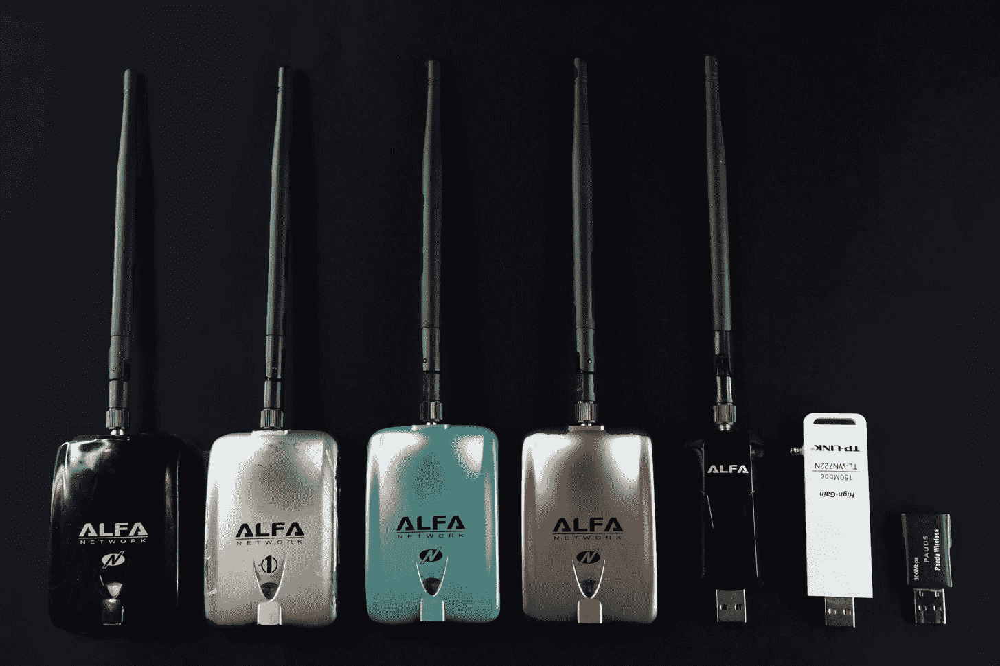
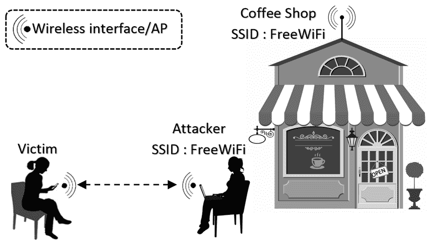

# Wifi 黑客 101–如何使用 Aircrack-NG 保护您的 WiFi 网络

> 原文：<https://www.freecodecamp.org/news/wifi-hacking-securing-wifi-networks-with-aircrack-ng/>

想象一个没有 WiFi 的世界。我们仍然会使用很长的以太网电缆来连接互联网。

WiFi 给我们的生活带来了多大的便利，这是毋庸置疑的。现在我们可以在咖啡店、地铁站和几乎任何我们去的地方连接互联网。

然而，与以太网相比，WiFi 也是一个易受攻击的网络。除非安全措施得当，否则很容易使用 Wireshark 等[工具进行中间人攻击。](https://medium.com/manishmshiva/wireshark-a-walkthrough-of-the-best-packet-analyzer-in-the-world-9af0358ed9a1)

例如，如果您连接到星巴克网络，任何连接到该网络的人都可以查看所有其他人的网络流量。

除非你使用 VPN 或者网站使用 HTTPS，否则你的数据(包括密码和信用卡信息)将会被整个网络看到。

如果你在为一家公司工作，他们也有可能使用 WiFi 网络。你想知道它有多安全吗？您知道停车场中是否有人连接到您的网络并捕获您公司的机密数据吗？

借助 Wireshark 和 Aircrack 等工具，您可以对您的 WiFi 网络进行安全审计。虽然 Wireshark 可以帮助您观察网络上发生的事情，但 Aircrack 更像是一种攻击性工具，可以让您攻击并访问 WiFi 网络。

像攻击者一样思考一直是防御网络的最佳方式。通过学习如何使用 Aircrack，您将能够了解攻击者获取网络访问权限的确切步骤。然后，您可以对自己的网络进行安全审计，以确保它不容易受到攻击。

> 注意:我绝不是在鼓励使用非法的攻击性工具。本教程纯粹是教育性的，旨在帮助您更好地保护您的网络。

在我们详细了解 Aircrack 之前，有几个术语你应该知道。

*   **接入点** —您想要连接的 WiFi 网络。
*   **SSID** —接入点的名称。比如“星巴克”。
*   **Pcap 文件** —数据包捕获文件。包含网络上捕获的数据包。工具的通用格式，包括 Wireshark 和 Nessus。
*   **有线等效保密(WEP)** —无线网络的安全算法。
*   **保护无线电脑网络安全系统(WPA & WPA2)** —比 WEP 更强的安全算法。
*   **IEEE 802.11**——[无线局域网协议](https://en.wikipedia.org/wiki/IEEE_802.11)。
*   **监控模式** —在不连接路由器或接入点的情况下，在空中捕获网络数据包。

[我最近写了一篇关于作为渗透测试者你应该知道的前 100 个术语的文章](https://medium.com/manishmshiva/penetration-testing-100-terms-you-need-to-know-a723c38cd8c8)。有兴趣可以去看看。

## 什么是空调？

Aircrack 是一个软件套件，可以帮助您攻击和防御无线网络。

Aircrack 不是一个单一的工具，而是一个完整的工具集合，每个工具都执行特定的功能。这些工具包括检测器、数据包嗅探器、WEP/WPA 破解程序等等。

Aircrack 的主要目的是捕获数据包并从中读取散列值，以便破解密码。Aircrack 支持几乎所有最新的无线接口。

Aircrack 是开源的，可以在 Linux、FreeBSD、macOS、OpenBSD 和 Windows 平台上工作。

Aircrack-ng 中的“NG”代表“新一代”。Aircrack-ng 是一个名为 Aircrack 的旧工具的更新版本。 [Aircrack 也预装在 Kali Linux 中](https://tools.kali.org/wireless-attacks/aircrack-ng)。

### WiFi 适配器



在我们开始使用 Aircrack 之前，您需要一个 WiFi 适配器。Aircrack 仅与无线网络接口控制器配合使用，该控制器的驱动程序支持原始监控模式，可以嗅探 802.11a、802.11b 和 802.11g 流量。

典型的 wifi 适配器(通常内置于您的电脑中)无法监控来自其他网络的流量。您只能使用它们连接到 WiFi 接入点。

使用 Aircrack 兼容的 wifi 适配器，您可以启用“监控模式”,通过该模式，您可以嗅探来自您未连接的网络的流量。然后，您可以使用捕获的数据破解该网络的密码。

[点击这里查看与 Kali Linux 兼容的 WiFi 适配器列表](https://www.kalilinux.in/2020/07/wifi-adapter-kali-linux-2020.html)。

## 气垫工具

现在你知道你可以用 Aircrack 做什么了，让我们看看它的每一个工具。

### 艾尔蒙-ng

Airmon-ng 是一个将您的网络接口卡置于监控模式的脚本。启用此功能后，您应该能够捕获网络数据包，而无需连接或验证接入点。

您可以使用命令`airmon-ng`列出网络接口，使用`airmon-ng start <interface name>`在监控模式下启动接口。

```
# airmon-ng start wlan0

  PID Name
  718 NetworkManager
  870 dhclient
 1104 avahi-daemon
 1105 avahi-daemon
 1115 wpa_supplicant

PHY	Interface	Driver		Chipset

phy0	wlan0		ath9k_htc	Atheros Communications, Inc. AR9271 802.11n
		(mac80211 monitor mode vif enabled for [phy0]wlan0 on [phy0]wlan0mon)
		(mac80211 station mode vif disabled for [phy0]wlan0
```

在上面的例子中，您可以看到网络接口`wlan0`已经变成了`wlan0mon`，这意味着已经为它启用了监控模式。

### 空气引擎 mp-ng

Airodump-ng 是一个数据包捕获实用程序，它捕获并保存原始数据包以供进一步分析。如果您的计算机上连接了 GPS 接收器，airodump-ng 也可以获取接入点的坐标。

使用 airmon-ng 启用 monitor 模式后，可以开始使用 airodump 捕获数据包。运行命令`airodump-ng`将列出可用的接入点。ESSID(或 SSID)是无线网络的名称。

```
# airodump-ng
CH  9 ][ Elapsed: 1 min ][ 2007-04-26 17:41 ][ WPA handshake: 00:14:6C:7E:40:80

 BSSID              PWR RXQ  Beacons    #Data, #/s  CH  MB   ENC  CIPHER AUTH ESSID

 00:09:5B:1C:AA:1D   11  16       10        0    0  11  54\.  OPN              NETGEAR                         
 00:14:6C:7A:41:81   34 100       57       14    1   9  11e  WEP  WEP         bigbear 
 00:14:6C:7E:40:80   32 100      752       73    2   9  54   WPA  TKIP   PSK  teddy                             

 BSSID              STATION            PWR   Rate   Lost  Packets  Notes  Probes

 00:14:6C:7A:41:81  00:0F:B5:32:31:31   51   36-24    2       14
 (not associated)   00:14:A4:3F:8D:13   19    0-0     0        4           mossy 
 00:14:6C:7A:41:81  00:0C:41:52:D1:D1   -1   36-36    0        5
 00:14:6C:7E:40:80  00:0F:B5:FD:FB:C2   35   54-54    0       99           teddy
```

### Aircrack-ng

一旦您使用 airodump-ng 捕获了足够多的数据包，您就可以使用 aircrack-ng 破解密钥。Aircrack 使用统计、暴力和字典攻击来破解 WEP / WPA 密钥。

```
Aircrack-ng 1.4

                 [00:00:03] 230 keys tested (73.41 k/s)

                         KEY FOUND! [ biscotte ]

    Master Key     : CD D7 9A 5A CF B0 70 C7 E9 D1 02 3B 87 02 85 D6 
                     39 E4 30 B3 2F 31 AA 37 AC 82 5A 55 B5 55 24 EE 

    Transcient Key : 33 55 0B FC 4F 24 84 F4 9A 38 B3 D0 89 83 D2 49 
                     73 F9 DE 89 67 A6 6D 2B 8E 46 2C 07 47 6A CE 08 
                     AD FB 65 D6 13 A9 9F 2C 65 E4 A6 08 F2 5A 67 97 
                     D9 6F 76 5B 8C D3 DF 13 2F BC DA 6A 6E D9 62 CD 

    EAPOL HMAC     : 52 27 B8 3F 73 7C 45 A0 05 97 69 5C 30 78 60 BD 
```

需要注意的是，你需要足够的数据包来破解密钥。此外，aircrack-ng 使用复杂的算法来破解网络数据包中的密钥。

如果你有兴趣了解更多关于 Aircrack 是如何做到这一点的，[这将是一个很好的起点](https://www.aircrack-ng.org/doku.php?id=aircrack-ng)。

### 空气播放

空中播放用于在无线网络上创建人工流量。Aireplay 既可以从实时网络中捕获流量，也可以使用现有 Pcap 文件中的数据包将其注入网络。

使用 airplay-ng，您可以执行诸如伪造身份验证、数据包注入、咖啡-拿铁攻击等攻击。

Cafe Latte 攻击允许您从客户端设备获取 WEP 密钥。您可以通过从客户端捕获一个 [ARP 数据包](https://erg.abdn.ac.uk/users/gorry/course/inet-pages/arp.html)，对其进行操作，然后将其发送回客户端。

然后，客户端将生成一个可以被 airodump-ng 捕获的数据包。最后，aircrack-ng 可用于从修改后的数据包中破解 WEP 密钥。

### 空军基地

Airbase-ng 用于将攻击者的计算机转换为流氓接入点，供其他人连接。

使用 Airbase，您可以伪装成合法的接入点，对连接到您系统的设备进行中间人攻击。



这种攻击也被称为“**邪恶双生攻击**”。假设你在星巴克尝试连接到他们的 Wifi，攻击者可以创建另一个同名的接入点(通常信号强度更好)，让你认为该接入点属于星巴克。

普通用户很难区分合法接入点和恶意接入点。因此，邪恶的孪生攻击仍然是我们今天遇到的最危险的无线攻击之一。

除了这些，还有一些工具供你在 Aircrack 武器库中使用。

*   **Packetforge-ng** —用于创建用于注入的加密数据包。
*   **Airdecap-ng —** 使用 aircrack-ng 破解密钥后，解密 WEP/WPA 加密的采集文件。这将允许您访问用户名、密码和其他敏感数据。
*   **Airolib-ng —** 在数据库中存储预先计算的 WPA/WPA2 密码。破解密码时与 aircrack-ng 一起使用。
*   **Airtun-ng —** 创建虚拟隧道接口。

## 摘要

多亏了 WiFi，世界变得更加互联互通。我们几乎每天都享受着 WiFi 的好处。尽管它有很多好处，但如果我们不小心，它也是一个容易受到攻击的网络，能够暴露我们的私人信息。

希望这篇文章能帮助你详细了解 WiFi 安全和 Aircrack。要了解更多关于 Aircrack 的信息，请查看他们的官方维基。

喜欢这篇文章吗？ [***加入我的简讯***](http://tinyletter.com/manishmshiva)**每周一将我的文章和视频汇总发送到您的邮箱。你也可以 [**在这里**](https://medium.com/manishmshiva) 找到我的博客。**