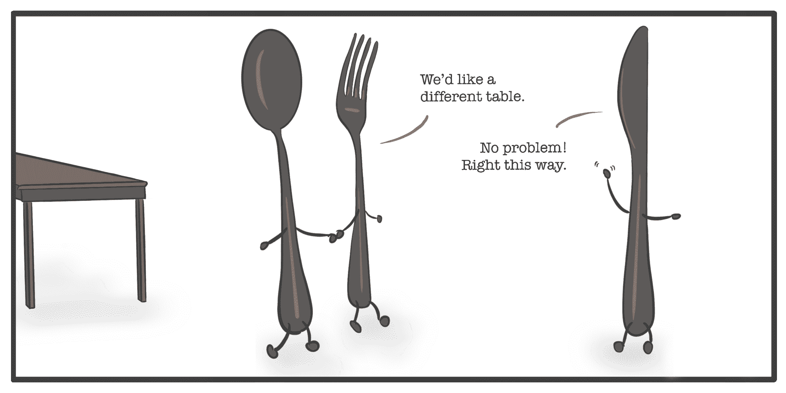

# 如何用 Django 迁移操作数据

> 原文：<https://www.freecodecamp.org/news/how-to-manipulate-data-with-django-migrations/>

在本文中，我们将学习如何更新 Django 模型并使用迁移操作现有数据。

不断增长的成功应用程序是一个可爱的问题。随着产品的开发，它会像你的周末蛋糕项目积累一层层的糖霜一样积累复杂性。

谢天谢地，Django，我最喜欢的包含电池的框架，很好地处理了复杂性。

Django [模型帮助人类以对我们的大脑有意义的方式处理数据](https://victoria.dev/blog/writing-efficient-django/#django-models)。该框架提供了大量可以继承的类，帮助您从头开始快速开发一个健壮的应用程序。

至于在现有的 Django 应用程序上开发，也有一个特性。

在本文中，我们将介绍如何使用 Django 迁移来更新您现有的模型和数据库。

## 引擎盖下是什么

Django 迁移是 Python 文件，帮助您添加和更改数据库表中的内容，以反映 Django 模型中的变化。

为了理解 Django 迁移如何帮助您处理数据，理解我们正在处理的底层结构可能会有所帮助。

### 什么是数据库表？

如果您以前看过电子表格，那么您已经基本理解了数据库表。

在关系数据库中，例如 PostgreSQL 数据库，您可以看到组织成列和行的数据。关系数据库表可以有固定数量的列和任意数量的行。

在 Django 中，每个模型都有自己的表。例如，这里有一个 Django 模型:

```
from django.db import models

class Lunch(models.Model):
    left_side = models.CharField(max_length=100, null=True)
    center = models.CharField(max_length=100, null=True)
    right_side = models.CharField(max_length=100, null=True) 
```

每个字段都是一列，每一行都是该模型的 Django 对象实例。

这是上面 Django 模型“午餐”的数据库表的表示。在数据库中，它的名字应该是`lunch_table`。

| 身份证明（identification） | 左侧 | 中心 | 右侧 |
| --- | --- | --- | --- |
| one | 叉 | 盘子 | 匙 |

模型`Lunch`有三个字段:`left_side`、`center`和`right-side`。一个`Lunch`对象的实例将会有`left_side`的“叉子”，一个`center`的“盘子”，和`right_side`的“勺子”。

如果不指定主键，Django [会自动添加一个`id`字段](https://docs.djangoproject.com/en/3.1/topics/db/models/#automatic-primary-key-fields)。

如果您想更改您的午餐模型的名称，您可以在您的`models.py`代码中这样做。

例如，将“午餐”改为“晚餐”，然后[运行`python manage.py makemigrations`](https://docs.djangoproject.com/en/3.1/ref/django-admin/#makemigrations) 。你会看到:

```
python manage.py makemigrations
Did you rename the backend.Lunch model to Dinner? [y/N] y
Migrations for 'backend':
  backend/migrations/0003_auto_20200922_2331.py
    - Rename model Lunch to Dinner 
```

Django 自动生成适当的迁移文件。在这种情况下，生成的迁移文件的相关行如下所示:

```
migrations.RenameModel(old_name="Lunch", new_name="Dinner"), 
```

这个操作会将我们的“午餐”模型重命名为“晚餐”,同时保持其他所有内容不变。

但是，如果您还想改变数据库表本身的结构、它的模式，并确保现有数据最终出现在餐桌上的正确位置，该怎么办呢？



Terrible cartoon by author.

让我们探索如何将我们的午餐模型转换成晚餐模型，如下所示:

```
from django.db import models

class Dinner(models.Model):
    top_left = models.CharField(max_length=100, null=True)
    top_center = models.CharField(max_length=100, null=True)
    top_right = models.CharField(max_length=100, null=True)
    bottom_left = models.CharField(max_length=100, null=True)
    bottom_center = models.CharField(max_length=100, null=True)
    bottom_right = models.CharField(max_length=100, null=True) 
```

…使用如下所示的数据库表:

| 身份证明（identification） | 左上角 | 顶部 _ 中间 | 右上方 | 左下角 | 底部中心 | 右下 |
| --- | --- | --- | --- | --- | --- | --- |
| one | 面包盘 | 匙 | 玻璃 | 叉 | 盘子 | 刀 |

## 如何用 Django 迁移操作数据

在开始处理数据之前，最好创建一个数据库备份，以便在出现问题时可以恢复。

根据您使用的数据库，有多种方法可以做到这一点。您通常可以通过搜索`<your database name>`和关键词`backup`、`recovery`或`snapshot`来找到说明。

为了设计您的迁移，熟悉可用的[迁移操作](https://docs.djangoproject.com/en/3.1/ref/migration-operations/)很有帮助。

迁移是一步一步进行的，每个操作都有点像添加、删除或更改数据。就像一个战略难题一样，一次一步地进行模型更改，以便生成的迁移具有正确的结果，这一点很重要。

我们已经成功地重命名了我们的模型。现在，我们将重命名包含我们想要保留的数据的字段:

```
class Dinner(models.Model):
    bottom_left = models.CharField(max_length=100, null=True)
    bottom_center = models.CharField(max_length=100, null=True)
    top_center = models.CharField(max_length=100, null=True) 
```

Django 有时足够聪明，可以正确地确定新旧字段名。您将被要求确认:

```
python manage.py makemigrations
Did you rename dinner.center to dinner.bottom_center (a CharField)? [y/N] y
Did you rename dinner.left_side to dinner.bottom_left (a CharField)? [y/N] y
Did you rename dinner.right_side to dinner.top_center (a CharField)? [y/N] y
Migrations for 'backend':
  backend/migrations/0004_auto_20200914_2345.py
    - Rename field center on dinner to bottom_center
    - Rename field left_side on dinner to bottom_left
    - Rename field right_side on dinner to top_center 
```

在某些情况下，您可能想要尝试重命名字段并一次运行一个。

既然现有的字段已经迁移到了它们的新名称，那么将剩余的字段添加到模型中:

```
class Dinner(models.Model):
    top_left = models.CharField(max_length=100, null=True)
    top_center = models.CharField(max_length=100, null=True)
    top_right = models.CharField(max_length=100, null=True)
    bottom_left = models.CharField(max_length=100, null=True)
    bottom_center = models.CharField(max_length=100, null=True)
    bottom_right = models.CharField(max_length=100, null=True) 
```

再次运行`makemigrations`,现在我们可以得到:

```
python manage.py makemigrations
Migrations for 'backend':
  backend/migrations/0005_auto_20200914_2351.py
    - Add field bottom_right to dinner
    - Add field top_left to dinner
    - Add field top_right to dinner 
```

你完了！通过生成 Django 迁移，您已经成功地设置了您的`dinner_table`,并将现有数据移动到了它的新位置。

## 额外的复杂性

您会注意到我们的午餐和晚餐模型并不复杂。在 Django 的许多[模型字段选项](https://docs.djangoproject.com/en/3.1/ref/models/fields/#field-types)中，我们只是使用`CharField`。我们还设置了`null=True`，让 Django 将空值存储为数据库中的`NULL`。

Django 迁移可以处理额外的复杂性，比如改变字段类型，以及是否允许空值。当我处理不同类型的数据和不同的用例时，我将 Django 的[模型字段引用](https://docs.djangoproject.com/en/3.1/ref/models/fields/#)放在手边。

## 去神秘化的迁徙

我希望这篇文章能够帮助您更好地理解 Django 迁移以及它们是如何工作的！

既然您可以在 Django 应用程序中更改模型和操作现有数据，那么一定要明智地使用您的能力。

备份您的数据库，研究和规划您的迁移，并在处理客户数据之前始终运行测试。通过这样做，您就有可能使您的应用程序在可管理的复杂性水平下增长。