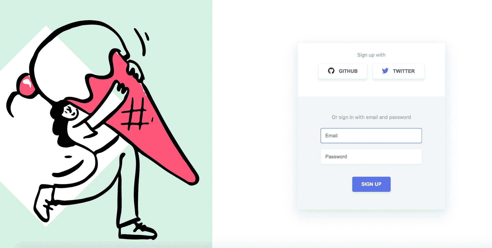
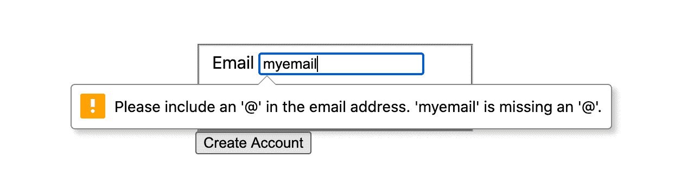
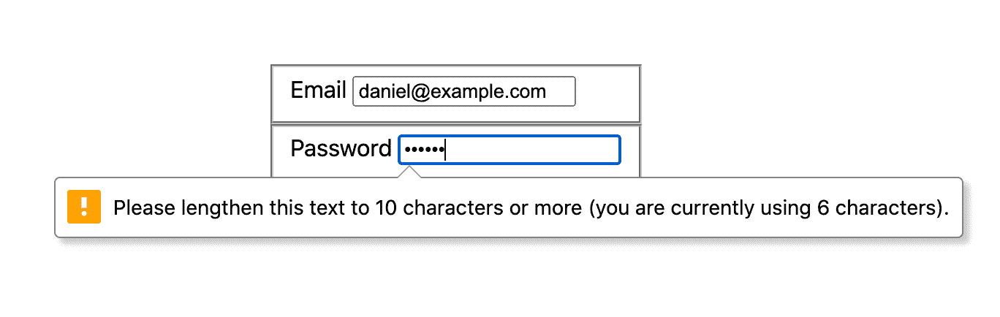
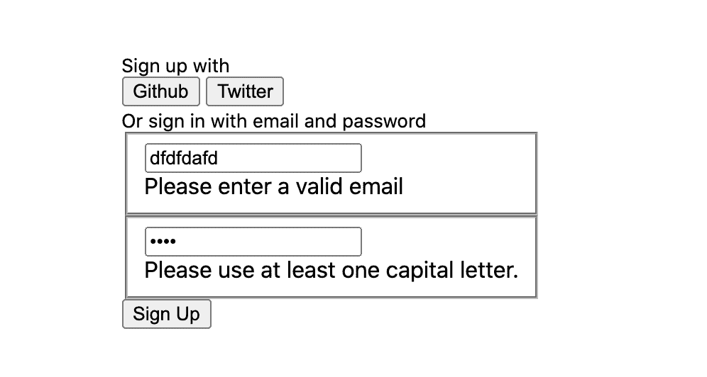
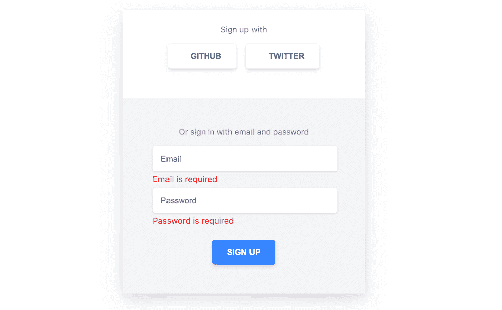

# 如何用普通的 HTML、CSS 和 JS 构建和验证漂亮的表单

> 原文：<https://www.freecodecamp.org/news/build-and-validate-beautiful-forms-with-vanilla-html-css-js/>

表格很难。

知道如何正确地收集和验证用户数据是前端开发人员需要掌握的最重要的技能之一。但是很难，因为边缘案例比比皆是。

你必须考虑用户破坏你漂亮的小表单的所有方式，同时提供优秀的用户体验。

UX 的作品很重要，因为表单是产品和服务转换的守门人。作为一名前端开发人员，如果你做错了，可能会有严重的财务后果。

这就是为什么有成千上万(稍微夸张)的表单库实现了行业最佳实践。

使用这些库没有错。当开发人员在不理解表单实际如何工作以及为什么某些模式被认为是标准的情况下使用它们时，问题就出现了。

我将向您展示我将如何仅使用 HTML、CSS 和 JavaScript 从头构建一个注册表单。

好了，事不宜迟，我们开始吧。

# 单一(默认)状态陷阱

### 桌面



### 移动的

[https://nolibs.io/dkh/motifs/2fnKSwMn/embed](https://nolibs.io/dkh/motifs/2fnKSwMn/embed)

当你面对这样的设计时，你的第一个问题应该是，这里有多少个状态*没有被表示出来？*

上面的例子代表一种状态(当用户访问登录页面时，这是他们将在桌面和移动设备上看到的)。

其他国家包括:

*   错误状态
    *   如果我输入一个已经存在的电子邮件，会发生什么？
*   装载状态
    *   当我提交表单时会发生什么？

规划工作时，一定要考虑设计中没有但必须考虑的内容。您需要仔细检查功能需求，如果您认为缺少了什么，就提出问题。

# 功能要求

说到要求...

作为一名开发人员，你经常会从产品经理、设计师或项目经理那里得到一份 [PRD](https://en.wikipedia.org/wiki/Product_requirements_document) (产品需求文档)。

这些文档通常被进一步分解成您将在 sprint 期间执行的单个用户故事。

戴上产品经理的帽子，下面是我们表单的功能需求:

*   用户必须提供电子邮件地址
*   密码长度必须至少为 10 个字符，并且至少包含一个大写字母、数字和特殊字符。
*   当错误信息不符合要求时，我们应该向用户显示错误信息

## 利润

我们要写的第一个代码将是 HTML 和少量的 CSS。

[https://nolibs.io/dkh/motifs/WhCWybHQ/embed](https://nolibs.io/dkh/motifs/WhCWybHQ/embed)

看起来还不多，但这里有一些不错的工作。让我们深入一点。

*   我们已经在表单中设置了侧元素和主元素
*   为了可读性，我使用 BEM 作为创建类名和语义 HTML 元素的指南。
*   我们的注册页面采用移动优先的方法，这意味着我们首先编写移动样式，并为桌面样式添加断点。
*   我将 CSS grid 用于整体布局，Flexbox 用于主要部分的位置元素。
*   我已经为表单添加了一个提交事件监听器和一个事件处理函数，该函数只是暂时记录事件对象。

## 确认

让我们通过明智地选择输入类型来利用一些内置的验证逻辑。我们将使用以下内容:

*   电子邮件输入类型
*   密码输入类型

电子邮件输入类型给了我们几个免费的验证。

1.  它检查以确保使用了`@`符号
2.  它还检查符号后是否有文本

因为 Email 和 Password 都是必需的，所以让我们为这两个元素添加`required`属性。我们还将为密码输入添加一个`minlength`属性。

```
<form id="dkh-signup-form">
  <div class="dkh-form-header">
    <div>
      <small>Sign up with</small>
      <div class="dkh-form-header__social-wrapper">
        <button type="button" class="dkh-btn dkh-btn-icon dkh-btn-github">
          Github
        </button>
        <button type="button" class="dkh-btn dkh-btn-icon dkh-btn-twitter">
          Twitter
        </button>
      </div>
    </div>
  </div>
  <div class="dkh-form-body">
    <small>Or sign in with email and password</small>
    <div class="dkh-form-field">
      <fieldset>
        <input autofocus class="dkh-form-field__input" name="email" type="email" id="email" required placeholder="Email">
      </fieldset>
      <div class="dkh-form-field__messages"></div>
    </div>
    <div class="dkh-form-field">
      <fieldset>
        <input class="dkh-form-field__input" name="password" type="password" id="password" required minlength="10" placeholder="Password">
      </fieldset>
      <div class="dkh-form-field__messages"></div>
    </div>
  </div>
  <div class="dkh-form-footer">
    <button class="dkh-btn dkh-btn-primary" type="submit">Sign Up</button>
  </div>
</form>
```

`type=email`属性告诉浏览器应该验证作为电子邮件的输入。



密码输入上的`minlength`属性给了我们这个有用的错误消息:



现在，在 handleSignupFormSubmit 函数中，我们可以使用 [FormData API](https://developer.mozilla.org/en-US/docs/Web/API/FormData/Using_FormData_Objects) 从表单中获取值，并最终将它们提交给 API。

```
function handleSignupFormSubmit(e) {
  // prevent default browser behaviour
  e.preventDefault();

  const formDataEntries = new FormData(signupForm).entries();
  const { email, password } = Object.fromEntries(formDataEntries);

  // submit email and password to an API
}
```

## 错误消息

浏览器呈现的错误消息有助于开始，但是如果您希望这些消息呈现在它们各自的表单输入下面，该怎么办呢？如果你想控制他们的样子呢？

遗憾的是，浏览器并没有给我们任何控制默认错误信息的方法。这就是我们的 div 元素发挥作用的地方。我们可以在这些元素中呈现自定义的错误消息。

让我们编写几个自定义验证函数来检查用户的密码和电子邮件值是否符合要求。

```
 function validatePassword(password, minlength) {
  if (!password) return 'Password is required';

  if (password.length < minlength) {
    return `Please enter a password that's at least ${minlength} characters long`;
  }

  const hasCapitalLetter = /[A-Z]/g;
  if (!hasCapitalLetter.test(password)) {
    return 'Please use at least one capital letter.';
  }

  const hasNumber = /\d/g;
  if (!hasNumber.test(password)) {
    return 'Please use at least one number.';
  }

  return '';
}
```

```
function validateEmail(email) {
  if (!email) return 'Email is required';

  const isValidEmail = /^\S+@\S+$/g
  if (!isValidEmail.test(email)) {
    return 'Please enter a valid email';
  }

  return '';
}
```

正则表达式`/^\\S+@\\S+$/g`远非防弹，但它至少检查以确保在符号`@`前后有字符。

验证电子邮件的最佳方式是向任何注册的用户发送确认电子邮件。然后，用户必须打开该电子邮件，并单击一个链接来确认他们的电子邮件地址是有效的。

如果你想更深入地了解客户端电子邮件验证，这是一个很好的[线索](https://stackoverflow.com/questions/46155/how-to-validate-an-email-address-in-javascript)。

现在，让我们弄清楚如何将错误消息呈现到页面上。

```
function handleSignupFormSubmit(e) {
  // prevent default browser behaviour
  e.preventDefault();

  const formDataEntries = new FormData(signupForm).entries();
  const { email, password } = Object.fromEntries(formDataEntries);

  const emailErrorMessage = validateEmail(email);
  const passowrdErrorMessage = validatePassword(password);

  if (!emailErrorMessage) {
		// select the email form field message element
    const emailErrorMessageElement = document.querySelector('.email .dkh-form-field__messages');
    // show email error message to user
    emailErrorMessageElement.innerText = emailErrorMessage;
  }

  if (passowrdErrorMessage) {
		// select the email form field message element
    const passwordErrorMessageElement = document.querySelector('.password .dkh-form-field__messages');
    // show password error message to user
    passwordErrorMessageElement.innerText = passowrdErrorMessage;
  }
}
```

我还需要强调一点:为了让这些消息显示出来，我们需要从电子邮件和密码输入中删除`required`属性。

我们需要更改电子邮件输入的类型属性值。

```
<input autofocus class="dkh-form-field__input" type="text" name="email" id="email" required placeholder="Email">
```

我们还需要从密码输入中删除`minlength`属性。

```
<input class="dkh-form-field__input" name="password" type="password" id="password" required placeholder="Password">
```

更新这些属性移除了基于浏览器的验证，支持我们自己的验证逻辑。下面是我们的自定义错误消息的呈现方式:



## 风格

我把 CSS 留到最后，因为根据我的个人经验，当视觉设计完成时，关注逻辑会有点困难。

当一个组件或页面“看起来”已经完成时，会产生一种实际上已经完成的错觉。我没有任何研究来支持这一点，只是我个人的看法。

这是我们的代码在添加了相当多的 CSS 之后的状态。

### 桌面


### 移动的

[https://nolibs.io/dkh/motifs/2fnKSwMn/embed](https://nolibs.io/dkh/motifs/2fnKSwMn/embed)

### 错误状态



我为 Github 和 Twitter 按钮添加了字体很棒的图标。

```
<div class="dkh-form-header">
  <div>
    <small>Sign up with</small>
    <div class="dkh-form-header__social-wrapper">
      <button type="button" class="dkh-btn dkh-btn-icon dkh-btn-github">
        <i class="fab fa-github fa-lg"></i>
        Github
      </button>
      <button type="button" class="dkh-btn dkh-btn-icon dkh-btn-twitter">
        <i class="fab fa-twitter fa-lg"></i>
        Twitter
      </button>
    </div>
  </div>
</div>
```

## 摘要

我们已经创建了构建块来构建注册和登录表单，无需第三方库。你可以点击查看最终的源代码[。](https://nolibs.io/dkh/motifs/2fnKSwMn/edit)

如果你正在使用 React 或 Vue 这样的框架，有大量令人敬畏的表单和验证库。你可以依靠他们快速完成工作。

然而，如果你是软件开发的新手，我会鼓励你在使用这些工具之前先关注基础知识。

五年前，我得到了第一份开发人员的工作，我的科技之旅永远改变了我的生活，让它变得更好。我认为关注和掌握基础知识很重要，这样你就可以更容易地掌握 React 和 Vue 这样的工具。

当[多年来亲自组织 meetup](https://technical.ly/philly/2018/03/05/free-coding-camp-philly-study-hall/) 时，我注意到的一个问题是，编程新手接触库和框架的速度太快了。这最终伤害了他们，许多人在面试中挣扎。

如果你正在学习如何编码，并且可能需要一些帮助，请随时在 twitter 上联系我。希望能尽我所能提供帮助。