# Python 的 Hello World 编程教程

> 原文：<https://www.freecodecamp.org/news/hello-world-programming-tutorial-for-python/>

## 🔹你好，世界！

嗨！如果你正在阅读这篇文章，那么你可能已经开始进入编程和计算机科学的奇妙世界了。太好了。

在本文中，您将了解到:

*   如何用 Python 编写你的第一个`"Hello, World!"`程序？
*   如何在 Python 文件中保存你的代码？
*   如何运行你的代码？

当你开始学习如何编码时编写这个程序是开发人员社区的一个传统。

享受这一刻吧，因为在接下来的几个月或几年里，当你想起自己迈出的第一步时，这绝对会成为你记忆的一部分。

我们开始吧。

## 🔸“你好，世界！”在 Python Shell 中

### 第一步:开始空闲

在本文中，我们将使用 [IDLE](https://docs.python.org/3/library/idle.html) (Python 的集成开发和学习环境)，它会在您安装 Python 时自动安装。这是您编写和运行 Python 代码的地方。

你需要做的第一件事是打开闲置。您将立即看到如下所示的屏幕。

这被称为 Python shell(交互式解释器)。这是一个交互式窗口，您可以在其中输入代码行或代码块，并立即运行它们以查看它们的效果和输出。

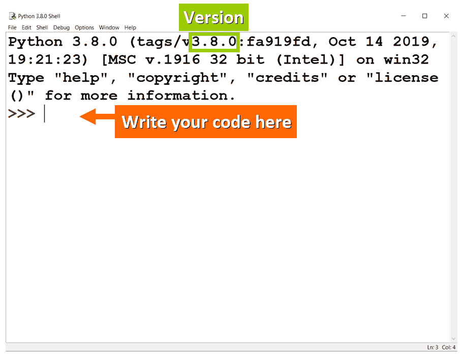

**💡提示:**默认情况下，你会看到一个较小的字号。您可以在“选项>配置空闲”中对此进行自定义。

### 步骤 2:显示消息

您需要通过编写适当的代码行来告诉程序您想要显示特定的消息。

在 Python 中，我们使用`print()`来做这件事:

*   首先，我们写`print`。
*   然后，在括号内，我们写下我们想要显示的消息或值。

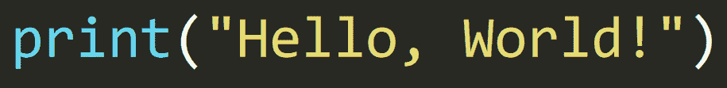

**💡提示:**消息`"Hello, World!"`用双引号括起来，因为它被表示为`string`，一种用于表示代码中字符序列的数据类型(例如，文本)。

### 步骤 3:查看输出

如果在 Python shell 中编写这行代码并按 enter 键，您将看到以下输出:

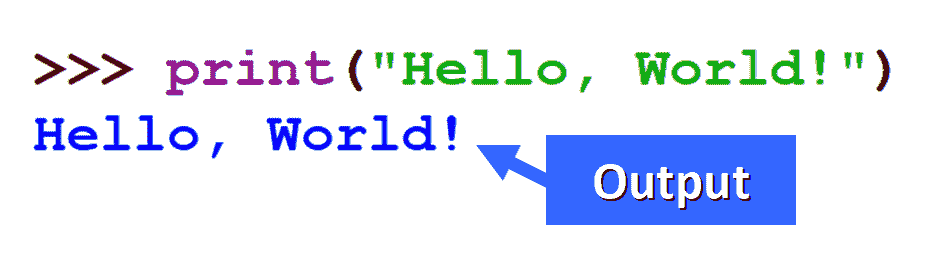

**💡提示:**您会注意到，当您添加最后一个引号时，`print()`中的消息颜色会变成绿色。

发生这种情况是因为 IDLE 为您可以在代码中编写的不同类型的元素分配了不同的颜色(注意`print`显示为紫色)。这被称为“语法突出显示”。

太好了！你刚刚用 Python 写了你的第一个`"Hello, World!"`程序。

如果您想保存它以便以后运行它(或者只是为了让它成为您的第一个 Python 程序的美好回忆！)，您将需要创建一个 Python 文件，所以让我们来看看您如何做到这一点。

## 🔹“你好，世界！”在 Python 文件中

### 步骤 1:创建文件

要在空闲状态下创建 Python 文件，您需要:

*   打开 Python 外壳。
*   点击工具栏中的`File`。
*   点击`New File`。

**💡温馨提示:**您也可以使用键盘快捷键`Ctrl + N`。

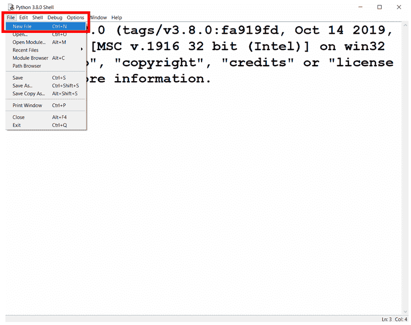

点击`New File`后，您将立即看到一个新文件，您可以在其中编写代码:

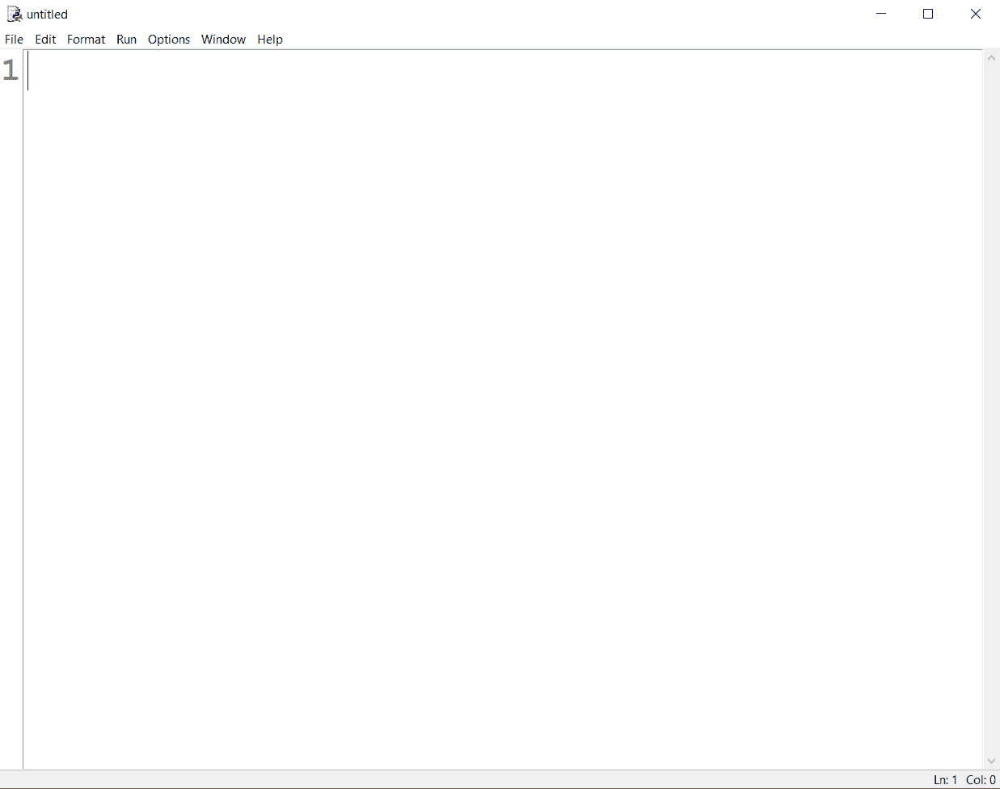

New File Displayed

### 第二步:编写代码

在新文件中，写出这行代码来打印`"Hello, World!"`:

**💡提示:**粗的垂直黑线显示光标当前所在的位置。

### 步骤 3:保存文件

点击**文件>保存**或使用键盘快捷键`Ctrl + S`保存新文件。您需要为您的文件写一个名称，并选择您想要保存它的位置。

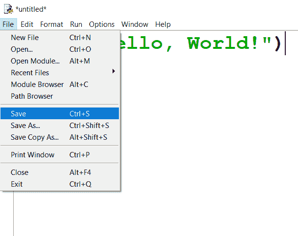

保存文件后，您将在您选择的文件夹中看到与此非常相似的内容:

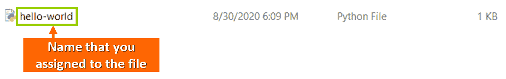

**💡温馨提示:**默认情况下，文件中不会显示行号。如果你想显示它们(如上图),进入选项>配置空闲>常规>勾选“在新窗口中显示行号”框。

### 步骤 4:运行程序

现在你可以通过点击**运行>运行模块**来运行你的文件:

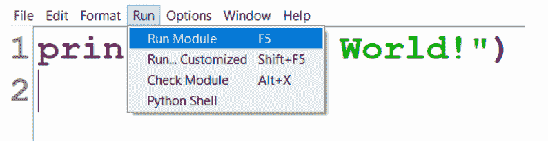

将会打开一个新窗口，您应该会看到蓝色的程序输出:

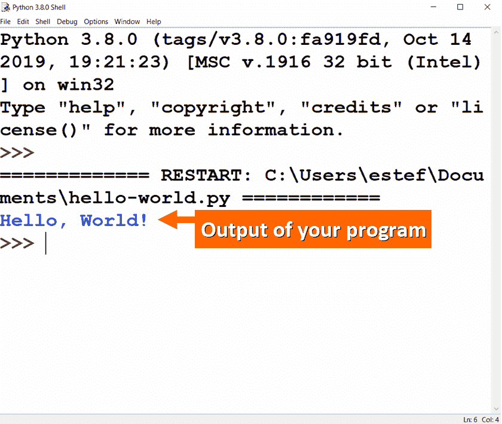

现在你的程序安全地存储在一个 Python 文件中，你可以在任何需要的时候运行它。

**伟大的作品！**

## 🔸定制您的程序

您可以自定义您的程序，使其独一无二。您只需要编辑 Python 文件并更改字符串。

例如，您可以在`Hello, World!`后添加您的姓名:

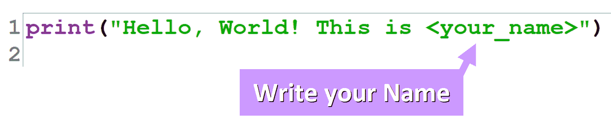

如果运行该文件，您将看到 Python shell 中显示的字符串:

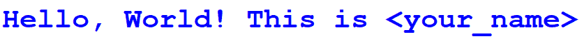

## 🔹第一个 Python 程序完成

出色的工作。你刚刚写了你的第一个 Python 程序。

编程和计算机科学将是人类未来的关键。通过学习如何编码，你可以塑造未来。

你将创造出令人惊叹的新产品和新平台，并帮助我们向技术将成为我们日常生活每一个方面的一部分的世界迈进一步。

要了解更多关于 Python 的编码用法，您可能想阅读我的文章“[Python 是用来做什么的？10+编码用于 Python 编程语言](https://www.freecodecamp.org/news/what-is-python-used-for-10-coding-uses-for-the-python-programming-language/)

********我真的希望你喜欢我的文章****** ，并发现它很有帮助 ******。******** 在 Twitter 上关注我[@ estefanicassn](https://twitter.com/EstefaniaCassN)和[查看我的在线课程。](https://www.udemy.com/user/estefania-cn/) ⭐️