# 如何用 Vue.js 和 C#搭建一个 SPA？网络核心

> 原文：<https://www.freecodecamp.org/news/how-to-build-an-spa-with-vuejs-and-c-using-net-core/>

假设你是前端开发人员。或者你最近不得不做更多的前端工作。

您偶尔会使用一些后端技术，但是您总是呆在自己的舒适区，也许是 JavaScript 世界。又或许你已经用 Python 搭建了一个小 API。

但是你从来没有接触过现代。NET 系列技术堆栈。

本教程将指导你一步一步地构建一个现代的单页面应用程序(SPA ),它将利用 [Vue.js](https://vuejs.org/) 作为前端和[。NET Core (C#)](https://docs.microsoft.com/en-us/dotnet/core/get-started?tabs=windows) 为后端。

我们还将看到如何编写一些测试，包括单元测试和集成测试，以覆盖前端和后端功能(至少部分覆盖)。

如果你想跳过阅读，[这里](https://github.com/mihailgaberov/pizza-app)？GitHub 仓库有详细的[自述](https://github.com/mihailgaberov/pizza-app/blob/master/README.md)吗？。

## 我们将建造什么

？‍?我们将建立一个网络应用程序，用户可以注册/登录，只需按下“我爱它”按钮，告诉我们他们有多爱披萨。

每个用户向我们表达感谢的次数没有限制。唯一的要求是，只有登录的用户可以投票。

在主页上，除了注册/登录按钮之外，我们还会放一个小小的条形图，在 X 轴上显示获得最高评价的前 X 名用户，在 Y 轴上显示投票数。

## 装置

先说前端。首先构建应用程序的可见部分更有意义。我们将用市场上最著名的前端库之一:Vue.js 来构建我们的前端。

### 如何设置前端

为了用 Vue.js 安装和配置我们的初始前端设置，我们将使用 [Vue CLI](https://cli.vuejs.org/) 。这是一个开发 Vue.js 应用程序的标准命令行工具。

要安装它，请使用以下命令。请注意，本教程中的所有命令都使用了 [NPM](https://www.npmjs.com/) ，您需要在您的机器上安装它才能继续使用。

```
npm install -g @vue/cli
```

Install Vue CLI

成功安装 Vue CLI 后，我们应该可以开始使用它来安装和配置 Vue.js 本身。让我们按照下面的过程来做。

步骤 1:创建一个新的空项目目录，并使用以下命令打开它:

```
mkdir pizza-app
cd pizza-app
```

Create new empty project directory

步骤 2:在项目根目录中，运行以下命令:

```
vue create frontend
```

Create front-end part of the app

然后从提供的选项中，选择以下选项:

*   手动选择功能

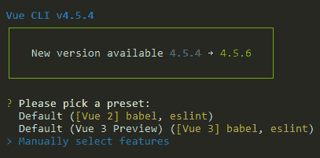

Vue.js installation - Manually select features

*   巴比伦式的城市
*   路由器
*   CSS-预处理程序(SASS)

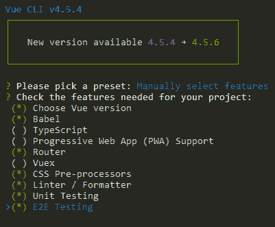

Vue.js installation - select features

然后从下一个屏幕中选择版本 2.x:

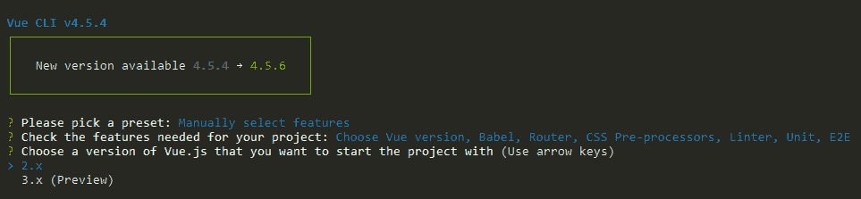

Select version 2.x

接下来，选择“对路由器使用历史模式？”和“萨斯/SCSS(带节点萨斯)”，就像这样:

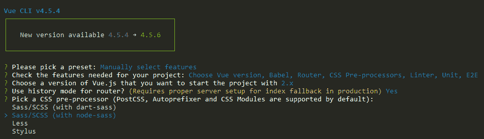

*   棉绒/格式器

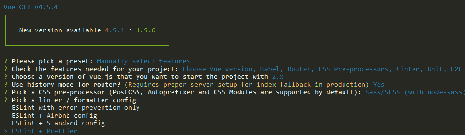

*   用 Jest 进行单元测试

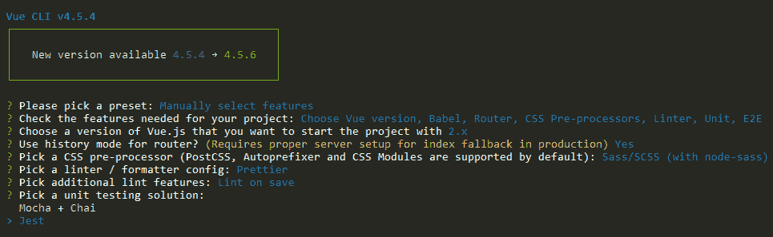

*   用柏树做 E2E 试验

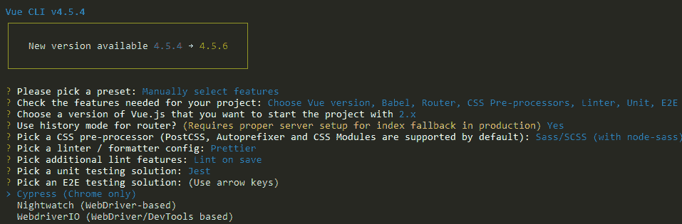

完成最后一步后，使用默认选项完成安装过程。

现在，我们可以通过使用根项目文件夹中的以下命令来运行应用程序了:

```
cd frontend
npm run serve
```

应用程序运行后，您可以在浏览器中看到它，网址为 http://localhost:8080:

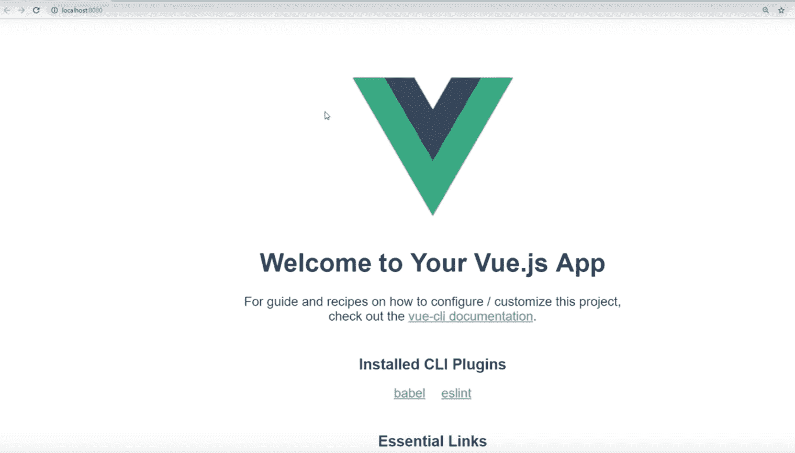

Vue.js default installation screen

在继续构建我们的前端应用程序将拥有的实际组件之前，让我们通过。NET Core CLI。

### 如何设置后端

如上所述，我们将使用另一个命令行工具。NET Core CLI，它使我们能够创建和配置。NET 应用程序。

如果你还没有，你可以使用[这个链接](https://dotnet.microsoft.com/download/dotnet-core/thank-you/sdk-3.1.401-windows-x64-installer)下载它，然后安装它。

一旦你有了。NET Core CLI 工具，转到您的项目的根目录并运行以下命令来创建我们的后端应用程序。因此，我们将创建一个名为`backend`的文件夹，并在其中安装一个. NET web 应用程序:

```
dotnet new web -o backend
```

### gitignore.io

在继续安装我们将需要的下一个包之前，让我们整理一下我们的*。gitignore* 文件。

这是一个配置文件，它告诉 [Git](https://git-scm.com/) 在提交对基于 Git 的库的更改时要忽略什么(在 [GitHub](https://github.com/) 中的那些)。

因为我们想要一个。 *gitignore* 文件，它将包括两类应用程序的规则:

*   一个基于 Node.js 的，这是我们的 Vue.js 前端，和
*   答。NET (C#)的一个，这是我们的后端。

为此，我们将使用一个名为 [*gitignore.io*](https://www.toptal.com/developers/gitignore) *的工具。这个工具会为我们生成这样的文件。使用这个工具的好处是，它允许我们键入我们的编程语言/平台是什么，并且它生成。gitignore 文件。*

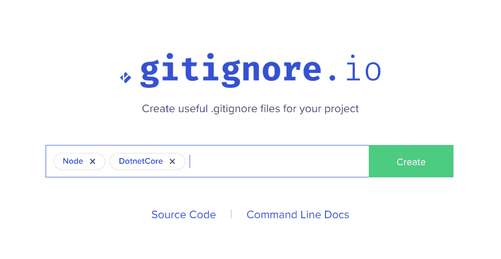

Use gitignore.io to generate a .gitignore file

此外，在生成文件的顶部，它保存了用于创建或后续编辑的链接，如下所示。

```
 # Created by https://www.toptal.com/developers/gitignore/api/webstorm,vue,vuejs,visualstudio
# Edit at https://www.toptal.com/developers/gitignore?templates=webstorm,vue,vuejs,visualstudio 
```

现在我们可以开始安装剩下的软件包了。

首先，我们将安装一个名为 SpaServices 的包，它将允许我们只通过一个 URL 运行我们的应用程序，并指向。NET app。从它的角度来看，它会将请求代理到我们的前端应用程序。

要安装它，请打开您的终端，转到项目的`backend`文件夹，并运行以下命令:

```
dotnet add package Microsoft.AspNetCore.SpaServices.Extensions --version 3.1.8 
```

在这之后，我们需要用 SpaServices 包配置我们的后端应用程序，以便得到想要的结果。

每一个请求都会送到我们的。NET 后端应用程序，如果请求是针对前端的，它将代理它。

为此，打开 [Startup.cs](https://github.com/mihailgaberov/pizza-app/blob/master/backend/Startup.cs) 文件，将其内容更新如下:

```
using System;
using System.Collections.Generic;
using System.Linq;
using System.Threading.Tasks;
using Microsoft.AspNetCore.Builder;
using Microsoft.AspNetCore.Hosting;
using Microsoft.AspNetCore.Http;
using Microsoft.Extensions.DependencyInjection;
using Microsoft.Extensions.Hosting;
using Microsoft.AspNetCore.Authentication.JwtBearer;
using Microsoft.EntityFrameworkCore;
using Microsoft.Extensions.Configuration;

namespace backend
{
    public class Startup
    {
        public IConfiguration Configuration { get; }

        public Startup(IConfiguration configuration)
        {
            Configuration = configuration;
        }

        // This method gets called by the runtime. Use this method to add services to the container.
        // For more information on how to configure your application, visit https://go.microsoft.com/fwlink/?LinkID=398940
        public void ConfigureServices(IServiceCollection services)
        {
            string connectionString = Configuration.GetConnectionString("DefaultConnection");
            services.AddDbContext<ApplicationDbContext>(options => options.UseSqlite(connectionString));
            services.AddSpaStaticFiles(configuration: options => { options.RootPath = "wwwroot"; });
            services.AddControllers();
            services.AddCors(options =>
            {
                options.AddPolicy("VueCorsPolicy", builder =>
                {
                    builder
                    .AllowAnyHeader()
                    .AllowAnyMethod()
                    .AllowCredentials()
                    .WithOrigins("https://localhost:5001");
                });
            });
            services.AddAuthentication(JwtBearerDefaults.AuthenticationScheme)
  .AddJwtBearer(options =>
                {
                    options.Authority = Configuration["Okta:Authority"];
                    options.Audience = "api://default";
                });
            services.AddMvc(option => option.EnableEndpointRouting = false);
        }

        // This method gets called by the runtime. Use this method to configure the HTTP request pipeline.
        public void Configure(IApplicationBuilder app, IWebHostEnvironment env, ApplicationDbContext dbContext)
        {
            if (env.IsDevelopment())
            {
                app.UseDeveloperExceptionPage();
            }

            app.UseCors("VueCorsPolicy");

            dbContext.Database.EnsureCreated();
            app.UseAuthentication();
            app.UseMvc();
            app.UseRouting();
            app.UseEndpoints(endpoints => { endpoints.MapControllers(); });
            app.UseSpaStaticFiles();
            app.UseSpa(configuration: builder =>
            {
                if (env.IsDevelopment())
                {
                    builder.UseProxyToSpaDevelopmentServer("http://localhost:8080");
                }
            });
        }
    }
}
```

？这是 Startup.cs 文件的最终版本，这就是为什么你可能会注意到它里面有更多的东西。我们将在本教程的稍后部分回到这个问题。

此时，您应该可以运行后端应用程序了。如果您希望这样做，请从项目的根文件夹中运行以下命令:

```
cd backend
dotnet run
```

## 如何设置认证

正如你可能记得从一开始的描述，我们的应用程序应该有一个注册/登录选项。

为了满足这一要求，我们将使用名为 [Okta](https://www.okta.com/) 的第三方服务。我们将在应用程序的前端和后端安装使用 Okta SDK 所需的软件包。

但在此之前，你需要在他们的网站上创建一个账户，并访问他们的管理面板。在那里，您可以创建一个新的应用程序。这是它在我身上的样子:

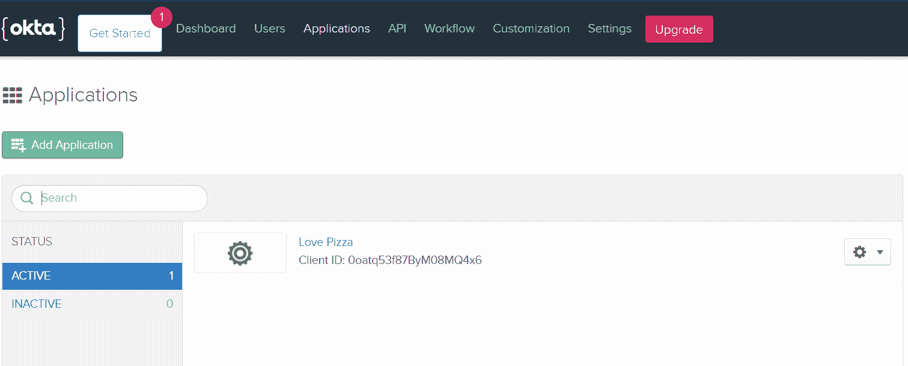

现在，让我们从我们的前端需要的包开始。从根文件夹中，运行以下命令:

```
cd frontend
npm i @okta/okta-vue
```

在这一步之后，我们准备修改我们的 Vue.js 应用程序，以便利用 Okta SDK。

我们还将安装另一个名为 [BootstrapVue](https://bootstrap-vue.org/) 的包，它提供了一组好看且随时可用的 Vue.js 组件。这将有助于我们节省开发时间，也将让我们有一个好看的前端。

要安装它，请从您的`frontend`文件夹运行以下命令:

```
npm i vue bootstrap-vue bootstrap
```

### 如何设置路由器

是时候做一些编码了。我们需要编辑我们的[路由器](https://router.vuejs.org/)，以便应用来自 Okta 认证服务的内容。

你可以在我的 GitHub repo 中看到[完整文件](https://github.com/mihailgaberov/pizza-app/blob/master/frontend/src/router/index.js)，但这里是你需要用你自己的细节配置的基本部分(当你在 Okta 开发者网站上注册时得到的):

```
Vue.use(Auth, {
  issuer: 'https://dev-914982.okta.com/oauth2/default',
  client_id: '0oatq53f87ByM08MQ4x6',
  redirect_uri: 'https://localhost:5001/implicit/callback',
  scope: 'openid profile email'
})

....

router.beforeEach(Vue.prototype.$auth.authRedirectGuard())
```

### 主屏幕

在我们对路由器进行排序后，我们终于可以对我们的应用程序的主屏幕进行一些更改，这实际上对我们的用户是可见的。

在 IDE 中打开 [App.vue](https://github.com/mihailgaberov/pizza-app/blob/master/frontend/src/App.vue) 文件，并按如下方式更改其内容:

```
<template>
  <div id="app">
    <header>
      <b-navbar toggleable="md" type="light" variant="light">
        <b-navbar-toggle target="nav-collapse"></b-navbar-toggle>
        <b-navbar-brand to="/">Love Pizza</b-navbar-brand>
        <b-collapse is-nav id="nav-collapse">
          <b-navbar-nav>
            <b-nav-item href="#" @click.prevent="login" v-if="!user">Login</b-nav-item>
            <b-nav-item href="#" @click.prevent="logout" v-else>Logout</b-nav-item>
          </b-navbar-nav>
        </b-collapse>
      </b-navbar>
    </header>
    <main>
      <div>
        Love pizza button and clicks counter here
      </div>
    </main>
  </div>
</template>

<script>
export default {
  name: 'app',
  data() {
    return {
      user: null
    }
  },
  async created() {
    await this.refreshUser()
  },
  watch: {
    '$route': 'onRouteChange'
  },
  methods: {
    login() {
      this.$auth.loginRedirect()
    },
    async onRouteChange() {
      await this.refreshUser()
    },
    async refreshUser() {
      this.user = await this.$auth.getUser()
    },
    async logout() {
      await this.$auth.logout()
      await this.refreshUser()
      this.$router.push('/')
    }
  }
}
</script>

<style lang="scss">
#app {
  font-family: Avenir, Helvetica, Arial, sans-serif;
  -webkit-font-smoothing: antialiased;
  -moz-osx-font-smoothing: grayscale;
  text-align: center;
  color: #2c3e50;
}

#nav {
  padding: 30px;

  a {
    font-weight: bold;
    color: #2c3e50;

    &.router-link-exact-active {
      color: #42b983;
    }
  }
}
</style>
```

到目前为止，您的应用程序可能看起来像这样:

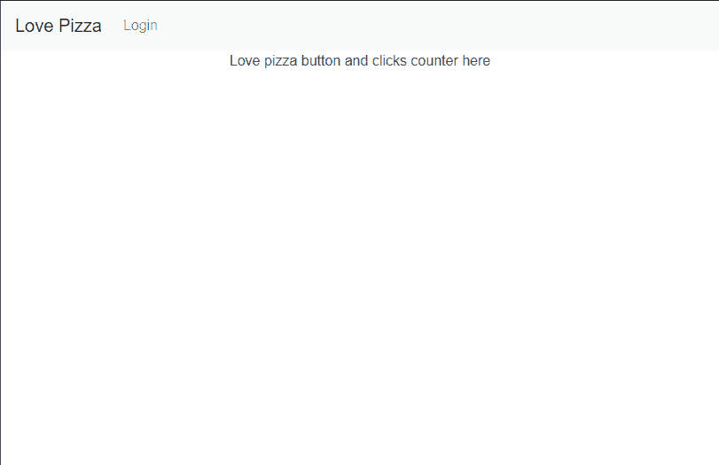

Vue.js front-end app - work in progress

**注意**:不要被文字“披萨按钮和点击此处的柜台”迷惑。在构建 ui 时，为将来要开发的组件留下这样的占位符是一个好习惯。

在我们的例子中，我们将在这里添加负责“我爱它”按钮和计数器的组件。他们将显示每个用户的投票数。

```
<main>
  <div>
  	Love pizza button and clicks counter here
  </div>
</main>
```

Placeholder for components to be added later

### 后端身份验证

到目前为止，我们已经设置了我们的前端来利用 Okta 提供的认证服务。但是为了让整张图片随时可用，我们需要在我们的后端应用程序中做同样的事情。

为了与数据库通信，我们将从这里进行 HTTP 调用。而且，正如您将在后面看到的，为了成功，其中一些调用将需要进行身份验证。

让我们从安装一些能使我们的工作更容易的包开始。在您的终端中，转到您的`backend`目录并运行以下命令:

```
dotnet add package Microsoft.AspNetCore.Authentication.JwtBearer --version 3.1.8
dotnet add package Microsoft.Extensions.Configuration --version 3.1.7
```

然后我们需要另一个软件包来帮助我们建立数据库。我们将使用 SQLite 数据库，它在。网络核心设置。

仍然在`backend`文件夹中，运行:

```
dotnet add package Microsoft.EntityFrameworkCore.Sqlite --version 2.1.1
```

一旦我们完成安装，请确保您已经获得了 [Startup.cs](https://github.com/mihailgaberov/pizza-app/blob/master/backend/Startup.cs) 文件的全部内容(如果您没有，现在就完成)。

### PizzaVotesApiService

好了，各位，我们已经设置了前端和后端来支持身份验证。我们添加了 SQLite 作为数据库，用于存储用户的投票。我们有了我们主屏幕的初始版本。

现在是时候在前端实现一个服务了，它将允许我们使用后端的 API。

到目前为止做得很好！？

在能够从我们的前端应用程序向我们的后端应用程序进行 HTTP 调用之前，我们需要在我们的 Vue.js 应用程序中再安装一个包。它叫做 [axios](https://www.npmjs.com/package/axios) ，它让我们能够从浏览器发出 [XMLHttpRequests](https://developer.mozilla.org/en-US/docs/Web/API/XMLHttpRequest) ，这正是我们所需要的。

打开终端，转到项目的`frontend`,运行:

```
npm i axious
```

然后，在您的 IDE 中，转到您的前端应用程序的`src`文件夹，创建一个新的。js 文件，并在其中添加以下内容:

```
import Vue from 'vue'
import axios from 'axios'

const client = axios.create({
    baseURL: 'http://localhost:5000/api/pizzavotes',
    json: true
})

export default {
    async execute(method, resource, data) {
        const accessToken = await Vue.prototype.$auth.getAccessToken()
        return client({
            method,
            url: resource,
            data,
            headers: {
                Authorization: `Bearer ${accessToken}`
            }
        }).then(req => {
            return req.data
        })
    },
    getAll() {
        return this.execute('get', '/')
    },
    getById(id) {
        return this.execute('get', `/${id}`)
    },
    create(data) {
        return this.execute('post', '/', data)
    },
    update(id, data) {
        return this.execute('put', `/${id}`, data)
    },
}
```

我已经把我的命名为 [PizzaVotesApiService.js](https://github.com/mihailgaberov/pizza-app/blob/master/frontend/src/PizzaVotesApiService.js) 。我们将暂时停止集成 API，并创建另一个组件来保存用户用来与 API 交互的控件。

### 仪表板组件

向我们的 [Dashboard.vue](https://github.com/mihailgaberov/pizza-app/blob/master/frontend/src/components/Dashboard.vue) 组件问好。

这是我们放置“我爱它”按钮和一个小投票计数器的地方。

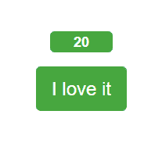

'I love it' button and votes counter

我们还将添加一个漂亮的比萨饼图片。


Pizza image

以及一个漂亮的条形图，显示了前 X 名的投票者。

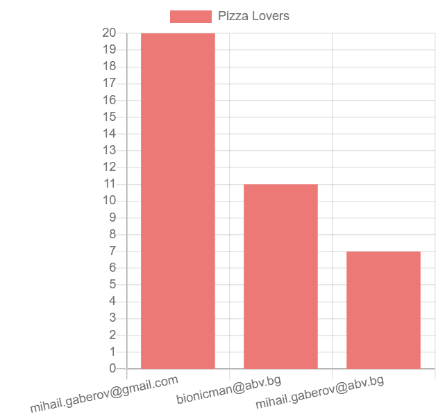

Top voters bar chart

你可以从我的回购文件中复制并粘贴文件的全部内容，这样我们就可以继续整合整个事情。

### API 集成

我将用一个小图来描述数据流。正如他们所说，“一幅画胜过千言万语”

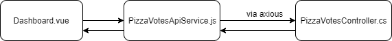

Data flow diagram

如你所见(我希望？)从图中可以看出，当用户输入他们的投票时，数据从仪表板组件通过我们为与后端 API 通信而创建的 API 服务。然后它到达实际进行 HTTP 调用的后端控制器。

一旦获取了数据，服务就将它传递回我们的 UI，在那里我们通过 Vue.js 组件显示它。正如您将看到的，有一些额外的逻辑检查用户是否通过了身份验证，以便知道要执行哪些调用。

下面是[控制器](https://github.com/mihailgaberov/pizza-app/blob/master/backend/PizzaVotesController.cs)本身的实现:

```
using System.Collections.Generic;
using System.Threading.Tasks;
using Microsoft.AspNetCore.Authorization;
using Microsoft.AspNetCore.Mvc;
using Microsoft.EntityFrameworkCore;

namespace backend.Controllers
{
    [Route("api/[controller]")]
    [ApiController]
    public class PizzaVotesController : ControllerBase
    {
        private readonly ApplicationDbContext _dbContext;

        public PizzaVotesController(ApplicationDbContext dbContext)
        {
            _dbContext = dbContext;
        }

        // GET api/pizzavotes
        [HttpGet]
        public async Task<ActionResult<List<PizzaVotes>>> Get()
        {
            return await _dbContext.PizzaVotes.ToListAsync();
        }

        // GET api/pizzavotes/{email}
        [Authorize]
        [HttpGet("{id}")]
        public async Task<ActionResult<PizzaVotes>> Get(string id)
        {
            return await _dbContext.PizzaVotes.FindAsync(id);
        }

        // POST api/pizzavotes
        [Authorize]
        [HttpPost]
        public async Task Post(PizzaVotes model)
        {
            await _dbContext.AddAsync(model);
            await _dbContext.SaveChangesAsync();
        }

        // PUT api/pizzavotes/{email}
        [Authorize]
        [HttpPut("{id}")]
        public async Task<ActionResult> Put(string id, PizzaVotes model)
        {
            var exists = await _dbContext.PizzaVotes.AnyAsync(f => f.Id == id);
            if (!exists)
            {
                return NotFound();
            }

            _dbContext.PizzaVotes.Update(model);

            await _dbContext.SaveChangesAsync();

            return Ok();
        }
    }
}
```

这里我们有四种方法来执行四个基本操作:

*   从数据库中获取所有记录
*   获取一个用户的记录(通过他们的电子邮件地址)
*   创建新的用户记录
*   更新现有用户的记录。

你可能已经注意到了上面四种方法中的三种方法中的`[Authorize]`子句。这些方法需要用户通过身份验证才能执行。

我们将使用方法`GET api/pizzavotes`来故意获取所有未授权的记录。因为我们希望在主屏幕上向所有用户显示条形图，所以无论用户是否经过身份验证，我们都需要能够进行这个调用。

### 允许注册

需要注意的是:如果你想在你的登录界面上注册，你需要在 Okta 管理面板上允许它。

登录后，从菜单中选择**用户- >注册**:

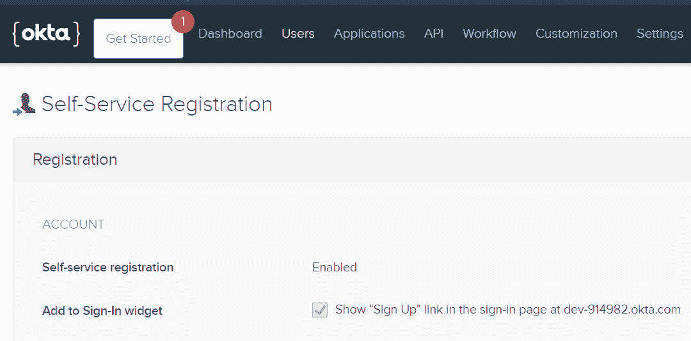

Allow registration for new users

### 完成后端

为了让您的后端应用程序完全发挥作用，请在这里查看[我的回购](https://github.com/mihailgaberov/pizza-app/tree/master/backend)并添加丢失的文件。

如果您已经完成了这一步，那么您应该拥有以下文件(除了`test`文件夹，因为我们稍后会添加它):

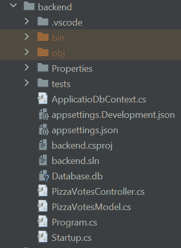

Back-end app structure

### 完成前端

为了完成我们的前端应用程序的工作，我们将创建两个以上的组件。

第一个将呈现上面提到的条形图，第二个将显示当前登录的用户的电子邮件地址。

在你的 IDE 中，转到`frontend/src/components`并创建两个文件，分别命名为 [Username.vue](https://github.com/mihailgaberov/pizza-app/blob/master/frontend/src/components/Username.vue) 和 [VotesChart.vue](https://github.com/mihailgaberov/pizza-app/blob/master/frontend/src/components/VotesChart.vue) 。

Username.vue 是一个非常简短的组件，它将用户的电子邮件地址作为道具并进行渲染。下面是它的实现:

```
<template>
  <div class="username">{{ username }}</div>
</template>

<script>
export default {
  props: { username: String },
}
</script>

<style lang="scss">
.username {
  color: rebeccapurple;
  display: flex;
  align-items: center;
  justify-content: center;
}

.username::before {
  content: "•";
}

.username::after {
  content: "•";
}
</style> 
```

这里唯一需要注意的是，我们对组件样式使用了 SASS/SCSS。这是可能的，因为我们一开始就选择了这个选项(当我们安装 Vue.js 应用程序时)。

为了绘制图表，我们将使用一个名为 [vue-chartsjs](https://www.npmjs.com/package/vue-chartjs) 的软件包。通过从您的`frontend`文件夹运行以下命令来安装它:

```
npm i vue-chartjs chart.js
```

我们的组件 **VotesChart.vue** 将是来自 vue-chartjs 包的条形图组件的某种包装器。

我们使用它从父组件 **Dashboard.vue** 、**中获取数据并对其进行处理。**

我们对数据数组进行排序，以显示我们的最佳投票者，从最大到最小的投票数排序。然后，我们将它传递给条形图组件来可视化它。

下面是完整的实现:

```
<script>
import { Bar } from 'vue-chartjs'

const TOP_N_VOTERS_TO_SHOW_ON_CHART = 10

// Used to sort by votes value - from bigger to smaller (desc)
function sortByStartDate(nextUser, currentUser) {
  const nextVoteValue = nextUser.value
  const currentVoteValue = currentUser.value
  return currentVoteValue - nextVoteValue
}

export default {
  extends: Bar,
  props: { data: Array },

  watch: {
    data: async function (newVal) {
      const sortedVotes = Array.from(newVal).sort(sortByStartDate).slice(0, TOP_N_VOTERS_TO_SHOW_ON_CHART)
      this.labels = sortedVotes.map(user => user.id)
      this.values = sortedVotes.map(user => user.value)

      this.renderChart({
        labels: this.labels,
        datasets: [
          {
            label: 'Pizza Lovers',
            backgroundColor: '#f87979',
            data: this.values,
          }
        ]
      }, {
        scales: {
          yAxes: [{
            ticks: {
              stepSize: 1,
              min: 0,
              max: this.values[0]
            }
          }]
        }
      })
    }
  }
}
</script> 
```

请注意，在文件的顶部有一个常量，它将定义我们希望在此图表上显示的最高投票人数。目前它被设置为 10，但是你可以随意修改。

一旦你准备好所有的前端材料，并希望运行应用程序，你可以这样做:

转到`frontend`文件夹并运行:

```
npm run serve
```

转到`backend`文件夹并运行:

```
dotnet run
```

打开浏览器，进入 https://localhost:5001。

## 如何测试我们的应用程序

到目前为止，我们已经用. NET 核心后端和 SQLite 数据库构建了一个现代化的、功能齐全的单页应用程序。那是许多工作。恭喜你。✨

我们可以很容易地在这里停下来，去喝点凉的？。

但是...

我们有足够的理性知道，如果我们不测试我们的应用程序，我们不能保证它们会像预期的那样工作。

我们也知道，如果我们想让我们的代码可测试，我们应该以一种结构良好的方式编写，牢记软件设计的主要原则。

我希望我已经说服你继续学习本教程。毕竟，我们剩下要做的唯一事情就是为我们的两个应用程序编写一些测试。所以让我们开始吧！

我们将用**集成测试**来涵盖我们后端 API 的功能，对于我们的前端，我们将编写**单元** 和**集成** 测试。

### 单元和集成测试

？在阅读代码之前，我想就这些类型的测试说几句话，并回答一些最常见的问题。

你可能想知道，什么是单元测试？什么是集成测试？我们为什么需要它们？我们应该在什么时候使用它们？

从第一个问题开始，**单元测试**是测试封装模块功能的一段代码(意味着另一段)。它被写成一个函数或者某种独立的代码块。

拥有它们是很好的，因为它们给你快速的开发时间反馈，并在添加新特性时保护代码免于退化。

当我们需要测试多个模块/单元如何协同工作时，集成测试非常有用。例如 REST API 和数据库交互。

根据我们正在开发的应用程序的规模，我们可能只需要集成测试。但是有时我们需要集成和单元测试来保护我们的代码。

理想情况下，我们应该同时拥有它们，因为它们是测试金字塔的重要组成部分，并且实现起来最便宜。

但是在某些情况下，比如对于我们的后端应用程序，只需要集成测试就可以覆盖值得测试的功能。我们只有几个处理数据库的 API 方法。

### 如何创建我们的后端测试

这次我们将从创建我们的测试解决方案开始。为此，您需要做几件事情。

首先，通过从项目根目录运行以下命令来安装 xUnit 库:

```
dotnet add package xUnit
```

然后转到您的`backend`文件夹，创建并清空名为`tests`的文件夹。然后在该文件夹中运行:

```
dotnet new xunit -o PizzaVotes.Tests
```

一旦完成，打开 [backend.csproj](https://github.com/mihailgaberov/pizza-app/blob/master/backend/backend.csproj) 并将以下两行添加到`<PropertyGroup>`块中:

```
<GenerateAssemblyInfo>false</GenerateAssemblyInfo>
<GenerateTargetFrameworkAttribute>false</GenerateTargetFrameworkAttribute>
```

然后转到您的`tests`文件夹，安装以下软件包:

```
Microsoft.AspNetCore.Mvc
Microsoft.AspNetCore.Mvc.Core
Microsoft.AspNetCore.Diagnostics
Microsoft.AspNetCore.TestHost
Microsoft.Extensions.Configuration.Json
Microsoft.AspNetCore.Mvc.Testing
```

为此，您可以在终端应用程序中执行以下命令:

```
dotnet add package Microsoft.AspNetCore.Mvc --version 2.2.0
dotnet add package Microsoft.AspNetCore.Mvc.Core --version 2.2.5
dotnet add package Microsoft.AspNetCore.Diagnostics --version 2.2.0
dotnet add package Microsoft.AspNetCore.TestHost --version 3.1.8
dotnet add package Microsoft.AspNetCore.Mvc.Testing --version 3.1.8
```

在我们安装好所有的东西之后，我们就可以开始实际编写一些测试了。

正如您在这里看到的，除了测试本身，我还添加了两个文件，这两个文件是我们在运行测试时需要的或者最好拥有的。

其中一个只是一个[助手文件](https://github.com/mihailgaberov/pizza-app/blob/master/backend/tests/PizzaVotes.Tests/ContentHelper.cs)，它有一个处理序列化对象和获取字符串内容的方法。另一个是 [fixture](https://github.com/mihailgaberov/pizza-app/blob/master/backend/tests/PizzaVotes.Tests/TestFixture.cs) 文件，在这里我们有测试服务器和客户端的配置和设置。

当然，我们的测试还有一个文件。

我不打算在这里粘贴这些文件的内容，因为本教程已经够长了。

你可以从我的储存库中复制它们。

如果您仔细观察这些测试，您可能会注意到我们只测试第一个成功响应的调用，而不是经过身份验证的调用。其余的我们只检查 401 HTTP 响应，也就是`Unautorized`。

那是因为只有第一种方法是公共的，也就是不需要认证。

如果我们要对所有方法进行相同的测试，我们将需要实现一个中间件，以便在 Okta 的认证服务前授权我们的测试应用程序。

由于本教程的目的是学习各种各样的东西，我们可能会说这不值得做。

现在有趣的部分是:如何运行测试。原来超级简单。只需从终端转到您的`tests`目录(tests.sln 文件所在的目录)并运行:

```
dotnet test
```

您应该在终端中看到类似这样的内容(忽略黄色警告):

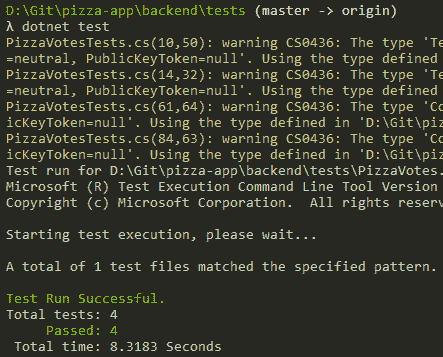

Running back-end tests

### 如何创建我们的前端测试

是时候给我们的前端添加一些测试了。在这里，我们将进行单元测试和集成测试。

正如我上面提到的，当我们拥有一个不依赖于外界的模块或组件时，单元测试是合适的。

这样的组件就是我们的 Username.vue 和 VotesChart.vue 组件。

它们是代表性组件，通过 props 接收正常运行所需的数据。这意味着我们可以用同样的方式编写测试:向他们传递他们需要的数据，并检查他们的执行结果是否如预期的那样。

这里有一件重要的事情要提一下。并不是说由 **@vue/test-utils** 包(来自安装 Vue.js)提供的东西不足以测试这两个组件。

相反，出于教育目的，我决定安装并使用 [Vue 测试库](https://testing-library.com/docs/vue-testing-library/intro)。这就是为什么下面的一个组件用@vue/test-utils 测试，而另一个用@testing-library/vue 测试。

不要忘记在运行测试之前安装它:

```
npm i --save-dev @testing-library/vue
```

同样，为了节省空间，我不打算在这里粘贴组件测试的代码，但是你可以很容易地看到这里的和这里的。

然后，为了运行前端应用程序的单元测试，转到`frontend`文件夹并执行:

```
npm run test:unit
```

整合测试
这可能对你们中的一些人来说更有趣。

如果您还记得本教程开始时我们安装了 Vue.js 应用程序，对于我们的 e2e(或集成)测试解决方案，我们选择了 [Cypress.js](https://www.cypress.io/) 。

这是一个超级易用的工具，允许开发人员通过给他们即时反馈来为他们的应用程序编写真正的 e2e 测试。

从个人经验来看，我认为使用 Cypress 比使用其他类似的框架更令人愉快。如果你以前使用过 Nightwatch.js 或 Selenium 之类的框架，你可能对下面看到的内容很熟悉。

在用 Cypress 运行我们的测试之前，我们需要对它的配置做一些小的修改。

在`plugins`文件夹下找到[索引文件](https://github.com/mihailgaberov/pizza-app/blob/master/frontend/tests/e2e/plugins/index.js),在文件末尾的 return 语句中添加下面一行:

```
 baseUrl: "https://localhost:5001"
```

现在更新`specs`文件夹下 test.js 的内容，如这里的[所示](https://github.com/mihailgaberov/pizza-app/blob/master/frontend/tests/e2e/specs/test.js)。

一旦你完成了所有的工作，你就可以通过 Cypress 运行你的 e2e 测试了。在您的`frontend`目录中，您可以通过执行以下命令来做到这一点:

```
npm run test:e2e
```

⚡Don't 忘记在执行 e2e 测试之前启动你的后端应用程序，这样它们才能正常工作。

如果您已经完成了，在运行上面的命令之后，您应该在您的终端中看到类似这样的内容:

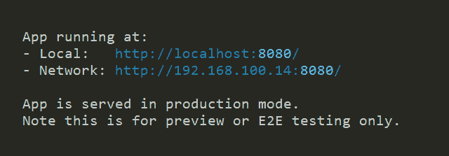

Running e2e tests

Cyrpess.js 将打开一个新的浏览器窗口，您可以使用提供的 UI 来查看和运行您的测试。

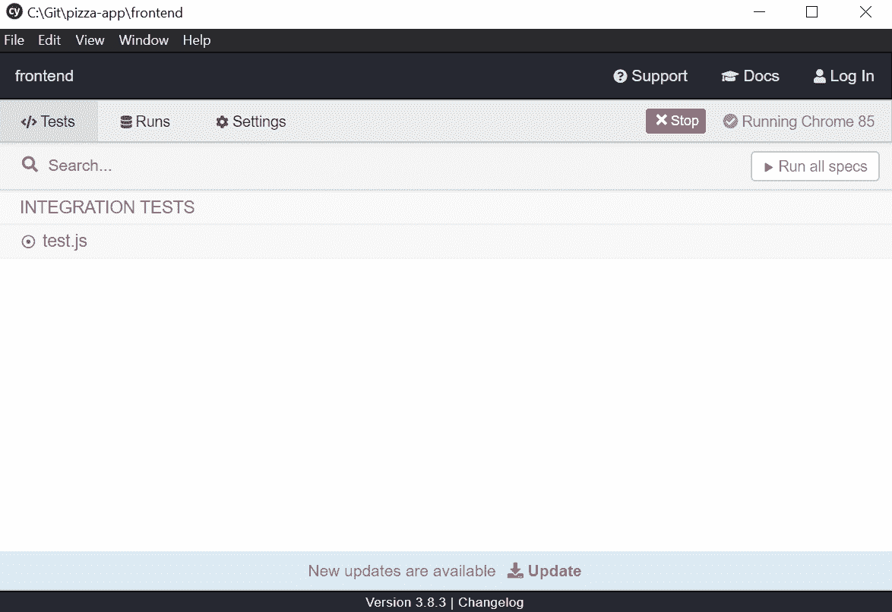

Cypress.js UI

当所有测试都通过时，您应该会看到这样的屏幕:

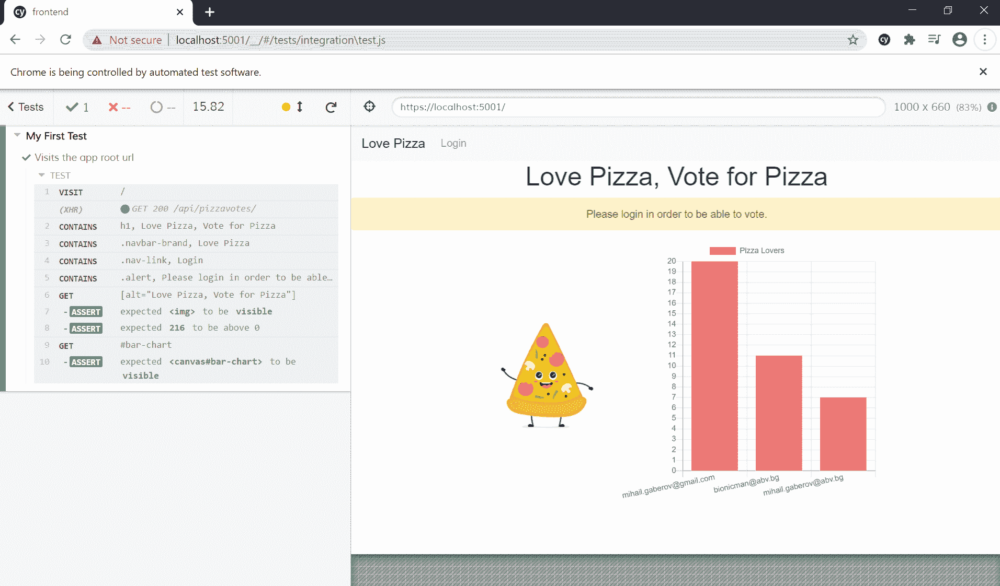

e2e tests pass successfully

## 结论

在本教程中，我们看到了如何在前端和后端使用市场上最热门的技术之一。

我们还学习了如何将它们恰当地结合起来，以构建一个小型但功能齐全的单页面应用程序，并提供数据库支持。

最后，我们还为两端编写了单元和集成测试。

我相信这种练习对有经验的读者和初学者都有好处，因为它以循序渐进的方式涵盖了许多不同的内容。如果你完成了整个过程，你最终会得到一个可用的示例应用程序。

本教程最终比我最初想象的要长得多。但是如果你都做到了，我佩服你？！我希望你读它是愉快的，就像我写它一样。

？感谢阅读！？

## 资源

在我写这篇文章的时候，你可能会在下面找到一些对我有用的链接。

https://consultwithgriff.com/spas-with-vuejs-aspnetcore/
[https://github.com/okta/okta-auth-dotnet](https://github.com/okta/okta-auth-dotnet)
[https://docs . Microsoft . com/en-us/dot net/core/testing/unit-testing-with-dot net-test](https://docs.microsoft.com/en-us/dotnet/core/testing/unit-testing-with-dotnet-test)
[https://docs . Microsoft . com/en-us/dot net/API/system . net . http . httpresponse message？view = netcore-3.1](https://docs.microsoft.com/en-us/dotnet/api/system.net.http.httpresponsemessage?view=netcore-3.1)
[https://vue-test-utils . vuejs . org/guides/# testing-key-mouse-and-other-DOM-events](https://vue-test-utils.vuejs.org/guides/#testing-key-mouse-and-other-dom-events)
[https://docs . cypress . io/guides/references/configuration . html # Options](https://docs.cypress.io/guides/references/configuration.html#Options)
[https://docs . cypress . io/guides/tooling/visual-testing . html # Functional-vs-visual-testing](https://docs.cypress.io/guides/tooling/visual-testing.html#Functional-vs-visual-testing)