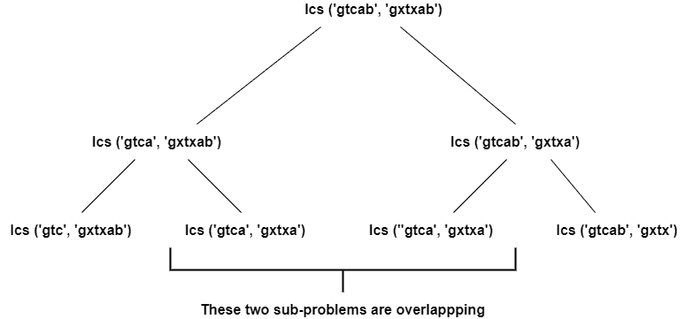
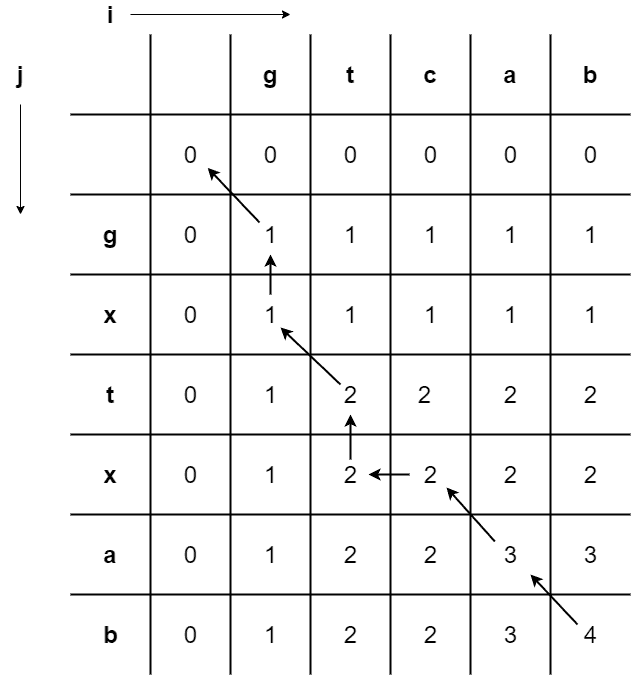

# 动态编程变得简单

> 原文：<https://www.freecodecamp.org/news/dynamic-programming-made-easy/>

动态规划是一种方法，其中主问题被分成更小的子问题，但是这些子问题不是独立解决的。

对于要使用动态规划解决的问题，子问题必须是重叠的。这意味着两个或更多的子问题将评估给出相同的结果。

因此，我们使用记忆技术来回忆已经解决的子问题的结果，以备将来使用。然后，我们使用缓存存储来存储这个结果，在将来遇到类似的子问题时会用到它。

现在让我们更深入地看看这个话题。

## 什么是记忆化？

记忆是记忆某些特定状态的结果的技术，然后可以访问它来解决类似的子问题。换句话说，它是一种特定形式的缓存。

这确保了已经计算出的结果通常以 hashmap 的形式存储。这极大地减少了运行时间，也减少了代码的复杂性。

但我们知道，任何收益都是有代价的。因此，当我们使用动态规划时，时间复杂度降低而空间复杂度增加。

## DP 中的不同方法

在动态编程中，我们既可以使用自顶向下的方法，也可以使用自底向上的方法。

自顶向下的方法包括以直接的方式解决问题，并检查我们是否已经计算出子问题的解决方案。

这种方法包括递归调用*(同一函数的重复调用)*。它建立了一个调用栈，导致内存开销。它也容易出现堆栈溢出错误。

自下而上的方法包括首先查看较小的子问题，然后使用较小问题的解决方案来解决较大的子问题。

这种方法避免了递归导致的内存开销。

但是动态规划中的自顶向下方法和自底向上方法具有相同的时间和空间复杂度。所以最后，使用这两种方法都没有太大的区别。

简单说明一下:动态编程不是一种算法。但我见过有人把它混淆为算法(包括我自己当初)。

只有当我们有一个重叠的子问题或者需要大量的递归调用时，才使用它。这是一种提高现有慢速算法性能的方法。

这也意味着动态规划的时间和空间复杂度根据问题的不同而不同。

## 动态编程示例

现在让我们解决一个问题，以便更好地理解动态编程实际上是如何工作的。

考虑从给定的两个序列中找出最长的公共子序列的问题。

*【gt cab】**【gxtxab】*

我们可以用一种简单的方法来解决这个问题，为两者生成所有的子序列，然后从中找出最长的公共子序列。

但是随着输入长度的不断增加，这种解决方案的时间复杂度呈指数增长。

那么，我们如何知道这个问题可以用动态编程来解决呢？ ‌‌‌‌

对于我们所取的两个字符串，我们使用下面的过程来计算最长的公共子序列(LCS)。

正如我们所看到的，这里我们把主要问题分成更小的子问题。让我们检查是否有任何子问题在这里重复出现。



Dividing the main problem into sub-problems

‌‌We 在这里可以看到，当我们把问题分成两个层次时，两个子问题是重叠的。

如果我们进一步划分树，我们可以看到更多重叠的子问题。所以我们得出结论，这可以用动态规划来解决。

接下来，让我们来看看使用动态编程找到最长公共子序列(LCS)的一般方法。

## 如何填充矩阵？

我们将使用矩阵方法来理解使用动态规划求解最长公共子序列的逻辑。

这里我们只讨论如何解决这个问题——也就是算法部分。为此我们使用矩阵方法。

看下面的矩阵。我们用第一个序列填充了第一行，用第二个序列填充了第一列。

然后，我们用零填充第二行和第二列，以便算法开始。我们用**‘I’**表示行，用**‘j’**表示列。



Matrix entry

现在我们继续填充矩阵的单元。比较两个序列，直到我们将要输入的特定单元格。

公共子序列的长度/计数保持不变，直到进行比较的两个序列的最后一个字符变得相同。

如果我们正在比较的序列的最后一个字符不相等，那么该条目将是它左边的列中的条目和它上面的行中的条目的最大值。

当两个序列的最后一个字符相等时，通过将该特定单元格的左上角对角线条目增加 **1** 来填充该条目。

**我们这里用来填充矩阵的逻辑给定 below:‌**

```
if(input[i]==input[j])              //Check if last characters are equal
T[i][j]=T[i-1][j-1]+1               //Entry is incremental of upper left element
else                                //If the last character are not equal
T[i][j]=max(T[i-1][j], T[i][j-1])   //Entry is max of element to its left and top 
```

整个矩阵的右下角条目给出了最长公共子序列的长度。

## 寻找最长的公共子序列

为了得到最长的公共子序列，我们必须从矩阵的右下角开始遍历。然后我们检查特定条目来自哪里。

也就是说，我们可以检查*是否是其左上条目*的最大值，或者是否是左上对角线元素的*增量条目？*

我们重复这个过程，直到我们到达矩阵的左上角。我们通过组合我们遍历的路径*(只考虑箭头对角移动的那些字符)*得到的子序列将是相反的顺序。

我们必须反转这个获得的序列，以获得正确的最长公共子序列。所以在这个特定的例子中，最长的公共子序列是**‘gtab’**。

我做了一个详细的视频，介绍我们如何填充矩阵，这样你可以更好地理解。可以在这里找到: [**视频讲解**](https://youtu.be/hVx1X46iLVk) **。**

## 我们学到了什么？

在本文中，我们学习了什么是动态编程，以及如何确定一个问题是否可以用动态编程来解决。

然后我们继续研究动态规划问题的复杂性。

接下来，我们学习了如何使用动态规划解决最长的公共子序列问题。

我希望你喜欢它，并从这篇文章中学到一些有用的东西。

如果你觉得这篇文章有帮助，请分享。如果您有任何反馈，请随时通过 [Twitter](https://twitter.com/ashwinsharmap) 联系我。