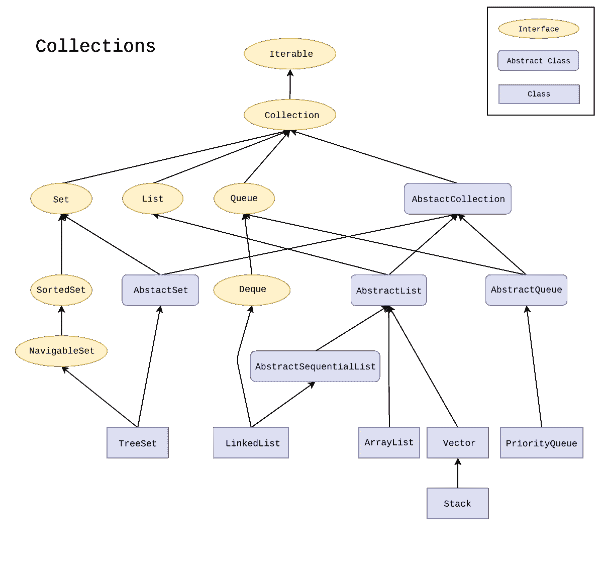
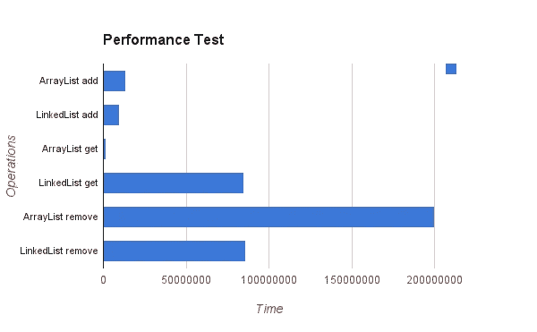

# Java 列表方法教程–实用列表 API 示例

> 原文：<https://www.freecodecamp.org/news/java-list-tutorial-util-list-api-example/>

列表是每种编程语言中常用的数据结构。

在本教程中，我们将研究 Java 的列表 API。我们将从基本操作开始，然后进入更高级的内容(比如不同列表类型的比较，比如 ArrayList 和 LinkedList)。

我还将为您提供一些指导，帮助您选择最适合您的情况的列表实现。

虽然基本的 Java 知识足以跟随教程，但最后一节需要基本的数据结构(Array、LinkedList)和 [Big-O](https://en.wikipedia.org/wiki/Big_O_notation) 知识。如果您不熟悉这些，请随意跳过这一部分。

## 列表的定义

列表是对象的有序集合。在这个意义上，它们类似于数学中的序列。然而，它们不同于集合，集合没有特定的顺序。

需要记住一些事情:列表允许有重复和空元素。它们是引用或对象类型，像 Java 中的所有对象一样，它们存储在堆中。

Java 中的列表是一个接口，有许多列表类型可以实现这个接口。



Collection Hierarchy

我将在前几个例子中使用 ArrayList，因为它是最常用的列表类型。

ArrayList 基本上是一个可调整大小的数组。几乎总是希望使用 ArrayList 而不是常规数组，因为它们提供了许多有用的方法。

过去，数组的唯一优势是它们的大小固定(不会分配超过所需的空间)。但是现在列表也支持固定大小。

## 如何在 Java 中创建列表

聊够了，让我们开始创建我们的列表。

```
import java.util.ArrayList;
import java.util.List;

public class CreateArrayList {
    public static void main(String[] args) {
        ArrayList<Integer> list0 = new ArrayList<>();

        // Makes use of polymorphism
        List list = new ArrayList<Integer>();

        // Local variable with "var" keyword, Java 10
        var list2 = new ArrayList<Integer>();
    }
}
```

在尖括号(<>)中，我们指定将要存储的对象的类型。

请记住，括号中的**类型必须是对象类型，而不是基本类型**。因此我们必须使用对象包装器，用 Integer 类代替 int，用 double 代替 Double，等等。

创建数组列表的方法有很多，但是我在上面的代码片段中给出了三种常见的方法。

第一种方法是通过在赋值的左边指定 ArrayList，从具体的 ArrayList 类创建对象。

第二个代码片段通过使用左侧的 list 来利用多态性。这使得赋值与 ArrayList 类松散耦合，并允许我们赋值其他类型的列表并轻松切换到不同的列表实现。

第三种方式是 Java 10 通过使用 var 关键字创建局部变量的方式。编译器通过检查右边来解释变量的类型。

我们可以看到所有的赋值都导致相同的类型:

```
System.out.println(list0.getClass());
System.out.println(list.getClass());
System.out.println(list2.getClass());
```

输出:

```
class java.util.ArrayList
class java.util.ArrayList
class java.util.ArrayList 
```

我们还可以指定列表的初始容量。

```
List list = new ArrayList<>(20);
```

这很有用，因为每当列表变满，并且您试图添加另一个元素时，当前列表会被复制到一个新列表中，其容量是前一个列表的两倍。这一切都发生在幕后。

这个操作使得我们的复杂度 *O(n)* ，但是，我们想避免它。默认容量是 10，所以如果您知道您将存储更多的元素，您应该指定初始容量。

## 如何在 Java 中添加和更新列表元素

要向列表中添加元素，我们可以使用 *add* 方法。我们还可以指定新元素的索引，但是在这样做的时候要小心，因为这会导致一个*IndexOutOfBoundsException*。

```
import java.util.ArrayList;

public class AddElement {
    public static void main(String[] args) {
        ArrayList<String> list = new ArrayList<>();
        list.add("hello");
        list.add(1, "world");
        System.out.println(list);
    }
}
```

输出:

```
[hello, world]
```

我们可以使用 *set* 方法来更新一个元素。

```
list.set(1, "from the otherside");
System.out.println(list);
```

输出:

```
[hello, world]
[hello, from the otherside]
```

## 如何在 Java 中检索和删除列表元素

要从列表中检索元素，可以使用 *get* 方法，并提供想要获取的元素的索引。

```
import java.util.ArrayList;
import java.util.List;

public class GetElement {
    public static void main(String[] args) {
        List list = new ArrayList<String>();
        list.add("hello");
        list.add("freeCodeCamp");

        System.out.println(list.get(1));
    }
}
```

输出:

```
freeCodeCamp 
```

对 ArrayList 的这个操作的复杂度是 *O(1)* ，因为它在后台使用了一个常规的随机访问数组。

为了从 ArrayList 中删除一个元素，使用了 *remove* 方法。

```
list.remove(0);
```

这将移除索引 0 处的元素，在本例中为“hello”。

我们也可以用一个元素调用 remove 方法来查找并移除它。请记住，它只移除元素的第一次出现(如果它存在的话)。

```
public static void main(String[] args) {
        List list = new ArrayList();
        list.add("hello");
        list.add("freeCodeCamp");
        list.add("freeCodeCamp");

        list.remove("freeCodeCamp");
        System.out.println(list);
    }
```

输出:

```
[hello, freeCodeCamp]
```

要删除所有的事件，我们可以以同样的方式使用 *removeAll* 方法。

这些方法在 List 接口内部，所以每个 List 实现都有它们(无论是 ArrayList、LinkedList 还是 Vector)。

## 如何在 Java 中获得列表的长度

为了得到一个列表的长度，或者元素的数量，我们可以使用 *size()* 方法。

```
import java.util.ArrayList;
import java.util.List;

public class GetSize {
    public static void main(String[] args) {
        List list = new ArrayList();
        list.add("Welcome");
        list.add("to my post");
        System.out.println(list.size());
    }
} 
```

输出:

```
2
```

## Java 中的二维列表

可以创建二维列表，类似于 2D 数组。

```
ArrayList<ArrayList<Integer>> listOfLists = new ArrayList<>();
```

我们使用这个语法来创建一个链表，每个内部链表存储整数。但是我们还没有初始化内部列表。我们需要自己创建并把它们放在这个列表上:

```
int numberOfLists = 3;
for (int i = 0; i < numberOfLists; i++) {
    listOfLists.add(new ArrayList<>());
}
```

我正在初始化我的内部列表，在这个例子中我添加了 3 个列表。如果需要，我还可以在以后添加列表。

现在我们可以在内部列表中添加元素了。要添加一个元素，我们需要首先获取对内部列表的引用。

例如，假设我们想在第一个列表中添加一个元素。我们需要得到第一个列表，然后添加到它。

```
listOfLists.get(0).add(1);
```

Adding elements to 2D list

这里给你举个例子。尝试猜测以下代码段的输出:

```
public static void main(String[] args) {
        ArrayList<ArrayList<Integer>> listOfLists = new ArrayList<>();
        System.out.println(listOfLists);
        int numberOfLists = 3;
        for (int i = 0; i < numberOfLists; i++) {
            listOfLists.add(new ArrayList<>());
        }

        System.out.println(listOfLists);

        listOfLists.get(0).add(1);
        listOfLists.get(1).add(2);
        listOfLists.get(2).add(0,3);

        System.out.println(listOfLists);
}
```

输出:

```
[]
[[], [], []]
[[1], [2], [3]]
```

注意，可以直接打印列表(与常规数组不同)，因为它们覆盖了 *toString()* 方法。

## Java 中有用的方法

还有一些其他常用的有用方法和快捷方式。在这一节中，我想让你熟悉其中的一些，这样你就可以更轻松地使用列表。

### 如何在 Java 中创建包含元素的列表

可以在一行中创建和填充列表中的一些元素。有两种方法可以做到这一点。

以下是老学校的方式:

```
public static void main(String[] args) {
        List<String> list = Arrays.asList(
                                "freeCodeCamp",
                                "let's",
                                "create");
 }
```

使用这个方法时，需要注意一件事:Arrays.asList 返回一个不可变的列表。因此，如果您试图在创建对象后添加或删除元素，将会得到一个*UnsupportedOperationException。*

您可能会尝试使用 *final* 关键字来使列表不可变，但是它不会像预期的那样工作。

它只是确保对对象的引用不会改变——它不关心对象内部发生了什么。因此它允许插入和移除。

```
final List<String> list2 = new ArrayList<>();
list2.add("erinc.io is the best blog ever!");
System.out.println(list2);
```

输出:

```
[erinc.io is the best blog ever!] 
```

现在让我们看看现代的做法:

```
ArrayList<String> friends =  new ArrayList<>(List.of("Gulbike", "Sinem", "Mete")); 
```

Java 9 附带了方法的*列表。这个方法也返回一个不可变的列表，但是我们可以把它传递给 ArrayList 构造函数来创建一个包含这些元素的可变列表。我们可以毫无问题地在这个列表中添加和删除元素。*

### 如何在 Java 中创建一个包含 N 个元素副本的列表

Java 提供了一个名为 *NCopies* 的方法，对于基准测试特别有用。可以在一行中用任意数量的元素填充数组。

```
public class NCopies {
    public static void main(String[] args) {
        List<String> list = Collections.nCopies(10, "HELLO");
        System.out.println(list);
    }
}
```

输出:

```
[HELLO, HELLO, HELLO, HELLO, HELLO, HELLO, HELLO, HELLO, HELLO, HELLO] 
```

### 如何在 Java 中克隆一个列表

如前所述，列表是引用类型，所以[通过引用](https://www.cs.fsu.edu/~myers/c++/notes/references.html)传递的规则适用于它们。

```
public static void main(String[] args) {
        List list1 = new ArrayList<String>();
        list1.add("Hello");
        List list2 = list1;
        list2.add(" World");

        System.out.println(list1);
        System.out.println(list2);
}
```

输出:

```
[Hello,  World]
[Hello,  World]
```

list1 变量保存对列表的引用。当我们把它赋给 list2 时，它也指向同一个对象。如果我们不希望原始列表改变，我们可以克隆列表。

```
ArrayList list3 = (ArrayList) list1.clone();
list3.add(" Of Java");

System.out.println(list1);
System.out.println(list3);
```

输出:

```
[Hello,  World]
[Hello,  World,  Of Java]
```

因为我们克隆了 list1，所以在这种情况下，list3 保存了对其克隆的引用。因此，列表 1 保持不变。

### 如何在 Java 中将列表复制到数组中

有时候你需要把你的列表转换成一个数组，然后把它传递给一个接受数组的方法。您可以使用以下代码来实现这一点:

```
List<Integer> list = new ArrayList<>(List.of(1, 2));
Integer[] toArray = list.toArray(new Integer[0]);
```

您需要传递一个数组， *toArray* 方法在用列表元素填充数组后返回该数组。

### 如何在 Java 中对列表进行排序

为了对列表进行排序，我们可以使用 *Collections.sort.* 默认情况下，它以升序排序，但是您也可以传递一个比较器来使用自定义逻辑进行排序。

```
List<Integer> toBeSorted = new ArrayList<>(List.of(3,2,4,1,-2));
Collections.sort(toBeSorted);
System.out.println(toBeSorted);
```

输出:

```
[-2, 1, 2, 3, 4]
```

## 如何选择要使用的列表类型？

在结束本文之前，我想给你一个不同 list 实现的简单性能比较，这样你可以选择哪一个更适合你的用例。

我们将比较 ArrayList、LinkedList 和 Vector。所有这些都有起有落，所以在你决定之前一定要考虑具体的环境。

### Java ArrayList 与 linkedlist

下面是算法复杂度方面的运行时比较。

```
|                       | ArrayList                  | LinkedList |
|-----------------------|----------------------------|------------|
| GET(index)            | O(1)                       | O(n)       |
| GET from Start or End | O(1)                       | O(1)       |
| ADD                   | O(1), if list is full O(n) | O(1)       |
| ADD(index)            | O(n)                       | O(1)       |
| Remove(index)         | O(n)                       | O(1)       |
| Search and Remove     | O(n)                       | O(n)       |
```

一般来说， *get* 操作在 ArrayList 上要快得多，但是 *add* 和 *remove* 在 LinkedList 上要快得多。

ArrayList 在后台使用一个数组，每当移除一个元素时，数组元素都需要移位(这是一个 *O(n)* 操作)。

选择数据结构是一项复杂的任务，没有适用于所有情况的方法。尽管如此，我还是会试着提供一些指导来帮助你更容易地做出决定:

*   如果您计划执行除 remove 之外的更多 get 和 add 操作，请使用 ArrayList，因为 get 操作在 LinkedList 上的开销太大。请记住，只有在没有指定索引的情况下调用插入并添加到列表末尾时，插入才是 *O(1)* 。
*   如果您打算频繁地删除元素和/或在中间(而不是末尾)插入，您可以考虑切换到 LinkedList，因为这些操作在 ArrayList 上开销很大。
*   请记住，如果按顺序访问元素(使用迭代器)，那么在获取元素时，LinkedList 不会出现性能损失。



Benchmark source: [programcreek](https://www.programcreek.com/2013/03/arraylist-vs-linkedlist-vs-vector/)

### Java 数组列表与向量

Vector 非常类似于 ArrayList。如果您来自 C++背景，您可能会尝试使用 Vector，但是它的用例与 C++有点不同。

Vector 的方法有 **[synchronized](https://docs.oracle.com/javase/tutorial/essential/concurrency/syncmeth.html)** 关键字，所以 Vector 保证线程安全，而 ArrayList 则不能。

在多线程编程中，您可能更喜欢 Vector 而不是 ArrayList，或者您可以使用 ArrayList 并自己处理同步。

在单线程程序中，最好坚持使用数组列表，因为线程安全是以性能为代价的。

## 结论

在这篇文章中，我试图提供一个 Java 的 List API 的概述。我们已经学会了使用基本的方法，我们也学习了一些更高级的技巧来使我们的生活变得更容易。

我们还对 ArrayList、LinkedList 和 Vector 进行了比较，Vector 是采访中经常被问到的话题。

感谢您花时间阅读整篇文章，希望对您有所帮助。

您可以从这个[库](https://github.com/yigiterinc/list-api-tutorial)中访问整个代码。

如果你有兴趣阅读更多这样的文章，你可以订阅我的[博客的](https://erinc.io/)邮件列表，以便在我发表新文章时得到通知。