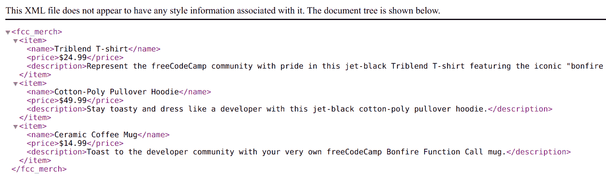
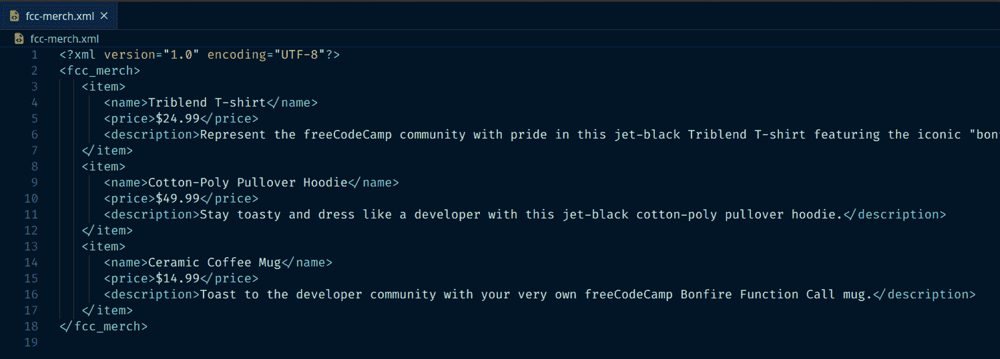
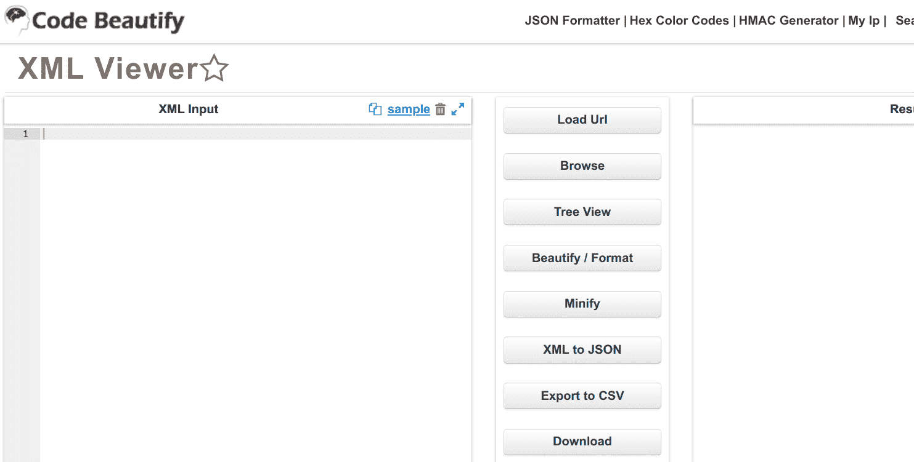
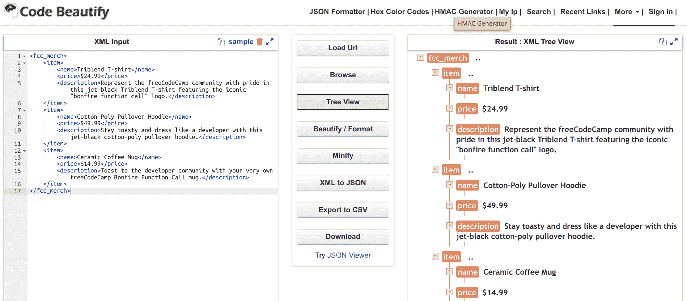

# 什么是 XML 文件？如何打开 XML 文件和最好的 XML 查看器

> 原文：<https://www.freecodecamp.org/news/what-is-an-xml-file-how-to-open-xml-files-and-the-best-xml-viewers/>

如果你曾经在下载文件夹中看到过`.xml`扩展名，并想知道那是什么，你并不孤单。

请继续阅读，了解什么是 XML 文件，以及如何在本地计算机和在线编辑器中打开它。

## 什么是 XML 文件？

XML 代表可扩展标记语言，由万维网联盟在 90 年代创建。

虽然 XML 和 HTML 一样，是一种人类可读的标记语言，但它们的用途非常不同。HTML 描述了网页的结构及其内容，XML 描述了数据的结构。

XML 为程序，更重要的是为程序员，提供了一种标准的、被广泛接受的格式来跨不同的系统传输数据。这样，XML 与 JSON 的共同点就比它与 HTML 的共同点多。

虽然 XML 不再是组织和传输数据的首选方法，但它仍有一席之地。XML 仍然在许多遗留系统中使用，RSS 和 SVG 都基于 XML 格式。

下面是一个简单的 XML 文件示例，以及如何使用它来组织数据:

```
<?xml version="1.0" encoding="UTF-8"?>
<fcc_merch>
   <item>
      <name>Triblend T-shirt</name>
      <price>$24.99</price>
      <description>Represent the freeCodeCamp community with pride in this jet-black Triblend T-shirt featuring the iconic "bonfire function call" logo.</description>
   </item>
   <item>
      <name>Cotton-Poly Pullover Hoodie</name>
      <price>$49.99</price>
      <description>Stay toasty and dress like a developer with this jet-black cotton-poly pullover hoodie.</description>
   </item>
   <item>
      <name>Ceramic Coffee Mug</name>
      <price>$14.99</price>
      <description>Toast to the developer community with your very own freeCodeCamp Bonfire Function Call mug.</description>
   </item>
</fcc_merch>
```

Sample `fcc-merch.xml` file

## 如何在本地打开 XML 文件

回到你的下载文件夹和扩展名为`.xml`的文件。

如果您需要打开一个 XML 文件，您有很多选择。最大的问题是您是否需要编辑 XML 文件中的数据，或者只是查看它。

### 在浏览器中查看 XML 文件

如果您需要做的只是查看 XML 文件中的数据，那么您很幸运。几乎每个浏览器都可以打开 XML 文件。

在 Chrome 中，只需打开一个新标签，将 XML 文件拖过来。或者，右键单击 XML 文件，悬停在“打开方式”上，然后单击“Chrome”。

当您这样做时，文件将在一个新的选项卡中打开。

下面是 Chrome 中的`fcc-merch.xml`文件:



**注:**针对您的操作系统的说明可能略有不同。

### 在文本编辑器中编辑 XML 文件

如果您需要在本地编辑 XML 文件，或者希望在浏览器之外查看它，最好的方法是在文本编辑器中完成。

根据操作系统的不同，您有很多选择。以下是一些常见的建议:

**视窗:**

*   [记事本++](https://notepad-plus-plus.org/)

**Mac/Linux/Windows:**

*   [VSCode](https://code.visualstudio.com/)
*   [Atom](https://atom.io/)
*   [崇高的文字](https://www.sublimetext.com/)

请注意，VSCode、Atom 和 Sublime Text 是相当繁重的程序，尤其是如果您只想编辑 XML 文件的话。Mac 和 Linux 用户可以访问其他轻量级文本编辑器，如 gedit 或 Leafpad，它们可以打开和编辑 XML 文件。

如果你想学习如何编码，那么无论如何，试试上面列出的编辑器。

一旦你下载了一个编辑器，你就可以像打开其他文件一样从编辑器的 GUI 中打开 XML 文件。

下面是 VSCode 中的同一个`fcc-merch.xml`文件:



## 如何在线打开 XML 文件

在线打开 XML 文件很容易，最好的在线 XML 查看器也可以充当编辑器和格式化程序。

下面是一些最流行的在线 XML 查看器/编辑器:

*   [代码美化](https://codebeautify.org/xmlviewer)
*   [JSON 格式化程序](https://jsonformatter.org/xml-viewer)
*   [教程要点](https://www.tutorialspoint.com/online_xml_editor.htm)

每种方法的工作方式都类似，允许您从计算机上传 XML 文件，或者将其复制并粘贴到左侧的编辑器中:



Code Beautify's XML viewer/editor

加载 XML 后，您可以单击“树形视图”来更容易地查看数据的层次结构以及不同字段的嵌套方式:



只需在左侧的编辑器中进行任何必要的编辑。然后，当你完成后，只需点击“下载”下载一份你编辑过的文件。

请注意，您下载的副本可能有不同的名称，如`codebeautify.xml`。在将文件附加到电子邮件、上传或做任何你需要做的事情之前，只需重命名文件。

## 概括起来

XML 格式有着悠久的历史。

尽管与 JSON 等现代数据传输解决方案相比，XML 文件相当密集，但了解如何打开和编辑它们并没有坏处。幸运的是，你在本地机器和网上有很多选择。

希望这有助于您下次打开或编辑 XML 文件。

保持安全和快乐的编码。