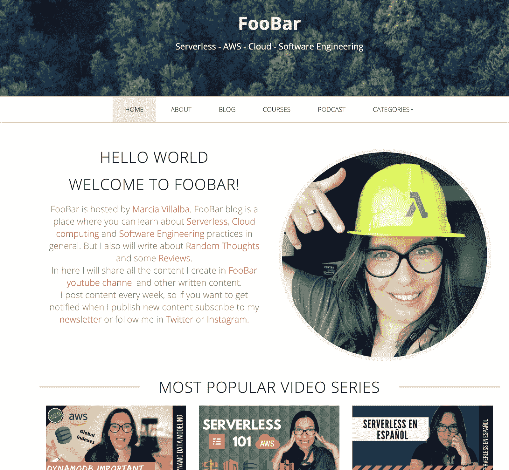
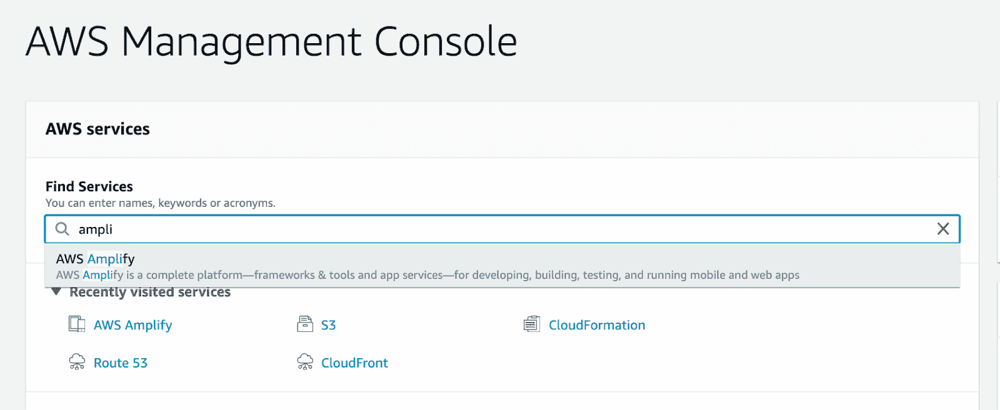
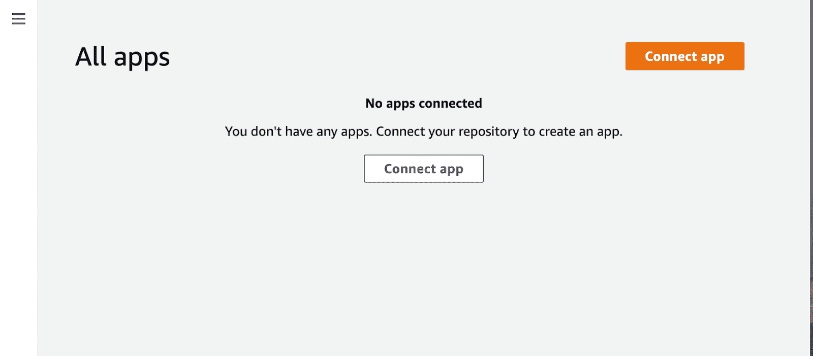
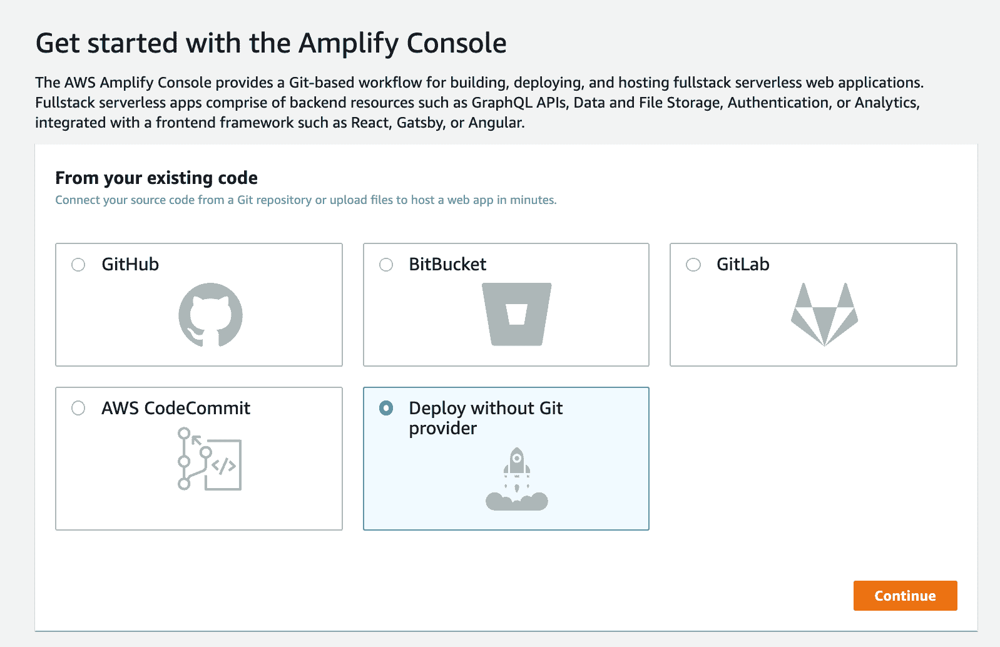
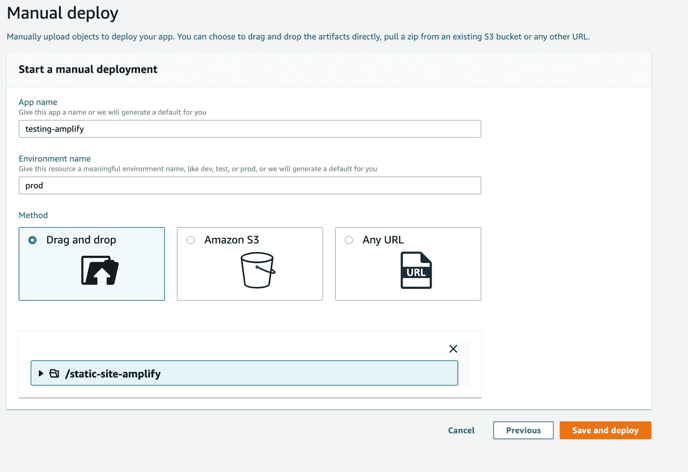
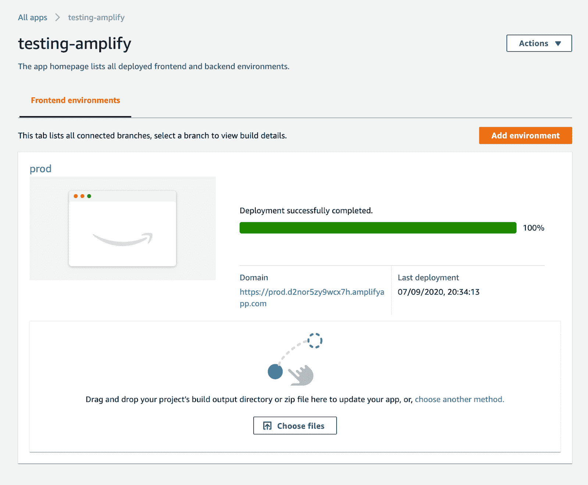
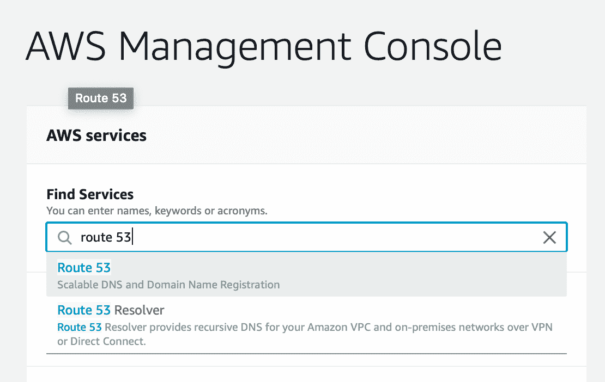
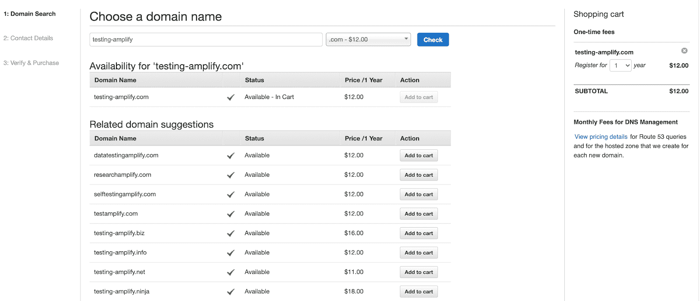
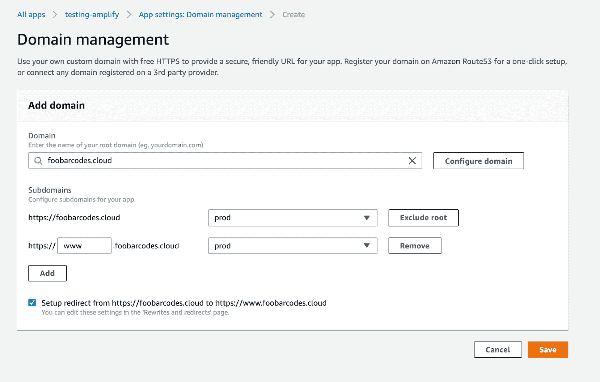
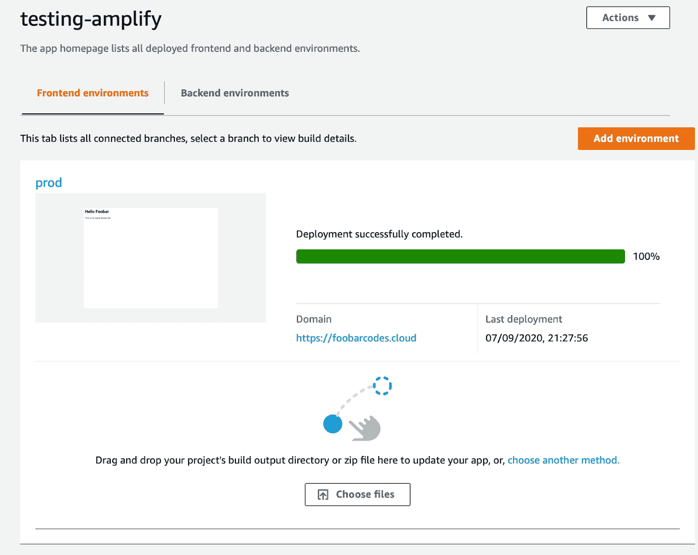

# 如何通过四个步骤在云中托管一个静态站点

> 原文：<https://www.freecodecamp.org/news/how-to-host-a-static-site-in-the-cloud-in-4-steps/>

静态网站可以托管各种类型的网站，从你的个人文件夹，到公司的登录页面，甚至是博客。

静态站点的主要优点是易于管理。它们的性价比也很高。而有了静态网站，你就不需要一直运行在服务器上的复杂的内容管理服务(CMS)(即使你没有任何流量)。

在这篇文章中，你将学习如何通过 4 个步骤在 AWS 云中托管一个静态网站，使用 [AWS Amplify](https://aws.amazon.com/amplify) 和 [Route 53](https://aws.amazon.com/route53/) 。最棒的是。每个月你几乎不用花一分钱。

## 什么是静态网站？

静态网站是由存储服务器或内容交付网络(CDN)提供服务的网站。不需要运行服务器来创建 HTML 文件。

这些网站预先构建为 HTML 文件，存储在互联网上的某个地方，然后在构建时提供服务。

静态站点可以有动态内容，但它是在客户端使用 JavaScript 或一些使用 API 的第三方集成来处理的。

使用静态站点的一些好处是:

*   它们很容易扩展
*   如果你使用的是 CDN，加载速度会很快
*   它们很划算
*   它们很容易维护

例如，我的[个人网站](https://marcia.dev/)就是一个静态网站的好例子:



Marcia's personal website

## 什么是 AWS？

AWS 代表亚马逊网络服务，是最广泛采用的云平台。它有许多不同的服务来帮助你开发和托管你的应用程序。

AWS 在世界各地也有数据中心，数百万客户使用它。

与使用自己的本地服务器相比，将云用于您的应用程序将降低成本，帮助您变得更加敏捷，并允许您更快地进行创新。

## 步骤 1 -设置您的 AWS 帐户

这个过程的第一步是获得一个 [AWS 账户](https://portal.aws.amazon.com/billing/signup)。您将在云中托管您的静态页面，为此您必须拥有一个有效的 AWS 帐户。

如果你刚刚创建你的账户，这个项目的自由层应该足够了。免费层将让您在前 12 个月免费访问大量 AWS 服务。

例如，您将获得 5GB 的免费存储空间。这很好，因为我们需要存储来保存云中的静态站点。

请记住，如果您不使用任何服务，拥有 AWS 帐户是免费的。创建帐户不会向您收费，如果您不使用该帐户，也不会收取任何费用。

要创建 AWS 帐户，您可以按照本视频中的步骤操作:

[https://www.youtube.com/embed/9_wo0FHtVmY?feature=oembed](https://www.youtube.com/embed/9_wo0FHtVmY?feature=oembed)

## 步骤 2 -创建你的静态站点并用 AWS Amplify 配置它

现在读完这个标题，你可能会问，什么是 AWS Amplify？

AWS Amplify 是一个开源框架，它提供了一些特性来帮助您构建云原生 web 和移动应用。它有 4 个组成部分:

*   放大器 CLI
*   扩增文库
*   放大 UI 组件，以及
*   放大器控制台。

Amplify CLI 可帮助您配置使用命令行界面为您的应用程序创建云后端所需的所有服务。

这些库帮助您将客户端应用程序与后端服务直接集成。

Amplify UI 组件是专门针对 React、React Native、Angular、Ionic 和 Vue 的 UI 库，将帮助您轻松开发云原生应用程序。

最后，Amplify 控制台是一个 AWS 服务，它为持续部署和托管全栈 web 和移动应用程序提供了基于 git 的工作流。

在这篇文章中，我们不会使用 AWS Amplify 的所有功能，我们只是使用控制台。但是我建议你查看一下关于如何使用 AWS Amplify 构建更复杂的应用程序的教程。

### 创建静态站点

现在，您已经拥有了开始创建静态站点所需的一切。对于这个演示，任何静态 HTML 都可以。我刚刚创建了一个名为 index.html 的文件，并在其中添加了以下代码:

```
<html>
    <h1>Hello Foobar</h1>
    <p>This is my super simple site</p>
</html>
```

### 上传到 AWS 放大器控制台

有了静态站点后，下一步是转到 AWS 控制台中的 [AWS Amplify 服务。](https://console.aws.amazon.com/amplify/)



Finding the AWS Amplify service in the AWS Console

当该服务打开时，您将会看到如下内容:



AWS Amplify console

点击**连接应用**按钮，将出现以下页面:



Options for deploying your existing project

然后您可以选择**Deploy without a Git provider**并继续。

您将看到一个页面，用于手动部署您的应用程序。在那里，你选择一个**应用名称**和一个**环境** **名称**，然后你可以将你的应用文件夹拖入浏览器。



Starting a manual deployment in AWS Amplify

当应用程序完成上传时，您将看到一条消息，显示“部署成功完成”。

现在你的网站托管在云中。转到位于**域**文本下的链接。这将把您带到刚刚部署的静态站点。



## 第三步-为你的网站购买域名

现在是时候为你的网站申请域名了。分享那个**域名**链接不太实际，域名可能是一种更简单的网站命名方式。

为此，你需要进入你的 AWS 账户，访问一个名为 Route53 的服务。



Finding the service Route53 in the AWS console

然后，当 53 号公路开通时，你可以转到一个链接，上面写着**注册域名**，这样的页面就会出现。



这里你需要选择一个域名。域名是按年计费的，根据不同的结局会有不同的费用(比如。com，。net 等等)。

选择域名后，您可以将其添加到名片中。然后只要按照 Route53 提供的说明就可以了。

## 步骤 4 -在 AWS Amplify 应用程序中配置域

现在你有了域名，是时候回到你刚刚配置的 AWS Amplify 应用程序了。

然后在左边，你点击**域管理**链接，这个页面打开:



Adding a domain to your site

**域名**文本框将提示您刚刚注册的域名。选中它，接受所有默认配置，然后点击**保存**。

之后，您将被定向到配置域和 SSL 证书的页面。在该步骤中，您不需要做任何事情，只需等到一切都配置完毕。这需要一段时间，所以要有耐心。

现在您已经完成了，所以您可以转到您的新域并查看您的静态页面。

## 如何更新这个网站

现在，每次你需要改变静态网站的内容时，你都需要去 AWS Amplify 并更新文件。基本上，你只需在 Amplify 应用程序中拖放目录。



Updating your static site

## 结论

现在，您有了一个托管在云中的静态站点。这个网站是非常可扩展和可靠的。该网站使用 AWS CDN 托管，称为 AWS CloudFormation，因此这将使您的网站对您的用户来说非常快。

在你的 AWS 账户超过 12 个月之后，总的托管费用大约是每月 0.50 到 4 美元，这取决于你的网站有多大以及你获得了多少流量。

另一项年费是域名费用，从每年 9 美元开始。

如果你想让这变得更加自动化，我建议你看看使用 Github 的 [AWS 放大自动部署。](https://docs.amplify.aws/guides/hosting/git-based-deployments/q/platform/js)

****感谢阅读。****

我是 Marcia Villalba，是 AWS 的开发者倡导者，也是 YouTube 频道 FooBar 的主持人，在那里我有超过 250 个关于无服务器、AWS 和软件工程师实践的视频教程。

*   推特:[https://twitter.com/mavi888uy](https://twitter.com/mavi888uy)
*   YouTube:[https://youtube.com/foobar_codes](https://youtube.com/foobar_codes)