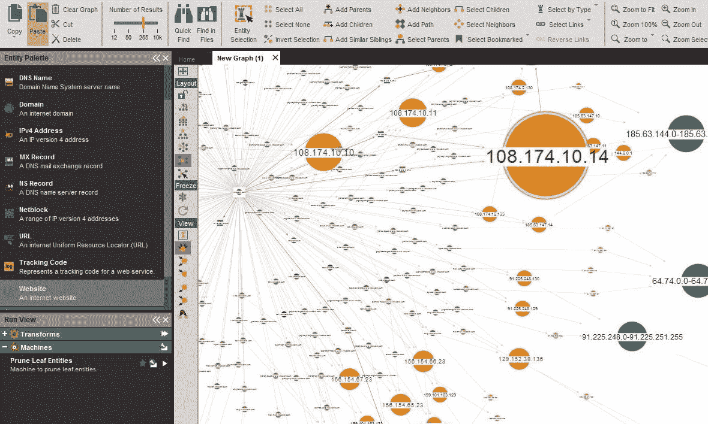
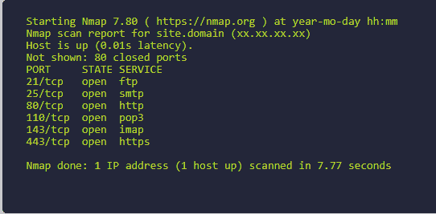
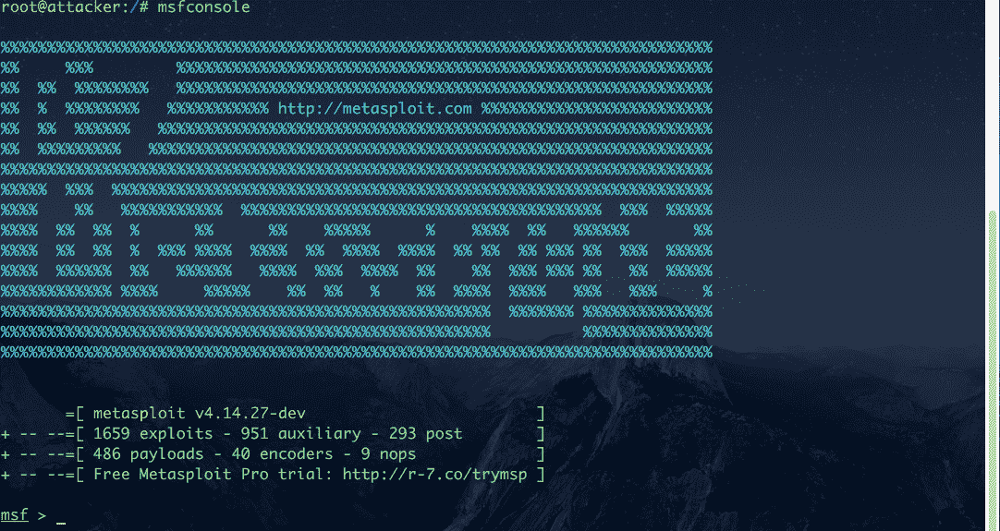

# 道德黑客生命周期——渗透测试的五个阶段

> 原文：<https://www.freecodecamp.org/news/ethical-hacking-lifecycle-five-stages-of-a-penetration-test/>

渗透测试是利用一个组织的网络来找出如何更好地保护它的过程。

在本文中，我们将讨论成功渗透测试的五个步骤。

**在我们进入文章之前，*一个快速的免责声明:*我想强调的是，我对你试图攻击系统所造成的任何损害不负任何责任。**

未经许可进行笔测试是非法的，所以在你尝试扫描一个系统或网络之前，确保你有书面记录。

说完了，让我们开始吧。

## 什么是网络安全？

网络安全是最热门的领域之一，这要归功于许多公司的远离。网络威胁正在增加，网络罪犯正在寻找新的方法来利用系统。

渗透测试是道德黑客的工作方式。他们像坏黑客一样思考，攻击自己的系统。这有助于他们了解自己的优势和劣势，并保护他们的组织资产。

笔测试由多个阶段组成。除非目标非常脆弱，否则你不能简单地通过使用工具进入系统。

在大多数情况下，系统通过防火墙、防病毒软件、默认操作系统配置等来保护。要成功利用网络，需要正确的工具、强大的技能，最重要的是耐心。

因此，让我们看看渗透测试人员将经历的五个主要阶段，以及他们用来闯入网络的工具。

你也可以在这里找到我写的关于网络安全专家使用的 10 大工具的文章。

## 侦察

> “给我六个小时砍树，我会用前四个小时磨利斧头。”—亚伯拉罕·林肯

侦察是渗透测试中最重要的部分。这是你获取目标信息的地方。

侦察很重要，因为你对目标了解得越多，你就越容易接近它。一旦你画出了整个网络，你就可以确定最薄弱的地方，并从那里开始。

常用的侦查工具有 [Google(耶！)](https://en.wikipedia.org/wiki/Google_hacking)和社交媒体网站，你可以在那里收集目标的信息。如果你正在对一家公司进行审计，你可以浏览该公司的招聘信息，看看他们使用的技术类型。

一旦你获得了足够的信息，你可以使用像 [Maltego](https://www.maltego.com/) 这样的工具来绘制目标。

Maltego

Maltego 还支持从社交网络、DNS 记录和自定义插件 [FullContact](https://www.fullcontact.com/) 自动导入数据的能力。

就担保而言，要记住的重要一点是，你永远不要碰目标。侦察类似于当你远离目标时侦察和寻找信息。

## 扫描

这是你接触目标的部分。扫描包括向目标发送数据包并解释它们的响应。

扫描为您提供有关目标的有用信息，如开放端口、IP 地址、操作系统信息、安装的服务等。

Nmap 是扫描网络的最佳扫描器。它将帮助您规划网络，并提供有关目标系统的详细信息。

Nmap

Nmap 还提供了许多 CLI 选项，包括扫描导出，您可以将其导入到利用工具中。

[Nessus](https://en.wikipedia.org/wiki/Nessus_(software)) 是另一个扫描工具，但它是一个商业产品。Nmap 会给你关于目标的信息，Nessus 会告诉你如何通过匹配[常见漏洞和暴露数据库](https://www.exploit-db.com/)中的漏洞来利用目标。

OpenVas 是另一个类似于 Nessus 的开源替代产品。

## 剥削

这是你进入系统的地方。成功的利用漏洞至少可以让您以用户级别控制系统。从那里，您执行[权限提升](https://searchsecurity.techtarget.com/definition/privilege-escalation-attack)来获得对目标的超级用户访问权限。

说到开发， [Metasploit 无疑是市场上最好的工具](https://medium.com/manishmshiva/metasploit-a-walkthrough-of-the-powerful-exploitation-framework-6974c4ed0ea7)。它是开源的(也有商业版本),易于使用。

Metasploit

Metasploit 经常随着常见漏洞和暴露(CVE)数据库中发布的新攻击进行更新。因此，您可以将扫描结果与可用的漏洞进行匹配，并使用 Metasploit 中的漏洞攻击目标。

Metasploit 有一个名为 [Meterpreter](https://www.offensive-security.com/metasploit-unleashed/about-meterpreter/) 的高级负载。一旦您获得了对目标系统的访问权，Meterpreter 会为您提供打开网络摄像头、转储密码散列等选项。Meterpreter 也存在于目标的内存中，因此很难被检测到。

例如，如果您的扫描结果告诉您目标具有 Samba 版本 3.5，您可以使用[Samba CVE-2017–7494 远程代码执行漏洞](https://cve.mitre.org/cgi-bin/cvename.cgi?name=CVE-2017-7494)通过 Metasploit 发送有效负载，并获得对目标系统的访问权限。

Metasploit 还有一个叫做 Armitage 的 GUI 工具。Armitage 帮助您可视化目标，并通过将漏洞与漏洞数据库进行匹配来推荐漏洞。

## 保持访问

进入系统并不容易，尤其是在公司网络上。在你为利用一个系统做了这么多努力之后，再去经历同样的过程来利用目标是没有意义的。

这就是维护访问权的切入点。你可以安装后门程序、键盘记录程序和其他代码，让你随时进入系统。

Metasploit 为您提供了键盘记录器和 Meterpreter 后门等工具来维护对被利用系统的访问。获得访问权限后还可以安装自定义[rootkit](https://www.veracode.com/security/rootkit)或木马。

rootkit 是一段代码，可让攻击者对其连接的系统拥有管理员权限。当您从恶意网站下载文件时，也可能会安装 Rootkits。

特洛伊木马是看似有用的软件(例如 adobe photoshop)，但可能包含隐藏的恶意软件。这在盗版软件中很常见，攻击者会在 MS Office 等流行软件中嵌入木马。

## 报告

报告是渗透测试的最后一部分。这就是攻击者和道德黑客之间的区别。

一旦你的渗透测试完成，你要总结从侦察到进入的所有步骤。这将有助于组织了解其安全架构并更好地保护自己。

当你们作为一个团队工作时，报告也是有用的。您将无法单独为一个大型组织进行渗透测试。报告也让客户理解团队的努力，并帮助证明补偿的合理性。

[这是一份在成功渗透测试](https://www.offensive-security.com/reports/sample-penetration-testing-report.pdf)后创建的样本报告。

## 摘要

网络安全是一个很好的职业选择，尤其是在这个不确定的时期。每天都有更多的设备暴露在网络中。渗透测试人员的工作是帮助保护组织的网络。

希望这篇文章能帮助你理解渗透测试的不同阶段。要了解更多关于道德黑客或人工智能的信息，你可以访问我的博客。