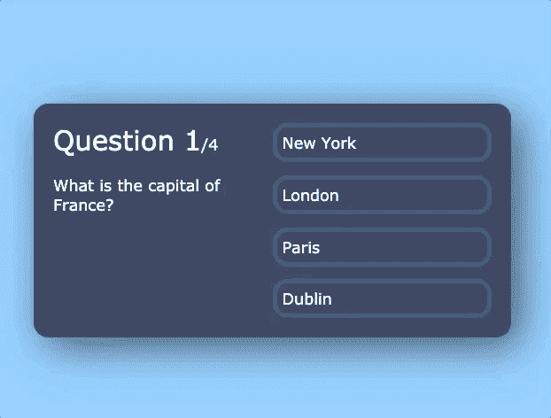
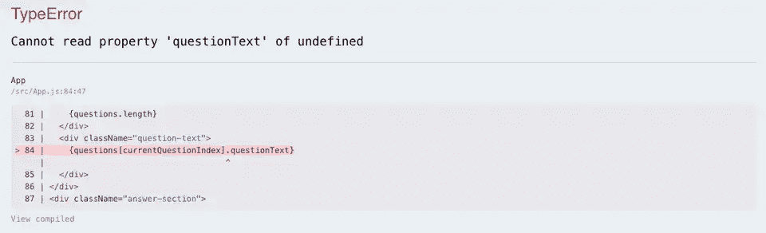

# 如何使用 React 构建测验应用程序——包括提示和入门代码

> 原文：<https://www.freecodecamp.org/news/how-to-build-a-quiz-app-using-react/>

在这个初学者 React 教程中，我们将构建一个测验应用程序。我们将使用复杂的状态对象，如何处理不同的状态挂钩，以及基于状态呈现事物。

看看这个:



## 你自己试试

如果你想自己先试一试，这里有一些场景(你也可以在下面找到启动代码):

*   当用户点击一个按钮，下一个问题应该出现
*   如果用户答对了问题，应该会增加他们的分数
*   当用户结束测验时，应该会显示他们的总分

## 视频漫游

[https://www.youtube.com/embed/Lya-qYiDqIA](https://www.youtube.com/embed/Lya-qYiDqIA)

## 起始代码

在 GitHub 这里下载。

## 我们走吧！

如果你打开起始代码，进入 **App.js** ，你会看到我给了你一个问题/答案列表，存储为一个名为**问题**的数组。这是我们的测验。

我们的第一个目标是从数组中获取问题数据，并将其显示在屏幕上。

现在，我们将删除硬编码的文本，并从第一个问题中提取数据，只是为了让事情进行下去。以后再担心切换问题。

在我们的 JSX 中，删除硬编码的问题文本并键入`{questions[0]}`以获得问题数组中的第一个项目(或问题)。

```
<div className='question-text'>{questions[0]}</div> 
```

## 呈现问题和答案

第一个问题是一个对象，所以我们可以使用“点符号”来访问属性。现在，我们将执行`{question[0].questionText}`来访问该对象的问题文本:

```
<div className='question-text'>{questions[0].questionText}</div> 
```

保存并运行应用程序。请注意文本是如何更新的。请记住，我们只是从问题数组中的第一个对象获取第一个问题文本。

我们将对答案选项采取类似的方法。去掉硬编码的按钮，我们将使用 map 函数来遍历给定问题的答案选项。

还记得 map 函数在数组上循环，并以变量的形式给出循环当前所在的项。

将“答案部分”替换为以下内容:

```
<div className='answer-section'>
	{questions[0].answerOptions.map((answerOption, index) => (
		<button>{answerOption.answerText}</button>
	))}
</div> 
```

保存并运行应用程序。请注意四个回答按钮是如何出现的，文本是如何动态呈现的。

让我们回顾一下:

*   我们从问题数组中得到第一个问题:`questions[0]`
*   第一个问题是一个对象，它包含一个数组`answerOptions`。我们可以通过使用点符号得到这个数组:`questions[0].answerOptions`
*   因为`answerOptions`是一个数组，我们可以映射到这个:`questions[0].answerOptions.map`
*   在 map 函数中，我们为每个`answerOption`呈现一个按钮，并显示文本

## 使用状态更改问题

现在让我们回到我们的 JSX。请注意，如果我们将`questions[0]`改为`questions[1]`，或者`questions[2]`，用户界面将会更新。这是因为它根据索引从我们的问题数组中的不同问题获取数据。

我们想要做的是使用一个状态对象来保存用户当前所在的问题，并在点击一个回答按钮时更新它。您可以通过运行最后一个示例中的代码看到这一点。

继续添加一个 state 对象，它将保存用户当前的问题号。这将被初始化为 0，因此测验将从数组中抽取第一个问题:

```
const [currentQuestion, setCurrentQuestion] = useState(0); 
```

现在我们想用这个变量替换 JSX 中的硬编码“0”。首先是问题文本:

```
<div className='question-text'>{questions[currentQuestion].questionText}</div> 
```

对于问题部分:

```
<div className='answer-section'>
	{questions[currentQuestion].answerOptions.map((answerOption, index) => (
		<button>{answerOption.answerText}</button>
	))}
</div> 
```

现在，如果您将**当前问题**初始化为 0 以外的值，例如 1 或 2，UI 将会更新以显示该问题以及该特定问题的答案。相当酷！

让我们添加一些代码，以便当我们单击一个答案时，我们增加 **currentQuestion** 值，将我们带到下一个问题。

创建一个名为 **handleAnswerButtonClick** 的新函数。这是当用户点击一个答案时将被调用的内容。

我们将把当前的问题值增加 1，保存到一个新变量中，并将这个新变量设置为 state:

```
const handleAnswerButtonClick = (answerOption) => {
	const nextQuestion = currentQuestion + 1;
	setCurrentQuestion(nextQuestion);
}; 
```

接下来，向按钮添加一个 onClick 事件，如下所示:

```
<button onClick={() => handleAnswerButtonClick()}>{answerOption.answerText}</button> 
```

如果我们尝试这样做，你会看到它的效果，直到我们完成:



发生了什么事？在我们的 **handleAnswerButtonClick** 函数中，我们增加了数字并将其设置为 state。没关系。

但是请记住，我们使用这个数字来访问一个数组，以便获得问题和答案选项。一旦我们到了 5，它将打破，因为没有第五元素！

让我们做一次检查以确保我们没有超过限制。在 handleAnswerButtonClick 函数中，我们添加以下条件:

```
if (nextQuestion < questions.length) {
	setCurrentQuestion(nextQuestion);
} else {
	alert('you reached the end of the quiz');
} 
```

这基本上是说，如果下一个问题的数量少于问题的总数，就将状态更新为下一个问题。否则，我们已经到达测验的末尾，所以现在显示一个警告。

## 显示乐谱屏幕

我们想要做的不是显示警告，而是显示“分数”屏幕。

如果我们看看 JSX，你会注意到我已经把标记放在这里了，我们只需要用逻辑替换“false”。

那么我们该如何着手呢？嗯，这是一个完美的东西放在国家！

添加另一个状态对象，它将存储我们是否要显示分数屏幕:

```
const [showScore, setShowScore] = useState(false); 
```

在我们的 JSX 中，将`false`替换为`showScore`:

```
<div className='app'>{showScore ? <div className='score-section'>// ... score section markup</div> : <>// ... quiz question/answer markup</>}</div> 
```

什么都不会改变，但是如果我们将 state 值更改为 true，那么 score div 将会显示。这是因为一切都包裹在三元之中，意思是:

> 如果 showScore 为 true，则呈现分数部分标记，否则，呈现测验问题/答案标记

现在，我们希望在用户到达测验末尾时更新这个状态变量。我们已经在 handleAnswerButtonClick 函数中为此编写了逻辑。

我们所要做的就是替换将 **showScore** 变量更新为真的警报逻辑:

```
if (nextQuestion < questions.length) {
	setCurrentQuestion(nextQuestion);
} else {
	setShowScore(true);
} 
```

如果我们点击测验的答案，当我们结束时，它会显示分数部分。目前，显示的文本和分数是硬编码的字符串，所以我们应该使它动态化。

## 保存分数

我们的下一个任务是在我们的应用程序中保存一个分数，如果用户选择了正确的选项，这个值就会增加。

这样做的逻辑位置是在“handleAnswerOptonClick”函数中。

记得当我们迭代 **answerOptions** 时，map 函数为每个选项提供了一个对象，其中包括**问题文本**，以及一个**布尔值**，显示该答案是否正确。这个布尔值是我们用来帮助我们增加分数的。

在我们的按钮中，像这样更新函数:

```
onClick={()=> handleAnswerButtonClick(answerOption.isCorrect) 
```

接下来更新函数以接受该参数:

```
const handleAnswerButtonClick = (isCorrect) => {
	//... other code
}; 
```

现在我们可以在函数中添加一些逻辑。现在我们想说“如果 isCorrect 为真，我们想显示一个警告”:

```
const handleAnswerButtonClick = (isCorrect) => {
	if (isCorrect) {
		alert(“the answer is correct!”)
	}

	//...other code
}; 
```

这个和`if(isCorrect === true)`一样，只是简写版。现在，如果我们尝试这样做，您会看到，当我们单击正确答案时，会收到一条警告。

简单回顾一下到目前为止:

*   当我们迭代按钮时，我们将该按钮的`isCorrect`布尔值传递给 **handleAnswerButtonClick** 函数
*   在函数中，我们检查该值是否为真，如果为真，则显示一个警告。

接下来我们要实际保存分数。你觉得我们该怎么做？如果你说国家价值你是正确的！

继续添加另一个名为“score”的状态值。记住在函数前面加上前缀“set”来改变值，所以它是 setScore。将其初始化为`0`:

```
const [score, setScore] = useState(0); 
```

接下来，如果用户回答正确，我们希望将分数更新 1，而不是显示警告。

在我们的 **handleAnswerButtonClick** 函数中，移除警报并将我们的分数增加 1:

```
const handleAnswerButtonClick = (isCorrect) => {
	if (answerOption.isCorrect) {
		setScore(score + 1);
	}

	//...other code
}; 
```

## 显示分数

为了显示分数，我们只需对渲染代码做一点小小的修改。在我们的 JSX 中，删除了 score 部分中的硬编码字符串，并添加了这个新变量:

```
<div className='score-section'>
	You scored {score} out of {questions.length}
</div> 
```

```
<div className='score-section'>
	You scored {score} out of {questions.length}
</div> 
```

现在，如果我们浏览答案，分数是动态的，将在最后正确显示！

在我们结束我们的测验应用程序之前，最后一件事:你会注意到 UI 上显示的当前问题总是“1”，因为它是硬编码的。我们需要把它变得更有活力。

将“问题计数”替换为:

```
<div className='question-count'>
	<span>Question {currentQuestionIndex + 1}</span>/{questions.length}
</div> 
```

记住，我们需要+1，因为计算机是从 0 而不是 1 开始计数的。

## 想要更多项目创意？

为什么不尝试构建一些 React 项目来进一步促进您的学习呢？每周我都会发送一个新项目给你，让你尝试一个工作示例、起始代码和提示。[订阅，让它直接进入你的收件箱！](https://subscribe.jschris.com)