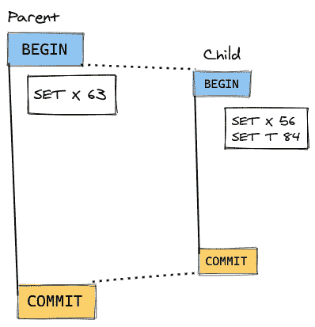
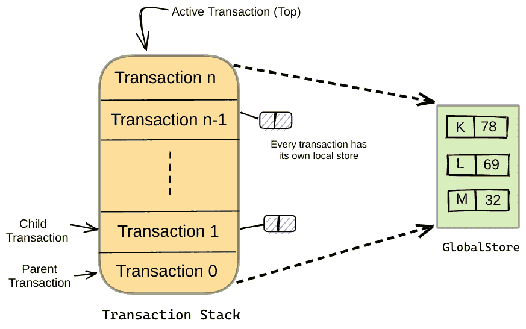
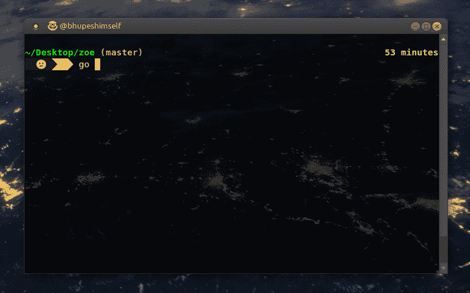

# 如何在 Go 中设计一个事务键值存储

> 原文：<https://www.freecodecamp.org/news/design-a-key-value-store-in-go/>

如果您想设计一个允许访问事务性内存中键/值存储的交互式 shell，那么您就找对了地方。

现在就一起去设计一个吧。

## 背景

系统设计问题一直让我感兴趣，因为它们让你有创造力。

最近，我读了乌多阿克的博客，他在博客中分享了他参加 30 天马拉松面试的经历，这非常令人兴奋。强烈推荐阅读。

不管怎样，我了解了他在面试时被问到的这个有趣的[系统设计](https://en.wikipedia.org/wiki/Systems_design)问题。

## 挑战

问题如下:

构建一个允许访问“事务性内存中键/值存储”的交互式外壳。

**注**:为了更好地理解，这个问题被重新措辞。在上面提到的作者的采访中，这是一个“带回家”的项目。

shell 应该接受以下命令:

| 命令 | 描述 |
| :-: | :-: |
| `SET` | 将给定键设置为指定值。也可以更新密钥。 |
| `GET` | 打印出指定键的当前值。 |
| `DELETE` | 删除给定的键。如果尚未设置密钥，则忽略。 |
| `COUNT` | 返回已设置为指定值的键的数量。如果没有键被设置为该值，则打印 0。 |
| `BEGIN` | 开始交易。这些事务允许您修改系统的状态，并提交或回滚您的更改。 |
| `END` | 结束交易。在“活动”事务中所做的一切都将丢失。 |
| `ROLLBACK` | 丢弃在活动事务上下文中所做的更改。如果没有活动的事务，则打印“没有活动的事务”。 |
| `COMMIT` | 提交在活动事务上下文中所做的更改，并结束活动事务。 |

## 我们在竞技场？

开始之前，我们可以问一些额外的问题，例如:

**Q1。** *交互式 shell 会话结束后，数据是否会持续存在？*

**Q2。** *对数据的操作是否反映到全局 shell？*

**Q3。** *提交嵌套事务中的更改是否也会反映到祖父母身上？*

你的问题可能不一样，这很好。你问的问题越多，你对问题的理解就越好。

解决这个问题在很大程度上取决于所提的问题，所以让我们定义在构建我们的键值存储时我们要假设什么:

1.  数据是非持久的(也就是说，一旦 shell 会话结束，数据就会丢失)。
2.  键值只能是字符串(我们可以实现自定义数据类型的接口，但这超出了本教程的范围)。

现在让我们试着理解问题的棘手之处。

### 理解“交易”

用`BEGIN`命令创建一个事务，并为其他操作的发生创建一个上下文。例如:

```
> BEGIN // Creates a new transaction
> SET X 200
> SET Y 14
> GET Y
14 
```

这是当前活动的事务，所有的操作都只在其中进行。

在使用`COMMIT`命令提交活动事务之前，这些操作不会持续。而且，`ROLLBACK`命令会丢弃活动事务上下文中这些操作所做的任何更改。更准确地说，它从映射中删除了所有的键值对。

例如:

```
> BEGIN //Creates a new transaction which is currently active
> SET Y 2020
> GET Y
2020
> ROLLBACK //Throws away any changes made
> GET Y
Y not set // Changes made by SET Y have been discarded 
```

事务也可以嵌套，也就是说，也可以有子事务:



Parent-Child hierarchy in transactions

新产生的事务从其父事务继承变量，并且在子事务的上下文中所做的更改也将反映在父事务中。

例如:

```
> BEGIN //Creates a new active transaction
> SET X 5
> SET Y 19
> BEGIN //Spawns a new transaction in the context of the previous transaction and now this is currently active
> GET Y
Y = 19 //The new transaction inherits the context of its parent transaction**
> SET Y 23
> COMMIT //Y's new value has been persisted to the key-value store**
> GET Y
Y = 23 // Changes made by SET Y 19 have been discarded** 
```

我刚看完博客就试了一下。让我们看看如何解决这个问题。

## 让我们来设计

我们讨论过事务也可能有子事务，我们可以使用[堆栈](https://en.wikipedia.org/wiki/Stack_(abstract_data_type))数据结构来概括这一点:



Visualizing our Transaction Stack

*   每个堆栈元素都是一个**事务**。
*   栈顶存储我们当前的“活动”事务。
*   每个事务元素都有自己的[映射](https://en.wikipedia.org/wiki/Hash_table)。我们称之为“本地存储”,它就像一个本地缓存——每次我们在一个事务中使用一个变量，这个存储就会被更新。
*   一旦在事务内部提交了更改，这个“本地”存储中的值就被写入我们的全局 map 对象。

我们将使用堆栈的[链表](https://en.wikipedia.org/wiki/Linked_list)实现。我们也可以使用动态数组来实现这一点，但这是读者的家庭作业:

```
package main

import (
	"fmt"
	"os"
	"bufio"
	"strings"
)

/*GlobalStore holds the (global) variables*/
var GlobalStore = make(map[string]string)

/*Transaction points to a key:value store*/
type Transaction struct {
	store map[string]string // every transaction has its own local store
	next  *Transaction
}

/*TransactionStack maintains a list of active/suspended transactions */
type TransactionStack struct {
	top  *Transaction
	size int 			// more meta data can be saved like Stack limit etc.
} 
```

*   我们的堆栈由一个结构`TransactionStack`表示，它只存储一个指向堆栈`top`的指针。`size`是一个结构变量，可用于确定堆栈的大小，即找到挂起的&活动事务的数量(完全可选——可以省略声明)。
*   `Transaction`结构有一个存储，我们在前面定义为内存中下一个事务的映射和指针。
*   `GlobalStore`是堆栈中所有事务共享的映射。这就是我们如何建立亲子关系的，稍后会详细介绍。

现在让我们为我们的`TransactionStack`编写 push 和 pop 方法。

```
 /*PushTransaction creates a new active transaction*/
func (ts *TransactionStack) PushTransaction() {
	// Push a new Transaction, this is the current active transaction
	temp := Transaction{store : make(map[string]string)}
	temp.next = ts.top
	ts.top = &temp
	ts.size++
}

/*PopTransaction deletes a transaction from stack*/
func (ts *TransactionStack) PopTransaction() {
	// Pop the Transaction from stack, no longer active
	if ts.top == nil {
		// basically stack underflow
		fmt.Printf("ERROR: No Active Transactions\n")
	} else {
		node := &Transaction{}
		ts.top = ts.top.next
		node.next = nil
		ts.size--
	}
} 
```

*   随着每个`BEGIN`操作，一个新的堆栈元素被推入`TransactionStack`并将`top`更新为这个值。
*   对于每个`COMMIT`或`END`操作，活动事务从堆栈中*弹出*，堆栈的下一个元素被分配给`top`。因此父事务现在是我们当前的活动事务。

如果您是新手，请注意`PushTransaction()`和`PopTransaction()`是[方法](https://gobyexample.com/methods)，而不是接收器类型的函数(`*TransactionStack`)。

在 JavaScript 和 Python 这样的语言中，接收者方法调用分别通过关键字`this`和`self`来实现。

然而在围棋中却不是这样。你可以给它起任何你想要的名字。为了更容易理解，我们选择`ts`来指代事务堆栈。

现在我们创建一个`Peek`方法从堆栈中返回给我们`top`元素:

```
/*Peek returns the active transaction*/
func (ts *TransactionStack) Peek() *Transaction {
	return ts.top
} 
```

注意，我们正在返回一个类型为`Transaction`的指针变量。

提交交易将涉及将所有新的和/或更新的值从交易本地存储“复制”到我们的`GlobalStore`:

```
/*Commit write(SET) changes to the store with TranscationStack scope
Also write changes to disk/file, if data needs to persist after the shell closes
*/
func (ts *TransactionStack) Commit() {
	ActiveTransaction := ts.Peek()
	if ActiveTransaction != nil {
		for key, value := range ActiveTransaction.store {
			GlobalStore[key] = value
			if ActiveTransaction.next != nil {
				// update the parent transaction
				ActiveTransaction.next.store[key] = value
			}
		}
	} else {
		fmt.Printf("INFO: Nothing to commit\n")
	}
	// write data to file to make it persist to disk
	// Tip: serialize map data to JSON
} 
```

回滚事务非常容易。只需从映射(事务的本地映射)中删除所有键:

```
/*RollBackTransaction clears all keys SET within a transaction*/
func (ts *TransactionStack) RollBackTransaction() {
	if ts.top == nil {
		fmt.Printf("ERROR: No Active Transaction\n")
	} else {
		for key := range ts.top.store {
			delete(ts.top.store, key)
		}
	}
} 
```

最后，这里是`GET`和`SET`函数:

```
/*Get value of key from Store*/
func Get(key string, T *TransactionStack) {
	ActiveTransaction := T.Peek()
	if ActiveTransaction == nil {
		if val, ok := GlobalStore[key]; ok {
		    fmt.Printf("%s\n", val)
		} else {
			fmt.Printf("%s not set\n", key)
		}
	} else {
		if val, ok := ActiveTransaction.store[key]; ok {
		    fmt.Printf("%s\n", val)
		} else {
			fmt.Printf("%s not set\n", key)
		}
	}
} 
```

在设置变量时，我们还必须考虑用户可能根本不运行任何事务的情况。这意味着我们的堆栈将是空的，也就是说，用户正在全局 shell 本身中设置变量。

```
> SET F 55
> GET F
55 
```

在这种情况下，我们可以直接更新我们的`GlobalStore`:

```
/*Set key to value */
func Set(key string, value string, T *TransactionStack) {
	// Get key:value store from active transaction
	ActiveTransaction := T.Peek()
	if ActiveTransaction == nil {
		GlobalStore[key] = value
	} else {
		ActiveTransaction.store[key] = value
	}
} 
```

你还和我在一起吗？不要走！


我们已经基本完成了键值存储，所以让我们来编写驱动程序代码:

```
 func main(){
	reader := bufio.NewReader(os.Stdin)
	items := &TransactionStack{}
	for {
		fmt.Printf("> ")
		text, _ := reader.ReadString('\n')
		// split the text into operation strings
		operation := strings.Fields(text)
		switch operation[0] {
		case "BEGIN": 		items.PushTransaction()
		case "ROLLBACK": 	items.RollBackTransaction()
		case "COMMIT": 		items.Commit(); items.PopTransaction()
		case "END": 		items.PopTransaction()
		case "SET": 		Set(operation[1], operation[2], items)
		case "GET": 		Get(operation[1], items)
        case "DELETE": 		Delete(operation[1], items)
		case "COUNT": 		Count(operation[1], items)
		case "STOP": 		os.Exit(0)
		default:
			fmt.Printf("ERROR: Unrecognised Operation %s\n", operation[0])
		}
	}
} 
```

如果您一直坚持到现在，那么`COUNT`和`DELETE`操作很容易实现。

我鼓励你把这作为家庭作业来做，但是如果你遇到困难，我在下面提供了我的实现。

考验⚔.的时候到了



让我把我的源代码留给你——如果你想支持我的工作，你可以给回购打一颗星。

如果你喜欢这个教程，你可以在我的博客上阅读更多我的东西。

有疑问，有问题，或者有反馈？在推特上与我联系，或者直接给我发电子邮件。

马里亚莱塔的地鼠/自由地鼠包

快乐学习？