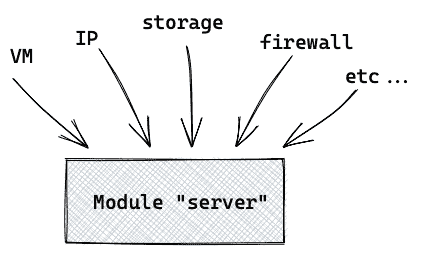
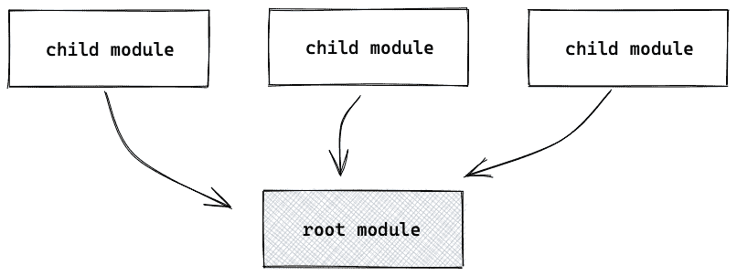
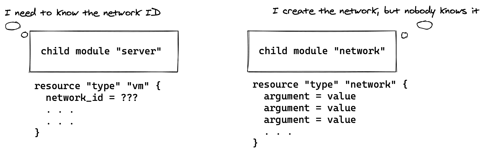
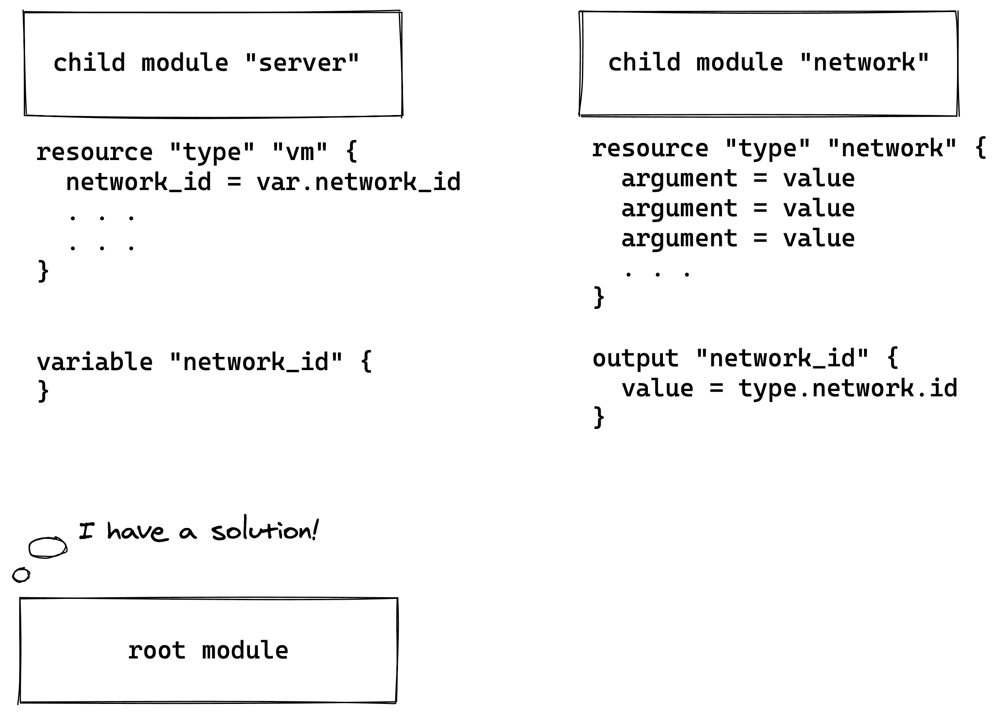

# 什么是 Terraform 模块，它们是如何工作的？

> 原文：<https://www.freecodecamp.org/news/terraform-modules-explained/>

令人惊讶的是，许多初学者为了简单起见跳过了 Terraform 模块，或者他们是这样认为的。

后来，他们发现自己要检查数百行配置代码。

我假设你已经知道一些关于 Terraform 的基础知识，甚至曾经尝试过使用它。如果没有，在你继续阅读之前，看看这个关于 Terraform 的概述和这个 T2 视频教程。

请注意:为了简单起见，我没有特意使用 AWS 或 Google 等特定提供商的真实代码示例。

## 地形模块

### 您已经编写了模块

即使你没有故意创建一个模块，如果你使用 Terraform，你已经在编写一个模块——一个所谓的“ *root* 模块。

目录中的任何 Terraform 配置文件(`.tf`)即使只有一个，也构成一个模块。

### 模块是做什么的？

Terraform 模块允许你在一些资源集的顶层创建逻辑抽象。换句话说，模块允许您将资源分组在一起，并在以后重用这个组，可能是多次。

让我们假设我们有一个虚拟服务器，它在云中托管了一些功能。哪组资源可以描述该服务器？例如:

*   从某个映像创建的虚拟机本身
*   指定大小的附加块设备，用于附加存储
*   映射到服务器虚拟网络接口的静态公共 IP
*   要附加到服务器的一组防火墙规则
*   其他东西，如另一个块设备、附加网络接口等等



现在让我们假设您需要多次用一组资源创建这个服务器。这就是模块真正有用的地方——您不希望一遍又一遍地重复相同的配置代码，对吗？

这里有一个例子来说明如何调用我们的“服务器”模块。
*调用模块*的意思是在配置文件中使用它。

这里，我们使用单组配置(在模块中)创建了 5 个“服务器”实例:

```
module "server" {

    count         = 5

    source        = "./module_server"
    some_variable = some_value
}
```

Terraform supports "count" for modules starting from version 0.13

### 模块组织:子模块和根模块

当然，您可能想要创建多个模块。以下是一些常见的例子:

*   类似虚拟专用云的网络(VPC)
*   静态内容托管(即存储桶)
*   负载平衡器及其相关资源
*   日志记录配置
*   或者您认为是基础设施的独特逻辑组件的任何其他东西

假设我们有两个不同的模块:一个“服务器”模块和一个“网络”模块。名为“网络”的模块是我们定义和配置虚拟网络并在其中放置服务器的地方:

```
module "server" {
    source        = "./module_server"
    some_variable = some_value
}

module "network" {  
    source              = "./module_network"
    some_other_variable = some_other_value
}
```

Two different child modules called in the root module

一旦我们有了一些定制模块，我们就可以称它们为“子”模块。我们调用子模块的配置文件与根模块相关。



子模块可以来自许多地方:

*   本地路径
*   官方的 Terraform 注册表——如果你熟悉 Docker 注册表之类的其他注册表，那么你应该已经明白这个想法了
*   一个 Git 存储库(一个定制的或者 GitHub/BitBucket)
*   带有模块的. zip 档案的 HTTP URL

但是如何在模块之间传递资源细节呢？

在我们的示例中，应该在网络中创建服务器。那么，我们如何告诉“服务器”模块在网络中创建虚拟机，而虚拟机是在名为“网络”的模块中创建的呢？

这就是**封装**发挥作用的地方。

## 模块封装

Terraform 中的封装由两个基本概念组成:模块范围和显式资源公开。

### 模块范围

所有资源实例、名称以及资源可见性都被隔离在一个模块的范围内。例如，默认情况下，模块“A”看不到也不知道模块“B”中的资源。

资源可见性，有时称为资源隔离，确保资源在模块的命名空间中具有唯一的名称。例如，对于我们的 5 个“服务器”模块实例:

```
module.server[0].resource_type.resource_name
module.server[1].resource_type.resource_name
module.server[2].resource_type.resource_name
...
```

Module resource addresses created with the count meta-argument

另一方面，我们可以用不同的名称创建同一个模块的两个实例:

```
module "server-alpha" {    
    source        = "./module_server"
    some_variable = some_value
}
module "server-beta" {
    source        = "./module_server"
    some_variable = some_value
}
```

Pay attention to the source argument — it remains the same, it is the same source module

在这种情况下，资源的命名或地址如下:

```
module.server-alpha.resource_type.resource_name

module.server-beta.resource_type.resource_name
```

### 显性资源暴露

如果您想访问另一个模块中资源的一些细节，您需要显式地配置它。

默认情况下，我们的模块“服务器”不知道在“网络”模块中创建的网络。



因此，我们必须在“network”模块中声明一个`output`值，以将其资源或资源的属性导出到其他模块。

模块“服务器”必须声明一个`variable`作为输入:



The names `output` and `variable` can differ, but I suggest using the same names for clarity.

这种输出的显式声明是向“根”模块的范围之外公开一些资源(或关于它的信息)的方式，因此使它对其他模块可用。

接下来，当我们在根模块中调用子模块“服务器”时，我们应该将“网络”模块的输出分配给“服务器”模块的变量:

```
network_id = module.network.network_id
```

Pay attention to the 'network_id' output address here — we explicitly tell where it resides

下面是调用我们的子模块的最终代码:

```
module "server" {
    count         = 5
    source        = "./module_server"
    some_variable = some_value
    network_id    = module.network.network_id
}

module "network" {  
    source              = "./module_network"
    some_other_variable = some_other_value
}
```

此示例配置将在我们作为独立模块创建的网络中创建同一服务器的 5 个实例，并提供所有必需的资源。

## 包扎

现在你应该明白什么是模块，它们是做什么的。

如果你刚刚开始你的 Terraform 之旅，这里有一些关于下一步的建议。

我鼓励你学习 Terraform 的创造者 HashiCorp 的这个关于模块的简短教程:“[组织配置](https://learn.hashicorp.com/collections/terraform/modules)”。

此外，还有一个非常全面的学习指南，涵盖了从初级到高级的所有关于 Terraform 的概念:“[学习指南- Terraform 助理认证](https://learn.hashicorp.com/tutorials/terraform/associate-study?in=terraform/certification)”。

模块化的代码结构使您的配置更加灵活，并且易于被他人理解。后者对于一个团队尤其有用。

如果你喜欢这篇文章，请在 Twitter ( [@vasylenko](https://twitter.com/vasylenko) )上关注我，我偶尔会在那里分享我关于 Terraform、AWS、Ansible 和其他 DevOps 相关技术的发现和技巧。